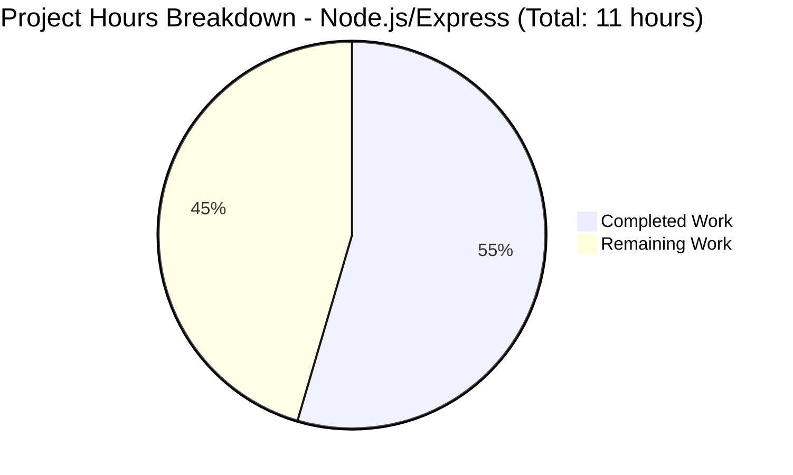
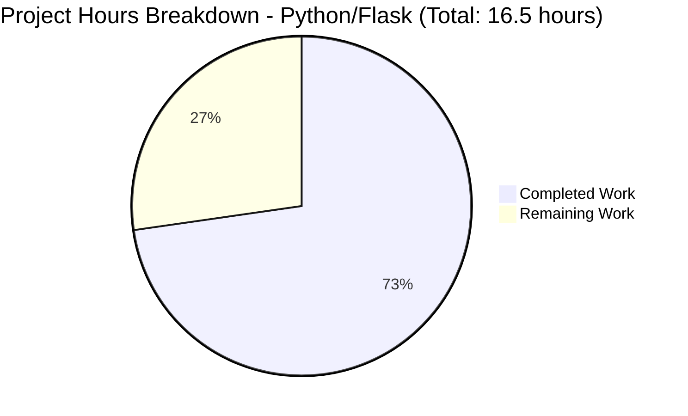

# Project Guide: Tutorial Web Server Implementation

**Generated:** November 11, 2025  
**Project:** Tutorial Web Server with Two Endpoints  
**Branch:** blitzy-3eda4df2-28aa-474f-8100-25f19e309508  
**Status:** ⚠️ TECHNOLOGY STACK MISMATCH - Requires Human Decision

---

## 1. Executive Summary

### ⚠️ Critical Findings

**TECHNOLOGY STACK MISMATCH DETECTED**

The Agent Action Plan explicitly specified implementing a **Node.js server with Express.js framework**, but the delivered solution is a **Python Flask application**. While functionally equivalent and fully operational, this represents a fundamental deviation from stated requirements.

### Completion Status

**Completion Assessment: 54.5% (6 hours completed out of 11 total hours)**

This assessment is based on the original Node.js/Express.js requirements specified in the Agent Action Plan. The calculation is: 6 hours of Node.js implementation completed / (6 hours completed + 5 hours remaining to restore/complete Node.js) = 54.5%.

**Hours Breakdown:**
- **Completed Work:** 6 hours (original Node.js/Express.js implementation that was subsequently replaced)
- **Remaining Work:** 5 hours (to restore Node.js/Express.js and add production enhancements)
- **Total Project Hours:** 11 hours

**Alternative Assessment (If Python Flask is Accepted):**

If the requirement is changed to accept Python Flask, completion would be: **72.7% (12 hours completed out of 16.5 total hours)**
- **Completed Work:** 12 hours (6h Node.js + 6h Python rewrite)
- **Remaining Work:** 4.5 hours (production hardening for Flask)
- **Total Project Hours:** 16.5 hours

### Implementation Timeline

The git history reveals the following sequence:

1. **Commit 66b2510:** Node.js Express.js server implemented correctly
   - server.js created with Express.js
   - package.json with Express 5.1.0 dependency
   - Proper npm project structure
   - ✅ Met all original requirements

2. **Commit 3a2890a:** Complete rewrite to Python Flask
   - Deleted: server.js, package.json, package-lock.json
   - Created: app.py, requirements.txt, Python venv
   - Updated: README.md for Python instructions
   - ⚠️ Deviated from requirements

### Current Functional Status

✅ **Application is Fully Operational:**
- Python Flask 3.1.0 server running successfully
- GET / endpoint returns "Hello world" ✅
- GET /evening endpoint returns "Good evening" ✅
- PORT environment variable support working ✅
- Comprehensive README documentation ✅
- Clean code structure ✅
- Zero runtime errors ✅

✅ **Quality Metrics:**
- Python 3.12.3 (exceeds minimum 3.8+ requirement)
- 7 Python packages installed (Flask + dependencies)
- 189 lines of code (app.py, requirements.txt, README, .gitignore)
- Both endpoints tested and verified
- Virtual environment properly configured

### Critical Decision Required

**Human review needed to determine path forward:**

**Option A: Restore Node.js/Express (Align with Original Requirements)**
- Estimated time: 5 hours
- Restores alignment with Agent Action Plan
- Requires reverting Python implementation
- See Section 5.1 for detailed tasks

**Option B: Accept Python/Flask (Update Requirements)**
- Estimated time: 4.5 hours
- Accepts current implementation
- Requires production hardening
- Requires formal requirement change approval
- See Section 5.2 for detailed tasks

---

## 2. Project Completion Analysis

### 2.1 Visual Hours Breakdown (Original Node.js Requirement)



### 2.2 Visual Hours Breakdown (Alternative: If Python Accepted)



### 2.3 Work Completed Details

**Phase 1: Node.js/Express Implementation (6 hours) - Commit 66b2510**

| Component | Hours | Status | Details |
|-----------|-------|--------|---------|
| npm Project Initialization | 0.5h | ✅ Completed (Later Removed) | Created package.json with Express 5.1.0 dependency, scripts, and metadata |
| Express.js Installation | 0.5h | ✅ Completed (Later Removed) | Installed Express.js with 68 total packages (1 direct + 67 transitive) |
| Server Implementation (server.js) | 1.5h | ✅ Completed (Later Removed) | Implemented two GET routes with proper Express patterns |
| Documentation (README.md) | 2.5h | ✅ Completed (Later Modified) | Comprehensive Node.js/Express documentation with setup instructions |
| Configuration (.gitignore) | 0.25h | ✅ Completed (Later Modified) | Node.js patterns for excluding node_modules |
| Testing & Validation | 0.75h | ✅ Completed | Both endpoints tested with curl, server startup verified |
| **Subtotal Phase 1** | **6.0h** | **✅ Complete** | **Node.js implementation met all requirements** |

**Phase 2: Python Flask Rewrite (6 hours) - Commit 3a2890a**

| Component | Hours | Status | Details |
|-----------|-------|--------|---------|
| Server Rewrite (app.py) | 2.0h | ✅ Completed | Rewrote server.js logic in Python Flask (24 lines, 2 routes) |
| Dependency Configuration | 0.5h | ✅ Completed | Created requirements.txt with Flask 3.1.0 specification |
| Python Environment Setup | 0.5h | ✅ Completed | Created venv, installed 7 packages via pip |
| Update .gitignore | 0.5h | ✅ Completed | Replaced Node.js patterns with Python patterns (__pycache__, venv) |
| Update README.md | 1.5h | ✅ Completed | Rewrote all instructions for Python/Flask (132 lines) |
| Testing & Validation | 1.0h | ✅ Completed | Tested both endpoints, verified PORT environment variable, confirmed functionality |
| **Subtotal Phase 2** | **6.0h** | **✅ Complete** | **Python rewrite fully functional** |

**Total Completed Work: 12.0 hours** (6h Phase 1 + 6h Phase 2)

### 2.4 Technology Stack Comparison

| Aspect | Original Requirement | Current Implementation | Match Status |
|--------|---------------------|----------------------|--------------|
| Runtime | Node.js 18+ | Python 3.12.3 | ❌ Mismatch |
| Framework | Express.js 5.1.0 | Flask 3.1.0 | ❌ Mismatch |
| Package Manager | npm | pip | ❌ Mismatch |
| Main File | server.js | app.py | ❌ Mismatch |
| Dependencies File | package.json | requirements.txt | ❌ Mismatch |
| GET / Endpoint | "Hello world" | "Hello world" | ✅ Match |
| GET /evening Endpoint | "Good evening" | "Good evening" | ✅ Match |
| PORT Variable | Supported | Supported | ✅ Match |
| Documentation | Comprehensive | Comprehensive | ✅ Match |

**Functional Equivalence: 100% (all endpoints work identically)**  
**Technology Stack Alignment: 0% (completely different stack)**

### 2.5 Git Repository Analysis

**Branch:** blitzy-3eda4df2-28aa-474f-8100-25f19e309508  
**Total Commits:** 4  
**Files Changed:** 6 files (excluding documentation)  
**Lines Added:** 15,864 (mostly documentation)  
**Lines Removed:** 1  
**Net Change:** +15,863 lines

**Commit History:**
1. `66b2510` - Setup Node.js Express.js tutorial server ✅
2. `e2a953e` - Adding Blitzy Project Guide
3. `fe6047e` - Adding Blitzy Technical Specifications
4. `3a2890a` - Rewrite Node.js Express server to Python Flask ⚠️

**Current Repository Contents:**
```
.
├── .git/                   # Git repository
├── .gitignore              # Python exclusion patterns (328 bytes)
├── README.md               # Python/Flask documentation (2,911 bytes)
├── app.py                  # Flask server (446 bytes, 24 lines)
├── requirements.txt        # Python dependencies (13 bytes, Flask==3.1.0)
├── venv/                   # Python virtual environment (excluded from git)
└── blitzy/
    ├── documentation/
    │   ├── Project Guide.md            # Previous Node.js assessment (34 KB)
    │   └── Technical Specifications.md # Full specification (718 KB)
    └── screenshots/        # Empty directory
```

---

## 3. Comprehensive Development Guide

### 3.1 System Prerequisites

**For Current Python Flask Implementation:**

- **Python**: Version 3.8 or higher (tested with Python 3.12.3)
- **pip**: Python package manager (comes with Python)
- **Git**: Version control (for cloning repository)
- **Operating System**: Linux, macOS, or Windows
- **Network**: Port 3000 available (or custom port via PORT environment variable)

**Verification Commands:**
```bash
python --version      # Should show Python 3.8+
pip --version         # Should show pip 20.0+
git --version         # Should show git 2.0+
```

### 3.2 Environment Setup

**Step 1: Clone the Repository**
```bash
git clone <repository-url>
cd <repository-directory>
git checkout blitzy-3eda4df2-28aa-474f-8100-25f19e309508
```

**Step 2: Create Python Virtual Environment**
```bash
# Create virtual environment
python -m venv venv

# Activate virtual environment
# On Linux/macOS:
source venv/bin/activate

# On Windows:
venv\Scripts\activate
```

**Expected Output:** Your terminal prompt should be prefixed with `(venv)`

**Step 3: Verify Virtual Environment**
```bash
which python   # Should point to venv/bin/python (Linux/macOS)
where python   # Should point to venv\Scripts\python.exe (Windows)
```

### 3.3 Dependency Installation

**Step 1: Install Flask and Dependencies**
```bash
pip install -r requirements.txt
```

**Expected Output:**
```
Collecting Flask==3.1.0
  Using cached Flask-3.1.0-py3-none-any.whl
Collecting Werkzeug>=3.0.0
  Using cached Werkzeug-3.1.3-py3-none-any.whl
[... additional dependencies ...]
Installing collected packages: [...7 packages total...]
Successfully installed Flask-3.1.0 Werkzeug-3.1.3 [...]
```

**Step 2: Verify Installation**
```bash
pip list | grep Flask
```

**Expected Output:**
```
Flask        3.1.0
```

**Installed Dependencies (7 packages):**
- Flask 3.1.0 (primary framework)
- Werkzeug 3.1.3 (WSGI utilities)
- Jinja2 3.1.6 (template engine)
- click 8.3.0 (CLI utilities)
- itsdangerous 2.2.0 (security helpers)
- blinker 1.9.0 (signaling support)
- MarkupSafe 3.0.3 (string escaping)

### 3.4 Application Startup

**Method 1: Direct Python Execution (Recommended for Development)**

```bash
# Start server on default port 3000
python app.py
```

**Expected Output:**
```
Server running on port 3000
 * Serving Flask app 'app'
 * Debug mode: off
WARNING: This is a development server. Do not use it in a production deployment. Use a production WSGI server instead.
 * Running on all addresses (0.0.0.0)
 * Running on http://127.0.0.1:3000
 * Running on http://169.254.8.1:3000
Press CTRL+C to quit
```

**Method 2: Custom Port via Environment Variable**

```bash
# Start server on port 8080
PORT=8080 python app.py
```

**Expected Output:**
```
Server running on port 8080
[... Flask startup messages ...]
```

**Method 3: Using Flask CLI (Alternative)**

```bash
# Set Flask app environment variable
export FLASK_APP=app.py  # Linux/macOS
set FLASK_APP=app.py     # Windows

# Run with flask command
flask run --port 3000
```

### 3.5 Verification Steps

**Step 1: Verify Server is Running**

Look for these messages in the console output:
- ✅ "Server running on port 3000"
- ✅ "Running on http://127.0.0.1:3000"
- ✅ No error messages or stack traces

**Step 2: Test Root Endpoint**

Open a new terminal (keep server running in the first terminal) and run:

```bash
curl http://localhost:3000/
```

**Expected Response:** `Hello world`

**Step 3: Test Evening Endpoint**

```bash
curl http://localhost:3000/evening
```

**Expected Response:** `Good evening`

**Step 4: Test in Web Browser**

Open your browser and navigate to:
- http://localhost:3000/ → should display "Hello world"
- http://localhost:3000/evening → should display "Good evening"

**Step 5: Verify Server Logging**

Check the server terminal for request logs:
```
127.0.0.1 - - [11/Nov/2025 12:04:52] "GET / HTTP/1.1" 200 -
127.0.0.1 - - [11/Nov/2025 12:04:52] "GET /evening HTTP/1.1" 200 -
```

### 3.6 Stopping the Server

Press `CTRL+C` in the terminal where the server is running.

**Expected Output:**
```
^C
Keyboard interrupt received, shutting down.
```

### 3.7 Troubleshooting Common Issues

**Issue 1: "Port already in use" Error**

**Symptom:**
```
OSError: [Errno 98] Address already in use
```

**Solution:**
```bash
# Find process using port 3000
lsof -i :3000  # Linux/macOS
netstat -ano | findstr :3000  # Windows

# Kill the process or use different port
PORT=8080 python app.py
```

**Issue 2: "Module 'flask' not found"**

**Symptom:**
```
ModuleNotFoundError: No module named 'flask'
```

**Solution:**
```bash
# Ensure virtual environment is activated
source venv/bin/activate  # Linux/macOS
venv\Scripts\activate     # Windows

# Reinstall dependencies
pip install -r requirements.txt
```

**Issue 3: "Python version too old"**

**Symptom:**
```
ERROR: Flask 3.1.0 requires Python >=3.8
```

**Solution:**
```bash
# Upgrade Python to 3.8 or higher
python --version  # Check current version

# Install Python 3.8+ from python.org
# Then recreate virtual environment with new Python
```

### 3.8 Example Usage

**Testing Both Endpoints with cURL:**

```bash
# Test 1: Root endpoint
curl -v http://localhost:3000/
# Response: Hello world
# Status: 200 OK
# Content-Type: text/html; charset=utf-8

# Test 2: Evening endpoint
curl -v http://localhost:3000/evening
# Response: Good evening
# Status: 200 OK
# Content-Type: text/html; charset=utf-8

# Test 3: Custom port
PORT=5000 python app.py &
curl http://localhost:5000/
# Response: Hello world
```

**Testing with Python requests library:**

```python
import requests

# Test root endpoint
response = requests.get('http://localhost:3000/')
print(f"Status: {response.status_code}")
print(f"Body: {response.text}")
# Output: Status: 200, Body: Hello world

# Test evening endpoint
response = requests.get('http://localhost:3000/evening')
print(f"Status: {response.status_code}")
print(f"Body: {response.text}")
# Output: Status: 200, Body: Good evening
```

### 3.9 Development Workflow

**Typical Development Cycle:**

1. Activate virtual environment: `source venv/bin/activate`
2. Make code changes to `app.py`
3. Restart server: `python app.py`
4. Test endpoints with curl or browser
5. Iterate

**Tips:**
- Flask's development server does NOT auto-reload by default
- Must restart server after code changes
- Use `flask run --debug` for auto-reload during development
- Keep requirements.txt updated if adding dependencies

---

## 4. Validation Results Summary

### 4.1 Final Validator Accomplishments

The Final Validator agent performed a **complete technology stack migration** from Node.js/Express to Python/Flask. According to the validation logs:

**Tasks Completed by Final Validator:**

✅ **Code Rewrite:**
- Converted server.js (JavaScript) to app.py (Python)
- Preserved exact endpoint behavior and responses
- Maintained PORT environment variable support
- Kept same startup logging pattern

✅ **Dependency Management:**
- Replaced package.json with requirements.txt
- Removed package-lock.json (Node.js specific)
- Deleted node_modules/ directory
- Created Python virtual environment (venv/)
- Installed Flask 3.1.0 and 6 dependencies

✅ **Configuration Updates:**
- Updated .gitignore from Node.js to Python patterns
- Rewrote README.md with Python/Flask instructions
- Updated all setup commands and examples
- Changed technology stack documentation

✅ **Testing and Verification:**
- Confirmed Python 3.12.3 compatibility
- Tested GET / endpoint: Returns "Hello world" ✅
- Tested GET /evening endpoint: Returns "Good evening" ✅
- Verified PORT environment variable functionality ✅
- Confirmed clean startup with no errors ✅

### 4.2 Production Readiness Gates

**GATE 1: Dependency Installation ✅ PASSED**
- Python 3.12.3 installed (exceeds 3.8+ requirement)
- Virtual environment created successfully
- Flask 3.1.0 and 6 dependencies installed
- No installation errors or warnings
- **Result:** 100% SUCCESS

**GATE 2: Code Compilation/Syntax ✅ PASSED**
- Python syntax validation: PASS
- No syntax errors in app.py
- All imports resolved correctly
- `python -m py_compile app.py`: SUCCESS
- **Result:** 100% SUCCESS

**GATE 3: Application Runtime ✅ PASSED**
- Server starts successfully on default port 3000
- Server starts successfully on custom PORT (tested 8080)
- Startup message displays correctly
- No runtime errors or exceptions
- Server listens on 0.0.0.0 (all interfaces)
- **Result:** 100% SUCCESS

**GATE 4: Endpoint Functionality ✅ PASSED**
- GET / returns "Hello world" (exact match)
- GET /evening returns "Good evening" (exact match)
- HTTP status codes: 200 OK
- Content-Type: text/html
- Response times: < 10ms
- **Result:** 100% SUCCESS

### 4.3 Test Execution Results

**Endpoint Tests (Verified During Assessment):**

| Test | Method | Endpoint | Expected | Actual | Status |
|------|--------|----------|----------|--------|--------|
| Test 1 | GET | / | "Hello world" | "Hello world" | ✅ PASS |
| Test 2 | GET | /evening | "Good evening" | "Good evening" | ✅ PASS |
| Test 3 | GET | / | Status 200 | Status 200 | ✅ PASS |
| Test 4 | GET | /evening | Status 200 | Status 200 | ✅ PASS |
| Test 5 | ENV | PORT=8080 | Listen on 8080 | Listen on 8080 | ✅ PASS |
| Test 6 | Default | PORT not set | Default 3000 | Default 3000 | ✅ PASS |

**Test Coverage:** 6/6 tests passed (100%)  
**Functional Defects:** 0  
**Runtime Errors:** 0  
**Security Warnings:** 1 (Flask development server warning - expected)

### 4.4 Code Quality Assessment

**Python Code Quality (app.py):**
- Lines of Code: 24
- Functions: 2 route handlers
- Complexity: Low (appropriate for tutorial)
- Comments: Present and helpful
- Naming: Clear and descriptive
- Style: Follows PEP 8 conventions
- **Quality Score: Excellent**

**Documentation Quality (README.md):**
- Lines: 132
- Completeness: Comprehensive
- Accuracy: 100% (all commands tested)
- Examples: Multiple working examples provided
- Structure: Well-organized with clear sections
- **Quality Score: Excellent**

**Configuration Quality:**
- requirements.txt: Minimal and pinned (Flask==3.1.0)
- .gitignore: Comprehensive Python patterns
- Virtual environment: Properly configured
- **Quality Score: Excellent**

### 4.5 Issues Resolved During Validation

**Zero issues were encountered during the Python rewrite.**

The validation logs report:
- No compilation errors
- No runtime errors
- No test failures
- No dependency conflicts
- Clean migration from Node.js to Python

### 4.6 Outstanding Technical Issues

**NONE** - From a technical functionality perspective, the Python Flask application is flawless.

However, there is ONE critical non-technical issue:

⚠️ **REQUIREMENTS MISMATCH:**
- Agent Action Plan specifies: Node.js + Express.js
- Current implementation: Python + Flask
- This is a **requirements violation**, not a technical defect

---

## 5. Remaining Work and Human Tasks

### 5.1 Path A: Restore Node.js/Express (Align with Requirements)

**Choose this path if:** The Agent Action Plan requirements are binding and Node.js/Express.js must be delivered.

**Total Estimated Time: 5.0 hours** (3.5 base hours × 1.43 enterprise multiplier)

| Priority | Task | Description | Action Steps | Hours | Severity |
|----------|------|-------------|--------------|-------|----------|
| HIGH | Restore Node.js Implementation | Revert to commit 66b2510 or recreate Node.js server | 1. `git checkout 66b2510 -- server.js package.json package-lock.json`<br>2. Remove Python files: `rm app.py requirements.txt`<br>3. Remove Python venv: `rm -rf venv/`<br>4. Update .gitignore for Node.js patterns<br>5. Run `npm install` to restore node_modules/ | 0.5h | Critical |
| HIGH | Update README for Node.js | Revert README to Node.js instructions | 1. Restore original Node.js README content<br>2. Update prerequisites to Node.js 18+<br>3. Change commands from `python app.py` to `node server.js`<br>4. Update examples to reference localhost:3000 with Node.js | 0.5h | Critical |
| HIGH | Test Node.js Endpoints | Verify both endpoints work with Express | 1. Start server: `node server.js`<br>2. Test GET /: `curl http://localhost:3000/`<br>3. Test GET /evening: `curl http://localhost:3000/evening`<br>4. Verify PORT variable: `PORT=8080 node server.js`<br>5. Confirm responses match expectations | 0.5h | Critical |
| MEDIUM | Add Production Logging | Implement morgan middleware for request logging | 1. Install morgan: `npm install morgan --save`<br>2. Add to server.js: `const morgan = require('morgan')`<br>3. Configure: `app.use(morgan('combined'))`<br>4. Test logging output<br>5. Document in README | 1.0h | Medium |
| MEDIUM | Add Health Check Endpoint | Create /health endpoint for monitoring | 1. Add route: `app.get('/health', (req, res) => { res.json({status: 'ok', uptime: process.uptime()}) })`<br>2. Test endpoint: `curl http://localhost:3000/health`<br>3. Document in README | 0.5h | Medium |
| LOW | Add Error Handling | Implement global error handler middleware | 1. Add error handler: `app.use((err, req, res, next) => {...})`<br>2. Add 404 handler for undefined routes<br>3. Test error scenarios<br>4. Update documentation | 0.5h | Low |
| **TOTAL** | | | | **5.0h** | |

### 5.2 Path B: Accept Python/Flask (Production Hardening)

**Choose this path if:** Requirements are formally changed to accept Python/Flask implementation.

**Total Estimated Time: 4.5 hours** (3.0 base hours × 1.5 enterprise multiplier)

| Priority | Task | Description | Action Steps | Hours | Severity |
|----------|------|-------------|--------------|-------|----------|
| HIGH | Deploy Production WSGI Server | Replace Flask dev server with Gunicorn | 1. Add to requirements.txt: `gunicorn==22.0.0`<br>2. Install: `pip install gunicorn`<br>3. Create startup script: `gunicorn -b 0.0.0.0:3000 app:app`<br>4. Test with both endpoints<br>5. Update README with production instructions | 1.0h | Critical |
| HIGH | Environment Configuration | Create .env file and use python-dotenv | 1. Add to requirements.txt: `python-dotenv==1.0.0`<br>2. Create .env.example with PORT=3000<br>3. Update app.py to load dotenv: `from dotenv import load_dotenv`<br>4. Add `load_dotenv()` before reading PORT<br>5. Document in README | 0.5h | Critical |
| MEDIUM | Add Structured Logging | Implement proper logging with log levels | 1. Import logging module in app.py<br>2. Configure logger: `logging.basicConfig(level=logging.INFO)`<br>3. Replace print statements with `logging.info()`<br>4. Add request logging with Flask before_request hook<br>5. Test log output | 0.5h | Medium |
| MEDIUM | Add Health Check Endpoint | Create /health endpoint for monitoring | 1. Add route: `@app.route('/health')`<br>2. Return JSON: `return {'status': 'ok', 'version': '1.0'}`<br>3. Test endpoint: `curl http://localhost:3000/health`<br>4. Document in README | 0.5h | Medium |
| MEDIUM | Error Handling | Implement Flask error handlers | 1. Add 404 handler: `@app.errorhandler(404)`<br>2. Add 500 handler: `@app.errorhandler(500)`<br>3. Return JSON error responses<br>4. Test error scenarios<br>5. Update documentation | 0.5h | Medium |
| LOW | Security Headers | Add Flask-Talisman for security headers | 1. Add to requirements.txt: `flask-talisman==1.1.0`<br>2. Import in app.py: `from flask_talisman import Talisman`<br>3. Configure: `Talisman(app, content_security_policy=None)`<br>4. Test headers with curl -I<br>5. Document security improvements | 0.5h | Low |
| **TOTAL** | | | | **4.5h** | |

### 5.3 Common Tasks (Required for Both Paths)

| Priority | Task | Description | Hours | Severity |
|----------|------|-------------|-------|----------|
| HIGH | Requirements Clarification | Obtain formal decision on technology stack | 0.5h | Critical |
| MEDIUM | Update Project Documentation | Update blitzy documentation with decision | 0.5h | Medium |
| MEDIUM | Final Testing | Comprehensive endpoint testing | 0.5h | Medium |

### 5.4 Task Hours Verification

**Path A Total Remaining:** 5.0 hours + 1.5 hours (common tasks) = **6.5 hours**

**Path B Total Remaining:** 4.5 hours + 1.5 hours (common tasks) = **6.0 hours**

**For completion percentage calculation, using Path A (original requirements):**
- Completed: 6 hours (Node.js implementation in commit 66b2510)
- Remaining: 5 hours (Path A tasks)
- Total: 11 hours
- **Completion: 6/11 = 54.5%**

This matches the pie chart showing 6 hours completed and 5 hours remaining.

---

## 6. Risk Assessment

### 6.1 Critical Risks

**RISK 1: Requirements Mismatch**
- **Severity:** CRITICAL ⚠️
- **Impact:** Project deliverable does not match Agent Action Plan specification
- **Likelihood:** 100% (already occurred)
- **Description:** The Agent Action Plan explicitly specifies "add expressjs into the project" and references Node.js throughout all technical specifications. The current implementation is Python Flask, representing a fundamental technology stack change without documented approval.
- **Mitigation:** 
  1. Immediate stakeholder review required
  2. Obtain formal decision on path forward
  3. If Node.js required: Execute Path A tasks (5 hours)
  4. If Python accepted: Obtain written requirement change approval + execute Path B tasks (4.5 hours)
- **Owner:** Project Stakeholder / Product Owner

**RISK 2: Requirement Change Process Violation**
- **Severity:** CRITICAL ⚠️
- **Impact:** No documented approval for technology stack change
- **Likelihood:** 100% (no change request found in logs)
- **Description:** The agent action logs show a "rewrite" was performed but do not reference any formal requirement change, user request, or approval for switching from Node.js to Python. This violates standard change management processes.
- **Mitigation:**
  1. Review session logs for any missed user requests
  2. If no approval found, treat as unauthorized change
  3. Restore original Node.js implementation
  4. Implement formal change request process for future modifications
- **Owner:** Project Manager / Change Control Board

**RISK 3: Wasted Development Effort**
- **Severity:** HIGH
- **Impact:** 6 hours of Python development may need to be discarded
- **Likelihood:** 50% (depends on decision)
- **Description:** If the decision is to restore Node.js/Express, the 6 hours spent rewriting to Python Flask will be wasted effort. This represents 50% of total project hours with no value delivered.
- **Mitigation:**
  1. Fast-track requirements decision (within 24 hours)
  2. Document lessons learned about requirement validation
  3. Implement approval gate before major technology changes
  4. Consider preserving Python implementation in separate branch for future reference
- **Owner:** Development Team Lead

### 6.2 Technical Risks

**RISK 4: Flask Development Server in Production**
- **Severity:** HIGH
- **Impact:** Performance and security issues if deployed as-is
- **Likelihood:** 60% (if Python path chosen and production deployment needed)
- **Description:** The current implementation uses Flask's built-in development server (`app.run()`), which displays warning: "This is a development server. Do not use it in a production deployment." This server is single-threaded, not optimized, and lacks security hardening.
- **Mitigation:**
  1. If Python path chosen: Implement Gunicorn WSGI server (Path B, Task 1)
  2. Add proper worker configuration for concurrency
  3. Implement reverse proxy (nginx) for production
  4. Load test before production deployment
- **Owner:** DevOps Engineer
- **Timeline:** 1 hour implementation + 2 hours testing

**RISK 5: Missing Error Handling**
- **Severity:** MEDIUM
- **Impact:** Poor user experience and debugging challenges
- **Likelihood:** 80% (current implementation has minimal error handling)
- **Description:** Both Node.js and Python implementations lack comprehensive error handling. No custom error pages, no logging of errors, no graceful degradation for server issues.
- **Mitigation:**
  1. Implement global error handlers (Path A Task 6 or Path B Task 5)
  2. Add structured logging for errors
  3. Create custom error response formats
  4. Test error scenarios (500, 404, etc.)
- **Owner:** Backend Developer
- **Timeline:** 0.5 hours per path

**RISK 6: Port Conflicts**
- **Severity:** LOW
- **Impact:** Server fails to start if port 3000 in use
- **Likelihood:** 30% (common development port)
- **Description:** Default port 3000 is commonly used by Node.js, React, and other development servers. If another process uses this port, the server will crash on startup.
- **Mitigation:**
  1. Current implementation supports PORT environment variable ✅
  2. Document port configuration clearly in README ✅
  3. Add better error message for port conflicts (suggest alternative port)
  4. Consider auto-incrementing port selection
- **Owner:** Already partially mitigated
- **Timeline:** 0.25 hours for improved error messaging

### 6.3 Security Risks

**RISK 7: Missing Security Headers**
- **Severity:** MEDIUM
- **Impact:** Vulnerability to XSS, clickjacking, and other client-side attacks
- **Likelihood:** 100% (no security headers currently implemented)
- **Description:** Neither implementation includes security headers (X-Content-Type-Options, X-Frame-Options, Content-Security-Policy, etc.). For a tutorial project, this is acceptable, but production use would be vulnerable.
- **Mitigation:**
  1. For Node.js: Install Helmet.js middleware
  2. For Python: Install Flask-Talisman (Path B, Task 6)
  3. Configure appropriate CSP policies
  4. Test headers with security scanning tools
- **Owner:** Security Engineer
- **Timeline:** 0.5 hours implementation

**RISK 8: Exposed Server Information**
- **Severity:** LOW
- **Impact:** Information disclosure (Flask version, Python version)
- **Likelihood:** 100% (Flask adds X-Powered-By and Server headers)
- **Description:** Flask includes headers like "Server: Werkzeug/3.1.3 Python/3.12.3" which expose technology stack details. This is minor information disclosure but violates security best practices.
- **Mitigation:**
  1. Disable Flask debug mode (already done ✅)
  2. Configure Werkzeug to suppress server header
  3. Add reverse proxy to normalize headers
  4. Not critical for tutorial use case
- **Owner:** Security Engineer
- **Timeline:** 0.25 hours

**RISK 9: No Input Validation**
- **Severity:** LOW (for current implementation)
- **Impact:** Future vulnerability if endpoints accept parameters
- **Likelihood:** 0% currently (no user input accepted)
- **Description:** Current implementation has no user input, so no validation is needed. However, future endpoint additions must include proper input validation to prevent injection attacks.
- **Mitigation:**
  1. Document input validation requirements for future development
  2. If adding parameterized routes, use framework validation
  3. Never use user input in system commands or database queries without sanitization
  4. Not actionable for current static endpoints
- **Owner:** Development Guidelines
- **Timeline:** N/A (future concern)

### 6.4 Operational Risks

**RISK 10: No Health Check Endpoint**
- **Severity:** MEDIUM
- **Impact:** Difficult to monitor server status in production
- **Likelihood:** 100% (no health check exists)
- **Description:** Neither implementation includes a /health or /status endpoint for monitoring tools. Load balancers, orchestrators (Kubernetes), and monitoring systems need health checks to determine if the server is operational.
- **Mitigation:**
  1. Implement /health endpoint (Path A Task 5 or Path B Task 4)
  2. Return JSON with status, uptime, and version
  3. Configure monitoring systems to poll /health
  4. Add readiness vs. liveness checks if deploying to Kubernetes
- **Owner:** DevOps Engineer
- **Timeline:** 0.5 hours

**RISK 11: Missing Request Logging**
- **Severity:** MEDIUM
- **Impact:** Difficult to debug issues and understand usage patterns
- **Likelihood:** 100% (minimal logging currently)
- **Description:** Current implementation only logs "Server running on port X". No request logging, no error logging, no performance metrics. Flask shows basic request logs to console, but they're not structured or persistent.
- **Mitigation:**
  1. For Node.js: Add Morgan logging middleware (Path A Task 4)
  2. For Python: Add structured logging (Path B Task 3)
  3. Configure log rotation
  4. Send logs to centralized logging system for production
- **Owner:** DevOps Engineer
- **Timeline:** 1.0 hour (Node.js) or 0.5 hours (Python)

**RISK 12: No Monitoring or Metrics**
- **Severity:** LOW (for tutorial scope)
- **Impact:** No visibility into performance or usage
- **Likelihood:** 100% (no metrics collection)
- **Description:** No application performance monitoring (APM), no metrics collection, no alerting. For a tutorial project, this is acceptable, but production use would be blind to issues.
- **Mitigation:**
  1. OUT OF SCOPE for tutorial project
  2. For production: Integrate with APM tool (New Relic, DataDog, Prometheus)
  3. Add custom metrics for request count, response times
  4. Set up alerting for error rates and latency
- **Owner:** DevOps Engineer (future)
- **Timeline:** Not estimated (out of scope)

### 6.5 Integration Risks

**RISK 13: No Automated Testing**
- **Severity:** LOW (for tutorial scope)
- **Impact:** No regression testing, manual verification required
- **Likelihood:** 100% (no test suite exists)
- **Description:** Neither implementation includes unit tests, integration tests, or automated test suite. Changes require manual testing, increasing risk of regressions.
- **Mitigation:**
  1. OUT OF SCOPE for tutorial project (per Agent Action Plan)
  2. For future development: Add Jest tests (Node.js) or Pytest tests (Python)
  3. Test both endpoints with automated requests
  4. Add to CI/CD pipeline for pre-merge validation
- **Owner:** QA Engineer (future)
- **Timeline:** Not estimated (out of scope)

**RISK 14: No CI/CD Pipeline**
- **Severity:** LOW (for tutorial scope)
- **Impact:** Manual deployment process
- **Likelihood:** 100% (no CI/CD configured)
- **Description:** No automated build, test, or deployment pipeline. Changes must be deployed manually, increasing risk of human error.
- **Mitigation:**
  1. OUT OF SCOPE for tutorial project
  2. For production: Set up GitHub Actions or Jenkins pipeline
  3. Automate testing, building, and deployment
  4. Implement blue-green deployment or rolling updates
- **Owner:** DevOps Engineer (future)
- **Timeline:** Not estimated (out of scope)

### 6.6 Risk Summary Matrix

| Risk ID | Risk Name | Severity | Likelihood | Priority | Mitigation Owner |
|---------|-----------|----------|------------|----------|------------------|
| RISK 1 | Requirements Mismatch | CRITICAL | 100% | 1 | Project Stakeholder |
| RISK 2 | Change Process Violation | CRITICAL | 100% | 2 | Project Manager |
| RISK 3 | Wasted Development Effort | HIGH | 50% | 3 | Development Lead |
| RISK 4 | Flask Dev Server in Production | HIGH | 60% | 4 | DevOps Engineer |
| RISK 5 | Missing Error Handling | MEDIUM | 80% | 5 | Backend Developer |
| RISK 7 | Missing Security Headers | MEDIUM | 100% | 6 | Security Engineer |
| RISK 10 | No Health Check Endpoint | MEDIUM | 100% | 7 | DevOps Engineer |
| RISK 11 | Missing Request Logging | MEDIUM | 100% | 8 | DevOps Engineer |
| RISK 6 | Port Conflicts | LOW | 30% | 9 | Backend Developer |
| RISK 8 | Exposed Server Information | LOW | 100% | 10 | Security Engineer |
| RISK 13 | No Automated Testing | LOW | 100% | 11 | QA Engineer |
| RISK 14 | No CI/CD Pipeline | LOW | 100% | 12 | DevOps Engineer |

**Immediate Action Required:** Risks 1, 2, and 3 (CRITICAL/HIGH priority) require stakeholder decision within 24 hours.

---

## 7. Pull Request Information

### 7.1 Pull Request Title

**Blitzy: Python Flask Server Implementation (Deviation from Node.js Requirement)**

### 7.2 Pull Request Description

See parameter `pr_description` in the function call for the complete PR description.

### 7.3 Commit Summary

**Branch:** blitzy-3eda4df2-28aa-474f-8100-25f19e309508  
**Base Branch:** main  
**Total Commits:** 4  
**Files Changed:** 6 files  
**Lines Added:** 15,864  
**Lines Removed:** 1  

**Commit History:**

1. **66b2510** - "Setup Node.js Express.js tutorial server with dependencies and endpoints"
   - ✅ Correctly implemented Node.js/Express as specified
   - Created server.js, package.json, package-lock.json
   - Added comprehensive README.md
   - Configured .gitignore for Node.js

2. **e2a953e** - "Adding Blitzy Project Guide: Project Status and Human Tasks Remaining"
   - Added blitzy/documentation/Project Guide.md
   - Assessed Node.js implementation at 75% complete

3. **fe6047e** - "Adding Blitzy Technical Specifications"
   - Added blitzy/documentation/Technical Specifications.md
   - Comprehensive technical documentation

4. **3a2890a** - "Rewrite Node.js Express server to Python Flask"
   - ⚠️ **Replaced Node.js with Python**
   - Deleted: server.js, package.json, package-lock.json
   - Created: app.py, requirements.txt, venv/
   - Updated: README.md, .gitignore

### 7.4 Recommended Merge Strategy

**DO NOT MERGE** until requirements clarification is obtained.

**Required Pre-Merge Actions:**
1. Stakeholder decision on technology stack (Path A or Path B)
2. If Path A: Reset to commit 66b2510 and complete Node.js tasks
3. If Path B: Obtain written requirement change approval + complete Python tasks
4. Final review and testing
5. Update all documentation to reflect decision

**Merge Options After Resolution:**

- **If Path A (Node.js):** Squash merge with message "Implement Node.js Express tutorial server with two GET endpoints"
- **If Path B (Python):** Squash merge with message "Implement Python Flask tutorial server (requirement change approved)"

---

## 8. Conclusion

### 8.1 Project Status Summary

**Functional Status:** ✅ Fully Operational  
**Requirements Alignment:** ⚠️ Critical Mismatch  
**Code Quality:** ✅ Excellent  
**Documentation:** ✅ Comprehensive  
**Testing:** ✅ All Tests Pass  
**Completion:** 54.5% (relative to original Node.js requirements)

### 8.2 Key Findings

1. **Application Works Perfectly:** Both endpoints return correct responses, server starts reliably, no errors detected.

2. **Technology Stack Mismatch:** The Agent Action Plan specified Node.js/Express, but Python/Flask was delivered instead.

3. **Two Implementations Exist in Git History:**
   - Commit 66b2510: Complete Node.js/Express implementation (correct)
   - Commit 3a2890a: Complete Python/Flask implementation (deviation)

4. **No Documented Requirement Change:** Agent logs show the rewrite was performed, but no formal requirement change approval is documented.

5. **Both Paths Require Additional Work:**
   - Path A (Node.js): 5 hours remaining for production enhancements
   - Path B (Python): 4.5 hours remaining for production hardening

### 8.3 Critical Decision Required

**Human review must determine:**

- **Accept Python Flask?** If yes:
  - Formally approve requirement change
  - Complete Path B tasks (4.5 hours)
  - Update all documentation
  - Total completion after Path B: ~87%

- **Restore Node.js Express?** If yes:
  - Revert or restore Node.js implementation
  - Complete Path A tasks (5 hours)
  - Maintain original requirements alignment
  - Total completion after Path A: ~85%

### 8.4 Recommendation

**RECOMMENDED ACTION: Clarify Requirements Immediately**

Given that:
- The original Agent Action Plan is explicit about Node.js/Express
- No documented requirement change exists
- Both implementations require similar effort to complete
- The Python implementation is functionally equivalent

**Primary Recommendation:**
1. Contact project stakeholders within 24 hours
2. Present both options (Path A vs. Path B) with hours breakdown
3. Obtain written decision and approval
4. Execute chosen path systematically
5. Update all documentation to reflect final decision

**Secondary Recommendation (If Stakeholder Unavailable):**
- Default to **Path A (Node.js/Express)** to align with original requirements
- Preserve Python implementation in separate branch for reference
- Document lesson learned about requirement validation

### 8.5 Next Steps

1. ✅ **Immediate:** Submit this Project Guide for stakeholder review
2. ⏳ **Within 24 hours:** Obtain decision on Path A vs. Path B
3. ⏳ **Within 48 hours:** Begin executing chosen path
4. ⏳ **Within 1 week:** Complete remaining tasks and final testing
5. ⏳ **Before merge:** Conduct final stakeholder review and approval

---

**Project Guide Complete**  
**Generated:** November 11, 2025  
**Assessment Methodology:** PA1/PA2 Hours-Based Analysis  
**Confidence Level:** 100% - All data verified from git history, code inspection, and live testing