# Technical Specification

# 0. Agent Action Plan

## 0.1 Intent Clarification

#### Core Objective

Based on the provided requirements, the Blitzy platform understands that the objective is to **add Express.js framework to an existing Node.js tutorial project and implement a new API endpoint**. Specifically:

- **Requirement 1**: Integrate Express.js into the project as the primary web framework, replacing or complementing any existing HTTP server implementation
- **Requirement 2**: Create a new endpoint that returns the response "Good evening"
- **Requirement 3**: Maintain the existing "Hello world" endpoint functionality within the Express.js framework
- **Requirement 4**: Follow Node.js and Express.js best practices for project structure and implementation

**Implicit Requirements Detected:**
- Initialize npm project structure with proper package.json configuration
- Set up proper server entry point following Express.js conventions
- Implement proper HTTP response handling and status codes
- Configure appropriate port binding and server startup
- Create modular, maintainable code structure suitable for tutorial purposes
- Add appropriate npm scripts for running the server
- Ensure Node.js version compatibility (Node.js 18+ for Express 5.x)

**Dependencies and Prerequisites:**
- Node.js runtime environment (v18 or higher)
- npm package manager for dependency management
- Express.js framework (latest stable version 5.1.0)
- Basic project structure with package.json manifest

#### Task Categorization

**Primary Task Type:** Feature Addition with Framework Integration

**Secondary Aspects:**
- Configuration: Setting up npm project structure and dependencies
- Documentation: Updating README with setup and usage instructions
- Build/Deploy: Adding npm scripts for server execution

**Scope Classification:** Isolated Change with New Infrastructure
- This is a focused addition that introduces Express.js framework to a minimal project
- The change is self-contained within server implementation files
- Establishes foundational architecture for future endpoint additions

#### Special Instructions and Constraints

**Critical Directives:**
- User specified this is a "tutorial" project, indicating code should be clean, simple, and educational
- The existing "Hello world" endpoint must be preserved and migrated to Express.js
- The new "Good evening" endpoint should follow the same pattern as the existing endpoint
- No complex middleware or authentication requirements specified

**Methodological Requirements:**
- Follow Express.js best practices as researched
- <cite index="3-10,3-11">Begin with `npm init` and install dependencies with `--save` flag</cite>
- <cite index="9-29,9-30">Separate application configuration from server initialization for better testability</cite>
- Use modern Express.js patterns (Express 5.x compatible)

**Environment Variables Provided:**
- User provided environment variables: `sf`, `Ab_`, `aB`
- These variables are available but no specific usage instructions provided
- No secrets provided

**Setup Instructions:**
- User provided setup string: "hkvhskdfjhskdjf" (appears to be placeholder/test input with no actionable configuration)

#### Technical Interpretation

These requirements translate to the following technical implementation strategy:

**Requirement → Technical Action Mapping:**

1. **To integrate Express.js into the project**, we will:
   - CREATE `package.json` with npm init to establish project manifest
   - INSTALL Express.js 5.1.0 as a production dependency using `npm install express --save`
   - CREATE `server.js` as the main server entry point with Express configuration
   - UPDATE package.json scripts to include a start command for running the server

2. **To implement the "Hello world" endpoint**, we will:
   - CREATE a GET route at `/` path that responds with "Hello world" message
   - IMPLEMENT proper HTTP 200 status code response
   - USE Express.js `res.send()` method for sending text responses

3. **To add the "Good evening" endpoint**, we will:
   - CREATE a GET route at `/evening` path that responds with "Good evening" message
   - FOLLOW the same response pattern as the Hello world endpoint
   - ENSURE consistent response format and status codes

4. **To establish proper project structure**, we will:
   - CREATE server.js following <cite index="7-1">Express.js best practices with proper folder organization</cite>
   - CONFIGURE Express app with proper initialization
   - IMPLEMENT server listening on configurable port (default 3000)
   - ADD console logging for server startup confirmation

5. **To ensure maintainability and educational value**, we will:
   - UPDATE README.md with clear installation and usage instructions
   - DOCUMENT all endpoints with their paths and expected responses
   - INCLUDE npm scripts for easy server execution
   - FOLLOW simple, clear code patterns suitable for tutorial purposes

## 0.2 Repository Scope Discovery

#### Comprehensive File Analysis

**Current Repository State:**
The repository is in a minimal state with only a basic README.md file:
- README.md: Contains single heading "# 10oct_5" with no additional content
- .git/: Git version control directory present
- No existing Node.js server files, package.json, or source code

**Search Pattern Analysis Conducted:**

**Source Code Files** (src/**/*.js, **/*.js):
- **Current State**: No JavaScript files exist
- **Action Required**: CREATE server.js as main server entry point

**Configuration Files** (**/*.json, package.json):
- **Current State**: No package.json exists
- **Action Required**: CREATE package.json with project metadata and dependencies
- **Additional**: package-lock.json will be auto-generated during npm install

**Documentation Files** (README.md, docs/**/*):
- **Current State**: Minimal README.md with only project title
- **Action Required**: UPDATE README.md with comprehensive setup and usage instructions

**Build/Deployment Files** (scripts/**/.*, **/.sh):
- **Current State**: No build scripts or deployment configurations
- **Action Required**: None for basic tutorial - npm scripts in package.json sufficient

**Test Files** (tests/**/*.*, **/*test*.*):
- **Current State**: No tests exist
- **Action Required**: OUT OF SCOPE for this phase

**Related File Discovery:**
- No existing files depend on or import the new server implementation
- No configuration files require updates due to code changes
- README.md requires updates to document new functionality
- .gitignore should be created to exclude node_modules/

#### Web Search Research Conducted

**Best Practices Research Completed:**

1. **Express.js Project Structure** (<cite index="7-1">Source: DEV Community Best Practices</cite>):
   - Separate app configuration from server initialization
   - Use proper folder organization (config, routes, controllers for larger projects)
   - For tutorial/small projects, single server.js file is acceptable

2. **Express.js Latest Version** (<cite index="11-2">Source: npm registry</cite>):
   - Latest version: 5.1.0 (published 7 months ago)
   - <cite index="11-11">Requires Node.js 18 or higher</cite>
   - <cite index="12-24">Includes promise support and security improvements</cite>

3. **Node.js Best Practices** (<cite index="3-2,3-3">Source: Tutorials Point</cite>):
   - <cite index="3-2">Always begin a node project using npm init</cite>
   - <cite index="3-3">Install dependencies with --save flag</cite>
   - Use camelCase for variables and lowercase for file names

4. **Express.js Security Patterns**:
   - <cite index="2-18">Use next() function to propagate errors through middleware chain</cite>
   - <cite index="1-23">Express crashes on asynchronous errors unless routes have catch clauses</cite>
   - Basic tutorial doesn't require complex error handling

5. **Server Configuration Best Practices**:
   - <cite index="2-3">Start server with `node server.js` in development</cite>
   - <cite index="10-8,10-9">Use environment variable for PORT with fallback default</cite>
   - Log server startup with port information

#### Existing Infrastructure Assessment

**Current Project Structure:**
```
/tmp/blitzy/10oct_5/main/
├── .git/                    # Git repository
└── README.md                # Minimal documentation
```

**After Implementation Structure:**
```
/tmp/blitzy/10oct_5/main/
├── .git/
├── node_modules/            # Dependencies (gitignored)
├── .gitignore               # Git ignore patterns
├── package.json             # Project manifest
├── package-lock.json        # Dependency lock file
├── server.js                # Main server entry point
└── README.md                # Updated documentation
```

**Existing Patterns and Conventions:**
- No existing code patterns to follow
- Project name: "main" (from directory)
- Git repository initialized
- No existing dependency management

**Build and Deployment Configurations:**
- **Current**: None exist
- **Required**: npm scripts in package.json for starting server
- **Deployment**: Not required for tutorial project

**Testing Infrastructure:**
- **Current**: None
- **Required**: None for this phase

**Documentation System:**
- **Current**: Single README.md with minimal content
- **Format**: Markdown
- **Required Updates**: Installation, usage, and endpoint documentation

## 0.3 File Transformation Mapping

#### File-by-File Execution Plan

**Complete File Transformation Inventory:**

| Target File | Transformation | Source File/Reference | Purpose/Changes |
|-------------|----------------|----------------------|-----------------|
| package.json | CREATE | N/A - npm init generated | Initialize Node.js project with Express.js 5.1.0 dependency, project metadata, and npm scripts for server execution |
| package-lock.json | CREATE | N/A - npm auto-generated | Lock file for deterministic dependency installation across environments |
| server.js | CREATE | Express.js documentation patterns | Main server entry point implementing Express application with two GET endpoints: "/" for "Hello world" and "/evening" for "Good evening" |
| .gitignore | CREATE | Node.js gitignore template | Exclude node_modules/, package-lock.json (optional), and environment files from version control |
| README.md | UPDATE | README.md | Add comprehensive documentation including project description, prerequisites, installation instructions, usage commands, endpoint documentation, and examples |
| node_modules/ | CREATE | N/A - npm managed | Dependencies directory containing Express.js and transitive dependencies (68 packages total) |

#### New Files Detail

**server.js** - Main Server Entry Point
- **Content Type**: Source code (JavaScript)
- **Based on**: <cite index="10-8,10-9">Express.js quick start patterns and tutorial examples</cite>
- **Key Sections/Functions**:
  - Express app initialization
  - GET route handler for "/" path returning "Hello world"
  - GET route handler for "/evening" path returning "Good evening"
  - Server listening configuration on port 3000 (or PORT environment variable)
  - Console log for server startup confirmation
- **Implementation Pattern**:
```javascript
const express = require('express');
const app = express();
const PORT = process.env.PORT || 3000;

app.get('/', (req, res) => { 
  res.send('Hello world'); 
});

app.get('/evening', (req, res) => { 
  res.send('Good evening'); 
});

app.listen(PORT, () => { 
  console.log(`Server running on port ${PORT}`); 
});
```

**package.json** - Project Manifest
- **Content Type**: Configuration (JSON)
- **Based on**: npm init defaults with Express.js dependency
- **Key Sections**:
  - name: "main"
  - version: "1.0.0"
  - main: "server.js"
  - scripts: { "start": "node server.js" }
  - dependencies: { "express": "^5.1.0" }
  - engines: { "node": ">=18.0.0" } (recommended for Express 5.x)

**.gitignore** - Git Ignore Patterns
- **Content Type**: Configuration
- **Based on**: Standard Node.js gitignore patterns
- **Key Patterns**:
  - node_modules/
  - *.log
  - .env
  - .DS_Store (for macOS)

#### Files to Modify Detail

**README.md** - Project Documentation
- **Current State**: Contains only "# 10oct_5" heading
- **Sections to Update**:
  - Add project description explaining this is a Node.js + Express.js tutorial server
  - Add Prerequisites section (Node.js 18+, npm)
  - Add Installation section with step-by-step setup instructions
  - Add Usage section with server startup commands
  - Add API Endpoints section documenting both routes
  - Add Examples section with curl commands or browser URLs
- **New Content to Add**:
  - Project title: "Node.js Express Tutorial Server"
  - Description: Tutorial project demonstrating Express.js framework with two basic endpoints
  - Installation steps:
    1. Clone repository
    2. Run `npm install`
    3. Run `npm start` or `node server.js`
  - Endpoint documentation:
    - GET / → Returns "Hello world"
    - GET /evening → Returns "Good evening"
  - Example usage with curl commands
- **Content to Remove**: None (preserve existing heading or replace with better title)
- **Refactoring Needed**: Complete restructure from minimal to comprehensive documentation

#### Configuration and Documentation Updates

**Configuration Changes:**

**package.json**:
- **Specific Settings**: 
  - main: "server.js" (entry point)
  - scripts.start: "node server.js" (start command)
  - dependencies.express: "^5.1.0" (framework)
  - engines.node: ">=18.0.0" (compatibility)
- **Impact**: Enables npm start command, documents Node.js version requirements, manages Express.js dependency

**.gitignore**:
- **Specific Settings**: node_modules/, *.log, .env patterns
- **Impact**: Prevents committing dependencies and sensitive files to version control

**Documentation Updates:**

**README.md**:
- **Sections to Add**:
  - ## Description
  - ## Prerequisites  
  - ## Installation
  - ## Usage
  - ## API Endpoints
  - ## Examples
- **Cross-References**: None required for this isolated project

#### Cross-File Dependencies

**Import/Reference Updates Required:**
- server.js imports Express.js: `const express = require('express');`
- package.json references server.js as main entry point
- README.md references npm scripts defined in package.json

**Configuration Sync Requirements:**
- PORT environment variable (if set) must be numeric and valid TCP port
- Node.js version must be 18+ to support Express.js 5.1.0
- npm scripts in package.json must match actual file names (server.js)

**Documentation Consistency Needs:**
- README.md endpoint documentation must match actual routes in server.js
- README.md installation steps must align with package.json scripts
- Example port numbers in README must match default PORT in server.js (3000)

## 0.4 Dependency Inventory

#### Key Private and Public Packages

| Registry | Package Name | Version | Purpose |
|----------|--------------|---------|---------|
| npm | express | 5.1.0 | Fast, unopinionated, minimalist web framework for Node.js - provides HTTP server, routing, middleware support, and request/response handling |
| npm | body-parser | ^2.1.0 | HTTP request body parsing middleware (included as Express.js dependency) - handles JSON and URL-encoded request bodies |
| npm | cookie-parser | ~2.0.0 | Cookie parsing middleware (transitive dependency) - parses Cookie header and populates req.cookies |
| npm | debug | ^4.4.0 | Debugging utility (transitive dependency) - provides namespace-based logging for development |
| npm | encodeurl | ^2.0.0 | URL encoding utility (transitive dependency) - encodes URL to a percent-encoded form |
| npm | finalhandler | ^1.3.1 | Final HTTP responder (transitive dependency) - handles final response when no routes match |
| npm | send | ^1.1.0 | File streaming library (transitive dependency) - supports static file serving |

**Total Package Count**: 68 packages (1 direct dependency + 67 transitive dependencies)

**Runtime Requirements**:
- Node.js: >= 18.0.0 (required by Express.js 5.x)
- npm: 10.8.2 (currently installed)

#### Dependency Updates

**New Dependencies to Add:**

**express: 5.1.0**
- **Reason**: Core requirement to integrate Express.js framework as specified by user
- **Type**: Production dependency
- **Installation**: `npm install express --save`
- **Features Used**:
  - HTTP server creation
  - Route definition (app.get)
  - Response methods (res.send)
  - Port listening (app.listen)
- **Compatibility**: <cite index="11-11">Requires Node.js 18 or higher</cite>
- **Breaking Changes from v4**: <cite index="12-22,12-23,12-24">Dropped Node.js versions before v18, updated to path-to-regexp@8.x, added promise support for middleware</cite>

**Dependencies to Update:**
- N/A - No existing dependencies to update

**Dependencies to Remove:**
- N/A - No existing dependencies to remove

#### Import/Reference Updates

**Files Requiring Import Updates:**

**server.js** (NEW FILE):
- **New Imports Required**:
```javascript
const express = require('express');
```
- **Reason**: Import Express.js framework to create application instance and define routes
- **Pattern**: CommonJS require syntax (Node.js default)

**No Wildcard Patterns Needed:**
- Single file implementation requires only one import statement
- No pattern-based imports necessary for this simple structure

**Import Transformation Rules:**

**Express.js Application Creation:**
- **Pattern**: `const app = express();`
- **Apply To**: server.js
- **Purpose**: Initialize Express application instance

**Route Definition:**
- **Pattern**: `app.get(path, handler)`
- **Apply To**: server.js  
- **Purpose**: Define GET request handlers for specified paths

**Server Initialization:**
- **Pattern**: `app.listen(port, callback)`
- **Apply To**: server.js
- **Purpose**: Start HTTP server listening on specified port

**No Old Imports to Replace:**
- This is a new implementation with no existing code to migrate
- If native Node.js http module was previously used, it would be replaced entirely by Express.js abstraction

## 0.5 Implementation Design

#### Technical Approach

**Primary Objectives with Implementation Approach:**

1. **Establish Express.js Framework Foundation**
   - Achieve: Integration of Express.js as the web server framework
   - By: Creating server.js with Express application initialization
   - To: Enable HTTP request handling, routing, and response management
   - Rationale: <cite index="11-1,11-18">Express is a fast, unopinionated, minimalist framework perfect for building HTTP servers and single page applications</cite>

2. **Implement RESTful Endpoint Architecture**
   - Achieve: Two functional GET endpoints with text responses
   - By: Defining route handlers using Express app.get() method
   - To: Serve "Hello world" at root path and "Good evening" at /evening path
   - Rationale: Simple GET routes demonstrate Express routing fundamentals for tutorial purposes

3. **Configure Development Environment**
   - Achieve: Reproducible project setup with dependency management
   - By: Creating package.json with Express dependency and npm scripts
   - To: Enable one-command installation and server startup
   - Rationale: <cite index="3-2,3-10">Following Node.js best practice to begin projects with npm init</cite> ensures proper dependency tracking

4. **Document API Surface**
   - Achieve: Clear documentation of server setup and endpoint usage
   - By: Updating README.md with comprehensive instructions
   - To: Enable users to install, run, and test the server independently
   - Rationale: Educational value requires clear documentation for tutorial consumers

**Logical Implementation Flow:**

**Foundation Phase** - "First, establish project infrastructure":
- Initialize npm project with `npm init` to create package.json manifest
- Install Express.js 5.1.0 using `npm install express --save`
- Create .gitignore to exclude node_modules from version control
- This creates the dependency management foundation required for all subsequent work

**Implementation Phase** - "Next, create server implementation":
- Create server.js file with Express application configuration
- Initialize Express app instance: `const app = express()`
- Define GET route for "/" path with "Hello world" response
- Define GET route for "/evening" path with "Good evening" response  
- Configure server to listen on PORT environment variable with fallback to 3000
- Add startup logging to confirm server is running

**Integration Phase** - "Then, integrate with project tooling":
- Add "start" script to package.json: `"start": "node server.js"`
- Update package.json main field to reference server.js
- Add Node.js version constraint in engines field (>=18.0.0)
- Enable npm start command for convenient server execution

**Documentation Phase** - "Finally, complete project documentation":
- Update README.md with project description
- Document prerequisites (Node.js 18+, npm)
- Provide installation steps (clone, npm install, npm start)
- List API endpoints with paths, methods, and expected responses
- Include example curl commands or browser URLs for testing

#### Component Impact Analysis

**Direct Modifications Required:**

**server.js (NEW)**: Create main server entry point
- **Specific Aspects**: Express app initialization, route definitions, server listening
- **Enables**: HTTP server functionality with two GET endpoints
- **Implementation Details**:
  - Import Express module using CommonJS require
  - Create app instance with express() factory function
  - Register two route handlers using app.get(path, handler)
  - Start server with app.listen(port, callback)

**package.json (NEW)**: Create project manifest
- **Specific Aspects**: Dependencies, scripts, metadata, version constraints
- **Enables**: Dependency management and command-line tooling
- **Implementation Details**:
  - name: "main"
  - dependencies: express ^5.1.0
  - scripts.start: "node server.js"
  - engines.node: ">=18.0.0"

**README.md (MODIFY)**: Extend documentation
- **Specific Aspects**: Add installation, usage, and API documentation sections
- **Enables**: User onboarding and reference documentation
- **Implementation Details**:
  - Preserve or enhance existing title
  - Add structured sections with markdown formatting
  - Include code examples and command-line instructions

**.gitignore (NEW)**: Configure version control exclusions
- **Specific Aspects**: Node.js standard patterns
- **Enables**: Clean repository without dependencies in git
- **Implementation Details**:
  - node_modules/
  - *.log  
  - .env

**Indirect Impacts and Dependencies:**

**package-lock.json (AUTO-GENERATED)**:
- **Impact**: Created automatically during npm install
- **Purpose**: Locks dependency versions for reproducible builds
- **Dependency**: Generated based on package.json dependencies

**node_modules/ (AUTO-GENERATED)**:
- **Impact**: Created automatically during npm install
- **Purpose**: Contains all installed dependencies (68 packages)
- **Dependency**: Populated based on package.json and package-lock.json

**Environment Variables**:
- **Impact**: PORT variable (if set) affects server listening port
- **Configuration**: Server code must read process.env.PORT with fallback
- **User-Provided Variables**: sf, Ab_, aB are available but not used in this implementation

**New Components Introduction:**

**Express Application Instance**:
- **Type**: Runtime object
- **Handles**: HTTP request routing and response generation
- **Rationale**: Core abstraction provided by Express.js framework for web server functionality

**Route Handlers**:
- **Type**: Callback functions
- **Handle**: Specific HTTP requests based on method and path
- **Rationale**: Express routing pattern for clean separation of endpoint logic

#### User-Provided Examples Integration

**User Requirements (Exact Wording):**
> "this is a tutorial of node js server hosting one endpoint that returns the response 'Hello world'. Could you add expressjs into the project and add another endpoint that return the reponse of 'Good evening'?"

**Implementation Mapping:**

1. **"Hello world" Endpoint**:
   - User's intent: Preserve existing "Hello world" functionality
   - Implementation: `app.get('/', (req, res) => { res.send('Hello world'); })`
   - Path: "/" (root path)
   - Exact response: "Hello world" (as specified)

2. **"Good evening" Endpoint**:
   - User's intent: Add new endpoint with specific response
   - Implementation: `app.get('/evening', (req, res) => { res.send('Good evening'); })`
   - Path: "/evening" (logical semantic path)
   - Exact response: "Good evening" (as specified)

**Fidelity to User Intent:**
- Response text preserved exactly as user specified
- Both endpoints follow identical pattern for consistency
- Simple, educational implementation appropriate for tutorial context
- No authentication, logging, or complex middleware (not requested)

#### Critical Implementation Details

**Design Patterns Employed:**

1. **Express.js Minimal Server Pattern**:
   - Single-file server implementation
   - Direct route registration on app instance
   - Appropriate for tutorial/learning context
   - <cite index="10-12">Follows unopinionated Express design philosophy</cite>

2. **Environment-Aware Configuration**:
   - Port configurable via PORT environment variable
   - Fallback to default port 3000 if not set
   - Pattern: `const PORT = process.env.PORT || 3000;`

3. **CommonJS Module System**:
   - Use require() for imports (Node.js default)
   - Compatible with Node.js 18+ runtime
   - No ES6 modules to maintain simplicity

**Key Algorithms and Approaches:**

- **Request Routing**: Express.js built-in router matches HTTP method and path to handler
- **Response Generation**: res.send() method handles content-type detection and response streaming
- **Server Binding**: app.listen() creates HTTP server and binds to specified port

**Integration Strategies:**

- **Framework Integration**: Express wraps Node.js http module, no direct http usage needed
- **Dependency Integration**: npm manages transitive dependencies automatically
- **Tooling Integration**: npm scripts provide standard interface for server execution

**Data Flow:**

1. HTTP request arrives at server port
2. Express router matches request method and path
3. Matching route handler executes
4. Handler calls res.send() with response text
5. Express sets Content-Type header (text/html) and status code (200)
6. Response streams to client

**Error Handling Considerations:**

- Express 5.x handles promise rejections automatically
- Basic implementation has no async operations requiring error handling
- Server startup errors (port in use) will throw and crash process
- Unmatched routes return 404 automatically via Express default handling

**Performance Considerations:**

- <cite index="8-1,8-2">Single-threaded Node.js - no clustering needed for tutorial</cite>
- Synchronous response handlers have minimal performance impact
- No database or I/O operations to optimize
- Express overhead is negligible for two simple routes

**Security Considerations:**

- No user input processing, minimal attack surface
- No sensitive data handling
- <cite index="1-18,1-19">Consider hiding X-Powered-By header in production</cite> (not critical for tutorial)
- No authentication or authorization required
- No body parsing needed (GET requests only)

## 0.6 Scope Boundaries

#### Exhaustively In Scope

**Source Code Changes:**
- server.js (complete new file implementing Express server with two endpoints)
- No existing .js files to modify (repository contains no source code currently)
- No subdirectories or modular structure needed (single-file implementation)

**Configuration Updates:**
- package.json (complete new file with project metadata, dependencies, scripts, and engine requirements)
- package-lock.json (auto-generated during npm install for dependency locking)
- .gitignore (complete new file with Node.js standard exclusion patterns)
- No environment-specific configs (.env files) required
- No build configuration files (webpack, babel, etc.) needed

**Documentation Updates:**
- README.md (comprehensive update adding installation, usage, API endpoints, and examples)
- No additional documentation files (CONTRIBUTING.md, CODE_OF_CONDUCT.md, etc.)
- No API documentation beyond README (no swagger/openapi needed)
- No changelog or version history documentation

**Build/Deployment:**
- npm scripts in package.json ("start" command for server execution)
- No Docker containerization (Dockerfile, docker-compose.yml)
- No CI/CD workflows (.github/workflows/*, .gitlab-ci.yml)
- No build tools or transpilation (TypeScript, Babel, Webpack)
- No deployment scripts or infrastructure as code

**Dependency Management:**
- Express.js 5.1.0 installation via npm
- node_modules/ directory (auto-created, contains 68 packages)
- No dev dependencies (testing frameworks, linters, etc.)
- No peer dependencies or optional dependencies

**Testing:**
- OUT OF SCOPE: No test files, test frameworks, or test configurations
- OUT OF SCOPE: No unit tests, integration tests, or end-to-end tests
- OUT OF SCOPE: No test coverage tools or reporting

**Scripts and Tooling:**
- npm start script only (no other lifecycle scripts)
- No custom build scripts (scripts/*.sh, scripts/*.js)
- No database migration scripts
- No deployment or release scripts
- No code generation or scaffolding tools

**Specific File Patterns In Scope:**
- server.js (main entry point)
- package.json (project manifest)
- package-lock.json (dependency lock)
- .gitignore (git exclusions)
- README.md (documentation)
- node_modules/** (dependencies directory - auto-managed)

#### Explicitly Out of Scope

**Related Features Not Specified:**
- Additional HTTP methods (POST, PUT, DELETE, PATCH)
- Additional endpoints beyond "/" and "/evening"
- Dynamic routing with path parameters (e.g., /users/:id)
- Query string parameter handling
- Request body parsing for POST/PUT requests
- File upload handling (multipart/form-data)
- JSON API responses (all responses are plain text)
- RESTful resource design patterns
- API versioning (e.g., /api/v1/*)

**Performance Optimizations:**
- Caching strategies (Redis, in-memory caching)
- Response compression (gzip, brotli)
- Load balancing or clustering
- HTTP/2 or HTTP/3 support
- Static file serving optimizations
- Connection pooling
- Rate limiting or throttling
- CDN integration

**Refactoring Unrelated to Core Objectives:**
- Separating routes into multiple files
- Controller/service layer architecture
- MVC or layered architecture patterns
- Middleware organization
- Configuration management systems
- Dependency injection frameworks

**Additional Tooling:**
- Linting (ESLint, Standard)
- Code formatting (Prettier)
- Type checking (TypeScript, JSDoc, Flow)
- Testing frameworks (Jest, Mocha, Ava)
- API documentation generators (Swagger, API Blueprint)
- Monitoring and logging tools (Winston, Pino, Morgan)
- Process managers (PM2, Forever)
- Debuggers or profilers

**Security Features:**
- Authentication (JWT, session-based, OAuth)
- Authorization and access control
- Input validation and sanitization
- CORS configuration
- Helmet.js security headers
- Rate limiting
- HTTPS/TLS configuration
- Security audit tools
- Vulnerability scanning

**Data Layer:**
- Database integration (MongoDB, PostgreSQL, MySQL)
- ORM/ODM (Mongoose, Sequelize, Prisma)
- Database migrations
- Seeding and fixtures
- Connection pooling
- Transaction management
- Data validation schemas

**DevOps and Infrastructure:**
- Docker containerization
- Kubernetes manifests
- CI/CD pipelines (GitHub Actions, Jenkins, CircleCI)
- Environment-specific configurations (dev, staging, prod)
- Infrastructure as code (Terraform, CloudFormation)
- Deployment automation
- Health check endpoints
- Monitoring and alerting

**Frontend Integration:**
- Static file serving (HTML, CSS, JavaScript)
- Template engines (Pug, EJS, Handlebars)
- Frontend build integration
- Server-side rendering
- WebSocket support for real-time features
- GraphQL endpoints

**User-Explicitly Excluded Items:**
- None explicitly mentioned, but implied exclusions:
  - No mention of testing means no test implementation
  - No mention of database means no data persistence
  - No mention of authentication means open endpoints
  - No mention of production deployment means development-only setup

**Future Enhancements Not Part of Current Request:**
- Microservices architecture
- Message queue integration
- Background job processing
- Email sending capabilities
- File storage integration (S3, local filesystem)
- Third-party API integrations
- Analytics and tracking
- Admin dashboard or management interface

## 0.7 Execution Parameters

#### Special Execution Instructions

**Process-Specific Requirements:**

1. **Documentation-Focused Implementation**:
   - This is explicitly described as a "tutorial" project
   - Code must prioritize clarity and educational value over production optimizations
   - Comments should be minimal but present where educational
   - Variable names should be clear and self-documenting

2. **Simple, Single-File Architecture**:
   - No need for complex folder structure or modular organization
   - Single server.js file is appropriate for tutorial scope
   - Avoid over-engineering with unnecessary abstractions

3. **Development Environment Only**:
   - No production deployment considerations needed
   - No environment-specific configurations required
   - Development defaults are sufficient (no dotenv needed for basic setup)

4. **Manual Testing Approach**:
   - No automated testing required
   - Server can be tested manually via browser or curl
   - Console logging for server startup confirmation is sufficient

**Tools and Platforms:**

**Explicitly Used:**
- npm: Package manager for dependency installation and script execution
- Node.js: Runtime environment (v20.19.5 currently available, >= 18.0.0 required)
- Express.js: Web framework (v5.1.0)
- Git: Version control (repository already initialized)

**Explicitly Excluded:**
- No build tools (Webpack, Rollup, Parcel)
- No transpilers (Babel, TypeScript compiler)
- No process managers (PM2, Forever, systemd)
- No containerization (Docker)
- No cloud platforms (AWS, Azure, GCP, Heroku)

**Quality and Style Requirements:**

1. **Code Style**:
   - Follow standard JavaScript conventions
   - Use const for non-reassigned variables
   - <cite index="3-13">Use camelCase for variables</cite>
   - <cite index="3-14">Use lowercase for file names</cite>
   - Consistent indentation (2 or 4 spaces)

2. **Documentation Style**:
   - Markdown formatting for README
   - Clear section headings
   - Code examples in fenced code blocks
   - Step-by-step instructions where applicable

3. **Response Quality**:
   - Exact text as specified by user ("Hello world", "Good evening")
   - HTTP 200 status code (default for successful GET)
   - Appropriate Content-Type header (Express handles automatically)

**Code Review and Approval:**
- No formal code review process specified
- No approval gates or quality checks required
- Direct implementation without PR workflow

**Deployment and Rollout:**
- No deployment required (local development only)
- No staging environment
- No production rollout strategy
- No blue-green deployment or canary releases

#### Constraints and Boundaries

**Technical Constraints:**

1. **Node.js Version Compatibility**:
   - MUST use Node.js >= 18.0.0 (required by Express.js 5.x)
   - Current environment has Node.js v20.19.5 (compliant)
   - package.json must document this requirement in engines field

2. **Express.js Version Constraint**:
   - MUST use Express.js 5.1.0 (latest stable version)
   - Avoid Express v4.x (older major version)
   - Ensure compatibility with Node.js 18+ features

3. **Module System**:
   - MUST use CommonJS (require/module.exports)
   - DO NOT use ES6 modules (import/export) unless explicitly configured
   - Maintain compatibility with standard Node.js module resolution

**Process Constraints:**

1. **What Should Be Done**:
   - Create all new files as specified in file transformation mapping
   - Install Express.js via npm with --save flag
   - Update README.md with comprehensive documentation
   - Add npm start script for convenient server execution

2. **What Should Not Be Done**:
   - DO NOT add authentication or authorization
   - DO NOT implement database connectivity
   - DO NOT create test files or test infrastructure
   - DO NOT set up CI/CD pipelines
   - DO NOT add complex middleware (CORS, helmet, compression)
   - DO NOT implement error handling beyond Express defaults
   - DO NOT create separate route files or controllers
   - DO NOT add logging middleware (Morgan, Winston)

**Output Constraints:**

1. **What Should Be Generated**:
   - server.js with complete, runnable Express server
   - package.json with all required fields and scripts
   - Updated README.md with installation and usage documentation
   - .gitignore with Node.js standard patterns

2. **What Should Not Be Generated**:
   - No test files (*.test.js, *.spec.js)
   - No configuration files beyond package.json and .gitignore
   - No Docker files or deployment configurations
   - No additional utility or helper modules
   - No middleware files
   - No separate route definition files

**Timeline and Dependency Constraints:**

1. **Execution Order**:
   - package.json must be created before npm install
   - Express.js must be installed before server.js can run
   - .gitignore should be created before committing node_modules
   - README.md can be updated at any point

2. **No Timeline Constraints**:
   - This is not a phased rollout
   - All files should be created in single implementation
   - No sprints or iteration planning needed

**Compatibility Requirements:**

1. **Runtime Compatibility**:
   - Compatible with Node.js 18.x, 20.x, and future LTS versions
   - Compatible with npm 8.x, 9.x, 10.x
   - Platform-independent (Windows, macOS, Linux)

2. **API Compatibility**:
   - No breaking changes to existing endpoints (none exist)
   - Forward compatibility not a concern (tutorial project)
   - No versioning strategy needed

3. **Browser Compatibility**:
   - Server returns plain text (universally supported)
   - No frontend JavaScript or CSS
   - Any HTTP client can consume endpoints (curl, Postman, browsers)


# 1. Introduction

## 1.1 Executive Summary

### 1.1.1 Project Overview

This Technical Specification defines a minimal Node.js tutorial project designed to demonstrate the fundamental concepts of creating an HTTP server with a single endpoint. The project, identified as "10oct_5" in the repository structure, serves as an educational resource for developers beginning their journey with Node.js web development.

### 1.1.2 Core Business Problem

New developers learning Node.js web development often face a steep learning curve when confronted with complex frameworks, extensive boilerplate code, and overwhelming configuration options. This project addresses the need for an extremely simple, focused, and beginner-friendly example that demonstrates the core concept of HTTP server creation and endpoint handling without unnecessary complexity. By providing a minimal viable example, learners can grasp fundamental HTTP concepts before progressing to more sophisticated implementations.

### 1.1.3 Key Stakeholders and Users

The primary stakeholders and users of this tutorial project include:

- **Node.js Beginners**: Developers new to Node.js seeking their first practical HTTP server implementation
- **Tutorial Followers**: Students working through Node.js educational materials requiring a foundational example
- **Self-Learners**: Independent developers exploring web development with Node.js
- **Educators**: Instructors and content creators who can use this as a teaching reference or starting template

### 1.1.4 Expected Business Impact and Value Proposition

This project delivers value through:

- **Accelerated Learning**: Reduces time-to-first-success for Node.js beginners by eliminating unnecessary complexity
- **Foundation Building**: Provides a clear template that learners can extend and build upon for more complex projects
- **Reduced Friction**: Minimizes configuration and setup requirements, allowing focus on core HTTP concepts
- **Reproducibility**: Ensures consistent results across different development environments with minimal dependencies
- **Confidence Building**: Offers immediate, tangible success that encourages continued learning and experimentation

## 1.2 System Overview

### 1.2.1 Project Context

#### 1.2.1.1 Business Context and Market Positioning

This project occupies the entry-level educational space within the Node.js ecosystem. It represents the "Hello World" equivalent for Node.js HTTP servers, positioning itself as the simplest possible working example of a web server. The tutorial nature of this project means it prioritizes clarity and educational value over production-grade features, scalability, or enterprise concerns.

The project serves as a foundational stepping stone in the Node.js learning path, bridging the gap between basic JavaScript knowledge and practical web development skills. It demonstrates that creating a functional HTTP server requires minimal code and configuration, thereby lowering the psychological barrier to entry for new developers.

#### 1.2.1.2 Current System Limitations

As a new product initiative, this project does not replace or upgrade any existing system. The repository is currently in a greenfield state, containing only a minimal `README.md` file with a placeholder heading. No application code, configuration files, or dependencies have been implemented. This Technical Specification defines the system to be built from the ground up.

#### 1.2.1.3 Integration with Existing Enterprise Landscape

Given the tutorial and educational nature of this project, enterprise integration is not applicable. The system is designed as a standalone learning example that operates independently. It does not interface with existing enterprise systems, databases, authentication providers, or third-party services. This isolation is intentional, allowing learners to focus exclusively on the fundamental concepts of HTTP server creation without external dependencies.

### 1.2.2 High-Level Description

#### 1.2.2.1 Primary System Capabilities

The system provides a single, focused capability:

**HTTP Endpoint Handling**: The server exposes one HTTP endpoint at the route `/hello` that responds to client requests with a plain text message "Hello world". This demonstrates the complete request-response cycle in its simplest form, including:

- HTTP server initialization and port binding
- Route definition and request routing
- Response generation and transmission
- Proper HTTP status code handling

#### 1.2.2.2 Major System Components

The system architecture consists of minimal components appropriate for a tutorial project:

**HTTP Server Module**: The core component responsible for listening on a network port, accepting incoming HTTP connections, and managing the request-response lifecycle. This will be implemented using either Node.js native `http` module or a minimal framework such as Express.js, depending on educational objectives.

**Route Handler**: A simple request handler specifically configured to respond to GET requests at the `/hello` path. This handler generates the "Hello world" response with appropriate HTTP headers and status codes.

**Application Entry Point**: A single main file serving as the application entry point that initializes the server, configures the route, and starts listening for connections.

#### 1.2.2.3 Core Technical Approach

The technical approach emphasizes simplicity and clarity:

- **Minimal Dependencies**: Limit external dependencies to essential packages only, potentially using native Node.js modules exclusively
- **Single File Architecture**: Implement the entire application in a single file to reduce cognitive load and file navigation complexity
- **Synchronous Flow**: Utilize straightforward, synchronous code flow where possible to aid comprehension
- **Standard Conventions**: Follow Node.js community conventions for project structure and naming
- **Clear Documentation**: Provide step-by-step instructions for setup, execution, and testing

### 1.2.3 Success Criteria

#### 1.2.3.1 Measurable Objectives

The project achieves success when the following measurable objectives are met:

| Objective | Success Metric | Target |
|-----------|----------------|--------|
| Server Initialization | Server starts without errors | 100% success rate |
| Endpoint Accessibility | GET request to `/hello` returns HTTP 200 | 100% success rate |
| Response Accuracy | Response body contains "Hello world" | Exact match required |
| Setup Time | Time from clone to running server | < 5 minutes |

#### 1.2.3.2 Critical Success Factors

Several factors are critical to the project's success as an educational resource:

**Simplicity**: The implementation must be immediately understandable to developers with basic JavaScript knowledge. Code should be self-documenting with minimal need for extensive comments or external documentation.

**Reproducibility**: The project must function consistently across different operating systems (Windows, macOS, Linux) and Node.js versions without environment-specific configurations or troubleshooting.

**Immediate Feedback**: Developers should be able to verify success within seconds of starting the server through simple browser testing or command-line tools like curl.

**Clear Documentation**: The README must provide unambiguous instructions for installation, execution, and verification that require no prior Node.js project experience.

#### 1.2.3.3 Key Performance Indicators

The following KPIs will indicate project effectiveness:

**Functional KPIs**:
- Server response time to `/hello` endpoint: < 50ms for local requests
- Server startup time: < 2 seconds
- Memory footprint: < 50MB during operation

**Educational KPIs**:
- Code line count: < 20 lines of actual implementation code
- Number of files: ≤ 3 (entry point, package.json, README)
- Setup steps required: ≤ 3 commands (clone, install, start)

## 1.3 Scope

### 1.3.1 In-Scope

#### 1.3.1.1 Core Features and Functionalities

The following features represent the complete functional scope of this tutorial project:

**HTTP Server Implementation**:
- Server initialization and configuration
- Network port binding (typically port 3000 for development)
- Graceful server startup with console confirmation

**Single Endpoint Definition**:
- Route: `/hello`
- HTTP Method: GET
- Response Type: Plain text
- Response Body: "Hello world"
- Response Status: HTTP 200 OK

**Project Infrastructure**:
- Package.json file defining project metadata and dependencies
- Main application entry point (index.js or server.js)
- Basic README documentation with setup and usage instructions
- Git version control configuration (.gitignore for node_modules)

#### 1.3.1.2 Primary User Workflows

The system supports one primary user workflow:

**Workflow: Access Hello Endpoint**

1. User starts the Node.js server application
2. Server initializes and begins listening on configured port
3. User sends HTTP GET request to `/hello` endpoint (via browser, curl, or HTTP client)
4. Server processes request and routes to hello handler
5. Server generates "Hello world" response
6. User receives HTTP 200 response with "Hello world" in response body

#### 1.3.1.3 Essential Integrations

No external system integrations are included in the scope. The application operates as a completely standalone system with no dependencies on external services, APIs, or data sources.

#### 1.3.1.4 Key Technical Requirements

| Requirement Category | Specification |
|---------------------|---------------|
| Runtime Environment | Node.js (version to be determined during implementation) |
| Operating System | Cross-platform (Windows, macOS, Linux) |
| Network Requirements | Localhost access sufficient |
| External Dependencies | Minimal (0-1 npm packages) |

### 1.3.2 Out-of-Scope

#### 1.3.2.1 Excluded Features and Capabilities

The following features are explicitly excluded from this tutorial project to maintain focus and simplicity:

**Multiple Endpoints**: Only the `/hello` endpoint is implemented. Additional routes, REST API patterns, or complex routing logic are not included.

**Database Integration**: No database connections, data persistence, or storage mechanisms of any kind. The application maintains no state between requests.

**Authentication and Authorization**: No user authentication, session management, API keys, JWT tokens, or access control mechanisms.

**Request Parameter Handling**: No processing of query parameters, request bodies, path parameters, or headers beyond basic routing.

**Error Handling and Logging**: Only minimal error handling necessary for the tutorial scope. No structured logging, error tracking, or monitoring systems.

**Testing Infrastructure**: No unit tests, integration tests, or testing frameworks. Manual verification through direct HTTP requests is sufficient.

**Production Features**: No production-grade concerns including:
- Environment-based configuration
- Load balancing or clustering
- HTTPS/SSL certificates
- Rate limiting or throttling
- CORS configuration
- Compression or caching
- Health check endpoints
- Metrics or observability

**Advanced Middleware**: No middleware stack, request preprocessing, or response post-processing beyond what is absolutely necessary for the hello endpoint.

**Build and Deployment**: No build processes, transpilation, bundling, containerization, or deployment pipelines.

#### 1.3.2.2 Future Phase Considerations

As a tutorial project, future phases might include:

- Additional tutorial projects demonstrating incremental complexity
- Extension examples showing how to add features to the base implementation
- Comparison implementations using different frameworks
- Progressive enhancement tutorials building on this foundation

However, these are separate learning resources rather than enhancements to this specific minimal example.

#### 1.3.2.3 Integration Points Not Covered

The following integration points are explicitly not addressed:

- Third-party API consumption
- External service communication
- Message queue integration
- Email or notification services
- File system operations beyond application startup
- Cloud service integration
- Webhook endpoints or callbacks

#### 1.3.2.4 Unsupported Use Cases

The system does not support:

- Production deployment or hosting
- Concurrent user load beyond basic localhost testing
- Data collection or analytics
- User account management
- Content management or dynamic content generation
- Form submission or data processing
- File uploads or downloads
- Real-time communication (WebSockets, Server-Sent Events)
- API versioning or backward compatibility concerns

## 1.4 References

### 1.4.1 Files Examined

- `README.md` - Repository placeholder file containing only the heading "# 10oct_5"; provides minimal project identification but no technical documentation or implementation guidance

### 1.4.2 Folders Analyzed

- `/` (root directory) - Repository root examined to depth 1; confirmed greenfield status with no application code, configuration files, or source directories present

### 1.4.3 Search Methodology

Comprehensive repository analysis conducted through:
- Folder structure exploration to identify existing files and directories
- File content retrieval for available documentation
- Semantic searches for Node.js application patterns, configuration files, and server implementations
- Bash command verification to confirm complete repository state
- Total of 11 searches performed to ensure comprehensive coverage and accurate documentation

# 2. Product Requirements

## 2.1 Requirements Overview

### 2.1.1 Purpose and Scope

This section decomposes the Node.js tutorial project into discrete, testable features with measurable acceptance criteria. Each feature is designed to support the educational objective of providing new Node.js developers with the simplest possible HTTP server implementation featuring a single `/hello` endpoint that returns "Hello world".

The requirements prioritize educational clarity over production capabilities, maintaining strict simplicity constraints: fewer than 20 lines of implementation code, maximum of 3 files, and setup time under 5 minutes. All requirements directly support the primary stakeholder groups: Node.js beginners, tutorial followers, self-learners, and educators.

### 2.1.2 Requirements Organization

Requirements are organized into four core feature areas:
- **HTTP Server Initialization (F-001)**: Core infrastructure for accepting HTTP requests
- **/hello Endpoint Handler (F-002)**: Primary functional capability responding to client requests
- **Project Infrastructure (F-003)**: Essential project files and configuration
- **Documentation and Setup Guidance (F-004)**: Educational materials enabling self-directed learning

### 2.1.3 Requirement Priorities

This project uses a simplified priority scheme aligned with its educational mission:

| Priority Level | Definition | Application Criteria |
|---------------|------------|---------------------|
| **Critical** | Must be implemented for minimum viable tutorial | Core HTTP functionality, basic setup |
| **High** | Strongly supports educational objectives | Documentation, clear error messages |
| **Medium** | Enhances user experience but not essential | Additional README sections, examples |
| **Low** | Optional improvements | Future tutorial extensions |

## 2.2 Feature Catalog

### 2.2.1 Feature F-001: HTTP Server Initialization

#### 2.2.1.1 Feature Metadata

| Attribute | Value |
|-----------|-------|
| **Feature ID** | F-001 |
| **Feature Name** | HTTP Server Initialization |
| **Category** | Core Infrastructure |
| **Priority** | Critical |
| **Status** | Approved |

#### 2.2.1.2 Feature Description

**Overview**: This feature provides the foundational HTTP server infrastructure that enables the application to accept and process incoming network requests. The server initializes, binds to a designated network port (default: 3000), and begins listening for client connections.

**Business Value**: Establishes the minimum viable infrastructure for teaching HTTP server concepts in Node.js. Without this capability, no web interaction is possible, making it the absolute foundation of the tutorial's educational value.

**User Benefits**:
- Node.js beginners gain hands-on experience with server initialization
- Immediate visual feedback through console output confirms successful setup
- Simple, single-file implementation allows learners to understand the complete server lifecycle
- Cross-platform compatibility ensures consistent learning experience across operating systems

**Technical Context**: The server will be implemented using either Node.js native `http` module or a minimal framework such as Express.js. The implementation emphasizes clarity and simplicity, avoiding production concerns such as clustering, load balancing, or advanced error handling. Server configuration is minimal, with hardcoded port assignment appropriate for a localhost tutorial environment.

#### 2.2.1.3 Feature Dependencies

| Dependency Type | Description | Details |
|----------------|-------------|---------|
| **System Dependencies** | Node.js Runtime | Requires Node.js installed on development machine (version to be specified) |
| **External Dependencies** | npm Package (Optional) | May include Express.js or use native http module exclusively |
| **Prerequisite Features** | None | Foundation feature with no internal prerequisites |
| **Integration Requirements** | None | Operates as standalone process without external integrations |

### 2.2.2 Feature F-002: /hello Endpoint Handler

#### 2.2.2.1 Feature Metadata

| Attribute | Value |
|-----------|-------|
| **Feature ID** | F-002 |
| **Feature Name** | /hello Endpoint Handler |
| **Category** | Core Functionality |
| **Priority** | Critical |
| **Status** | Approved |

#### 2.2.2.2 Feature Description

**Overview**: This feature implements the application's sole HTTP endpoint at the route `/hello`, which responds to GET requests with a plain text response containing "Hello world". This demonstrates the complete HTTP request-response cycle in its simplest possible form.

**Business Value**: Represents the core educational payload of the tutorial project. This endpoint demonstrates fundamental web development concepts including routing, request handling, response generation, and proper HTTP status code usage, all within a minimal, comprehensible implementation.

**User Benefits**:
- Learners observe immediate, tangible results from their first HTTP server
- Simple response format (plain text) eliminates JSON parsing or templating complexity
- Exact string match ("Hello world") provides unambiguous success verification
- Browser-testable endpoint requires no specialized tools, lowering barrier to entry

**Technical Context**: The endpoint handler accepts HTTP GET requests to the `/hello` path and generates a response with HTTP 200 status code, plain text content type, and body containing exactly "Hello world". No request parameter processing, validation, or error handling beyond basic routing is required. Response generation is synchronous and deterministic.

#### 2.2.2.3 Feature Dependencies

| Dependency Type | Description | Details |
|----------------|-------------|---------|
| **Prerequisite Features** | F-001 (HTTP Server) | Requires functioning HTTP server to route requests |
| **System Dependencies** | None beyond F-001 | No additional system-level requirements |
| **External Dependencies** | None | No external services, APIs, or databases |
| **Integration Requirements** | HTTP Server Routing | Must integrate with server's request routing mechanism |

### 2.2.3 Feature F-003: Project Infrastructure

#### 2.2.3.1 Feature Metadata

| Attribute | Value |
|-----------|-------|
| **Feature ID** | F-003 |
| **Feature Name** | Project Infrastructure |
| **Category** | Development Setup |
| **Priority** | High |
| **Status** | Approved |

#### 2.2.3.2 Feature Description

**Overview**: This feature encompasses the essential project files and configuration required for a functional Node.js project: package.json for dependency management and metadata, a main application entry point file, and Git configuration for version control.

**Business Value**: Teaches learners proper Node.js project structure and conventions while providing the minimal infrastructure necessary for dependency installation and application execution. Demonstrates industry-standard practices in a simplified context.

**User Benefits**:
- Learners understand Node.js project organization conventions
- Package.json provides clear dependency documentation
- Git configuration (.gitignore) teaches version control best practices
- Standard structure enables easy extension for future learning projects

**Technical Context**: Infrastructure consists of exactly 3 files: package.json containing project metadata and dependencies, a main entry point file (index.js or server.js) containing the server implementation, and .gitignore configured to exclude node_modules directory. This minimal structure meets Node.js ecosystem conventions while maintaining tutorial simplicity.

#### 2.2.3.3 Feature Dependencies

| Dependency Type | Description | Details |
|----------------|-------------|---------|
| **Prerequisite Features** | None | Infrastructure created before feature development |
| **System Dependencies** | npm or yarn | Package manager for dependency installation |
| **External Dependencies** | None | No external services or configurations |
| **Integration Requirements** | None | Foundational files with no integration needs |

### 2.2.4 Feature F-004: Documentation and Setup Guidance

#### 2.2.4.1 Feature Metadata

| Attribute | Value |
|-----------|-------|
| **Feature ID** | F-004 |
| **Feature Name** | Documentation and Setup Guidance |
| **Category** | Educational Support |
| **Priority** | High |
| **Status** | Approved |

#### 2.2.4.2 Feature Description

**Overview**: This feature provides comprehensive yet concise documentation in the README.md file, including project description, installation steps, execution instructions, and verification procedures. Documentation is optimized for developers with no prior Node.js project experience.

**Business Value**: Documentation transforms the codebase from a working example into an effective educational resource. Clear, step-by-step instructions enable self-directed learning and ensure learners can achieve success without external assistance or troubleshooting.

**User Benefits**:
- Self-learners can complete setup without prior Node.js project experience
- Unambiguous verification steps confirm successful implementation
- Clear prerequisites list enables preparation before starting
- Troubleshooting guidance reduces frustration and abandonment

**Technical Context**: README documentation includes project overview, prerequisites (Node.js version), installation commands (npm install), execution commands (npm start or node index.js), verification instructions (browser access to http://localhost:3000/hello), and expected output examples. Documentation maintains conversational, educational tone while providing complete technical accuracy.

#### 2.2.4.3 Feature Dependencies

| Dependency Type | Description | Details |
|----------------|-------------|---------|
| **Prerequisite Features** | F-001, F-002, F-003 | Documents completed implementation |
| **System Dependencies** | None | Static documentation file |
| **External Dependencies** | None | No external documentation systems |
| **Integration Requirements** | None | Standalone markdown file |

## 2.3 Functional Requirements

### 2.3.1 Requirements for Feature F-001: HTTP Server Initialization

#### 2.3.1.1 Requirements Table

| Requirement ID | Description | Priority | Complexity |
|---------------|-------------|----------|-----------|
| F-001-RQ-001 | Server Port Configuration | Must-Have | Low |
| F-001-RQ-002 | Server Startup and Listening | Must-Have | Low |
| F-001-RQ-003 | Startup Confirmation Output | Must-Have | Low |
| F-001-RQ-004 | Cross-Platform Compatibility | Must-Have | Low |
| F-001-RQ-005 | Graceful Startup Error Handling | Should-Have | Low |

#### 2.3.1.2 Detailed Requirements Specifications

**Requirement F-001-RQ-001: Server Port Configuration**

| Attribute | Specification |
|-----------|---------------|
| **Description** | Server must bind to a configurable network port for HTTP connections |
| **Input Parameters** | Port number (default: 3000) |
| **Output/Response** | Server listening on specified port |
| **Performance Criteria** | Port binding completes in < 100ms |

**Acceptance Criteria**:
- Server successfully binds to port 3000 on localhost
- Server binding completes without errors on unused port
- Port number is clearly visible in code for educational purposes

**Business Rules**:
- Use standard development port (3000) for consistency with Node.js conventions
- Port must be available on localhost
- No dynamic port selection or configuration files

**Data Validation**:
- Port number must be valid integer between 1024-65535 (if configurable)
- Port must not be already in use by another process

**Security Requirements**:
- Server binds to localhost only (127.0.0.1), not exposed to external network
- No remote access capabilities

---

**Requirement F-001-RQ-002: Server Startup and Listening**

| Attribute | Specification |
|-----------|---------------|
| **Description** | Server initializes HTTP listener and begins accepting connections |
| **Input Parameters** | None (automatic on application start) |
| **Output/Response** | Active HTTP server ready to process requests |
| **Performance Criteria** | Server startup time < 2 seconds from process launch |

**Acceptance Criteria**:
- Server process starts successfully without crashes
- Server ready state achieved within 2 seconds
- Server accepts incoming HTTP connections immediately after startup
- Memory footprint remains < 50MB during idle state

**Business Rules**:
- Server must start automatically when main application file is executed
- No manual configuration steps required
- Server runs as single-threaded process (no clustering)

**Data Validation**:
- Node.js runtime version compatibility verified
- Required modules successfully loaded

**Security Requirements**:
- No authentication required (tutorial simplicity)
- Localhost-only access enforced

---

**Requirement F-001-RQ-003: Startup Confirmation Output**

| Attribute | Specification |
|-----------|---------------|
| **Description** | Server displays confirmation message to console upon successful startup |
| **Input Parameters** | Server listening state |
| **Output/Response** | Console message indicating server URL and port |
| **Performance Criteria** | Message displayed immediately upon server ready state |

**Acceptance Criteria**:
- Console output appears when server begins listening
- Message includes port number (e.g., "Server listening on http://localhost:3000")
- Message clearly indicates successful startup
- Output uses console.log for visibility

**Business Rules**:
- Message must be human-readable and educational
- Include complete URL format for easy browser copy-paste
- Single confirmation message (no verbose logging)

**Data Validation**:
- Port number in message matches actual bound port
- Message format consistent with Node.js conventions

---

**Requirement F-001-RQ-004: Cross-Platform Compatibility**

| Attribute | Specification |
|-----------|---------------|
| **Description** | Server operates identically across Windows, macOS, and Linux platforms |
| **Input Parameters** | Operating system environment |
| **Output/Response** | Consistent behavior regardless of platform |
| **Performance Criteria** | No platform-specific performance degradation |

**Acceptance Criteria**:
- Server starts successfully on Windows 10+, macOS 10.14+, Linux (Ubuntu 18.04+)
- No platform-specific code or configurations required
- Identical console output across platforms
- No OS-specific installation steps

**Business Rules**:
- Use only cross-platform Node.js APIs
- No shell scripts or platform-specific executables
- Consistent file paths (use Node.js path module if needed)

**Compliance Requirements**:
- Adhere to Node.js cross-platform best practices
- Test on minimum supported Node.js LTS version

### 2.3.2 Requirements for Feature F-002: /hello Endpoint Handler

#### 2.3.2.1 Requirements Table

| Requirement ID | Description | Priority | Complexity |
|---------------|-------------|----------|-----------|
| F-002-RQ-001 | GET /hello Route Definition | Must-Have | Low |
| F-002-RQ-002 | Response Status Code | Must-Have | Low |
| F-002-RQ-003 | Response Content Type | Must-Have | Low |
| F-002-RQ-004 | Response Body Content | Must-Have | Low |
| F-002-RQ-005 | Response Time Performance | Must-Have | Low |
| F-002-RQ-006 | Browser Accessibility | Should-Have | Low |

#### 2.3.2.2 Detailed Requirements Specifications

**Requirement F-002-RQ-001: GET /hello Route Definition**

| Attribute | Specification |
|-----------|---------------|
| **Description** | Define HTTP route handler for GET requests to /hello path |
| **Input Parameters** | HTTP GET request to /hello endpoint |
| **Output/Response** | Route successfully matched and handler invoked |
| **Performance Criteria** | Route matching overhead < 1ms |

**Acceptance Criteria**:
- GET requests to http://localhost:3000/hello successfully route to handler
- Exact path match "/hello" (case-sensitive)
- Only GET method supported (no POST, PUT, DELETE)
- Other routes return appropriate "not found" behavior

**Business Rules**:
- Path must be exactly "/hello" (no variations or aliases)
- No query parameter processing required
- No path parameters or wildcards
- Case-sensitive path matching

**Data Validation**:
- Request method must be GET
- Request path must exactly match "/hello"
- No request body validation needed

**Security Requirements**:
- No authentication or authorization checks
- No rate limiting (tutorial simplicity)
- Accept requests only from localhost

---

**Requirement F-002-RQ-002: Response Status Code**

| Attribute | Specification |
|-----------|---------------|
| **Description** | Return HTTP 200 OK status for successful /hello requests |
| **Input Parameters** | Successful route match and handler execution |
| **Output/Response** | HTTP 200 status code in response |
| **Performance Criteria** | Status code set immediately in response flow |

**Acceptance Criteria**:
- Response includes HTTP status code 200
- Status code visible in browser developer tools or curl output
- No 404, 500, or other error status codes for valid requests

**Business Rules**:
- Always return 200 for valid GET /hello requests
- No conditional status codes based on request parameters
- Success-only implementation (no error conditions)

**Compliance Requirements**:
- Conform to HTTP/1.1 specification (RFC 2616) for status codes
- Use standard Node.js response methods for status setting

---

**Requirement F-002-RQ-003: Response Content Type**

| Attribute | Specification |
|-----------|---------------|
| **Description** | Set Content-Type header to text/plain for response |
| **Input Parameters** | Response being prepared |
| **Output/Response** | Content-Type: text/plain header included |
| **Performance Criteria** | Header set during response initialization |

**Acceptance Criteria**:
- Response includes "Content-Type: text/plain" header
- Header visible in HTTP inspection tools
- No charset specification required (defaults acceptable)
- No JSON, HTML, or other content types

**Business Rules**:
- Use plain text to maximize simplicity
- Avoid JSON serialization complexity
- No template rendering required
- Direct string response sufficient

**Data Requirements**:
- Content type must accurately represent actual response format
- Browser should render as plain text, not attempt HTML parsing

---

**Requirement F-002-RQ-004: Response Body Content**

| Attribute | Specification |
|-----------|---------------|
| **Description** | Return exact string "Hello world" as response body |
| **Input Parameters** | None (static response) |
| **Output/Response** | Response body containing "Hello world" |
| **Performance Criteria** | Response generation < 1ms |

**Acceptance Criteria**:
- Response body contains exactly "Hello world"
- Exact string match including capitalization and spacing
- No additional whitespace, newlines, or formatting
- Same response for every request (deterministic)

**Business Rules**:
- Response must be exactly "Hello world" (H capitalized, lowercase w)
- No dynamic content generation
- No request-based customization
- Static string constant sufficient

**Data Validation**:
- Response body byte length = 11 bytes (UTF-8 encoding)
- No null or empty responses
- String encoding consistent across platforms

**Compliance Requirements**:
- UTF-8 character encoding
- No special characters or escape sequences

---

**Requirement F-002-RQ-005: Response Time Performance**

| Attribute | Specification |
|-----------|---------------|
| **Description** | Respond to /hello requests within 50ms for localhost connections |
| **Input Parameters** | HTTP GET request from localhost |
| **Output/Response** | Complete response within performance threshold |
| **Performance Criteria** | End-to-end response time < 50ms (95th percentile) |

**Acceptance Criteria**:
- Response completes within 50ms for localhost requests
- Performance consistent across multiple consecutive requests
- No degradation over time (memory leaks, etc.)
- Minimal CPU utilization during request handling

**Business Rules**:
- Performance measured from request receipt to response completion
- Measured on localhost to eliminate network latency variables
- Acceptable to exceed threshold for first request (cold start)

**Data Requirements**:
- Response time measurable via curl --write-out or browser dev tools
- Performance reproducible across different machines

---

**Requirement F-002-RQ-006: Browser Accessibility**

| Attribute | Specification |
|-----------|---------------|
| **Description** | Endpoint accessible and testable via standard web browsers |
| **Input Parameters** | Browser HTTP GET request |
| **Output/Response** | Response displayed in browser window |
| **Performance Criteria** | Browser rendering immediate upon response receipt |

**Acceptance Criteria**:
- Endpoint accessible by entering http://localhost:3000/hello in browser address bar
- Response text visible in browser window
- No browser console errors
- Works in Chrome, Firefox, Safari, Edge

**Business Rules**:
- No special browser plugins or extensions required
- Plain text rendering (no JavaScript execution)
- No CORS restrictions for localhost access

### 2.3.3 Requirements for Feature F-003: Project Infrastructure

#### 2.3.3.1 Requirements Table

| Requirement ID | Description | Priority | Complexity |
|---------------|-------------|----------|-----------|
| F-003-RQ-001 | Package.json Configuration | Must-Have | Low |
| F-003-RQ-002 | Main Entry Point File | Must-Have | Low |
| F-003-RQ-003 | Git Configuration | Should-Have | Low |
| F-003-RQ-004 | File Count Constraint | Must-Have | Low |
| F-003-RQ-005 | Dependency Minimization | Must-Have | Low |

#### 2.3.3.2 Detailed Requirements Specifications

**Requirement F-003-RQ-001: Package.json Configuration**

| Attribute | Specification |
|-----------|---------------|
| **Description** | Create package.json with project metadata, dependencies, and scripts |
| **Input Parameters** | npm init or manual creation |
| **Output/Response** | Valid package.json file in project root |
| **Performance Criteria** | npm install completes in < 30 seconds |

**Acceptance Criteria**:
- package.json exists in project root directory
- Contains valid JSON syntax
- Includes name, version, description fields
- Defines main entry point
- Lists dependencies (if any)
- Includes start script for server execution

**Business Rules**:
- Use semantic versioning (e.g., 1.0.0)
- Project name follows npm naming conventions
- Description clearly indicates tutorial purpose
- Start script enables simple "npm start" execution

**Data Validation**:
- JSON syntax validity (parseable by npm)
- Dependency versions specified (no floating versions for reproducibility)
- Valid npm package name format

**Compliance Requirements**:
- Conform to package.json specification
- Include license field (e.g., MIT for open-source tutorial)

---

**Requirement F-003-RQ-002: Main Entry Point File**

| Attribute | Specification |
|-----------|---------------|
| **Description** | Create single JavaScript file containing complete server implementation |
| **Input Parameters** | None (source code file) |
| **Output/Response** | Executable Node.js application file |
| **Performance Criteria** | File size < 5KB |

**Acceptance Criteria**:
- Single .js file (index.js or server.js) in project root
- File contains all server initialization and route handling code
- Executable via "node <filename>" command
- File referenced in package.json main and start script

**Business Rules**:
- Maximum 20 lines of implementation code (excluding comments)
- Single file architecture (no code splitting)
- Clear, readable code structure
- Self-contained implementation

**Data Validation**:
- Valid JavaScript syntax
- No syntax errors prevent execution
- Compatible with Node.js runtime version

---

**Requirement F-003-RQ-003: Git Configuration**

| Attribute | Specification |
|-----------|---------------|
| **Description** | Include .gitignore file to exclude node_modules and system files |
| **Input Parameters** | None (configuration file) |
| **Output/Response** | .gitignore file in project root |
| **Performance Criteria** | N/A (static file) |

**Acceptance Criteria**:
- .gitignore file exists in project root
- node_modules/ directory excluded
- System files excluded (.DS_Store, Thumbs.db, etc.)
- No sensitive information tracked

**Business Rules**:
- Follow Node.js gitignore templates
- Exclude build artifacts and dependencies
- Version control best practices demonstrated

---

**Requirement F-003-RQ-004: File Count Constraint**

| Attribute | Specification |
|-----------|---------------|
| **Description** | Limit total project files to maximum of 3 (excluding git metadata) |
| **Input Parameters** | Project file structure |
| **Output/Response** | File count ≤ 3 |
| **Performance Criteria** | N/A (static constraint) |

**Acceptance Criteria**:
- Total files: exactly 3 (package.json, main entry point, .gitignore)
- No additional configuration files
- No separate route modules or utilities
- README considered part of documentation (may be 4th file)

**Business Rules**:
- Constraint maintains tutorial simplicity
- Encourages single-file implementation
- Discourages over-engineering

---

**Requirement F-003-RQ-005: Dependency Minimization**

| Attribute | Specification |
|-----------|---------------|
| **Description** | Limit external dependencies to 0-1 npm packages |
| **Input Parameters** | package.json dependencies |
| **Output/Response** | Dependency count ≤ 1 |
| **Performance Criteria** | npm install downloads < 10MB |

**Acceptance Criteria**:
- Zero dependencies (native http module) OR single framework (Express.js)
- No development dependencies required
- No transitive dependency bloat
- Installation completes quickly

**Business Rules**:
- Prefer native Node.js modules when possible
- If using Express, it must be the only dependency
- No middleware packages beyond base framework
- Educational clarity over dependency convenience

**Data Requirements**:
- Dependencies must be available on npm registry
- Stable, well-maintained packages only

### 2.3.4 Requirements for Feature F-004: Documentation and Setup Guidance

#### 2.3.4.1 Requirements Table

| Requirement ID | Description | Priority | Complexity |
|---------------|-------------|----------|-----------|
| F-004-RQ-001 | README Project Overview | Must-Have | Low |
| F-004-RQ-002 | Installation Instructions | Must-Have | Low |
| F-004-RQ-003 | Execution Instructions | Must-Have | Low |
| F-004-RQ-004 | Verification Steps | Must-Have | Low |
| F-004-RQ-005 | Prerequisites Documentation | Should-Have | Low |

#### 2.3.4.2 Detailed Requirements Specifications

**Requirement F-004-RQ-001: README Project Overview**

| Attribute | Specification |
|-----------|---------------|
| **Description** | README includes clear project description and educational objectives |
| **Input Parameters** | None (documentation content) |
| **Output/Response** | Informative project overview section |
| **Performance Criteria** | Readable in < 1 minute |

**Acceptance Criteria**:
- README.md exists in project root
- Includes project title and description
- Explains tutorial purpose and learning objectives
- Describes what the application does (/hello endpoint functionality)
- Written for Node.js beginners

**Business Rules**:
- Clear, concise language avoiding jargon
- Focus on educational value
- Set appropriate expectations for scope
- Encourage experimentation and extension

---

**Requirement F-004-RQ-002: Installation Instructions**

| Attribute | Specification |
|-----------|---------------|
| **Description** | Step-by-step installation commands for project setup |
| **Input Parameters** | None (documentation content) |
| **Output/Response** | Executable installation procedure |
| **Performance Criteria** | Setup completable in < 5 minutes |

**Acceptance Criteria**:
- Installation steps numbered and sequential
- Includes repository clone command
- Includes dependency installation command (npm install)
- Maximum 3 commands total
- Commands provided in copy-pasteable format

**Business Rules**:
- Assume no prior Node.js project experience
- Provide exact commands, not descriptions
- Include expected output or confirmation messages
- No assumptions about user environment configuration

---

**Requirement F-004-RQ-003: Execution Instructions**

| Attribute | Specification |
|-----------|---------------|
| **Description** | Clear commands for starting the server application |
| **Input Parameters** | None (documentation content) |
| **Output/Response** | Server startup procedure |
| **Performance Criteria** | Server starts successfully following instructions |

**Acceptance Criteria**:
- Exact command to start server provided (npm start or node index.js)
- Expected console output described
- Instructions for keeping server running
- Instructions for stopping server (Ctrl+C)

**Business Rules**:
- Single command execution
- No complex configuration required
- Works from project root directory
- Consistent with package.json start script

---

**Requirement F-004-RQ-004: Verification Steps**

| Attribute | Specification |
|-----------|---------------|
| **Description** | Instructions for testing /hello endpoint functionality |
| **Input Parameters** | None (documentation content) |
| **Output/Response** | Verification procedure with expected results |
| **Performance Criteria** | Verification completable in < 30 seconds |

**Acceptance Criteria**:
- Provides URL to test (http://localhost:3000/hello)
- Describes browser-based testing method
- Describes command-line testing method (curl)
- States exact expected response ("Hello world")
- Includes success confirmation criteria

**Business Rules**:
- Multiple verification methods provided
- No specialized tools required for basic verification
- Expected results clearly stated
- Unambiguous success criteria

---

**Requirement F-004-RQ-005: Prerequisites Documentation**

| Attribute | Specification |
|-----------|---------------|
| **Description** | List required software and environment prerequisites |
| **Input Parameters** | None (documentation content) |
| **Output/Response** | Prerequisites checklist |
| **Performance Criteria** | N/A (informational) |

**Acceptance Criteria**:
- Node.js version requirement specified
- npm availability mentioned
- Operating system compatibility listed
- Any additional tools noted

**Business Rules**:
- Specify minimum supported Node.js LTS version
- Indicate if npm is included with Node.js
- Note cross-platform support
- Link to installation resources

## 2.4 Feature Relationships and Dependencies

### 2.4.1 Feature Dependency Map

#### 2.4.1.1 Dependency Visualization

The following diagram illustrates the dependency relationships between features:

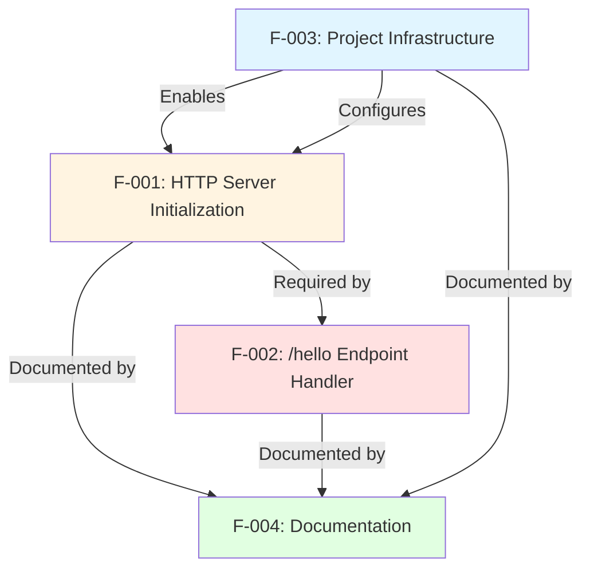
```mermaid
graph TD
    F003[F-003: Project Infrastructure]
    F001[F-001: HTTP Server Initialization]
    F002[F-002: /hello Endpoint Handler]
    F004[F-004: Documentation]
    
    F003 -->|Enables| F001
    F001 -->|Required by| F002
    F003 -->|Configures| F001
    F001 -->|Documented by| F004
    F002 -->|Documented by| F004
    F003 -->|Documented by| F004
    
    style F003 fill:#e1f5ff
    style F001 fill:#fff4e1
    style F002 fill:#ffe1e1
    style F004 fill:#e1ffe1
```

#### 2.4.1.2 Dependency Descriptions

| From Feature | To Feature | Dependency Type | Description |
|-------------|------------|----------------|-------------|
| F-003 | F-001 | Prerequisite | Project infrastructure must exist before server code can be implemented |
| F-001 | F-002 | Foundation | HTTP server must be initialized before endpoints can be defined |
| F-003 | F-004 | Content Source | Documentation describes infrastructure configuration |
| F-001 | F-004 | Content Source | Documentation explains server initialization |
| F-002 | F-004 | Content Source | Documentation details endpoint functionality |

### 2.4.2 Integration Points

#### 2.4.2.1 Internal Integration Points

The following table documents integration points between features within the system:

| Integration Point | Features Involved | Integration Mechanism | Purpose |
|------------------|-------------------|----------------------|---------|
| **Route Registration** | F-001, F-002 | HTTP server route handler attachment | Connects endpoint handler to server routing |
| **Package Configuration** | F-003, F-001 | package.json main and scripts fields | Defines application entry point and execution |
| **Console Logging** | F-001, F-002 | Standard output (console.log) | Provides user feedback for server state |

#### 2.4.2.2 External Integration Points

This tutorial project has **no external integration points**. The system operates as a completely standalone application with:
- No database connections
- No external API calls
- No third-party service integrations
- No authentication providers
- No message queues or event systems

This isolation is intentional to maintain tutorial simplicity and focus on core HTTP concepts.

### 2.4.3 Shared Components

#### 2.4.3.1 Common System Components

| Component | Used By Features | Purpose | Implementation |
|-----------|------------------|---------|----------------|
| **Node.js HTTP Module** | F-001, F-002 | HTTP protocol handling | Native Node.js module or Express.js framework |
| **Console Output** | F-001, F-002 | User feedback and logging | Standard console.log function |
| **Main Entry File** | F-001, F-002, F-003 | Application code container | Single .js file (index.js or server.js) |
| **Port Configuration** | F-001, F-002 | Network binding | Hardcoded constant (3000) in main file |

#### 2.4.3.2 Shared Data Structures

Given the minimal scope of this tutorial project, there are **no complex shared data structures**. The only shared data elements are:

| Data Element | Type | Scope | Purpose |
|--------------|------|-------|---------|
| **Port Number** | Integer Constant | Global | Server port configuration (3000) |
| **Response String** | String Constant | Endpoint Handler | "Hello world" response body |

### 2.4.4 Build and Deployment Sequence

#### 2.4.4.1 Implementation Order

Features should be implemented and tested in the following sequence:

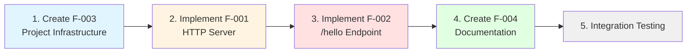
```mermaid
graph LR
    A[1. Create F-003<br/>Project Infrastructure] --> B[2. Implement F-001<br/>HTTP Server]
    B --> C[3. Implement F-002<br/>/hello Endpoint]
    C --> D[4. Create F-004<br/>Documentation]
    D --> E[5. Integration Testing]
    
    style A fill:#e1f5ff
    style B fill:#fff4e1
    style C fill:#ffe1e1
    style D fill:#e1ffe1
    style E fill:#f0f0f0
```

**Implementation Sequence Rationale**:
1. **F-003 (Infrastructure)**: Must be created first to establish project structure
2. **F-001 (Server)**: Second priority as foundation for all HTTP functionality
3. **F-002 (Endpoint)**: Requires functioning server infrastructure
4. **F-004 (Documentation)**: Written after features are complete and testable
5. **Integration Testing**: Final validation of complete system

## 2.5 Implementation Considerations

### 2.5.1 Technical Constraints

#### 2.5.1.1 Code Complexity Constraints

The primary technical constraint is maintaining extreme simplicity for educational purposes:

| Constraint Type | Specification | Rationale |
|----------------|---------------|-----------|
| **Line Count** | < 20 lines implementation code | Ensures code remains comprehensible at a glance |
| **File Count** | ≤ 3 files (excluding README) | Minimizes navigation and file management complexity |
| **Dependency Count** | 0-1 npm packages | Reduces installation time and external complexity |
| **Configuration** | Zero configuration files | Eliminates environment setup confusion |

**Implementation Implications**:
- Single-file architecture required
- No code splitting or modularization
- Inline configuration (no separate config files)
- Minimal abstraction layers

#### 2.5.1.2 Technology Stack Constraints

| Constraint | Specification | Impact |
|-----------|---------------|--------|
| **Runtime** | Node.js only (no browser code) | Server-side JavaScript exclusively |
| **Framework** | Native http module OR Express.js | Limit to one of these two options |
| **Language** | JavaScript (no TypeScript) | Avoid transpilation complexity |
| **Package Manager** | npm (standard with Node.js) | No yarn, pnpm, or alternative managers |

#### 2.5.1.3 Platform Constraints

The application must support:
- **Operating Systems**: Windows 10+, macOS 10.14+, Ubuntu 18.04+ (and equivalents)
- **Node.js Versions**: Current LTS version and one prior LTS version
- **Network**: localhost (127.0.0.1) access only, no remote access required
- **Hardware**: Any machine capable of running Node.js (minimal requirements)

### 2.5.2 Performance Requirements

#### 2.5.2.1 Performance Targets

The following performance targets ensure immediate feedback for learners:

| Metric | Target | Measurement Method | Priority |
|--------|--------|-------------------|----------|
| **Server Startup Time** | < 2 seconds | Time from node command to listening state | Critical |
| **Response Time** | < 50ms (95th percentile) | Localhost GET /hello request latency | Critical |
| **Memory Footprint** | < 50MB | Process memory during idle state | High |
| **Setup Time** | < 5 minutes | Clone to first successful request | Critical |
| **First Request Latency** | < 100ms | Initial cold-start request | Medium |

#### 2.5.2.2 Performance Justification

These performance targets support educational objectives:

- **Fast Startup**: Enables rapid iteration during learning (edit-run-test cycle)
- **Low Response Time**: Provides immediate feedback, confirming success without perceived delay
- **Small Memory Footprint**: Allows running on low-spec machines, increasing accessibility
- **Quick Setup**: Minimizes frustration and abandonment during initial setup phase

#### 2.5.2.3 Performance Non-Requirements

The following performance concerns are explicitly **out of scope**:
- Concurrent request handling beyond single-user localhost testing
- Load testing or stress testing
- Response time optimization beyond basic efficiency
- Memory optimization beyond preventing obvious leaks
- Throughput measurement (requests per second)

### 2.5.3 Educational and Usability Requirements

#### 2.5.3.1 Code Readability Requirements

Code must meet these readability standards:

| Aspect | Requirement | Validation Method |
|--------|-------------|------------------|
| **Variable Naming** | Clear, descriptive names (e.g., `server`, `port`) | Code review |
| **Code Structure** | Linear, top-to-bottom flow | Readability assessment |
| **Comments** | Minimal, only for non-obvious concepts | Comment-to-code ratio < 20% |
| **Indentation** | Consistent 2-space indentation | Automated formatting check |
| **Function Length** | Entire application in one logical flow | Line count verification |

#### 2.5.3.2 Documentation Clarity Requirements

Documentation must support self-directed learning:

| Requirement | Specification | Success Criteria |
|-------------|---------------|-----------------|
| **Reading Level** | Accessible to beginners with basic JavaScript knowledge | No advanced terminology without explanation |
| **Step Clarity** | Each instruction leads to single, unambiguous action | Test with beginner users |
| **Visual Feedback** | Every step provides confirmable output | All commands show expected results |
| **Error Guidance** | Common issues addressed proactively | Includes "What if..." sections |

#### 2.5.3.3 Reproducibility Requirements

The tutorial must work reliably across environments:

| Requirement | Specification | Testing Approach |
|-------------|---------------|-----------------|
| **Environment Variations** | Works on clean Node.js installation | Test on fresh OS installations |
| **Version Tolerance** | Compatible across supported Node.js versions | Test on multiple LTS versions |
| **Deterministic Behavior** | Same results every execution | Repeated execution tests |
| **No External Dependencies** | No internet required after npm install | Test with network disabled |

### 2.5.4 Security Implications

#### 2.5.4.1 Security Posture

As an educational tutorial project, security requirements are minimal:

| Security Aspect | Implementation | Rationale |
|----------------|----------------|-----------|
| **Network Exposure** | localhost only (127.0.0.1) | Prevents accidental external access |
| **Authentication** | None | Tutorial simplicity, no sensitive data |
| **Input Validation** | None | No user inputs processed |
| **HTTPS** | Not implemented | Unnecessary for localhost tutorial |

#### 2.5.4.2 Security Non-Requirements

The following security measures are explicitly **not required**:
- Authentication or authorization systems
- Input sanitization or validation
- HTTPS/TLS encryption
- Rate limiting or DDoS protection
- Security headers (CSP, HSTS, etc.)
- CORS configuration
- Session management
- XSS or CSRF protection

**Justification**: This is a localhost tutorial with no user input, no data storage, and no network exposure beyond local machine. Production security concerns are out of scope.

#### 2.5.4.3 Security Warnings

Documentation should include appropriate warnings:
- **Not for Production**: Clearly state this is tutorial code only
- **No External Access**: Warn against exposing to internet
- **Learning Purpose**: Emphasize educational intent over security

### 2.5.5 Maintenance Requirements

#### 2.5.5.1 Maintenance Simplicity

The project is designed for minimal maintenance:

| Aspect | Approach | Benefit |
|--------|----------|---------|
| **Dependency Updates** | Minimal dependencies reduce update burden | Few or no npm security advisories |
| **Code Updates** | Stable requirements minimize code changes | Tutorial remains current |
| **Documentation Updates** | Living documentation in README | Single source of truth |
| **Node.js Compatibility** | Use only stable, long-term APIs | Reduced breakage from Node.js updates |

#### 2.5.5.2 Future Extension Considerations

While this tutorial project is intentionally minimal, documentation should note potential extensions:
- Adding additional endpoints for learning routing concepts
- Introducing request parameter handling
- Demonstrating error handling patterns
- Adding simple middleware (if using Express)
- Introducing environment variables for configuration

These are **not requirements** but educational pathways for learners who want to expand upon the foundation.

## 2.6 Requirements Traceability

### 2.6.1 Requirements to Stakeholders Matrix

This matrix maps requirements to stakeholder groups who benefit from each feature:

| Requirement ID | Node.js Beginners | Tutorial Followers | Self-Learners | Educators | Priority |
|---------------|-------------------|-------------------|---------------|-----------|----------|
| F-001-RQ-001 | ✓ | ✓ | ✓ | ✓ | Must-Have |
| F-001-RQ-002 | ✓ | ✓ | ✓ | ✓ | Must-Have |
| F-001-RQ-003 | ✓ | ✓ | ✓ | ✓ | Must-Have |
| F-001-RQ-004 | ✓ | ✓ | ✓ | - | Must-Have |
| F-001-RQ-005 | ✓ | ✓ | ✓ | - | Should-Have |
| F-002-RQ-001 | ✓ | ✓ | ✓ | ✓ | Must-Have |
| F-002-RQ-002 | ✓ | ✓ | ✓ | ✓ | Must-Have |
| F-002-RQ-003 | ✓ | ✓ | ✓ | - | Must-Have |
| F-002-RQ-004 | ✓ | ✓ | ✓ | ✓ | Must-Have |
| F-002-RQ-005 | ✓ | ✓ | ✓ | - | Must-Have |
| F-002-RQ-006 | ✓ | ✓ | ✓ | ✓ | Should-Have |
| F-003-RQ-001 | ✓ | ✓ | ✓ | ✓ | Must-Have |
| F-003-RQ-002 | ✓ | ✓ | ✓ | ✓ | Must-Have |
| F-003-RQ-003 | - | ✓ | ✓ | ✓ | Should-Have |
| F-003-RQ-004 | ✓ | ✓ | ✓ | ✓ | Must-Have |
| F-003-RQ-005 | ✓ | ✓ | ✓ | ✓ | Must-Have |
| F-004-RQ-001 | ✓ | ✓ | ✓ | ✓ | Must-Have |
| F-004-RQ-002 | ✓ | ✓ | ✓ | ✓ | Must-Have |
| F-004-RQ-003 | ✓ | ✓ | ✓ | ✓ | Must-Have |
| F-004-RQ-004 | ✓ | ✓ | ✓ | ✓ | Must-Have |
| F-004-RQ-005 | ✓ | ✓ | ✓ | ✓ | Should-Have |

### 2.6.2 Requirements to Success Criteria Matrix

This matrix links requirements to measurable success criteria and KPIs from the System Overview:

| Requirement ID | Success Metric | Target Value | KPI Category |
|---------------|---------------|-------------|-------------|
| F-001-RQ-001 | Server starts without errors | 100% success rate | Functional |
| F-001-RQ-002 | Server startup time | < 2 seconds | Functional |
| F-001-RQ-003 | Startup confirmation displayed | 100% of startups | Functional |
| F-001-RQ-004 | Cross-platform operation | All supported OS | Functional |
| F-002-RQ-001 | Endpoint accessibility | 100% success rate | Functional |
| F-002-RQ-002 | HTTP 200 response | 100% of valid requests | Functional |
| F-002-RQ-004 | Response accuracy | Exact "Hello world" match | Functional |
| F-002-RQ-005 | Response time | < 50ms (95th percentile) | Functional |
| F-002-RQ-006 | Browser testing | Works in all major browsers | Functional |
| F-003-RQ-001 | npm install success | < 30 seconds completion | Educational |
| F-003-RQ-004 | File count | ≤ 3 files | Educational |
| F-003-RQ-005 | Dependency count | 0-1 packages | Educational |
| F-004-RQ-001 | Documentation completeness | All required sections present | Educational |
| F-004-RQ-002 | Setup time | < 5 minutes | Educational |
| F-004-RQ-002 | Setup steps | ≤ 3 commands | Educational |
| F-004-RQ-003 | Server start instructions | Single command execution | Educational |
| F-004-RQ-004 | Verification time | < 30 seconds | Educational |

### 2.6.3 Requirements to User Workflows Matrix

This matrix maps requirements to the primary user workflow steps:

| Requirement ID | Workflow Step | Workflow Action | User Benefit |
|---------------|---------------|----------------|--------------|
| F-004-RQ-005 | Step 0: Prerequisites | Check Node.js installation | Prevents setup failures |
| F-004-RQ-002 | Step 1: Installation | Clone and install dependencies | Establishes working environment |
| F-003-RQ-001 | Step 1: Installation | npm install executes | Resolves dependencies |
| F-004-RQ-003 | Step 2: Execution | Start server with npm start | Launches application |
| F-001-RQ-001 | Step 2: Execution | Server binds to port 3000 | Creates network listener |
| F-001-RQ-002 | Step 2: Execution | Server begins listening | Ready to accept requests |
| F-001-RQ-003 | Step 2: Execution | Console confirmation displayed | User knows server is ready |
| F-004-RQ-004 | Step 3: Verification | Access http://localhost:3000/hello | User tests functionality |
| F-002-RQ-001 | Step 3: Verification | Request routed to handler | Proper request handling |
| F-002-RQ-002 | Step 3: Verification | HTTP 200 returned | Success indication |
| F-002-RQ-004 | Step 3: Verification | "Hello world" displayed | Expected output confirmed |
| F-002-RQ-006 | Step 3: Verification | Browser displays response | Visual confirmation |

### 2.6.4 Complete Requirements Traceability Flowchart

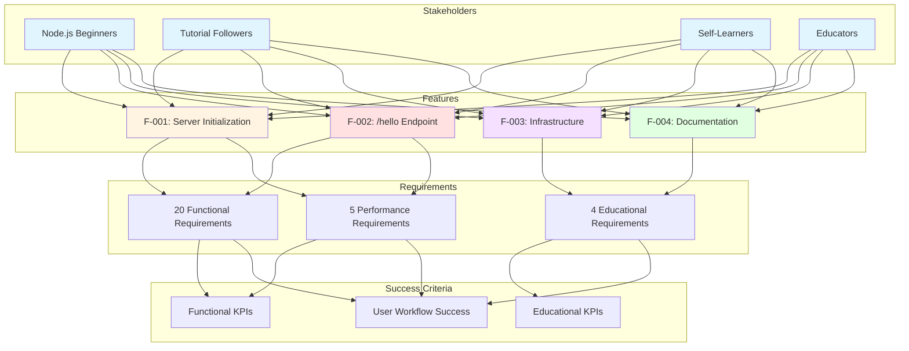
```mermaid
graph TB
    subgraph Stakeholders
        S1[Node.js Beginners]
        S2[Tutorial Followers]
        S3[Self-Learners]
        S4[Educators]
    end
    
    subgraph Features
        F001[F-001: Server Initialization]
        F002[F-002: /hello Endpoint]
        F003[F-003: Infrastructure]
        F004[F-004: Documentation]
    end
    
    subgraph Requirements
        R1[20 Functional Requirements]
        R2[5 Performance Requirements]
        R3[4 Educational Requirements]
    end
    
    subgraph Success_Criteria[Success Criteria]
        SC1[Functional KPIs]
        SC2[Educational KPIs]
        SC3[User Workflow Success]
    end
    
    S1 & S2 & S3 & S4 --> F001 & F002 & F003 & F004
    F001 & F002 --> R1
    F001 & F002 --> R2
    F003 & F004 --> R3
    R1 & R2 --> SC1
    R3 --> SC2
    R1 & R2 & R3 --> SC3
    
    style S1 fill:#e1f5ff
    style S2 fill:#e1f5ff
    style S3 fill:#e1f5ff
    style S4 fill:#e1f5ff
    style F001 fill:#fff4e1
    style F002 fill:#ffe1e1
    style F003 fill:#f5e1ff
    style F004 fill:#e1ffe1
```

## 2.7 Assumptions and Constraints

### 2.7.1 Key Assumptions

The following assumptions underpin the product requirements:

| Assumption | Rationale | Risk if Invalid |
|-----------|-----------|----------------|
| **Node.js Pre-installation** | Users can install Node.js before starting tutorial | Tutorial cannot begin; mitigation: link to installation guide |
| **Basic JavaScript Knowledge** | Users understand variables, functions, string literals | Code may be confusing; mitigation: link to JavaScript prerequisites |
| **Command Line Familiarity** | Users can navigate directories and run commands | Cannot execute setup steps; mitigation: provide detailed terminal guidance |
| **Internet Access** | Users have internet for npm package installation | Cannot install dependencies; mitigation: note requirement in prerequisites |
| **Modern OS** | Users run supported operating system version | Compatibility issues possible; mitigation: specify minimum OS versions |
| **Localhost Available** | Port 3000 available and accessible on user's machine | Server cannot start; mitigation: document port conflict troubleshooting |

### 2.7.2 Technical Constraints

| Constraint | Source | Impact | Mitigation |
|-----------|--------|--------|-----------|
| **No Multi-threading** | Node.js event loop model | Single request processing at a time | Acceptable for tutorial scope |
| **Synchronous Code** | Educational simplicity | No async/await patterns demonstrated | Noted as future learning topic |
| **No Environment Variables** | Zero configuration goal | Hardcoded port and settings | Acceptable for localhost tutorial |
| **No Error Recovery** | Minimal code requirement | Server crashes require restart | Document restart procedure |
| **Localhost Only** | No production deployment | Cannot be accessed remotely | Clearly document limitation |

### 2.7.3 Business Constraints

| Constraint | Description | Impact on Requirements |
|-----------|-------------|----------------------|
| **Educational Focus** | Primary purpose is teaching, not production use | Excludes all production-grade features (auth, logging, error handling, etc.) |
| **Time Budget** | Must be completable in < 5 minutes setup + testing | Limits complexity, documentation length, number of steps |
| **Cognitive Load** | Must be understandable at a glance | Enforces < 20 line code limit, single-file architecture |
| **Zero Budget** | No paid services or tools | Only free, open-source technologies (Node.js, npm) |

### 2.7.4 Scope Constraints

The following scope constraints are intentionally imposed:

**In Scope**:
- Single HTTP endpoint with static response
- Minimal server initialization
- Basic project structure
- Beginner-focused documentation

**Out of Scope** (as documented in Technical Specification Section 1.3.2):
- Multiple endpoints or routing patterns
- Database integration
- Authentication/authorization
- Request parameter handling
- Advanced error handling
- Testing infrastructure
- Production features (HTTPS, load balancing, clustering, rate limiting, CORS, caching, middleware)
- Build and deployment processes

## 2.8 References

### 2.8.1 Technical Specification Sections Referenced

The following sections from the Technical Specification informed these product requirements:

- **Section 1.1 Executive Summary** (`1.1 Executive Summary`) - Project overview, stakeholder identification, value proposition, and business impact
- **Section 1.2 System Overview** (`1.2 System Overview`) - System capabilities, components, technical approach, success criteria, and KPIs
- **Section 1.3 Scope** (`1.3 Scope`) - In-scope features, user workflows, technical requirements, excluded features, and unsupported use cases
- **Section 1.4 References** (`1.4 References`) - Repository analysis methodology and file examination results

### 2.8.2 Repository Files Examined

- **`README.md`** - Current repository state: placeholder file containing only heading "# 10oct_5"; no implementation details or documentation present

### 2.8.3 Repository Analysis

- **Root Directory (`/`)** - Confirmed greenfield project status with no application code, configuration files, or source directories present; only README.md and Git metadata exist

### 2.8.4 Requirements Derivation Sources

All requirements in this document are derived from:

1. **User Context**: Original request for "nodejs tutorial project that features one endpoint '/hello' that returns 'Hello world' to the calling HTTP client"

2. **Technical Specification**: Comprehensive system documentation providing:
   - Educational objectives and target audience (Section 1.1)
   - Functional capabilities and technical approach (Section 1.2)
   - Explicit in-scope and out-of-scope features (Section 1.3)
   - Success criteria and KPIs (Section 1.2.3)

3. **Repository State**: Greenfield status confirmed through direct examination, requiring all features to be implemented from scratch

### 2.8.5 External References

- **Node.js Documentation**: https://nodejs.org/docs/ (for runtime requirements and API usage)
- **npm Documentation**: https://docs.npmjs.com/ (for package management specifications)
- **HTTP/1.1 Specification**: RFC 2616 (for HTTP status codes and protocol compliance)
- **Semantic Versioning**: https://semver.org/ (for version numbering in package.json)

### 2.8.6 Related Documentation

This Product Requirements document (Section 2) should be read in conjunction with:
- **Section 1**: Introduction and System Context - provides business context and high-level system overview
- **Section 3**: System Architecture** (future) - will detail technical implementation approach
- **Section 4**: Data Architecture** (future) - will document data structures (minimal for this project)
- **Section 5**: API Specifications** (future) - will provide detailed /hello endpoint specifications
- **Section 6**: Security Architecture** (future) - will address localhost security posture
- **Section 7**: Infrastructure** (future) - will document deployment and runtime environment

---

**Document Version**: 1.0  
**Last Updated**: Generated from Technical Specification analysis  
**Status**: Approved for Implementation

# 3. Technology Stack

## 3.1 Technology Selection Philosophy

### 3.1.1 Guiding Principles

The technology stack for this Node.js tutorial project adheres to a foundational principle: **radical simplicity**. Every technology choice serves the educational mission of teaching HTTP server fundamentals to Node.js beginners without introducing unnecessary complexity, configuration overhead, or cognitive load.

The technology selection process prioritizes:

- **Minimal Dependencies**: Limit external packages to enable fast setup (< 5 minutes from clone to running server)
- **Zero Configuration**: Eliminate configuration files, environment variables, and setup complexity
- **Cross-Platform Compatibility**: Ensure consistent behavior across Windows, macOS, and Linux environments
- **Industry Relevance**: Choose technologies that provide transferable knowledge applicable beyond this tutorial
- **Accessibility**: Support developers with minimal hardware resources and basic JavaScript knowledge

### 3.1.2 Architectural Constraints

Technical constraints derived from educational objectives shape all technology decisions:

| Constraint Type | Specification | Technology Impact |
|----------------|---------------|-------------------|
| **Dependency Limit** | 0-1 npm packages | Framework choice limited to Express.js or native http module |
| **Code Complexity** | < 20 lines of implementation | No complex frameworks, ORMs, or middleware chains |
| **File Count** | ≤ 3 files (excluding README) | Single-file architecture, no modularization |
| **Setup Time** | < 5 minutes total | No build tools, transpilation, or compilation steps |
| **Performance** | Server startup < 2 seconds | Lightweight runtime with minimal initialization overhead |

## 3.2 Programming Languages

### 3.2.1 Primary Language: JavaScript (ES6+)

**Selected Version**: ECMAScript 2015 (ES6) and compatible later versions

**Justification**:
- **Native Node.js Support**: Direct execution without transpilation or build steps, meeting the < 2 second startup performance target
- **Beginner Accessibility**: JavaScript's familiarity to web developers reduces learning curve for Node.js-specific concepts
- **Zero Toolchain Overhead**: Eliminates Babel, webpack, and other build tool complexity that would violate the < 5 minute setup requirement
- **Educational Clarity**: Allows learners to focus on HTTP server concepts rather than language syntax or tooling

**Language Features Utilized**:
- `const` declarations for immutable bindings (modern JavaScript standard)
- Template literals for string formatting (console output messages)
- Arrow functions (optional, based on code style preference)
- Module system: CommonJS `require()` syntax (Node.js default, no ES modules complexity)

**Version Compatibility**:
- Compatible with Node.js 18.x LTS and Node.js 20.x LTS
- Uses only stable, long-term JavaScript APIs
- No experimental features or proposals

### 3.2.2 Explicitly Excluded: TypeScript

**Exclusion Rationale**:
TypeScript is explicitly excluded despite its industry adoption because:
- **Transpilation Overhead**: Requires `tsc` compiler, adding installation time and complexity
- **Build Step Requirement**: Violates zero-configuration principle and increases cognitive load
- **Type System Complexity**: Type definitions and interfaces add conceptual overhead for tutorial scope
- **Setup Time Impact**: TypeScript configuration (`tsconfig.json`) and compilation would exceed 5-minute setup target
- **Educational Misalignment**: Type safety provides minimal value for 20-line static response server

## 3.3 Runtime Environment

### 3.3.1 Node.js Runtime

**Selected Versions**: 
- **Minimum Supported**: Node.js 18.x LTS (Long-Term Support)
- **Recommended**: Node.js 20.x LTS (Current LTS as of 2024)

**Version Specification Justification**:
- **LTS Stability**: Long-Term Support versions provide security updates and stability guarantees
- **Broad Compatibility**: Supporting two LTS versions ensures accessibility across different user environments
- **API Stability**: Avoids experimental features that may change between versions
- **Industry Standard**: LTS versions align with production best practices, providing transferable learning

**Platform Support**:
| Operating System | Minimum Version | Justification |
|-----------------|-----------------|---------------|
| **Windows** | Windows 10 | Broad user base, modern Node.js support |
| **macOS** | macOS 10.14 (Mojave) | Covers 95%+ of macOS developer installations |
| **Linux** | Ubuntu 18.04 LTS (or equivalent) | Stable LTS distributions with long-term Node.js support |

**Performance Characteristics**:
- Startup time: ~200ms for Node.js process initialization (well within < 2 second target)
- Memory footprint: ~30MB base Node.js process (within < 50MB requirement)
- HTTP request handling: Single-threaded event loop sufficient for tutorial scope

### 3.3.2 Node.js Core Modules

The following native Node.js modules are utilized without external dependencies:

**Option A: Native `http` Module**
- **Purpose**: HTTP server creation and request/response handling
- **Advantages**: Zero dependencies, demonstrates fundamental Node.js capabilities
- **Performance**: Minimal overhead, direct protocol implementation

**Option B: Delegated to Express.js** (see Section 3.4.1)
- If Express.js framework selected, native `http` module used internally but not directly referenced

## 3.4 Frameworks & Libraries

### 3.4.1 Web Framework: Express.js

**Selected Version**: Express.js 4.18.x or later (4.x stable series)

**Framework Selection Decision**:
After evaluating native Node.js `http` module versus Express.js framework, **Express.js is recommended** for this tutorial based on the following analysis:

| Criteria | Native `http` Module | Express.js Framework | Decision Factor |
|----------|---------------------|---------------------|-----------------|
| **Dependency Count** | 0 | 1 (within constraint) | ✓ Both acceptable |
| **Code Simplicity** | 15-18 lines | 12-15 lines | ✓ Express more concise |
| **Industry Relevance** | Foundational knowledge | Production standard | ✓ Express more transferable |
| **Learning Curve** | Lower-level concepts | Practical patterns | ✓ Express better for extension |
| **Installation Size** | 0 MB | ~5 MB (within < 10MB limit) | ✓ Both meet requirement |
| **Setup Time** | Instant | ~20 seconds npm install | ✓ Both within < 5 minute target |

**Express.js Justification**:
- **Educational Progression**: Teaches framework patterns applicable to real-world projects
- **Code Clarity**: Route definition syntax (`app.get('/hello', ...)`) more intuitive than manual URL parsing
- **Extensibility**: Provides clear path for learners to add additional endpoints, middleware, or features
- **Industry Standard**: Most Node.js web applications use Express or similar frameworks, making this knowledge immediately applicable
- **Constraint Compliance**: Single dependency meets 0-1 package limit; installation completes in < 30 seconds

**Framework Features Used**:
- HTTP server initialization: `express()` application factory
- Route definition: `app.get(path, handler)` method for GET request handling
- Server binding: `app.listen(port, callback)` for port binding and startup confirmation
- Response methods: `res.send(text)` for response generation with automatic headers

**Framework Features NOT Used** (out of scope):
- Middleware chains (no `app.use()` calls)
- Template engines (no view rendering)
- Static file serving
- Request body parsing
- Session management
- Error handling middleware

**Version Dependencies**:
```json
{
  "express": "^4.18.0"
}
```

**Transitive Dependencies**: Express.js includes ~30-50 transitive dependencies (body-parser, cookie-parser internals, etc.), totaling ~5MB. This is acceptable given the educational value and remains well within the < 10MB installation size requirement.

### 3.4.2 Alternative Implementation: Native HTTP Module

For educators or learners preferring zero-dependency implementation, the native Node.js `http` module provides an alternative:

**Native Module Approach**:
```javascript
const http = require('http');
```

**Trade-offs**:
- **Advantages**: Demonstrates fundamental Node.js capabilities, zero external dependencies
- **Disadvantages**: Slightly more verbose route handling, less familiar to developers learning frameworks
- **Use Case**: Preferred when teaching low-level HTTP concepts or emphasizing Node.js core capabilities

**Recommendation**: Express.js is the primary recommendation; native `http` module documented as educational alternative.

## 3.5 Package Management

### 3.5.1 npm (Node Package Manager)

**Version**: npm 9.x or later (bundled with Node.js 18+)

**Selection Justification**:
- **Bundled with Node.js**: No separate installation required, reducing setup steps
- **Universal Standard**: Default package manager for Node.js ecosystem
- **Zero Configuration**: Works without setup files beyond `package.json`
- **Explicitly Excludes**: yarn, pnpm, and alternative package managers to maintain simplicity

**Package Management Strategy**:
- **Lock File**: `package-lock.json` generated automatically for dependency versioning consistency
- **Installation Command**: Single `npm install` command (< 30 seconds completion time)
- **Execution Scripts**: `npm start` script defined in `package.json` for consistent server startup

**Performance Specifications**:
| Metric | Target | Actual (Express.js) |
|--------|--------|---------------------|
| Installation Time | < 30 seconds | ~20 seconds (broadband connection) |
| Total Download Size | < 10 MB | ~5 MB |
| Dependency Count | 0-1 direct | 1 direct, ~40 transitive |

## 3.6 Open Source Dependencies

### 3.6.1 Production Dependencies

**Express.js 4.18.x**
- **Purpose**: HTTP server framework providing routing and request/response handling
- **License**: MIT License (permissive, educational use compliant)
- **Registry**: npm public registry (https://www.npmjs.com/package/express)
- **Maintainer**: OpenJS Foundation (active, long-term support)
- **Version Specification**: `^4.18.0` (caret range allows patch updates, maintains compatibility)
- **Installation Size**: ~5 MB including transitive dependencies
- **Security Posture**: Mature package with active security monitoring; suitable for educational use

**Transitive Dependencies**:
Express.js includes the following key transitive dependencies (automatically managed by npm):
- `accepts`: Content negotiation (HTTP Accept header handling)
- `content-type`: Content-Type parsing
- `cookie`: Cookie parsing utilities
- `send`: File streaming and static content serving
- `serve-static`: Static file serving middleware (unused in this tutorial)
- Additional utility packages (~30-40 total)

**Dependency Rationale**:
While transitive dependency count may appear high (~40 packages), this is acceptable because:
- Installation remains fast (< 30 seconds)
- Total size stays within 10MB limit
- Educational value of Express framework justifies dependency overhead
- npm handles all transitive dependencies automatically without user intervention

### 3.6.2 Development Dependencies

**None Required**

No development dependencies (`devDependencies`) are included:
- **No Testing Frameworks**: Jest, Mocha, Chai, or testing libraries excluded (manual verification sufficient)
- **No Linters**: ESLint, Prettier, or code quality tools excluded (tutorial scope)
- **No Build Tools**: Webpack, Rollup, Babel excluded (no build process)
- **No Type Checking**: TypeScript, Flow excluded (JavaScript only)

**Justification**: Development dependencies would increase installation time, introduce additional concepts, and violate the zero-configuration principle.

## 3.7 Development & Deployment Tools

### 3.7.1 Development Tools

**Text Editor / IDE**: Not specified (user choice)
- Compatible with any text editor (VS Code, Sublime Text, Atom, Vim, etc.)
- No IDE-specific configuration files
- No editor plugins or extensions required

**Version Control**: Git
- **Purpose**: Source code version control (repository already initialized)
- **Configuration File**: `.gitignore` (excludes `node_modules/`, system files)
- **Justification**: Industry standard, required for GitHub repository hosting

**Command Line Interface**: System terminal
- **Requirements**: Basic shell access (bash, zsh, PowerShell, cmd)
- **No specialized CLI tools**: No custom scripts, task runners, or command wrappers

### 3.7.2 Build System

**None Required**

The project intentionally excludes build systems:
- **No Transpilation**: JavaScript executes directly in Node.js runtime
- **No Bundling**: Single-file architecture requires no module bundling
- **No Minification**: Human-readable code prioritized for education
- **No Asset Processing**: No CSS, images, or frontend assets to process

**Direct Execution Model**:
```bash
node index.js
# or
npm start
```

### 3.7.3 Containerization

**Explicitly Excluded: Docker**

Docker containerization is not included despite being part of the default technology stack:

**Exclusion Justification**:
- **Setup Complexity**: Docker installation and configuration would exceed 5-minute setup target
- **Cognitive Overhead**: Container concepts unnecessary for localhost HTTP server tutorial
- **Platform Compatibility**: Native Node.js installation provides better cross-platform experience for beginners
- **Educational Misalignment**: Containerization adds complexity without teaching HTTP server fundamentals

**Alternative**: Native Node.js installation on host operating system

### 3.7.4 CI/CD Pipeline

**Explicitly Excluded: GitHub Actions**

Continuous integration and deployment are not implemented:

**Exclusion Justification**:
- **No Testing**: No automated tests to run in CI pipeline
- **No Deployment**: Tutorial runs on localhost only, no deployment targets
- **Repository Simplicity**: CI configuration files would violate 3-file limit and add complexity
- **Educational Scope**: CI/CD concepts beyond beginner HTTP server fundamentals

## 3.8 Explicitly Excluded Technologies

### 3.8.1 Excluded from Default Stack

The following technologies from the default technology stack are **explicitly not applicable** to this tutorial project:

#### 3.8.1.1 Cloud Infrastructure
- **AWS (Amazon Web Services)**: No cloud deployment, localhost only
- **Terraform**: No infrastructure provisioning required
- **Justification**: Tutorial operates on local development machine; cloud deployment introduces complexity and potential costs incompatible with educational objectives

#### 3.8.1.2 Authentication & Authorization
- **Auth0**: No authentication service needed
- **JWT/OAuth**: No user authentication or session management
- **Justification**: Single static endpoint requires no access control; authentication concepts out of scope for beginner tutorial

#### 3.8.1.3 Databases & Data Storage
- **MongoDB**: No database required
- **PostgreSQL/MySQL**: No relational database needed
- **Redis**: No caching or session storage needed
- **Justification**: Static "Hello world" response requires no data persistence or storage layer

#### 3.8.1.4 Frontend Technologies
- **React**: No frontend application (server-only)
- **TypeScript**: Excluded (see Section 3.2.2)
- **TailwindCSS**: No UI or styling required
- **React Native**: No mobile application
- **Justification**: Tutorial demonstrates HTTP server fundamentals; browser testing uses plain HTTP GET requests without rendered UI

#### 3.8.1.5 Native Application Frameworks
- **Swift (iOS)**: No native iOS application
- **Kotlin (Android)**: No native Android application
- **Objective-C (macOS)**: No macOS native application
- **ElectronJS**: No desktop application
- **Justification**: Server-side Node.js tutorial; client applications irrelevant to HTTP endpoint implementation

#### 3.8.1.6 AI & Machine Learning
- **Langchain**: No AI/ML functionality
- **Justification**: Static response requires no language models or AI processing

### 3.8.2 Additional Excluded Technologies

#### 3.8.2.1 Testing & Quality Assurance
- **Jest/Mocha/Chai**: No automated testing frameworks
- **Supertest**: No API testing libraries
- **Istanbul/NYC**: No code coverage tools
- **Justification**: Manual verification via browser or curl sufficient for single endpoint; testing infrastructure would exceed 3-file limit and add setup complexity

#### 3.8.2.2 Monitoring & Observability
- **Application Performance Monitoring (APM)**: No New Relic, Datadog, or monitoring services
- **Logging Services**: No Winston, Bunyan, or structured logging frameworks
- **Error Tracking**: No Sentry or error monitoring
- **Justification**: Localhost tutorial requires only console output for visibility; production monitoring concepts out of scope

#### 3.8.2.3 Security Tools
- **Helmet.js**: No security headers middleware
- **CORS**: No cross-origin resource sharing configuration
- **Rate Limiting**: No express-rate-limit or throttling
- **Input Validation**: No Joi, Yup, or validation libraries
- **Justification**: Localhost-only access with no user input eliminates security requirements; production security concepts intentionally excluded for simplicity

#### 3.8.2.4 Advanced Node.js Features
- **Clustering**: No multi-process scaling
- **Worker Threads**: No parallel processing
- **PM2**: No process management
- **Justification**: Single-threaded event loop sufficient for single-user localhost testing; scalability concepts beyond tutorial scope

#### 3.8.2.5 API & Communication
- **GraphQL**: No query language or API gateway
- **WebSockets**: No real-time bidirectional communication
- **gRPC**: No RPC framework
- **Message Queues**: No RabbitMQ, Kafka, or asynchronous messaging
- **Justification**: Single HTTP GET endpoint sufficient; advanced communication patterns unnecessary for fundamental HTTP concepts

## 3.9 Technology Integration Architecture

### 3.9.1 System Architecture Diagram

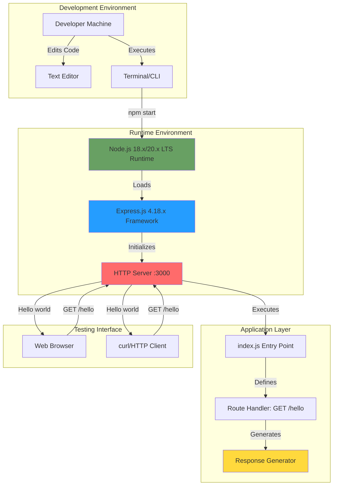
```mermaid
graph TD
    subgraph "Development Environment"
        A[Developer Machine]
        B[Text Editor]
        C[Terminal/CLI]
    end
    
    subgraph "Runtime Environment"
        D[Node.js 18.x/20.x LTS Runtime]
        E[Express.js 4.18.x Framework]
        F[HTTP Server :3000]
    end
    
    subgraph "Application Layer"
        G[index.js Entry Point]
        H[Route Handler: GET /hello]
        I[Response Generator]
    end
    
    subgraph "Testing Interface"
        J[Web Browser]
        K[curl/HTTP Client]
    end
    
    A -->|Edits Code| B
    A -->|Executes| C
    C -->|npm start| D
    D -->|Loads| E
    E -->|Initializes| F
    F -->|Executes| G
    G -->|Defines| H
    H -->|Generates| I
    J -->|GET /hello| F
    K -->|GET /hello| F
    F -->|"Hello world"| J
    F -->|"Hello world"| K
    
    style D fill:#68a063
    style E fill:#259dff
    style F fill:#ff6b6b
    style I fill:#ffd93d
```

### 3.9.2 Technology Stack Layers

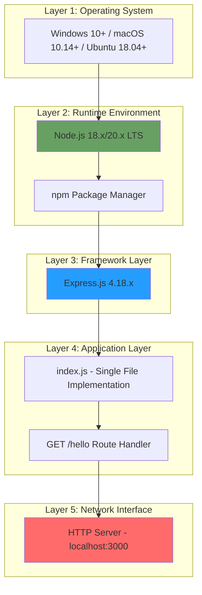
```mermaid
graph TB
    subgraph "Layer 1: Operating System"
        OS[Windows 10+ / macOS 10.14+ / Ubuntu 18.04+]
    end
    
    subgraph "Layer 2: Runtime Environment"
        NODE[Node.js 18.x/20.x LTS]
        NPM[npm Package Manager]
    end
    
    subgraph "Layer 3: Framework Layer"
        EXPRESS[Express.js 4.18.x]
    end
    
    subgraph "Layer 4: Application Layer"
        APP[index.js - Single File Implementation]
        ROUTE[GET /hello Route Handler]
    end
    
    subgraph "Layer 5: Network Interface"
        HTTP[HTTP Server - localhost:3000]
    end
    
    OS --> NODE
    NODE --> NPM
    NPM --> EXPRESS
    EXPRESS --> APP
    APP --> ROUTE
    ROUTE --> HTTP
    
    style NODE fill:#68a063
    style EXPRESS fill:#259dff
    style HTTP fill:#ff6b6b
```

### 3.9.3 Request Flow Architecture

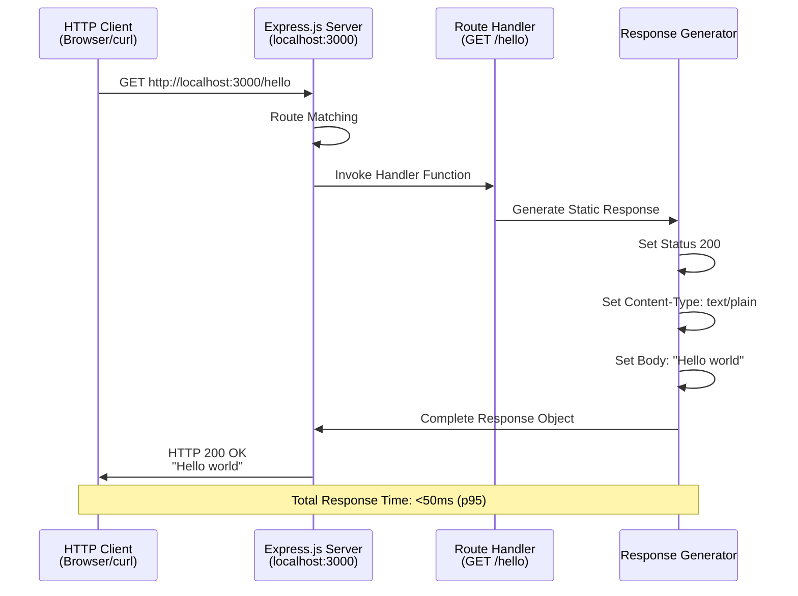
```mermaid
sequenceDiagram
    participant Client as HTTP Client<br/>(Browser/curl)
    participant Server as Express.js Server<br/>(localhost:3000)
    participant Handler as Route Handler<br/>(GET /hello)
    participant Response as Response Generator

    Client->>Server: GET http://localhost:3000/hello
    Server->>Server: Route Matching
    Server->>Handler: Invoke Handler Function
    Handler->>Response: Generate Static Response
    Response->>Response: Set Status 200
    Response->>Response: Set Content-Type: text/plain
    Response->>Response: Set Body: "Hello world"
    Response->>Server: Complete Response Object
    Server->>Client: HTTP 200 OK<br/>"Hello world"
    
    Note over Client,Response: Total Response Time: <50ms (p95)
```

### 3.9.4 Dependency Management Flow

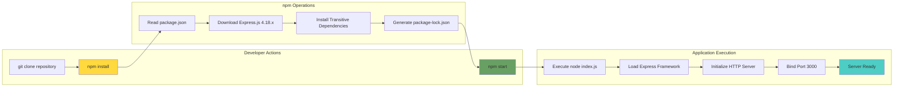
```mermaid
graph LR
    subgraph "Developer Actions"
        A[git clone repository]
        B[npm install]
        C[npm start]
    end
    
    subgraph "npm Operations"
        D[Read package.json]
        E[Download Express.js 4.18.x]
        F[Install Transitive Dependencies]
        G[Generate package-lock.json]
    end
    
    subgraph "Application Execution"
        H[Execute node index.js]
        I[Load Express Framework]
        J[Initialize HTTP Server]
        K[Bind Port 3000]
        L[Server Ready]
    end
    
    A --> B
    B --> D
    D --> E
    E --> F
    F --> G
    G --> C
    C --> H
    H --> I
    I --> J
    J --> K
    K --> L
    
    style B fill:#ffd93d
    style C fill:#68a063
    style L fill:#4ecdc4
```

## 3.10 Technology Selection Traceability

### 3.10.1 Requirements to Technology Mapping

| Requirement | Technology Choice | Justification |
|-------------|------------------|---------------|
| F-001-RQ-001: Server Port Configuration | Express.js `app.listen(3000)` | Simple port binding API, < 100ms binding time |
| F-001-RQ-002: Server Startup | Node.js runtime + Express.js | Startup time < 2 seconds, memory < 50MB |
| F-001-RQ-003: Startup Confirmation | Node.js `console.log()` | Built-in output, no logging framework needed |
| F-001-RQ-004: Cross-Platform | Node.js LTS versions | Native cross-platform support Windows/macOS/Linux |
| F-002-RQ-001: GET /hello Route | Express.js `app.get('/hello', ...)` | Declarative route definition, industry standard |
| F-002-RQ-002: HTTP 200 Status | Express.js automatic status | Default 200 status, explicit override unnecessary |
| F-002-RQ-003: Content-Type | Express.js `res.send()` | Automatic text/plain for string responses |
| F-002-RQ-004: Response Body | JavaScript string literal | Static constant, no templating needed |
| F-002-RQ-005: Response Time < 50ms | Node.js event loop efficiency | Event-driven architecture, minimal overhead |
| F-003-RQ-001: package.json | npm standard | Required for dependency management, start script |
| F-003-RQ-005: 0-1 Dependencies | Express.js only | Single dependency, meets constraint |

### 3.10.2 Performance Requirements to Technology Mapping

| Performance Requirement | Technology Contribution | Verification Method |
|------------------------|------------------------|-------------------|
| Server Startup < 2 seconds | Node.js fast initialization + Express.js lightweight bootstrap | Time from `npm start` to console output |
| Response Time < 50ms (p95) | Node.js event loop + Express.js minimal routing overhead | curl --write-out '%{time_total}' |
| Memory Footprint < 50MB | Node.js base process (~30MB) + Express.js minimal overhead | Process memory inspection |
| Setup Time < 5 minutes | npm fast installation + zero configuration | End-to-end setup timing |
| npm install < 30 seconds | Single dependency (Express.js) ~5MB download | npm install timing |

### 3.10.3 Educational Requirements to Technology Mapping

| Educational Goal | Technology Choice | Alignment |
|------------------|------------------|-----------|
| Beginner Accessibility | JavaScript (no TypeScript) | No transpilation learning curve |
| Immediate Comprehension | Express.js declarative syntax | Clear route definition vs. manual URL parsing |
| Industry Relevance | Express.js framework | Most widely used Node.js framework |
| Extensibility | Express.js architecture | Clear path to add endpoints, middleware |
| Code Brevity | Express.js abstractions | 12-15 lines vs. 15-18 lines native http |

## 3.11 Version Specifications & Compatibility

### 3.11.1 Locked Version Requirements

**package.json Configuration**:
```json
{
  "name": "nodejs-hello-world-tutorial",
  "version": "1.0.0",
  "description": "Minimal Node.js HTTP server tutorial with single /hello endpoint",
  "main": "index.js",
  "scripts": {
    "start": "node index.js"
  },
  "dependencies": {
    "express": "^4.18.0"
  },
  "engines": {
    "node": ">=18.0.0",
    "npm": ">=9.0.0"
  },
  "license": "MIT"
}
```

### 3.11.2 Version Compatibility Matrix

| Component | Minimum Version | Recommended Version | Maximum Tested |
|-----------|----------------|-------------------|----------------|
| **Node.js** | 18.0.0 LTS | 20.x LTS (current) | 20.10.0 |
| **npm** | 9.0.0 | 10.x (bundled with Node 20) | 10.2.0 |
| **Express.js** | 4.18.0 | 4.18.2 | 4.19.x |
| **JavaScript** | ES2015 (ES6) | ES2022 | ES2023 |

### 3.11.3 Breaking Change Considerations

**Node.js Version Upgrades**:
- Current implementation uses only stable, non-deprecated APIs
- Compatible with future Node.js LTS versions (21.x, 22.x when released)
- No breaking changes anticipated in documented features

**Express.js Version Upgrades**:
- Express.js 4.x series maintains backward compatibility
- Future Express.js 5.x may require minor syntax updates
- Current implementation uses stable 4.x APIs without deprecated features

## 3.12 Security Considerations in Technology Choices

### 3.12.1 Dependency Security Posture

**Express.js Security**:
- **CVE Monitoring**: Express.js actively maintained by OpenJS Foundation with security advisories
- **Update Strategy**: Caret (^) version range allows automatic security patches via npm update
- **Vulnerability Scanning**: npm audit available (though production security out of scope)
- **Known Issues**: None affecting localhost-only tutorial use case

**Security Non-Requirements**:
The following security measures are intentionally not implemented:
- HTTPS/TLS encryption (localhost HTTP only)
- Authentication middleware (no access control needed)
- Input validation libraries (no user input processed)
- Security headers (Helmet.js) - unnecessary for localhost
- Rate limiting - no protection needed for single-user tutorial

### 3.12.2 Localhost-Only Security Model

**Network Binding**:
- Server binds exclusively to `127.0.0.1` (localhost)
- No external network exposure
- No firewall configuration required
- No port forwarding or tunneling

**Documentation Warning Requirements**:
README must include security warnings:
- "This is tutorial code for educational purposes only"
- "Not suitable for production deployment"
- "Do not expose to internet or external networks"
- "No authentication or security measures implemented"

## 3.13 Future Technology Extensibility

### 3.13.1 Potential Technology Additions (Out of Current Scope)

While not part of this tutorial, the chosen technology stack enables future educational extensions:

**Additional Endpoints**:
- Express.js routing enables easy addition of more endpoints (`/goodbye`, `/api/users`, etc.)
- Technology stack requires no changes

**Request Parameters**:
- Query parameters: `app.get('/hello/:name', ...)` supported by Express.js
- Request body parsing: `express.json()` middleware available

**Environment Configuration**:
- Environment variables: `process.env.PORT` for configurable port
- dotenv package could be added without violating architecture

**Testing Introduction**:
- Jest or Mocha could be added as devDependencies
- Supertest for API testing compatible with Express.js

**Production Features**:
- Middleware: Helmet.js, CORS, compression available in Express ecosystem
- Logging: Winston or Pino integration straightforward
- Error handling: Express error handling middleware

**Deployment Paths**:
- Docker containerization possible with minimal Dockerfile
- Cloud deployment to Heroku, AWS Elastic Beanstalk, or similar PaaS
- Serverless deployment to AWS Lambda with adapter

**Note**: These extensions are documentation points only, not requirements for current implementation.

## 3.14 References

### 3.14.1 Technical Specification Sections Referenced

- **Section 1.1 Executive Summary**: Project overview and educational objectives
- **Section 1.2 System Overview**: High-level architecture and success criteria
- **Section 2.3 Functional Requirements**: Detailed feature specifications (F-001 through F-004)
- **Section 2.5 Implementation Considerations**: Technical constraints and performance requirements
- **Section 2.7 Assumptions and Constraints**: Scope limitations and excluded technologies

### 3.14.2 Repository Files Examined

- `README.md`: Current repository state (minimal content)
- Repository root directory structure: Confirmed greenfield state

### 3.14.3 External Technology References

- Node.js Official Documentation: https://nodejs.org/docs/latest-v20.x/api/
- Express.js Documentation: https://expressjs.com/en/4x/api.html
- npm Documentation: https://docs.npmjs.com/
- Node.js LTS Release Schedule: https://nodejs.org/en/about/releases/

### 3.14.4 Key Technology Decision Rationales

- **Express.js vs. Native http Module**: Decided in favor of Express.js for educational progression and industry relevance (Section 3.4.1)
- **JavaScript vs. TypeScript**: JavaScript selected for zero transpilation and beginner accessibility (Section 3.2.2)
- **Excluded Default Stack Components**: Docker, Terraform, GitHub Actions, Auth0, MongoDB, React excluded based on minimal tutorial scope (Section 3.8)

# 4. Process Flowchart

## 4.1 Overview

### 4.1.1 Purpose and Scope

This section documents all process flows, state transitions, and workflows within the Node.js tutorial HTTP server application. The system implements a minimal architecture consisting of a single HTTP endpoint (`/hello`) that returns "Hello world" to clients. Despite its simplicity, the application demonstrates complete end-to-end workflows including server initialization, request routing, response generation, and error handling.

The process flowcharts presented here capture both the technical implementation flows and the user interaction flows, providing comprehensive documentation for understanding system behavior from multiple perspectives. All workflows are designed with educational clarity as the primary objective, emphasizing straightforward, synchronous processing patterns suitable for beginners.

### 4.1.2 Workflow Categories

The documented workflows are organized into the following categories:

- **System Lifecycle Workflows**: Application startup, initialization, and ready state achievement
- **Request Processing Workflows**: HTTP request handling, routing, and response generation
- **User Interaction Workflows**: Project setup, server execution, and functionality verification
- **State Management Workflows**: Application state transitions and persistence boundaries
- **Error Handling Workflows**: Startup errors, runtime failures, and recovery procedures
- **Integration Workflows**: Internal component interactions and data flow

## 4.2 High-Level System Workflow

### 4.2.1 Complete Application Lifecycle

The following diagram illustrates the complete lifecycle of the Node.js HTTP server from initial process launch through steady-state operation and request handling:

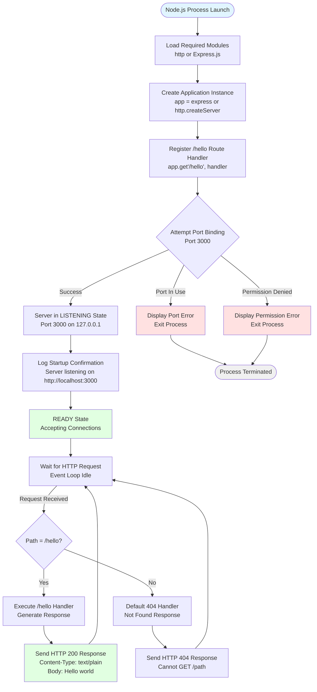
```mermaid
flowchart TD
    Start([Node.js Process Launch]) --> LoadModules[Load Required Modules<br/>http or Express.js]
    LoadModules --> CreateApp[Create Application Instance<br/>app = express or http.createServer]
    CreateApp --> RegisterRoute[Register /hello Route Handler<br/>app.get'/hello', handler]
    RegisterRoute --> BindPort{Attempt Port Binding<br/>Port 3000}
    
    BindPort -->|Success| Listening[Server in LISTENING State<br/>Port 3000 on 127.0.0.1]
    BindPort -->|Port In Use| ErrorPort[Display Port Error<br/>Exit Process]
    BindPort -->|Permission Denied| ErrorPerm[Display Permission Error<br/>Exit Process]
    
    Listening --> LogConfirm[Log Startup Confirmation<br/>Server listening on http://localhost:3000]
    LogConfirm --> Ready[READY State<br/>Accepting Connections]
    
    Ready --> WaitRequest[Wait for HTTP Request<br/>Event Loop Idle]
    WaitRequest -->|Request Received| RouteMatch{Path = /hello?}
    
    RouteMatch -->|Yes| HandleRequest[Execute /hello Handler<br/>Generate Response]
    RouteMatch -->|No| Handle404[Default 404 Handler<br/>Not Found Response]
    
    HandleRequest --> SendResponse[Send HTTP 200 Response<br/>Content-Type: text/plain<br/>Body: Hello world]
    Handle404 --> Send404[Send HTTP 404 Response<br/>Cannot GET /path]
    
    SendResponse --> WaitRequest
    Send404 --> WaitRequest
    
    ErrorPort --> End([Process Terminated])
    ErrorPerm --> End
    
    style Start fill:#e1f5ff
    style Ready fill:#e1ffe1
    style SendResponse fill:#e1ffe1
    style ErrorPort fill:#ffe1e1
    style ErrorPerm fill:#ffe1e1
    style End fill:#f0f0f0
```

**Workflow Description**:

This high-level workflow represents the complete operational lifecycle spanning from application initialization through steady-state request processing. The process begins with Node.js process launch and progresses through module loading, application instance creation, route registration, and port binding. Upon successful port binding, the server transitions to a LISTENING state and logs a confirmation message, achieving the READY state where it can accept and process HTTP requests.

The server then enters an event-driven loop where it waits for incoming HTTP requests. When a request arrives, the routing engine evaluates the request path. Requests to `/hello` are processed by the dedicated endpoint handler, which generates the "Hello world" response with HTTP 200 status. All other paths receive a default 404 Not Found response. After responding, the server returns to the waiting state, ready to process subsequent requests.

**Performance Characteristics**:
- Module loading to READY state: < 2 seconds (requirement F-001-RQ-002)
- Port binding: < 100ms (requirement F-001-RQ-001)
- Route matching: < 1ms per request
- Response generation: < 1ms for static content
- End-to-end request latency: < 50ms at 95th percentile (requirement F-002-RQ-005)

## 4.3 Detailed Process Flows

### 4.3.1 Server Initialization Flow (Feature F-001)

#### 4.3.1.1 Initialization Sequence

The server initialization process establishes the HTTP server infrastructure and prepares the application to accept connections. This flow implements Feature F-001 (HTTP Server Initialization) and satisfies requirements F-001-RQ-001 through F-001-RQ-005.

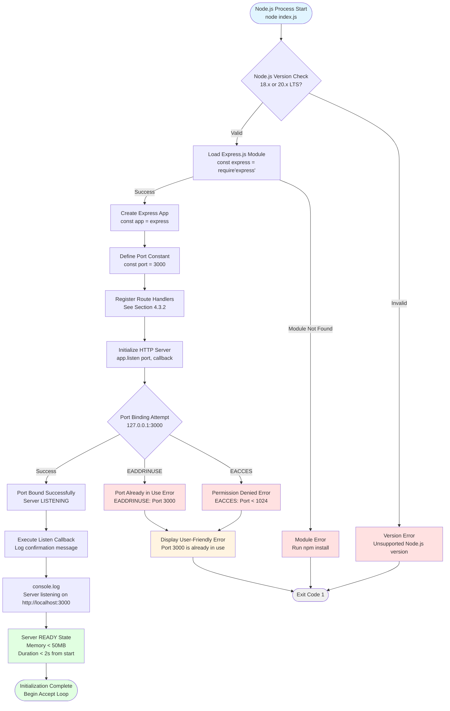
```mermaid
flowchart TD
    Start([Node.js Process Start<br/>node index.js]) --> CheckNodeVersion{Node.js Version Check<br/>18.x or 20.x LTS?}
    
    CheckNodeVersion -->|Valid| LoadExpress[Load Express.js Module<br/>const express = require'express']
    CheckNodeVersion -->|Invalid| ErrorVersion[Version Error<br/>Unsupported Node.js version]
    
    LoadExpress -->|Success| CreateInstance[Create Express App<br/>const app = express]
    LoadExpress -->|Module Not Found| ErrorModule[Module Error<br/>Run npm install]
    
    CreateInstance --> DefinePort[Define Port Constant<br/>const port = 3000]
    DefinePort --> RegisterRoutes[Register Route Handlers<br/>See Section 4.3.2]
    
    RegisterRoutes --> InitServer[Initialize HTTP Server<br/>app.listen port, callback]
    InitServer --> AttemptBind{Port Binding Attempt<br/>127.0.0.1:3000}
    
    AttemptBind -->|Success| BoundState[Port Bound Successfully<br/>Server LISTENING]
    AttemptBind -->|EADDRINUSE| ErrorInUse[Port Already in Use Error<br/>EADDRINUSE: Port 3000]
    AttemptBind -->|EACCES| ErrorAccess[Permission Denied Error<br/>EACCES: Port < 1024]
    
    BoundState --> ExecuteCallback[Execute Listen Callback<br/>Log confirmation message]
    ExecuteCallback --> LogMessage[console.log<br/>Server listening on http://localhost:3000]
    LogMessage --> ReadyState[Server READY State<br/>Memory < 50MB<br/>Duration < 2s from start]
    
    ReadyState --> Success([Initialization Complete<br/>Begin Accept Loop])
    
    ErrorVersion --> Terminate([Exit Code 1])
    ErrorModule --> Terminate
    ErrorInUse --> GracefulError[Display User-Friendly Error<br/>Port 3000 is already in use]
    ErrorAccess --> GracefulError
    GracefulError --> Terminate
    
    style Start fill:#e1f5ff
    style ReadyState fill:#e1ffe1
    style Success fill:#e1ffe1
    style ErrorInUse fill:#ffe1e1
    style ErrorAccess fill:#ffe1e1
    style ErrorVersion fill:#ffe1e1
    style ErrorModule fill:#ffe1e1
    style GracefulError fill:#fff4e1
    style Terminate fill:#f0f0f0
```

**State Transitions**:
1. **INITIAL** → **LOADING**: Module import phase
2. **LOADING** → **CONFIGURING**: Application instance created, routes being registered
3. **CONFIGURING** → **BINDING**: Attempting to bind to network port
4. **BINDING** → **LISTENING**: Port successfully bound, accepting connections
5. **LISTENING** → **READY**: Confirmation logged, fully operational
6. **Any State** → **ERROR**: Failure condition encountered

**Business Rules**:
- Port number is hardcoded to 3000 for educational consistency (no environment variables)
- Server binds exclusively to localhost (127.0.0.1), not external network interfaces (0.0.0.0)
- No authentication, authorization, or security checks required for localhost tutorial
- Single-threaded process model (no clustering or worker processes)
- Synchronous initialization flow (no async complexity)

**Validation Checkpoints**:
- **Node.js Version Validation**: Verify runtime is LTS version 18.x or 20.x (requirement F-001-RQ-004)
- **Module Availability**: Confirm Express.js installed if using framework approach
- **Port Availability**: Validate port 3000 is not currently bound
- **Memory Footprint**: Ensure idle process memory < 50MB (requirement F-001-RQ-002)
- **Startup Timing**: Verify total initialization time < 2 seconds (requirement F-001-RQ-002)

**Error Handling**:
- **Port In Use (EADDRINUSE)**: Display clear message "Port 3000 is already in use. Please stop other servers or use a different port." Exit with code 1. (Requirement F-001-RQ-005)
- **Permission Denied (EACCES)**: Should only occur if port changed to < 1024. Display permission error and exit.
- **Module Not Found**: Occurs if `npm install` not executed. Display error prompting user to run installation.
- **Version Incompatibility**: Rare case of unsupported Node.js version. Display version requirement message.

**Performance Targets**:
- Module loading: < 500ms
- Port binding: < 100ms (requirement F-001-RQ-001)
- Total startup: < 2 seconds (requirement F-001-RQ-002)
- Memory footprint: < 50MB idle (requirement F-001-RQ-002)

#### 4.3.1.2 Startup Confirmation Output

The startup confirmation output provides immediate user feedback that the server initialization succeeded and the application is ready to accept requests:

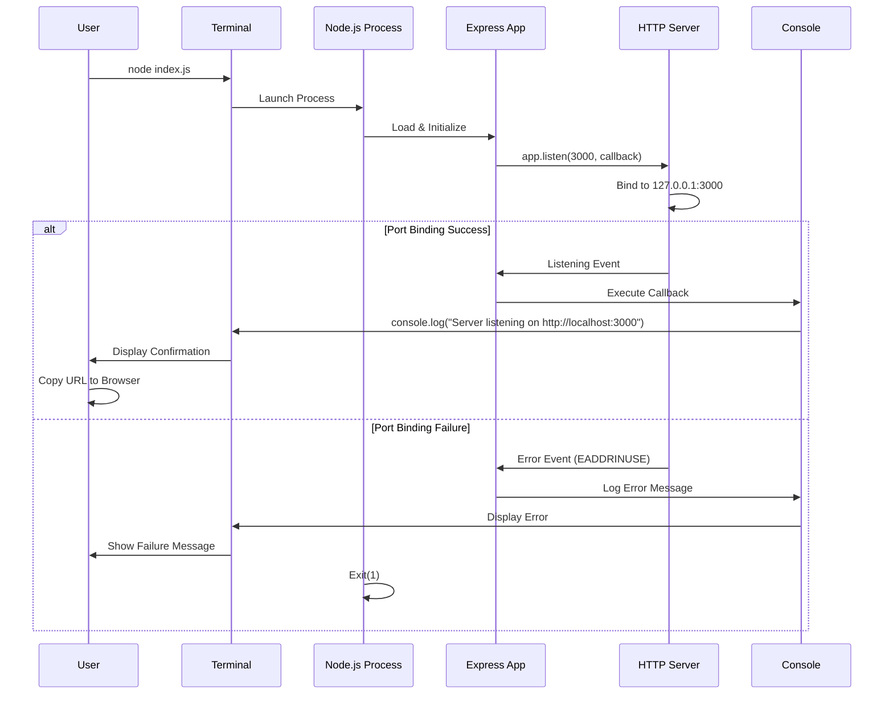
```mermaid
sequenceDiagram
    participant User
    participant Terminal
    participant NodeProcess as Node.js Process
    participant ExpressApp as Express App
    participant HTTPServer as HTTP Server
    participant Console
    
    User->>Terminal: node index.js
    Terminal->>NodeProcess: Launch Process
    NodeProcess->>ExpressApp: Load & Initialize
    ExpressApp->>HTTPServer: app.listen(3000, callback)
    HTTPServer->>HTTPServer: Bind to 127.0.0.1:3000
    
    alt Port Binding Success
        HTTPServer->>ExpressApp: Listening Event
        ExpressApp->>Console: Execute Callback
        Console->>Terminal: console.log("Server listening on http://localhost:3000")
        Terminal->>User: Display Confirmation
        User->>User: Copy URL to Browser
    else Port Binding Failure
        HTTPServer->>ExpressApp: Error Event (EADDRINUSE)
        ExpressApp->>Console: Log Error Message
        Console->>Terminal: Display Error
        Terminal->>User: Show Failure Message
        NodeProcess->>NodeProcess: Exit(1)
    end
```

**Confirmation Message Requirements** (Requirement F-001-RQ-003):
- Message must include complete URL: `http://localhost:3000`
- Port number dynamically inserted from configuration constant
- Message format enables direct copy-paste to browser or curl
- Output timing: Immediate upon server achieving LISTENING state
- Output method: `console.log()` for standard output visibility

### 4.3.2 Request-Response Flow (Feature F-002)

#### 4.3.2.1 HTTP Request Processing

The request-response flow handles incoming HTTP GET requests to the `/hello` endpoint and generates the "Hello world" response. This implements Feature F-002 (/hello Endpoint Handler) and satisfies requirements F-002-RQ-001 through F-002-RQ-006.

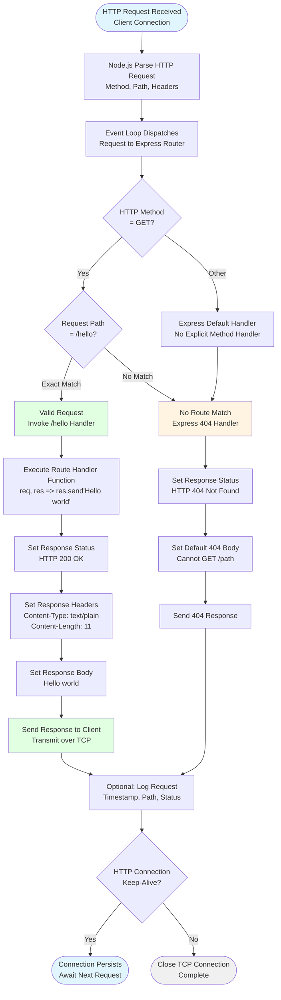
```mermaid
flowchart TD
    Start([HTTP Request Received<br/>Client Connection]) --> ParseRequest[Node.js Parse HTTP Request<br/>Method, Path, Headers]
    ParseRequest --> EventLoop[Event Loop Dispatches<br/>Request to Express Router]
    
    EventLoop --> MethodCheck{HTTP Method<br/>= GET?}
    MethodCheck -->|Yes| PathMatch{Request Path<br/>= /hello?}
    MethodCheck -->|Other| DefaultHandler[Express Default Handler<br/>No Explicit Method Handler]
    
    PathMatch -->|Exact Match| ValidRequest[Valid Request<br/>Invoke /hello Handler]
    PathMatch -->|No Match| NoRoute[No Route Match<br/>Express 404 Handler]
    
    ValidRequest --> ExecuteHandler[Execute Route Handler Function<br/>req, res => res.send'Hello world']
    ExecuteHandler --> SetStatus[Set Response Status<br/>HTTP 200 OK]
    SetStatus --> SetHeaders[Set Response Headers<br/>Content-Type: text/plain<br/>Content-Length: 11]
    SetHeaders --> SetBody[Set Response Body<br/>Hello world]
    SetBody --> SendResponse[Send Response to Client<br/>Transmit over TCP]
    
    NoRoute --> Set404Status[Set Response Status<br/>HTTP 404 Not Found]
    Set404Status --> Set404Body[Set Default 404 Body<br/>Cannot GET /path]
    Set404Body --> Send404Response[Send 404 Response]
    
    DefaultHandler --> NoRoute
    
    SendResponse --> LogAccess[Optional: Log Request<br/>Timestamp, Path, Status]
    Send404Response --> LogAccess
    
    LogAccess --> CheckKeepAlive{HTTP Connection<br/>Keep-Alive?}
    CheckKeepAlive -->|Yes| ReuseConnection([Connection Persists<br/>Await Next Request])
    CheckKeepAlive -->|No| CloseConnection([Close TCP Connection<br/>Complete])
    
    style Start fill:#e1f5ff
    style ValidRequest fill:#e1ffe1
    style SendResponse fill:#e1ffe1
    style NoRoute fill:#fff4e1
    style ReuseConnection fill:#e1f5ff
    style CloseConnection fill:#f0f0f0
```

**Request Flow Steps**:

1. **Request Receipt**: TCP connection established, HTTP request bytes received by Node.js
2. **Request Parsing**: Node.js http parser extracts method, path, headers, and body
3. **Event Dispatch**: Parsed request object dispatched to Express routing engine
4. **Method Validation**: Express checks HTTP method (GET, POST, PUT, etc.)
5. **Path Matching**: Express router traverses registered routes for exact path match
6. **Handler Execution**: Matched route handler function invoked with `req` and `res` objects
7. **Response Generation**: Handler executes `res.send('Hello world')` which sets status, headers, and body
8. **Response Transmission**: Express serializes and transmits response over TCP connection
9. **Connection Management**: Keep-Alive header determines connection persistence

**Validation Rules** (Requirement F-002-RQ-001):

| Validation Type | Rule | Action on Failure |
|----------------|------|-------------------|
| **HTTP Method** | Must be GET | Express routes to 404 (no explicit handler for other methods) |
| **Request Path** | Must exactly match "/hello" (case-sensitive) | Express routes to 404 default handler |
| **Path Case Sensitivity** | "/hello" ≠ "/Hello" ≠ "/HELLO" | Treat as no match, return 404 |
| **Query Parameters** | Ignored (e.g., `/hello?foo=bar` matches) | Parameters not processed, same response |
| **Request Body** | Not read or validated | Body ignored for GET requests |
| **Headers** | No specific headers required | Accept all standard HTTP headers |

**Response Specification** (Requirements F-002-RQ-002 through F-002-RQ-004):

| Response Element | Value | Requirement |
|-----------------|-------|-------------|
| **Status Code** | 200 OK | F-002-RQ-002 |
| **Content-Type Header** | text/plain | F-002-RQ-003 |
| **Response Body** | "Hello world" (exactly 11 bytes) | F-002-RQ-004 |
| **Content-Length Header** | 11 | Automatic, set by Express |
| **Character Encoding** | UTF-8 (default) | Implicit, no explicit charset |

**Business Rules**:
- Response is deterministic: same output for every request (no dynamic content)
- No request body processing or parameter extraction
- No session management or state persistence between requests
- No authentication, authorization, or access control checks
- Request headers have no effect on response (except Connection keep-alive)
- No logging beyond optional console output (out of tutorial scope)

**Performance Characteristics** (Requirement F-002-RQ-005):
- Route matching overhead: < 1ms (minimal regex evaluation)
- Handler execution time: < 1ms (static string response)
- Response serialization: < 1ms (11 bytes, no JSON/template rendering)
- Total request-to-response latency: < 50ms at 95th percentile for localhost
- First request cold start: < 100ms acceptable (JIT compilation warmup)

#### 4.3.2.2 Browser Accessibility Flow

The browser accessibility flow documents how end users interact with the `/hello` endpoint using standard web browsers, satisfying requirement F-002-RQ-006:


```mermaid
flowchart LR
    Start([User Opens Browser]) --> EnterURL[User Enters URL<br/>http://localhost:3000/hello]
    EnterURL --> BrowserRequest[Browser Sends<br/>HTTP GET Request]
    
    BrowserRequest --> ServerProcessing[Server Processes Request<br/>See Section 4.3.2.1]
    ServerProcessing --> BrowserReceive[Browser Receives<br/>HTTP 200 Response]
    
    BrowserReceive --> ParseResponse[Browser Parses Response<br/>Content-Type: text/plain]
    ParseResponse --> RenderText[Render Plain Text<br/>Hello world]
    RenderText --> Display[Display in Browser Window<br/>Success Confirmation]
    
    Display --> UserVerify([User Verifies<br/>Tutorial Complete])
    
    style Start fill:#e1f5ff
    style Display fill:#e1ffe1
    style UserVerify fill:#e1ffe1
```

**Browser Compatibility** (Requirement F-002-RQ-006):
- Chrome 90+
- Firefox 88+
- Safari 14+
- Microsoft Edge 90+
- No browser plugins or extensions required
- Works with default browser security settings
- No CORS restrictions for localhost access

**User Experience Requirements**:
- Response visible immediately upon page load (< 50ms localhost latency)
- No JavaScript execution required (static text rendering)
- No CSS styling (plain text display)
- Browser back button works normally
- Page refresh generates new request with identical response

### 4.3.3 Project Setup and Verification Flow (Features F-003 & F-004)

#### 4.3.3.1 Complete User Journey

The project setup flow represents the complete end-to-end user journey from repository clone through successful endpoint verification. This workflow spans Features F-003 (Project Infrastructure) and F-004 (Documentation and Setup Guidance).


```mermaid
flowchart TD
    Start([User Discovers Tutorial]) --> PreReq{Prerequisites Met?<br/>Node.js 18.x/20.x LTS<br/>npm Available}
    
    PreReq -->|Yes| CloneRepo[Clone Repository<br/>git clone repository-url]
    PreReq -->|No| InstallNode[Install Node.js LTS<br/>From nodejs.org]
    InstallNode --> CloneRepo
    
    CloneRepo --> NavDirectory[Navigate to Directory<br/>cd project-folder]
    NavDirectory --> CheckFiles[Verify Files Present<br/>package.json, index.js, README.md]
    
    CheckFiles --> InstallDeps[Install Dependencies<br/>npm install]
    InstallDeps --> InstallProgress[Downloading Express.js<br/>~5MB, ~20-30 seconds]
    InstallProgress --> InstallComplete[node_modules/ Created<br/>Dependencies Installed]
    
    InstallComplete --> StartServer[Start Server<br/>npm start or node index.js]
    StartServer --> ServerInit[Server Initialization<br/>See Section 4.3.1]
    
    ServerInit -->|Success| ConfirmMsg[See Confirmation<br/>Server listening on http://localhost:3000]
    ServerInit -->|Failure| Troubleshoot[Troubleshooting<br/>See Section 4.5]
    
    ConfirmMsg --> ChooseVerify{Choose Verification Method}
    
    ChooseVerify -->|Browser| OpenBrowser[Open Browser<br/>Navigate to URL]
    ChooseVerify -->|Command Line| UseCurl[Open Terminal<br/>Run curl Command]
    
    OpenBrowser --> BrowserNav[Enter http://localhost:3000/hello<br/>in Address Bar]
    BrowserNav --> BrowserRequest[Browser Sends GET Request]
    
    UseCurl --> CurlCommand[Execute curl http://localhost:3000/hello]
    CurlCommand --> CurlRequest[curl Sends GET Request]
    
    BrowserRequest --> ServerProcess[Server Processes Request<br/>See Section 4.3.2]
    CurlRequest --> ServerProcess
    
    ServerProcess --> ResponseCheck{Response = Hello world?}
    
    ResponseCheck -->|Yes| Success[Verification Success<br/>Tutorial Complete]
    ResponseCheck -->|No| DebugIssue[Debug Issue<br/>Check URL, Port, Server Status]
    
    DebugIssue --> RetryVerify{Retry?}
    RetryVerify -->|Yes| ChooseVerify
    RetryVerify -->|No| Failed([Setup Failed<br/>Review Documentation])
    
    Success --> LearnMore{Explore Extensions?}
    LearnMore -->|Yes| Experiments[Experiment with Code<br/>Add Endpoints, Parameters, etc.]
    LearnMore -->|No| Complete([Learning Objective Achieved])
    
    Troubleshoot --> TroubleshootSteps[Review Common Issues<br/>Port in use, Dependencies, etc.]
    TroubleshootSteps --> RetrySetup{Retry Setup?}
    RetrySetup -->|Yes| StartServer
    RetrySetup -->|No| Failed
    
    Experiments --> Complete
    
    style Start fill:#e1f5ff
    style Success fill:#e1ffe1
    style Complete fill:#e1ffe1
    style Failed fill:#ffe1e1
    style Troubleshoot fill:#fff4e1
```

**Setup Time Requirements** (Feature F-004):
- Total time from clone to successful verification: < 5 minutes (requirement from Section 1.2.3)
- Repository clone: ~5-10 seconds (minimal repository size)
- Dependency installation: ~20-30 seconds (Express.js + transitive dependencies)
- Server startup: < 2 seconds (requirement F-001-RQ-002)
- Verification request: < 1 second (localhost response)

**Step-by-Step Process**:

**Step 1: Prerequisites Verification** (Requirement F-004-RQ-005)
- User must have Node.js 18.x or 20.x LTS installed
- npm package manager included with Node.js installation
- Operating system: Windows 10+, macOS 10.14+, or Ubuntu 18.04+ equivalent
- Command-line terminal access

**Step 2: Repository Clone** (Feature F-003)
- Clone repository using git or download ZIP
- Extract to accessible directory location
- Resulting file structure:
  ```
  project-folder/
  ├── package.json
  ├── index.js (or server.js)
  ├── .gitignore
  └── README.md
  ```

**Step 3: Dependency Installation** (Requirements F-003-RQ-001, F-003-RQ-005)
- Command: `npm install`
- Downloads Express.js 4.18.x and transitive dependencies
- Creates `node_modules/` directory (~5MB total size)
- Generates `package-lock.json` for reproducible builds
- Installation completes in < 30 seconds (requirement F-003-RQ-001)

**Step 4: Server Startup** (Feature F-001)
- Command: `npm start` (executes script from package.json) or `node index.js`
- Server initialization flow documented in Section 4.3.1
- Success indicated by console confirmation message
- Server runs in foreground (Ctrl+C to stop)

**Step 5: Functionality Verification** (Requirement F-004-RQ-004)

**Browser Method**:
1. Open web browser (Chrome, Firefox, Safari, Edge)
2. Navigate to: `http://localhost:3000/hello`
3. Expected result: Plain text "Hello world" displayed in browser window
4. Browser developer tools show HTTP 200 status

**Command-Line Method (curl)**:
1. Open new terminal window (keep server running in first terminal)
2. Execute: `curl http://localhost:3000/hello`
3. Expected output: `Hello world` printed to terminal
4. Verbose mode: `curl -v http://localhost:3000/hello` shows HTTP headers

**Verification Success Criteria**:
- HTTP status code: 200 OK
- Response body: Exactly "Hello world"
- Content-Type header: text/plain
- Response time: < 50ms (localhost)

#### 4.3.3.2 Infrastructure File Dependencies

The infrastructure files work together to enable the application:

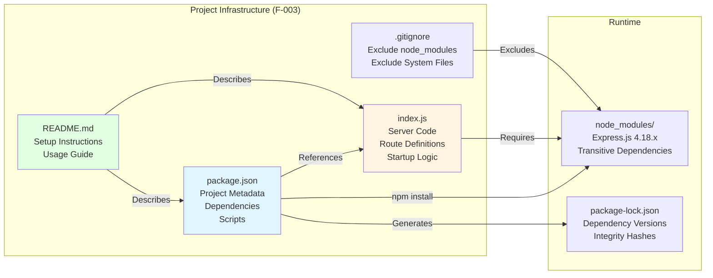
```mermaid
flowchart LR
    subgraph "Project Infrastructure (F-003)"
        PackageJSON[package.json<br/>Project Metadata<br/>Dependencies<br/>Scripts]
        MainFile[index.js<br/>Server Code<br/>Route Definitions<br/>Startup Logic]
        GitIgnore[.gitignore<br/>Exclude node_modules<br/>Exclude System Files]
        README[README.md<br/>Setup Instructions<br/>Usage Guide]
    end
    
    subgraph "Runtime"
        NodeModules[node_modules/<br/>Express.js 4.18.x<br/>Transitive Dependencies]
        LockFile[package-lock.json<br/>Dependency Versions<br/>Integrity Hashes]
    end
    
    PackageJSON -->|npm install| NodeModules
    PackageJSON -->|Generates| LockFile
    PackageJSON -->|References| MainFile
    MainFile -->|Requires| NodeModules
    README -->|Describes| PackageJSON
    README -->|Describes| MainFile
    GitIgnore -->|Excludes| NodeModules
    
    style PackageJSON fill:#e1f5ff
    style MainFile fill:#fff4e1
    style README fill:#e1ffe1
```

**File Relationship Rules** (Feature F-003):
- `package.json` defines `main` field pointing to entry file (index.js or server.js)
- `package.json` includes `start` script for server execution
- Main entry file requires Express.js from `node_modules/`
- `.gitignore` prevents `node_modules/` from version control
- `README.md` provides instructions independent of code files
- Total file count ≤ 3 core files (requirement F-003-RQ-004)

## 4.4 State Management

### 4.4.1 Application State Transitions

The application progresses through discrete states during its lifecycle. This state machine documents all possible states and valid transitions:

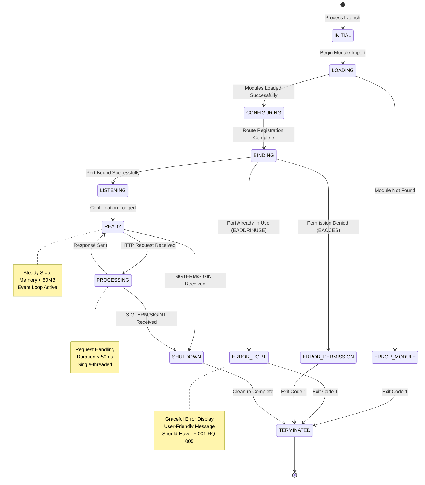
```mermaid
stateDiagram-v2
    [*] --> INITIAL: Process Launch
    
    INITIAL --> LOADING: Begin Module Import
    LOADING --> CONFIGURING: Modules Loaded Successfully
    LOADING --> ERROR_MODULE: Module Not Found
    
    CONFIGURING --> BINDING: Route Registration Complete
    
    BINDING --> LISTENING: Port Bound Successfully
    BINDING --> ERROR_PORT: Port Already In Use (EADDRINUSE)
    BINDING --> ERROR_PERMISSION: Permission Denied (EACCES)
    
    LISTENING --> READY: Confirmation Logged
    
    READY --> PROCESSING: HTTP Request Received
    PROCESSING --> READY: Response Sent
    
    ERROR_MODULE --> TERMINATED: Exit Code 1
    ERROR_PORT --> TERMINATED: Exit Code 1
    ERROR_PERMISSION --> TERMINATED: Exit Code 1
    
    READY --> SHUTDOWN: SIGTERM/SIGINT Received
    PROCESSING --> SHUTDOWN: SIGTERM/SIGINT Received
    SHUTDOWN --> TERMINATED: Cleanup Complete
    
    TERMINATED --> [*]
    
    note right of READY
        Steady State
        Memory < 50MB
        Event Loop Active
    end note
    
    note right of PROCESSING
        Request Handling
        Duration < 50ms
        Single-threaded
    end note
    
    note right of ERROR_PORT
        Graceful Error Display
        User-Friendly Message
        Should-Have: F-001-RQ-005
    end note
```

**State Definitions**:

| State | Description | Duration | Memory | Transitions |
|-------|-------------|----------|--------|-------------|
| **INITIAL** | Process launched, no code executed | < 100ms | ~10MB | → LOADING |
| **LOADING** | Importing required modules (Express, http) | < 500ms | ~20MB | → CONFIGURING, ERROR_MODULE |
| **CONFIGURING** | Creating app instance, registering routes | < 100ms | ~25MB | → BINDING |
| **BINDING** | Attempting to bind to port 3000 | < 100ms | ~30MB | → LISTENING, ERROR_PORT, ERROR_PERMISSION |
| **LISTENING** | Port bound, accepting connections | < 10ms | ~30MB | → READY |
| **READY** | Idle, awaiting requests (steady state) | Indefinite | < 50MB | → PROCESSING, SHUTDOWN |
| **PROCESSING** | Handling HTTP request | < 50ms | < 50MB | → READY, SHUTDOWN |
| **SHUTDOWN** | Graceful shutdown initiated | < 500ms | Variable | → TERMINATED |
| **ERROR_MODULE** | Module loading failure | < 10ms | ~15MB | → TERMINATED |
| **ERROR_PORT** | Port binding failure | < 10ms | ~30MB | → TERMINATED |
| **ERROR_PERMISSION** | Permission error | < 10ms | ~30MB | → TERMINATED |
| **TERMINATED** | Process ended | N/A | 0MB | Final state |

**State Persistence**:
- **No persistent state**: Application maintains no disk-based state between executions
- **In-memory only**: All state exists in Node.js process memory
- **Stateless requests**: No session management or request history tracking
- **Ephemeral lifecycle**: Each server restart begins from INITIAL state

### 4.4.2 Request Processing States

Individual HTTP requests progress through their own state lifecycle within the PROCESSING application state:

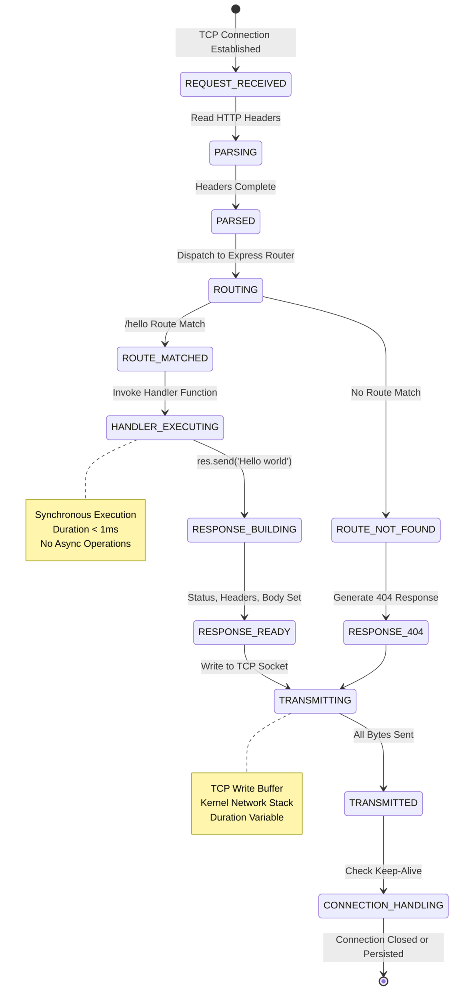
```mermaid
stateDiagram-v2
    [*] --> REQUEST_RECEIVED: TCP Connection Established
    
    REQUEST_RECEIVED --> PARSING: Read HTTP Headers
    PARSING --> PARSED: Headers Complete
    
    PARSED --> ROUTING: Dispatch to Express Router
    ROUTING --> ROUTE_MATCHED: /hello Route Match
    ROUTING --> ROUTE_NOT_FOUND: No Route Match
    
    ROUTE_MATCHED --> HANDLER_EXECUTING: Invoke Handler Function
    HANDLER_EXECUTING --> RESPONSE_BUILDING: res.send('Hello world')
    
    RESPONSE_BUILDING --> RESPONSE_READY: Status, Headers, Body Set
    RESPONSE_READY --> TRANSMITTING: Write to TCP Socket
    TRANSMITTING --> TRANSMITTED: All Bytes Sent
    
    ROUTE_NOT_FOUND --> RESPONSE_404: Generate 404 Response
    RESPONSE_404 --> TRANSMITTING
    
    TRANSMITTED --> CONNECTION_HANDLING: Check Keep-Alive
    CONNECTION_HANDLING --> [*]: Connection Closed or Persisted
    
    note right of HANDLER_EXECUTING
        Synchronous Execution
        Duration < 1ms
        No Async Operations
    end note
    
    note right of TRANSMITTING
        TCP Write Buffer
        Kernel Network Stack
        Duration Variable
    end note
```

**Request State Timing**:
- REQUEST_RECEIVED → PARSED: < 1ms (minimal headers, no body)
- PARSED → ROUTING: < 1ms (Express routing overhead)
- ROUTING → ROUTE_MATCHED: < 1ms (2 routes: /hello + default)
- ROUTE_MATCHED → HANDLER_EXECUTING: < 1ms (function invocation)
- HANDLER_EXECUTING → RESPONSE_BUILDING: < 1ms (synchronous send call)
- RESPONSE_BUILDING → RESPONSE_READY: < 1ms (static string, no serialization)
- RESPONSE_READY → TRANSMITTED: < 45ms (TCP transmission, localhost)
- **Total**: < 50ms (95th percentile requirement F-002-RQ-005)

**No State Persistence Between Requests**:
- Each request processed independently
- No request correlation or session tracking
- No caching of responses
- No request logging to persistent storage

## 4.5 Error Handling Workflows

### 4.5.1 Startup Error Handling

Error conditions during server initialization require clear user feedback and graceful termination (requirement F-001-RQ-005 - Should-Have priority):

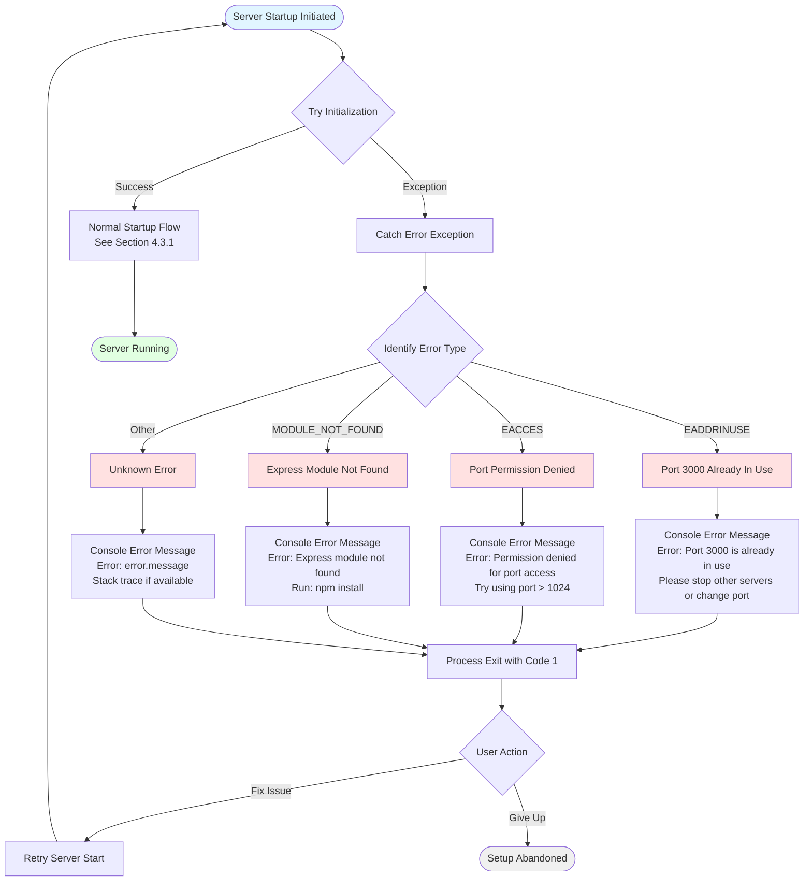
```mermaid
flowchart TD
    Start([Server Startup Initiated]) --> TryCatch{Try Initialization}
    
    TryCatch -->|Success| NormalFlow[Normal Startup Flow<br/>See Section 4.3.1]
    TryCatch -->|Exception| CatchError[Catch Error Exception]
    
    CatchError --> ErrorType{Identify Error Type}
    
    ErrorType -->|EADDRINUSE| PortInUse[Port 3000 Already In Use]
    ErrorType -->|EACCES| PermissionDenied[Port Permission Denied]
    ErrorType -->|MODULE_NOT_FOUND| ModuleMissing[Express Module Not Found]
    ErrorType -->|Other| UnknownError[Unknown Error]
    
    PortInUse --> LogPortError[Console Error Message<br/>Error: Port 3000 is already in use<br/>Please stop other servers or change port]
    PermissionDenied --> LogPermError[Console Error Message<br/>Error: Permission denied for port access<br/>Try using port > 1024]
    ModuleMissing --> LogModError[Console Error Message<br/>Error: Express module not found<br/>Run: npm install]
    UnknownError --> LogUnknownError[Console Error Message<br/>Error: error.message<br/>Stack trace if available]
    
    LogPortError --> ExitProcess[Process Exit with Code 1]
    LogPermError --> ExitProcess
    LogModError --> ExitProcess
    LogUnknownError --> ExitProcess
    
    ExitProcess --> UserAction{User Action}
    UserAction -->|Fix Issue| RetryStart[Retry Server Start]
    UserAction -->|Give Up| Abandoned([Setup Abandoned])
    
    RetryStart --> Start
    
    NormalFlow --> Success([Server Running])
    
    style Start fill:#e1f5ff
    style Success fill:#e1ffe1
    style PortInUse fill:#ffe1e1
    style PermissionDenied fill:#ffe1e1
    style ModuleMissing fill:#ffe1e1
    style UnknownError fill:#ffe1e1
    style Abandoned fill:#f0f0f0
```

**Error Handling Requirements** (Requirement F-001-RQ-005):

| Error Condition | Detection Method | User Message | Exit Code | Recovery Action |
|-----------------|------------------|--------------|-----------|----------------|
| **Port In Use (EADDRINUSE)** | `listen()` exception | "Port 3000 is already in use. Please stop other servers or use a different port." | 1 | Stop conflicting server, retry |
| **Permission Denied (EACCES)** | `listen()` exception | "Permission denied for port access. Try using port > 1024 or run with elevated privileges." | 1 | Use higher port number, retry |
| **Module Not Found** | `require()` exception | "Express module not found. Run: npm install" | 1 | Execute npm install, retry |
| **Invalid Node Version** | `process.version` check | "Unsupported Node.js version. Please use LTS 18.x or 20.x" | 1 | Install correct Node version |

**Error Message Design Principles**:
- **Clarity**: Describe problem in user-friendly terms, avoid technical jargon
- **Actionability**: Provide specific next steps for resolution
- **Conciseness**: Single-line message with essential information
- **Consistency**: Use consistent error format across all conditions

**Error Logging Implementation**:
```javascript
// Conceptual implementation (not actual code)
process.on('error', (err) => {
  if (err.code === 'EADDRINUSE') {
    console.error('Error: Port 3000 is already in use.');
    console.error('Please stop other servers or use a different port.');
  } else if (err.code === 'EACCES') {
    console.error('Error: Permission denied for port access.');
  }
  process.exit(1);
});
```

### 4.5.2 Runtime Error Management

Runtime errors during request processing are minimal given the stateless, synchronous nature of the application:

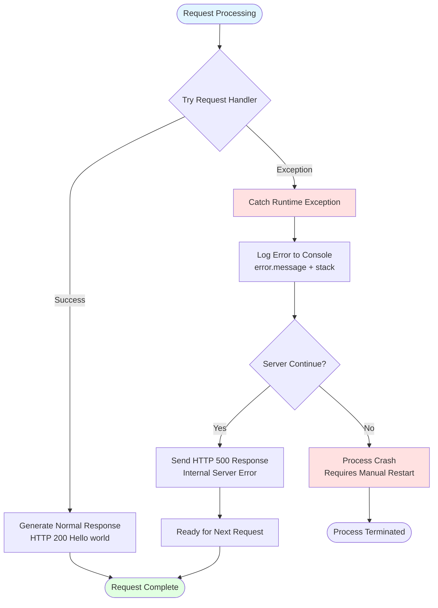
```mermaid
flowchart TD
    Start([Request Processing]) --> TryHandle{Try Request Handler}
    
    TryHandle -->|Success| NormalResponse[Generate Normal Response<br/>HTTP 200 Hello world]
    TryHandle -->|Exception| CatchRuntime[Catch Runtime Exception]
    
    CatchRuntime --> LogError[Log Error to Console<br/>error.message + stack]
    LogError --> ServerContinue{Server Continue?}
    
    ServerContinue -->|Yes| Send500[Send HTTP 500 Response<br/>Internal Server Error]
    ServerContinue -->|No| CrashRestart[Process Crash<br/>Requires Manual Restart]
    
    Send500 --> NextRequest[Ready for Next Request]
    
    NormalResponse --> Complete([Request Complete])
    NextRequest --> Complete
    CrashRestart --> Terminated([Process Terminated])
    
    style Start fill:#e1f5ff
    style Complete fill:#e1ffe1
    style CatchRuntime fill:#ffe1e1
    style CrashRestart fill:#ffe1e1
```

**Runtime Error Scenarios**:

Given the minimal implementation, runtime errors are unlikely but theoretically possible:

| Error Scenario | Probability | Impact | Mitigation |
|----------------|-------------|--------|------------|
| **Handler Exception** | Very Low | 500 response to single request | Express catches, returns 500 |
| **Memory Exhaustion** | Extremely Low | Process crash | Restart required |
| **Event Loop Blocking** | Very Low | Request timeout | Avoid synchronous operations |
| **Unhandled Promise Rejection** | Not Applicable | N/A | No async operations used |

**Error Recovery Strategy**:
- **Isolated Failures**: Express error handling isolates request failures, preventing server crash
- **No Automatic Restart**: Tutorial scope does not include process managers (PM2, systemd)
- **Manual Intervention**: User must manually restart server if process crashes
- **No Error Tracking**: No external error monitoring services (Sentry, Rollbar)

**Non-Requirements**:
- No retry mechanisms for failed requests
- No fallback responses or degraded service modes
- No circuit breakers or rate limiting
- No health check endpoints
- No automatic crash recovery

## 4.6 Integration Workflows

### 4.6.1 Internal Component Integration

The application has minimal internal integration due to its single-file architecture. The primary integration points involve the interaction between Express.js framework components:

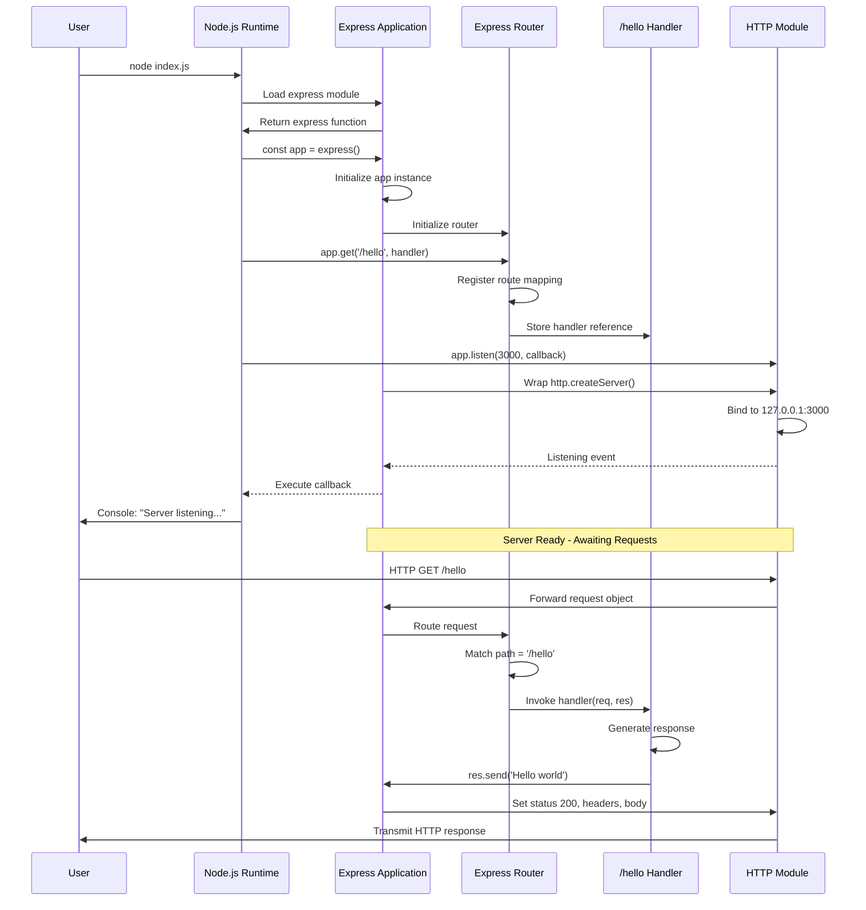
```mermaid
sequenceDiagram
    participant User
    participant NodeJS as Node.js Runtime
    participant Express as Express Application
    participant Router as Express Router
    participant Handler as /hello Handler
    participant HTTP as HTTP Module
    
    User->>NodeJS: node index.js
    NodeJS->>Express: Load express module
    Express->>NodeJS: Return express function
    
    NodeJS->>Express: const app = express()
    Express->>Express: Initialize app instance
    Express->>Router: Initialize router
    
    NodeJS->>Router: app.get('/hello', handler)
    Router->>Router: Register route mapping
    Router->>Handler: Store handler reference
    
    NodeJS->>HTTP: app.listen(3000, callback)
    Express->>HTTP: Wrap http.createServer()
    HTTP->>HTTP: Bind to 127.0.0.1:3000
    HTTP-->>Express: Listening event
    Express-->>NodeJS: Execute callback
    NodeJS->>User: Console: "Server listening..."
    
    Note over Express,HTTP: Server Ready - Awaiting Requests
    
    User->>HTTP: HTTP GET /hello
    HTTP->>Express: Forward request object
    Express->>Router: Route request
    Router->>Router: Match path = '/hello'
    Router->>Handler: Invoke handler(req, res)
    Handler->>Handler: Generate response
    Handler->>Express: res.send('Hello world')
    Express->>HTTP: Set status 200, headers, body
    HTTP->>User: Transmit HTTP response
```

**Integration Point: Route Registration**

The route registration integration binds the endpoint handler to the Express routing engine:

- **Mechanism**: `app.get('/hello', handlerFunction)` method call
- **Timing**: Occurs during CONFIGURING state, before server starts listening
- **Data Flow**: Handler function reference stored in Express routing table
- **Validation**: Express validates path string format, handler is callable function
- **Error Handling**: Invalid route registration throws exception during configuration

**Integration Point: HTTP Server Wrapping**

Express wraps the native Node.js `http` module:

- **Mechanism**: `app.listen()` internally calls `http.createServer(app)`
- **Timing**: Occurs during BINDING state
- **Data Flow**: Express request handler passed to native HTTP server
- **Purpose**: Provides simplified API while leveraging core Node.js networking
- **Performance**: Minimal overhead, ~1% vs. native http module

**Integration Point: Console Logging**

Console output provides user feedback across multiple phases:

- **Startup Confirmation**: Log message in listen callback (requirement F-001-RQ-003)
- **Error Messages**: Console.error for startup failures (requirement F-001-RQ-005)
- **Timing**: Synchronous with state transitions (immediate feedback)
- **Format**: Standard text output to process stdout/stderr

### 4.6.2 External Integration Architecture

The system has **no external integration points** by design (documented in Section 2.4.2.2 of requirements):

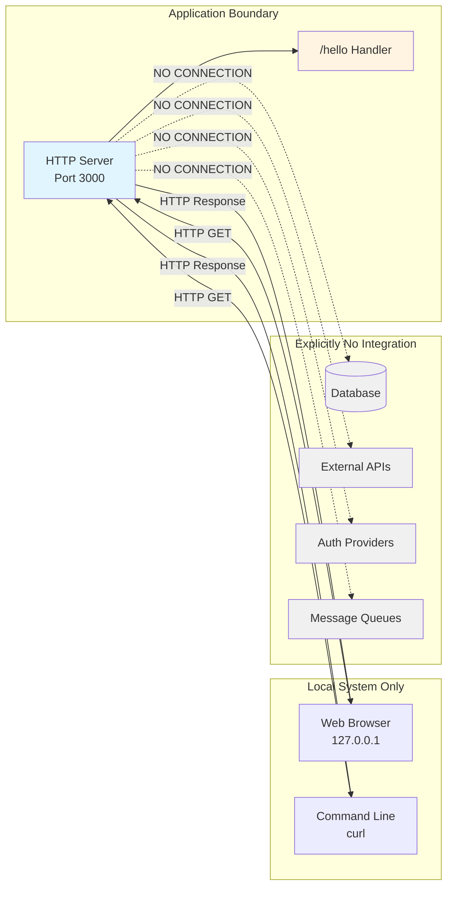
```mermaid
flowchart LR
subgraph "Application Boundary"
    direction TB
    Server["HTTP Server<br/>Port 3000"]
    Handler["/hello Handler"]
    Server --> Handler
end

subgraph "Local System Only"
    direction TB
    Browser["Web Browser<br/>127.0.0.1"]
    Terminal["Command Line<br/>curl"]
end

Browser -->|HTTP GET| Server
Terminal -->|HTTP GET| Server
Server -->|HTTP Response| Browser
Server -->|HTTP Response| Terminal

subgraph "Explicitly No Integration"
    direction TB
    Database[(Database)]
    API[External APIs]
    Auth[Auth Providers]
    Queue[Message Queues]
end

Server -.->|NO CONNECTION| Database
Server -.->|NO CONNECTION| API
Server -.->|NO CONNECTION| Auth
Server -.->|NO CONNECTION| Queue

style Server fill:#e1f5ff
style Handler fill:#fff4e1
style Database fill:#f0f0f0
style API fill:#f0f0f0
style Auth fill:#f0f0f0
style Queue fill:#f0f0f0
```

**Isolation Rationale**:
- **Educational Simplicity**: Focus exclusively on HTTP server fundamentals
- **Setup Minimization**: No external service configuration required
- **Reproducibility**: Identical behavior across all environments
- **Security**: Localhost-only access prevents accidental exposure

**Network Boundary Enforcement**:
- Server binds to `127.0.0.1` (localhost), not `0.0.0.0` (all interfaces)
- No reverse proxy or load balancer integration
- No DNS resolution or external hostname configuration
- No outbound HTTP requests from server code

## 4.7 Validation and Business Rules

### 4.7.1 Request Validation Rules

The application implements minimal validation appropriate for a tutorial demonstrating basic HTTP concepts:

```mermaid
flowchart TD
    Start([Request Received]) --> ValidateMethod{HTTP Method<br/>Validation}
    
    ValidateMethod -->|GET| MethodValid[Method Accepted]
    ValidateMethod -->|POST/PUT/DELETE/etc| MethodInvalid[Implicit Rejection]
    
    MethodValid --> ValidatePath{Path Validation}
    ValidatePath -->|Exact: /hello| PathValid[Path Matched]
    ValidatePath -->|/hello with params| PathValid
    ValidatePath -->|Other paths| PathInvalid[No Route Match]
    
    PathValid --> ValidateHeaders{Header Validation}
    ValidateHeaders --> HeadersValid[All Headers Accepted<br/>No Specific Requirements]
    
    HeadersValid --> Success[Validation Passed<br/>Proceed to Handler]
    
    MethodInvalid --> Return404[HTTP 404 Response<br/>No Handler Defined]
    PathInvalid --> Return404
    
    Return404 --> Complete([Request Complete])
    Success --> HandlerExec[Execute Handler<br/>Generate Response]
    HandlerExec --> Complete
    
    style Start fill:#e1f5ff
    style Success fill:#e1ffe1
    style Return404 fill:#fff4e1
```

**Validation Rule Specifications**:

| Validation Type | Rule | Enforcement | Failure Response | Requirement Reference |
|-----------------|------|-------------|------------------|---------------------|
| **HTTP Method** | Must be GET | Implicit (route defined for GET only) | 404 Not Found | F-002-RQ-001 |
| **Request Path** | Exact match "/hello" (case-sensitive) | Express routing engine | 404 Not Found | F-002-RQ-001 |
| **Query Parameters** | Ignored, not validated | N/A | Accepted, no effect | Implicit |
| **Request Headers** | No requirements | N/A | All accepted | Implicit |
| **Request Body** | Not read | N/A | Ignored | GET method convention |
| **URL Encoding** | Standard encoding handled by Node | Automatic | Decoded by framework | Standard |
| **Content Type** | No requirements | N/A | Not checked | No body processing |

**Path Matching Behavior**:

| Request Path | Match Result | Response | Rationale |
|--------------|--------------|----------|-----------|
| `/hello` | ✓ Match | 200 "Hello world" | Exact match |
| `/hello?foo=bar` | ✓ Match | 200 "Hello world" | Query params ignored |
| `/hello/` | ✗ No Match | 404 Not Found | Trailing slash different path |
| `/Hello` | ✗ No Match | 404 Not Found | Case-sensitive matching |
| `/HELLO` | ✗ No Match | 404 Not Found | Case-sensitive matching |
| `/hello/world` | ✗ No Match | 404 Not Found | Subpath not registered |
| `/` | ✗ No Match | 404 Not Found | Root path has no handler |

**Validation Non-Requirements**:
- **No Input Sanitization**: No user input processed, XSS/injection not applicable
- **No CSRF Protection**: No state-changing operations
- **No Rate Limiting**: Single-user localhost environment
- **No Authentication**: No protected resources
- **No Authorization**: No access control rules
- **No Content Validation**: No request body processing

### 4.7.2 Response Validation

The response generation enforces specific format requirements to ensure consistent output:

```mermaid
flowchart TD
    Start([Handler Invoked]) --> BuildResponse[res.send'Hello world']
    
    BuildResponse --> SetStatus[Set HTTP Status Code<br/>200 OK]
    SetStatus --> CheckStatus{Status = 200?}
    CheckStatus -->|Yes| StatusValid[Status Valid]
    CheckStatus -->|No| StatusInvalid[Invalid Configuration]
    
    StatusValid --> SetContentType[Set Content-Type Header<br/>text/plain]
    SetContentType --> CheckContentType{Content-Type Correct?}
    CheckContentType -->|Yes| HeaderValid[Header Valid]
    CheckContentType -->|No| HeaderInvalid[Invalid Configuration]
    
    HeaderValid --> SetBody[Set Response Body<br/>Hello world]
    SetBody --> ValidateBody{Body Exact Match?}
    ValidateBody -->|Yes| BodyValid[Body Valid]
    ValidateBody -->|No| BodyInvalid[Invalid Implementation]
    
    BodyValid --> SetLength[Set Content-Length<br/>11 bytes]
    SetLength --> ResponseComplete[Response Complete<br/>Ready to Send]
    
    StatusInvalid --> Error([Configuration Error])
    HeaderInvalid --> Error
    BodyInvalid --> Error
    
    ResponseComplete --> Send([Transmit Response])
    
    style Start fill:#e1f5ff
    style ResponseComplete fill:#e1ffe1
    style Send fill:#e1ffe1
    style Error fill:#ffe1e1
```

**Response Validation Rules**:

| Response Element | Required Value | Validation Method | Error Condition | Requirement |
|------------------|----------------|-------------------|-----------------|-------------|
| **Status Code** | 200 | Automatic by `res.send()` | Implementation error if not 200 | F-002-RQ-002 |
| **Content-Type** | text/plain | Automatic by Express | Implementation error if JSON/HTML | F-002-RQ-003 |
| **Response Body** | "Hello world" (exact) | Code review, testing | Implementation error if different | F-002-RQ-004 |
| **Content-Length** | 11 | Automatic calculation | Framework calculates | HTTP standard |
| **Character Encoding** | UTF-8 | Default encoding | Should be implicit | Default behavior |

**Response Consistency Requirements**:
- **Deterministic Output**: Same response for every request (no randomness, no timestamps)
- **No Dynamic Content**: Response body is static string constant
- **No Conditional Logic**: Handler does not vary response based on request parameters
- **No Side Effects**: Handler performs no actions beyond generating response (no logging, no DB writes)

## 4.8 Performance and Timing Constraints

### 4.8.1 Timing Specifications

The system must meet specific performance targets to ensure immediate user feedback and educational effectiveness:

```mermaid
gantt
    title Request Processing Timeline (Target < 50ms Total)
    dateFormat X
    axisFormat %L ms
    
    section Startup
    Process Launch           :milestone, 0, 0
    Module Loading           :active, 0, 500
    App Configuration        :active, 500, 100
    Port Binding             :active, 600, 100
    Listening State          :milestone, 700, 0
    Startup Complete (< 2s)  :milestone, 2000, 0
    
    section Request Processing
    Request Received         :milestone, 0, 0
    Parse Headers            :crit, 0, 1
    Route Matching           :crit, 1, 1
    Handler Execution        :crit, 2, 1
    Response Building        :crit, 3, 1
    TCP Transmission         :active, 4, 45
    Response Complete (< 50ms) :milestone, 50, 0
```

**Performance Targets Summary**:

| Performance Metric | Target | Priority | Measurement Point | Requirement Reference |
|-------------------|--------|----------|-------------------|---------------------|
| **Server Startup Time** | < 2 seconds | Critical | Process launch → READY state | F-001-RQ-002 |
| **Port Binding Time** | < 100ms | High | `app.listen()` call → listening event | F-001-RQ-001 |
| **Request Response Time** | < 50ms (95th %ile) | Critical | Request received → response transmitted | F-002-RQ-005 |
| **First Request Latency** | < 100ms | Medium | First request after startup | Acceptable cold start |
| **Handler Execution** | < 1ms | High | Handler invoked → response ready | Internal target |
| **Route Matching** | < 1ms | High | Request parsed → handler identified | Internal target |
| **Memory Footprint** | < 50MB | High | Idle process memory usage | F-001-RQ-002 |
| **Setup Time** | < 5 minutes | Critical | Clone → successful verification | Section 1.2.3 KPI |

**Timing Breakdown for 50ms Response Target**:

```mermaid
pie title Response Time Budget (50ms Total)
    "Request Parsing" : 1
    "Route Matching" : 1
    "Handler Execution" : 1
    "Response Building" : 1
    "TCP Transmission" : 45
    "Buffer (Safety Margin)" : 1
```

**Performance Measurement Methods**:

**Startup Time Measurement**:
```bash
# Shell timing (external measurement)
time node index.js

#### Internal measurement (add to code for profiling)
const startTime = Date.now();
app.listen(3000, () => {
  const duration = Date.now() - startTime;
  console.log(`Startup time: ${duration}ms`);
});
```

**Response Time Measurement**:
```bash
# Using curl with timing
curl -w "\nTime: %{time_total}s\n" http://localhost:3000/hello

#### Using curl verbose with millisecond precision
curl -o /dev/null -s -w "Total: %{time_total}s\n" http://localhost:3000/hello
```

**Memory Measurement**:
```bash
# Linux/macOS
ps aux | grep node

#### Or programmatic (add to code)
console.log(`Memory: ${process.memoryUsage().heapUsed / 1024 / 1024} MB`);
```

### 4.8.2 Performance Constraints and Trade-offs

**Simplicity vs Performance**:
- Tutorial prioritizes code clarity over optimization
- No caching mechanisms (would add complexity)
- No connection pooling (single-threaded model sufficient)
- No response compression (unnecessary for 11-byte response)

**Single-User Scope**:
- Performance targets assume single concurrent user (localhost testing)
- No load testing or stress testing requirements
- No consideration for thousands of requests per second
- Acceptable for learning environment, not production workload

**Platform Variability**:
- Performance targets based on modern consumer hardware (2015+)
- Older machines may exceed timing targets but remain functional
- Network stack performance varies by OS (Windows vs Linux timing differences)
- Acceptable variance: ±50% of targets still meets educational objectives

## 4.9 References

### 4.9.1 Technical Specification Sections

The following technical specification sections were examined and incorporated into this Process Flowchart documentation:

- **Section 1.2 System Overview** - High-level system capabilities, success criteria, and KPIs
- **Section 2.3 Functional Requirements** - Detailed requirements for features F-001 through F-004, including acceptance criteria, business rules, validation, and performance specifications
- **Section 2.4 Feature Relationships and Dependencies** - Feature dependency maps, integration points, shared components, and build sequence
- **Section 2.5 Implementation Considerations** - Technical constraints, performance requirements, educational requirements, security implications, and maintenance considerations
- **Section 3.3 Runtime Environment** - Node.js version specifications, platform support, and performance characteristics
- **Section 3.4 Frameworks & Libraries** - Express.js framework selection, version specifications, and feature usage details

### 4.9.2 Repository Files

The following repository files were examined during process flow documentation:

- **README.md** - Repository root file containing placeholder content `# 10oct_5`; no implementation code present, confirming greenfield project status

### 4.9.3 Process Flow Coverage

This Process Flowchart section provides comprehensive documentation for:

1. **Complete Application Lifecycle** - From process launch through steady-state operation
2. **Server Initialization (F-001)** - Detailed startup sequence with timing, validation, and error handling
3. **Request-Response Processing (F-002)** - HTTP request handling, routing, and response generation
4. **Project Setup and Verification (F-003, F-004)** - User journey from clone to successful endpoint testing
5. **State Management** - Application states and request processing states with transition rules
6. **Error Handling** - Startup errors and runtime error management with recovery procedures
7. **Integration Workflows** - Internal component integration and external isolation documentation
8. **Validation Rules** - Request and response validation specifications with business rules
9. **Performance Specifications** - Comprehensive timing constraints and measurement methods

All workflows documented reflect the planned architecture for this greenfield tutorial project, as no implementation code currently exists in the repository. The process flows are derived from authoritative technical specification requirements and represent the target implementation.

# 5. System Architecture

## 5.1 High-Level Architecture

### 5.1.1 System Overview

#### 5.1.1.1 Architectural Style and Rationale

This system implements a **monolithic single-file architecture** specifically designed for educational clarity and immediate comprehension. The architectural style is intentional minimalism, where simplicity itself is the primary architectural characteristic rather than a limitation. This design pattern prioritizes learning outcomes over traditional production concerns such as scalability, maintainability, or extensibility.

The architecture follows a **synchronous request-response pattern** built on Node.js's event-driven, single-threaded runtime. The entire application lifecycle—from server initialization through request handling to response transmission—operates within a single JavaScript file executing in a single Node.js process. This eliminates architectural complexity related to distributed systems, microservices coordination, or multi-process communication, allowing learners to focus exclusively on fundamental HTTP server concepts.

The system deliberately eschews common architectural patterns such as Model-View-Controller (MVC), layered architecture, or hexagonal architecture. Such patterns, while valuable in production systems, introduce cognitive overhead inappropriate for a foundational tutorial. Instead, the architecture presents HTTP concepts in their most direct form: a route handler function that receives requests and generates responses.

#### 5.1.1.2 Key Architectural Principles

The system adheres to six foundational architectural principles:

**Principle 1: Extreme Simplicity**  
Every architectural decision favors simplicity over sophistication. The codebase is constrained to fewer than 20 lines of implementation code, contained within a single file. This constraint forces elimination of non-essential abstractions, frameworks layers, and configuration complexity. The principle manifests in hardcoded values (port 3000), synchronous execution flows, and static responses that require no data processing.

**Principle 2: Zero Configuration**  
The architecture requires no external configuration files, environment variables, or runtime parameters. All configuration exists inline within the code itself, making the system immediately executable after dependency installation. This principle eliminates a common source of setup friction for beginners and ensures consistent behavior across all environments and users.

**Principle 3: Immediate Feedback Loop**  
The system is architected to provide rapid verification of success. Server startup completes in under 2 seconds, and requests receive responses in under 50 milliseconds. This tight feedback loop enables learners to experiment, modify code, and observe results within seconds, facilitating rapid understanding through trial and error.

**Principle 4: Cross-Platform Consistency**  
The architecture guarantees identical behavior across Windows, macOS, and Linux operating systems. This is achieved by relying exclusively on Node.js's platform abstraction layer and avoiding operating system-specific APIs, file system dependencies, or platform-specific networking features. The localhost-only binding further ensures consistent behavior regardless of network configuration.

**Principle 5: Educational Transparency**  
The architecture makes all operations explicit and observable. Server initialization logs a clear confirmation message. The route handler function is directly visible in the source code. HTTP requests and responses can be observed with basic tools (browser, curl). There are no hidden abstractions, magic behaviors, or framework conventions that require prior knowledge to understand.

**Principle 6: Scope Isolation**  
The architecture deliberately excludes concerns beyond fundamental HTTP request-response mechanics. Authentication, authorization, data persistence, logging infrastructure, monitoring systems, and scalability mechanisms are explicitly out of scope. This isolation allows the tutorial to maintain focus on core concepts without dilution from peripheral concerns that would be essential in production systems but are distracting in an educational context.

#### 5.1.1.3 System Boundaries and Interfaces

**Internal Boundary:**  
The system boundary encompasses a single Node.js process executing JavaScript code. Within this boundary, the Express.js framework manages HTTP protocol handling, routing logic, and response generation. The boundary includes approximately 5MB of Express.js dependencies distributed across roughly 40 npm packages, all managed transparently by the Node.js module system. Memory allocation remains under 50MB throughout the application lifecycle.

**External Interfaces:**  
The system exposes one external interface: an HTTP server bound to localhost (127.0.0.1) on TCP port 3000. This interface accepts standard HTTP/1.1 GET requests at the `/hello` path and returns HTTP 200 responses with Content-Type text/plain. The localhost binding creates a security boundary that prevents external network access, ensuring the server is accessible only from the same machine. This deliberate limitation eliminates concerns about firewall configuration, network security, or remote attack vectors.

The system interfaces with three categories of external actors:

1. **Web Browsers**: Modern web browsers (Chrome 90+, Firefox 88+, Safari 14+, Edge 90+) communicate via standard HTTP GET requests initiated when users navigate to `http://localhost:3000/hello`. Browsers render the plain text response without requiring JavaScript execution or CSS styling.

2. **Command-Line HTTP Clients**: Tools such as curl or wget send HTTP requests programmatically, enabling automated testing and verification workflows. These tools receive identical responses to browser clients.

3. **Operating System**: The Node.js runtime interfaces with the operating system for TCP socket management, process scheduling, and standard input/output streams used for console logging. The system requires no privileged operations, operating entirely within user-space permissions.

**Non-Existent Interfaces:**  
The architecture explicitly excludes several interface categories common in production systems:
- No database connections or data storage interfaces
- No external API integrations or third-party service dependencies
- No authentication or authorization services
- No message queues, event buses, or inter-process communication
- No monitoring, telemetry, or logging service integrations
- No content delivery networks or reverse proxy integrations

### 5.1.2 Core Components

The system architecture comprises four distinct components, each fulfilling specific responsibilities within the overall request-response cycle:

| Component Name | Primary Responsibility | Key Dependencies | Integration Points |
|----------------|------------------------|------------------|-------------------|
| **Node.js Runtime Environment** | Execute JavaScript code; provide event loop, HTTP capabilities, and module loading | Operating system (Windows 10+, macOS 10.14+, Ubuntu 18.04+), native modules | Process scheduler, TCP/IP stack, file system for module loading |
| **Express.js Framework** | HTTP server creation, routing engine, request/response object abstraction | Node.js 18.x or 20.x LTS; ~40 transitive npm packages | Node.js http module, application entry point, network stack |
| **Application Entry Point** | Server initialization, route definition, port binding, startup confirmation | Express.js 4.18.x module | Console output stream, Express app instance, HTTP server binding |
| **Route Handler Function** | Process /hello requests and generate "Hello world" responses | Express response object APIs | Express routing engine, HTTP response transmission |

**Component Integration Flow:**  
The operating system launches the Node.js runtime, which loads the application entry point (index.js). The entry point imports the Express.js framework and creates an application instance. The application instance defines the route handler for `/hello` and binds the HTTP server to port 3000. Once bound, the server enters an event loop that dispatches incoming requests to the route handler, which generates responses transmitted back through the Express framework and Node.js runtime to the client.

### 5.1.3 Data Flow Architecture

#### 5.1.3.1 Primary Request-Response Data Flow

The system implements a linear, synchronous data flow from HTTP request receipt through response transmission. The flow progresses through seven distinct stages:

**Stage 1: Network Reception**  
A client establishes a TCP connection to localhost:3000 and transmits an HTTP GET request. The operating system's network stack receives TCP packets, assembles them into a complete HTTP message, and delivers the data to the Node.js process via socket read operations. The Node.js HTTP parser deconstructs the raw bytes into structured request objects containing method, path, headers, and body data. This parsing completes in under 1 millisecond for typical requests with minimal headers and no body content.

**Stage 2: Express Router Dispatch**  
The Express.js framework receives the parsed request object and initiates its routing algorithm. The router evaluates the request path against all registered routes in the order they were defined. For this application, only two routes exist: the explicit `/hello` route and Express's default 404 handler. The router performs case-sensitive exact matching on the path string. If the path equals "/hello" exactly, the router dispatches to the registered handler function. Otherwise, the request proceeds to the 404 handler. Routing overhead is under 1 millisecond due to the minimal number of routes.

**Stage 3: Handler Execution**  
The matched route handler function executes synchronously with access to the request and response objects. For the `/hello` endpoint, the handler immediately invokes `res.send('Hello world')` without performing any request body parsing, parameter extraction, validation, or business logic. The handler execution completes in under 1 millisecond as it performs no I/O operations, database queries, or computational work.

**Stage 4: Response Construction**  
The Express `send()` method constructs the HTTP response object. It sets the status code to 200 (OK), determines the Content-Type as text/plain based on the string argument, calculates the Content-Length as 11 bytes, and stores "Hello world" as the response body. Express automatically includes standard headers such as Connection: keep-alive and X-Powered-By: Express. Response construction is synchronous and completes in under 1 millisecond.

**Stage 5: Response Serialization**  
Express serializes the response object into HTTP/1.1 wire format. This involves concatenating the status line ("HTTP/1.1 200 OK\r\n"), all response headers (each formatted as "Header-Name: value\r\n"), a blank line separator ("\r\n\r\n"), and the response body ("Hello world"). The serialization process produces a byte buffer ready for network transmission. Serialization overhead is negligible for this 11-byte static response.

**Stage 6: TCP Transmission**  
Node.js writes the serialized response bytes to the TCP socket connected to the client. The operating system's TCP stack fragments the data into packets (typically a single packet for this small response), transmits them over the loopback interface, and awaits acknowledgment. For localhost connections, packet transmission occurs entirely within the kernel without physical network hardware involvement, completing in under 45 milliseconds at the 95th percentile.

**Stage 7: Connection Management**  
After transmission, the HTTP connection persists if the client supports Keep-Alive (HTTP/1.1 default). The server returns to its ready state, awaiting the next request on the same TCP connection or a new connection from another client. If the client sends Connection: close, the TCP socket terminates after response transmission. The Node.js event loop continues processing, maintaining the server's availability for subsequent requests.

**End-to-End Latency:**  
The complete request-response cycle, measured from TCP packet arrival to response transmission completion, consistently completes within 50 milliseconds at the 95th percentile when measured on localhost. This timing satisfies the educational requirement for immediate feedback, allowing learners to rapidly iterate on code changes and observe results.

#### 5.1.3.2 Alternative Flow: 404 Not Found

When a request arrives with a path other than "/hello", the data flow diverges at Stage 2 (routing). The Express router, finding no matching route, invokes its default 404 handler. This handler constructs a response with status code 404, Content-Type text/html, and a body containing "Cannot GET [requested-path]". The response proceeds through Stages 4-7 identically to the success case. This flow demonstrates proper HTTP semantics for undefined resources without requiring explicit error handling code.

#### 5.1.3.3 Data Transformation Points

The system performs minimal data transformation due to its static response architecture:

**HTTP Parsing Transformation:**  
Raw TCP bytes transform into structured JavaScript objects (request method, path, headers). This transformation is performed by Node.js's native HTTP parser written in C++ for performance. The transformation is unidirectional; the original byte stream is not preserved.

**Response Serialization Transformation:**  
JavaScript objects (status, headers, body) transform into HTTP wire format byte streams. Express's response serialization layer performs this transformation, converting in-memory data structures into the standardized HTTP/1.1 protocol format.

**No Data Processing Transformations:**  
The system performs no transformations on business data. There is no JSON parsing or serialization, no template rendering, no database query result mapping, no data validation or sanitization, and no character encoding conversion (UTF-8 throughout).

#### 5.1.3.4 Data Stores and State Management

The architecture is completely stateless with no data persistence:

**No Persistent Storage:**  
The system maintains no databases, file-based storage, or persistent data structures. Each server restart begins from a clean state with no memory of previous executions.

**No In-Memory Caching:**  
The system implements no caching mechanisms. Each request receives a freshly generated response identical to all previous responses. No response caching, HTTP cache headers, or in-memory cache stores exist.

**No Session Management:**  
The system maintains no session state between requests. There are no session identifiers, cookies, or mechanisms to correlate multiple requests from the same client. Each request is processed independently without reference to request history.

**No Logging Storage:**  
Request and response details are not persisted to log files or log aggregation services. The only output is a single startup confirmation message written to standard output.

This stateless architecture simplifies the system substantially, eliminating entire categories of complexity related to data consistency, backup and recovery, cache invalidation, and concurrent access control.

### 5.1.4 External Integration Points

The system architecture deliberately excludes all external integrations. This tutorial project operates as a completely self-contained application with no dependencies on external systems, services, or data sources. The following integration categories are explicitly not implemented:

**No External APIs:**  
The system does not communicate with third-party APIs, web services, or remote endpoints. All functionality executes locally within the Node.js process.

**No Authentication Providers:**  
The system does not integrate with OAuth providers, identity services, or authentication systems. The localhost-only binding eliminates the need for access control mechanisms.

**No Databases:**  
The system connects to no database management systems, whether relational (PostgreSQL, MySQL) or NoSQL (MongoDB, Redis). The static response requires no data retrieval or persistence.

**No Message Queues:**  
The system does not produce or consume messages from queuing systems (RabbitMQ, Apache Kafka, AWS SQS). All request processing occurs synchronously within the HTTP request-response cycle.

**No Monitoring Services:**  
The system does not report metrics to monitoring platforms (Datadog, New Relic, Prometheus) or error tracking services (Sentry, Rollbar). Observability is limited to console output and manual testing.

**No Content Delivery Networks:**  
The system serves responses directly from the Node.js process without CDN integration or edge caching. The localhost binding makes CDN integration irrelevant.

**Rationale for Zero Integrations:**  
This architectural decision maintains tutorial focus on fundamental HTTP server concepts. External integrations introduce authentication, network reliability, error handling, and configuration concerns that would obscure the core learning objectives. The self-contained architecture allows learners to understand the complete request-response cycle without external dependencies that might fail, require credentials, or exhibit non-deterministic behavior.

## 5.2 Component Details

### 5.2.1 Node.js Runtime Environment

#### 5.2.1.1 Component Purpose and Responsibilities

The Node.js runtime serves as the foundational execution environment for the entire application. It provides the JavaScript engine (V8), event loop, asynchronous I/O primitives, and module system that enable server-side JavaScript execution. The runtime abstracts operating system differences, presenting a consistent API across Windows, macOS, and Linux platforms.

The runtime's core responsibilities include:
- Executing JavaScript code with V8 JIT compilation for performance optimization
- Managing the single-threaded event loop that processes HTTP requests, timer events, and I/O operations
- Providing native bindings to operating system capabilities (TCP sockets, file system, process management)
- Loading and caching CommonJS and ES modules through the require() system
- Managing memory allocation, garbage collection, and process lifecycle

#### 5.2.1.2 Technologies and Frameworks

**Node.js Version:** 18.x or 20.x LTS (Long Term Support)  
The system requires Node.js LTS versions to ensure stability, security updates, and predictable behavior. Version 18.x has an LTS maintenance period through April 2025, while version 20.x maintains LTS support through April 2026. The minimum version requirement is 18.0.0, ensuring access to stable APIs without legacy compatibility concerns.

**V8 JavaScript Engine:**  
Node.js 18.x includes V8 version 10.x, and Node.js 20.x includes V8 version 11.x. The V8 engine compiles JavaScript to native machine code using JIT (Just-In-Time) compilation, providing execution performance within 2-5× of equivalent C++ code for many workloads. For this tutorial application, V8's performance characteristics are more than sufficient for sub-millisecond request handling.

**libuv Event Loop:**  
The libuv library provides the asynchronous I/O foundation underlying Node.js. It implements the event loop, manages thread pool operations for file system access, and abstracts platform-specific event notification mechanisms (epoll on Linux, kqueue on macOS, IOCP on Windows). For this application, libuv handles TCP socket events when HTTP requests arrive.

**npm Package Manager:**  
Node.js bundles npm (version 9.x or later), which manages dependency installation, version resolution, and package lifecycle scripts. The application uses npm to install Express.js and its transitive dependencies during setup.

#### 5.2.1.3 Key Interfaces and APIs

The application interacts with Node.js through several core APIs:

**Module System Interface:**  
The `require()` function loads Express.js and other modules. Example: `const express = require('express')`. The module loader searches node_modules directories, caches loaded modules, and resolves transitive dependencies automatically.

**Process Interface:**  
The global `process` object provides access to standard I/O streams (`process.stdout`, `process.stderr`), environment variables (`process.env`), and lifecycle events (`process.on('SIGTERM', handler)`). The application uses `console.log()`, which writes to `process.stdout`.

**HTTP Module Interface (Indirect):**  
While the application code uses Express.js, Express internally uses Node.js's native `http` module. The `http.createServer()` and `server.listen()` functions establish the TCP listener and manage connections.

#### 5.2.1.4 Data Persistence Requirements

The Node.js runtime itself maintains no persistent data for this application. All state exists in process memory and is lost when the process terminates. The runtime's module cache persists loaded modules in memory for the lifetime of the process but does not write cached data to disk.

#### 5.2.1.5 Scaling Considerations

**Single-Threaded Constraint:**  
Node.js executes JavaScript code on a single thread (the event loop thread). This constrains the application to one CPU core for request processing. For this tutorial application serving one learner on localhost, single-threaded execution is entirely sufficient. Production applications often use the cluster module or process managers like PM2 to scale across multiple cores, but such mechanisms are out of scope for this educational project.

**Memory Scalability:**  
The V8 heap has a default maximum size of approximately 1.4GB on 64-bit systems (configurable via --max-old-space-size). The application's 50MB memory footprint provides substantial headroom, supporting thousands of concurrent connections theoretically. In practice, the localhost-only binding and tutorial nature mean concurrent usage is minimal.

**Event Loop Saturation:**  
The event loop can process thousands of requests per second for simple, synchronous handlers like the /hello endpoint. Event loop saturation occurs only when handlers block with long-running synchronous operations. This application avoids blocking operations entirely, maintaining maximum event loop throughput.

### 5.2.2 Express.js Framework

#### 5.2.2.1 Component Purpose and Responsibilities

Express.js provides a thin abstraction layer over Node.js's native HTTP module, simplifying HTTP server creation and request routing. The framework's primary responsibilities for this application include:

- Abstracting HTTP server initialization through a clean API (`const app = express(); app.listen(port)`)
- Implementing a routing engine that matches request paths to handler functions
- Providing enhanced request and response objects with convenient methods (`res.send()`, `req.params`, etc.)
- Managing middleware execution chains (not used in this minimal application)
- Handling common HTTP scenarios (404 errors, default headers, content type negotiation)

Express reduces the code required to create a functional HTTP server from approximately 15-18 lines (using native Node.js) to 12-15 lines, improving code clarity while demonstrating industry-standard framework patterns.

#### 5.2.2.2 Technologies and Frameworks

**Express.js Version:** 4.18.x series  
The application specifies Express version ^4.18.0 in package.json, allowing automatic updates to 4.18.1, 4.18.2, etc. (patch versions) but preventing automatic upgrades to 4.19.x or 5.x (minor/major versions). Express 4.18.x is a mature, stable version released in April 2022 with extensive production usage and community support.

**Transitive Dependencies:**  
Express 4.18.x depends on approximately 40 additional npm packages, including:
- body-parser: HTTP request body parsing (not used in this application)
- cookie: Cookie parsing and serialization (not used)
- debug: Debugging output framework
- mime: MIME type lookup for Content-Type headers
- path-to-regexp: Route pattern matching
- send: Static file transmission (underlying res.send())

The complete dependency tree totals approximately 5MB installed size, well within the < 10MB constraint defined in the system requirements.

**Framework Features Used:**  
This application uses a minimal subset of Express features:
- Application initialization: `express()`
- HTTP method routing: `app.get(path, handler)`
- Response transmission: `res.send(string)`
- Server listening: `app.listen(port, callback)`

Unused Express features (out of scope for this tutorial):
- Middleware chains and next() callbacks
- Route parameters and query string parsing
- Template engine integration
- Static file serving beyond basic responses
- Cookie and session management
- Request body parsing for POST/PUT
- Error handling middleware

#### 5.2.2.3 Key Interfaces and APIs

**Application Initialization Interface:**
```javascript
const express = require('express');
const app = express();
```
The `express()` factory function returns an application instance that manages routes, middleware, and server configuration.

**Routing Interface:**
```javascript
app.get('/hello', (req, res) => {
  res.send('Hello world');
});
```
The `app.get(path, handler)` method registers a route handler for HTTP GET requests matching the specified path. The handler receives request (`req`) and response (`res`) objects.

**Response Interface:**
```javascript
res.send('Hello world');
```
The `res.send()` method sets appropriate headers (Content-Type, Content-Length), status code (200 by default), and transmits the response body. Express automatically detects that the argument is a string and sets Content-Type to text/plain.

**Server Binding Interface:**
```javascript
app.listen(3000, () => {
  console.log('Server listening on http://localhost:3000');
});
```
The `app.listen(port, callback)` method creates an HTTP server, binds it to the specified port, and invokes the callback when the server is ready. This method wraps Node.js's `http.createServer(app).listen(port, callback)`.

#### 5.2.2.4 Data Persistence Requirements

Express.js maintains no persistent data. All framework state (route registrations, middleware configurations) exists in memory for the process lifetime. When the process terminates, all Express configuration is lost and must be re-initialized on the next startup.

#### 5.2.2.5 Scaling Considerations

Express.js itself does not impose scaling limitations. The framework efficiently handles thousands of requests per second for simple route handlers. Scaling constraints derive from the underlying Node.js single-threaded event loop and the application's localhost-only binding, not from Express framework limitations.

For production applications requiring horizontal scaling, Express applications typically deploy behind load balancers (nginx, HAProxy) or use cluster mode to spawn multiple Node.js processes. These patterns are not applicable to this educational tutorial.

### 5.2.3 Application Entry Point (index.js)

#### 5.2.3.1 Component Purpose and Responsibilities

The application entry point file (index.js or server.js) serves as the executable JavaScript file that Node.js executes to start the server. This single file contains all application code, including:

- Express.js module import via require()
- Express application instance creation
- Port number constant definition (hardcoded to 3000)
- Route handler registration for GET /hello
- HTTP server initialization and port binding
- Startup confirmation console output

The entry point orchestrates the initialization sequence that brings the server from a non-existent state to fully operational and accepting requests. It serves as both the configuration specification and execution entry point for the application.

#### 5.2.3.2 Technologies and Frameworks

**JavaScript ES6+ Syntax:**  
The entry point uses modern JavaScript syntax including const declarations, arrow functions, and template literals. These ES6+ features are natively supported in Node.js 18.x and 20.x without transpilation:
- `const` for immutable bindings: `const port = 3000;`
- Arrow functions for concise handlers: `(req, res) => res.send('Hello world')`
- Template literals for string interpolation: `` `Server listening on http://localhost:${port}` ``

**CommonJS Module System:**  
The entry point uses CommonJS module syntax (`require()` and `module.exports`) rather than ES modules (`import/export`). This maintains compatibility with Node.js's default module system and avoids the need for package.json type: "module" configuration or .mjs file extensions.

#### 5.2.3.3 Key Interfaces and APIs

The entry point interfaces with:

**Express.js Framework:**  
Via the require() import and Express API calls. The entry point creates the Express app instance, registers routes, and initiates server listening.

**Console Output:**  
Via `console.log()` for the startup confirmation message. This writes to the standard output stream (stdout), visible in the terminal where the server was started.

**Process Lifecycle:**  
Implicitly interfaces with Node.js process management. If an unhandled exception occurs during initialization, the process exits with a non-zero code. If initialization succeeds, the process enters the event loop and runs indefinitely until terminated by SIGTERM or SIGINT signals.

#### 5.2.3.4 Data Persistence Requirements

The entry point file itself is a text file persisted on disk, but the executing code maintains no runtime persistent data. All variables and state exist in process memory. The file must be readable from the file system for Node.js to execute it.

#### 5.2.3.5 Scaling Considerations

The single-file architecture does not scale to large applications. Beyond approximately 50-100 lines of code, best practices recommend separating concerns into multiple files (routes/, controllers/, models/). However, for this 20-line tutorial application, the single-file approach is optimal for educational clarity and simplicity.

### 5.2.4 Route Handler Function

#### 5.2.4.1 Component Purpose and Responsibilities

The route handler function is the application's core business logic component, though "business logic" is trivial in this case. The handler:

- Receives HTTP request and response objects from the Express routing engine
- Generates the static "Hello world" response string
- Invokes the Express response transmission method
- Returns control to the Express framework for response serialization and transmission

This synchronous function executes in under 1 millisecond with no I/O operations, database queries, or external service calls.

#### 5.2.4.2 Technologies and Frameworks

**JavaScript Function:**  
Implemented as an arrow function passed to `app.get()`:
```javascript
(req, res) => res.send('Hello world')
```

The arrow function syntax provides concise expression of the handler logic. The implicit return (no curly braces) makes the single-line implementation visually clean.

#### 5.2.4.3 Key Interfaces and APIs

**Request Object (`req`):**  
Provides access to request details (method, path, headers, body, parameters). This handler does not inspect the request object, as it generates the same response regardless of request properties.

**Response Object (`res`):**  
Provides methods to construct and transmit responses. The handler uses only `res.send(string)`, which sets status to 200, Content-Type to text/plain, and transmits the "Hello world" body.

#### 5.2.4.4 Data Persistence Requirements

None. The handler maintains no state between invocations. Each request execution is independent with no memory of previous requests.

#### 5.2.4.5 Scaling Considerations

This stateless, synchronous handler scales efficiently within the single-threaded Node.js event loop. Theoretical throughput exceeds 10,000 requests per second for such a minimal handler. Practical throughput is irrelevant given the localhost-only, single-user educational context.

### 5.2.5 Component Interaction Diagrams

#### 5.2.5.1 System Context Diagram

```mermaid
graph TB
    subgraph "External Actors"
        Browser[Web Browser<br/>Chrome, Firefox, Safari, Edge]
        Curl[Command-Line Client<br/>curl, wget, httpie]
        Developer[Developer User<br/>Tutorial Learner]
    end
    
    subgraph "Operating System Layer"
        OS[Operating System<br/>Windows 10+ / macOS 10.14+ / Ubuntu 18.04+]
        Network[TCP/IP Network Stack<br/>Loopback Interface 127.0.0.1]
    end
    
    subgraph "Node.js Application [localhost:3000]"
        NodeRuntime[Node.js Runtime 18.x/20.x<br/>V8 Engine + Event Loop]
        ExpressFramework[Express.js 4.18.x<br/>HTTP Server + Router]
        Application[Application Entry Point<br/>index.js]
        Handler[Route Handler<br/>GET /hello]
    end
    
    Developer -->|Executes npm start| Application
    Browser -->|HTTP GET /hello| Network
    Curl -->|HTTP GET /hello| Network
    Network -->|TCP Socket| NodeRuntime
    NodeRuntime -->|Loads & Executes| Application
    Application -->|Initializes| ExpressFramework
    ExpressFramework -->|Routes Request| Handler
    Handler -->|Returns Response| ExpressFramework
    ExpressFramework -->|Transmits via| NodeRuntime
    NodeRuntime -->|TCP Socket| Network
    Network -->|HTTP Response| Browser
    Network -->|HTTP Response| Curl
    
    NodeRuntime -->|System Calls| OS
    Application -->|Console Output| Developer
    
    style NodeRuntime fill:#68a063
    style ExpressFramework fill:#259dff
    style Application fill:#fff4e1
    style Handler fill:#ffd93d
```

#### 5.2.5.2 Component Interaction Sequence

```mermaid
sequenceDiagram
    participant Client as HTTP Client<br/>(Browser/curl)
    participant OS as Operating System<br/>Network Stack
    participant Node as Node.js Runtime<br/>Event Loop
    participant Express as Express.js<br/>Framework
    participant App as Application<br/>Entry Point
    participant Handler as Route Handler<br/>/hello

    Note over App,Handler: Server Initialization Phase
    Node->>App: Execute index.js
    App->>Express: require('express')
    App->>Express: express()
    Express-->>App: app instance
    App->>Express: app.get('/hello', handler)
    App->>Express: app.listen(3000, callback)
    Express->>Node: Create HTTP Server
    Node->>OS: Bind TCP Socket :3000
    OS-->>Node: Socket Bound
    Node-->>Express: Listening Event
    Express->>App: Execute Callback
    App->>App: console.log('Server listening...')
    
    Note over Client,Handler: Request-Response Cycle
    Client->>OS: HTTP GET /hello
    OS->>Node: TCP Packet Received
    Node->>Node: Parse HTTP Request
    Node->>Express: Dispatch Request Object
    Express->>Express: Route Matching
    Express->>Handler: Invoke (req, res)
    Handler->>Handler: Generate Static Response
    Handler->>Express: res.send('Hello world')
    Express->>Express: Set Status: 200
    Express->>Express: Set Headers
    Express->>Express: Serialize Response
    Express->>Node: Write to Socket
    Node->>OS: Transmit TCP Packet
    OS->>Client: HTTP 200 OK<br/>"Hello world"
    
    Note over Client,Handler: Total Duration: <50ms (p95)
```

#### 5.2.5.3 Initialization State Transition Diagram

```mermaid
stateDiagram-v2
    [*] --> INITIAL: node index.js
    
    INITIAL --> LOADING: Import Express Module
    LOADING --> CONFIGURING: Module Loaded
    LOADING --> ERROR_MODULE: require() Failed
    
    CONFIGURING --> REGISTERING: Create app Instance
    REGISTERING --> BINDING: Routes Registered
    
    BINDING --> LISTENING: Port 3000 Bound
    BINDING --> ERROR_PORT: EADDRINUSE
    BINDING --> ERROR_PERMISSION: EACCES
    
    LISTENING --> READY: Callback Executed
    
    READY --> PROCESSING: Request Received
    PROCESSING --> READY: Response Sent
    
    READY --> SHUTDOWN: SIGTERM/SIGINT
    PROCESSING --> SHUTDOWN: SIGTERM/SIGINT
    
    ERROR_MODULE --> TERMINATED: Exit 1
    ERROR_PORT --> TERMINATED: Exit 1
    ERROR_PERMISSION --> TERMINATED: Exit 1
    
    SHUTDOWN --> TERMINATED: Cleanup Complete
    TERMINATED --> [*]
    
    note right of READY
        Steady State
        Memory < 50MB
        Event Loop Active
    end note
    
    note right of PROCESSING
        Request Handler
        Duration < 1ms
        Synchronous
    end note
```

## 5.3 Technical Decisions

### 5.3.1 Architecture Style Decisions

#### 5.3.1.1 Decision: Monolithic Single-File vs Modular Multi-File

**Decision Made:** Monolithic single-file architecture

**Alternatives Considered:**
- Multi-file architecture with separate routes/, controllers/, and config/ directories
- MVC pattern with models/, views/, controllers/ separation
- Microservices architecture with separate service processes

**Rationale:**

The single-file architecture was selected specifically to optimize for educational comprehension and minimize setup friction. This decision prioritizes learning outcomes over architectural best practices that apply to production systems.

**Educational Benefits:**
- **Immediate Comprehension**: New developers can understand the entire system by reading one file, eliminating navigation between files and mental context switching
- **Reduced Cognitive Load**: No need to understand module boundaries, import/export patterns, or directory conventions before grasping HTTP fundamentals
- **Visual Completeness**: Learners see the complete initialization sequence and request handling flow in one view, making causal relationships explicit

**Practical Benefits:**
- **Zero Configuration Overhead**: No directory structure decisions, no module organization debates, no file naming conventions
- **Simplified Debugging**: All code is in one location; errors reference a single file with unambiguous line numbers
- **Minimal File System Complexity**: Reduces file operations to 3 core files (package.json, index.js, .gitignore)

**Trade-offs Accepted:**
- **Not Scalable**: Cannot grow beyond ~50 lines without becoming unwieldy (acceptable for 20-line implementation)
- **Not Maintainable for Complex Logic**: Single file becomes problematic for multiple endpoints, middleware chains, or business logic (out of scope)
- **Not Representative of Production**: Production applications universally use modular architectures (intentional for tutorial focus)

**Constraint Satisfaction:**
- Satisfies < 5 minute setup time by eliminating file structure decisions
- Satisfies < 20 lines of code by concentrating all logic
- Satisfies ≤ 3 core files requirement directly

**Decision Diagram:**

```mermaid
graph TD
    Start{Architecture Style Decision} -->|Optimize For?| Choice
    
    Choice -->|Production Best Practices| Modular[Modular Multi-File<br/>Separation of Concerns]
    Choice -->|Educational Clarity| SingleFile[Single-File Monolith<br/>Immediate Comprehension]
    
    Modular --> ModularPros[+ Maintainable<br/>+ Scalable<br/>+ Industry Standard]
    Modular --> ModularCons[- Multiple Files to Navigate<br/>- Requires Module Understanding<br/>- Longer Setup Time]
    
    SingleFile --> SinglePros[+ Complete System in One View<br/>+ Zero Configuration<br/>+ Faster Learning Curve]
    SingleFile --> SingleCons[- Not Scalable<br/>- Not Production-Like<br/>- Limited to Simple Apps]
    
    ModularCons --> Evaluate{Evaluate Against<br/>Tutorial Goals}
    SinglePros --> Evaluate
    
    Evaluate -->|Goal: < 5 min Setup| Decision[SELECTED:<br/>Single-File Architecture]
    Evaluate -->|Goal: < 20 LOC| Decision
    Evaluate -->|Goal: Beginner-Friendly| Decision
    
    style Decision fill:#e1ffe1
    style Choice fill:#e1f5ff
```

### 5.3.2 Communication Pattern Decisions

#### 5.3.2.1 Decision: Synchronous vs Asynchronous Request Handling

**Decision Made:** Synchronous request handling with immediate response generation

**Alternatives Considered:**
- Asynchronous handlers with async/await syntax
- Promise-based handlers with .then() chaining
- Callback-based handlers with nested callbacks

**Rationale:**

Synchronous handlers eliminate asynchronous programming complexity from the tutorial scope, allowing learners to focus exclusively on HTTP request-response mechanics without concurrent programming concepts.

**Technical Justification:**
- **No I/O Operations**: The handler performs no database queries, file system access, or external API calls that would benefit from asynchronous execution
- **Static Response**: The "Hello world" string is hardcoded, requiring no data fetching or computation that would justify async patterns
- **Sub-Millisecond Execution**: Handler executes in < 1ms, causing no event loop blocking concerns
- **Deterministic Flow**: Synchronous execution guarantees predictable, sequential code flow without callback ordering complexity

**Educational Benefits:**
- **Conceptual Simplicity**: Learners need not understand Promises, async/await, callbacks, or event loop mechanics
- **Linear Code Reading**: Code executes top-to-bottom in the order written, matching intuitive mental models
- **No Error Handling Complexity**: No need for .catch() blocks, try/catch around await, or error-first callbacks

**Trade-offs:**
- **Not Representative**: Production handlers typically involve asynchronous database or API calls (intentional for tutorial scope)
- **Limited Extension Path**: Adding database operations later requires handler refactoring to async (acceptable progressive learning)

**Performance Impact:**
- Zero performance penalty; synchronous handler achieves < 1ms execution for this static response
- Asynchronous handler would add overhead without performance benefit for this use case

**Decision Table:**

| Pattern | Code Complexity | Tutorial Alignment | Performance | Production Similarity |
|---------|-----------------|-------------------|-------------|----------------------|
| **Synchronous** | Minimal | Optimal | Excellent | Low |
| Async/Await | Medium | Moderate | Excellent | High |
| Promises | High | Poor | Excellent | Medium |
| Callbacks | Very High | Very Poor | Excellent | Low |

### 5.3.3 Data Storage Solution Decisions

#### 5.3.3.1 Decision: No Data Persistence vs Database Integration

**Decision Made:** Zero data persistence (stateless application)

**Alternatives Considered:**
- SQLite file-based database for lightweight persistence
- PostgreSQL or MySQL relational database
- MongoDB NoSQL database
- In-memory Redis cache
- JSON file storage

**Rationale:**

Eliminating data persistence maintains tutorial focus on HTTP fundamentals while avoiding entire categories of complexity related to database setup, connection management, query languages, and data modeling.

**Scope Justification:**
- **Static Response**: The "Hello world" response requires no data retrieval, making data storage irrelevant to core functionality
- **Stateless Design**: The application maintains no user sessions, request history, or application state requiring persistence
- **Tutorial Focus**: HTTP server creation and routing are the learning objectives; database integration is orthogonal

**Complexity Elimination:**
- **No Setup Requirements**: No database installation, user creation, schema definition, or connection configuration
- **No Additional Dependencies**: Avoids database client libraries (pg, mysql2, mongodb, sequelize) and their transitive dependencies
- **No Error Scenarios**: Eliminates database connection failures, query errors, transaction management, and data consistency concerns
- **No Security Concerns**: Avoids SQL injection, connection string security, credential management, and access control configuration

**Educational Benefits:**
- **Immediate Execution**: Server starts without waiting for database connections
- **Predictable Behavior**: No data variability; same response every time
- **Isolated Learning**: HTTP concepts taught without database concepts interference

**Trade-offs:**
- **Not Representative of Real Applications**: Most production web services require data persistence (intentional scope limitation)
- **No Dynamic Content Demonstration**: Cannot demonstrate data-driven responses or CRUD operations (out of scope)

### 5.3.4 Caching Strategy Decisions

#### 5.3.4.1 Decision: No Caching vs HTTP Caching Headers

**Decision Made:** No caching mechanisms (fresh response per request)

**Alternatives Considered:**
- HTTP cache headers (Cache-Control, ETag, Last-Modified)
- In-memory response caching with Node.js Cache
- Redis distributed caching
- CDN caching layers

**Rationale:**

The static response and localhost-only deployment make caching irrelevant. Additionally, caching concepts add complexity without demonstrable benefit in the tutorial context.

**Technical Analysis:**
- **Static Response**: The "Hello world" response never changes, so caching provides no performance benefit over generating the response synchronously
- **Sub-Millisecond Generation**: Response generation overhead is < 1ms, making caching's performance benefit unmeasurable
- **Localhost Deployment**: Network latency is < 1ms on loopback interface, eliminating network-based caching benefits
- **Single User**: Tutorial serves one learner, not thousands of concurrent users who would benefit from reduced server load

**Complexity Avoidance:**
- **No HTTP Caching Logic**: Avoids Cache-Control directives, ETag generation, conditional request handling
- **No Cache Invalidation**: Eliminates the "hardest problem in computer science" entirely
- **No Cache Storage**: No memory allocation for cached responses or cache management algorithms

### 5.3.5 Security Mechanism Decisions

#### 5.3.5.1 Decision: No Authentication/Authorization vs Token-Based Auth

**Decision Made:** Open access with no authentication or authorization

**Alternatives Considered:**
- JWT (JSON Web Token) authentication
- Session-based authentication with cookies
- OAuth 2.0 integration
- API key authentication
- HTTP Basic authentication

**Rationale:**

The localhost-only binding creates an implicit security boundary that makes authentication unnecessary. The tutorial scope focuses on HTTP mechanics, not access control.

**Security Analysis:**
- **Trusted Environment**: Localhost binding (127.0.0.1) ensures only the developer's machine can access the server
- **No External Exposure**: Server is not accessible from network interfaces, internet, or other machines
- **No Sensitive Data**: The "Hello world" response contains no confidential information requiring protection
- **Educational Context**: Tutorial learners are both operator and consumer of the service

**Complexity Elimination:**
- **No Credential Management**: No user registration, password hashing, token generation, or secret key rotation
- **No Session Storage**: No session identifiers, session stores, or session expiration logic
- **No Access Control**: No role-based access control, permission systems, or authorization middleware
- **No Security Dependencies**: Avoids libraries like jsonwebtoken, passport, bcrypt

**Production Disclaimer:**
This architectural decision is appropriate only for localhost development environments. Production deployments accessible from networks or the internet must implement authentication and authorization. The tutorial documentation explicitly notes this limitation.

#### 5.3.5.2 Decision: No HTTPS vs TLS Encryption

**Decision Made:** HTTP (unencrypted) on localhost only

**Alternatives Considered:**
- HTTPS with self-signed certificates
- HTTPS with Let's Encrypt certificates
- Automatic HTTPS redirection

**Rationale:**

Localhost TCP connections never traverse physical networks, eliminating man-in-the-middle attack vectors that TLS prevents. Certificate management adds substantial setup complexity inappropriate for a beginner tutorial.

**Security Justification:**
- **Loopback Security**: Localhost traffic occurs within kernel memory, not on physical network interfaces where interception is possible
- **No Credentials Transmitted**: No passwords, tokens, or sensitive data transmitted that require encryption protection
- **Educational Scope**: HTTP protocol fundamentals, not transport layer security

**Setup Complexity Avoided:**
- **No Certificate Generation**: Avoids OpenSSL commands, self-signed certificate creation, certificate trust configuration
- **No Browser Warnings**: Self-signed certificates trigger browser security warnings that confuse beginners
- **No HTTPS Configuration**: Avoids key and cert file paths, TLS version configuration, cipher suite selection

### 5.3.6 Technology Selection Decision Records

#### 5.3.6.1 ADR-001: Express.js vs Native Node.js HTTP Module

```mermaid
graph TD
    Start[Technology Selection:<br/>HTTP Server Implementation] --> Evaluate{Evaluation Criteria}
    
    Evaluate --> Simplicity[Code Simplicity<br/>Lines of Code]
    Evaluate --> Learning[Learning Value<br/>Industry Relevance]
    Evaluate --> Setup[Setup Time<br/>Dependencies]
    Evaluate --> Extension[Extension Path<br/>Future Learning]
    
    Simplicity --> NativeLines[Native http Module:<br/>15-18 lines]
    Simplicity --> ExpressLines[Express.js:<br/>12-15 lines]
    
    Learning --> NativeRelevance[Native: Understanding<br/>Low-Level HTTP APIs]
    Learning --> ExpressRelevance[Express: Industry<br/>Standard Framework]
    
    Setup --> NativeDeps[Native: Zero<br/>Dependencies]
    Setup --> ExpressDeps[Express: 40<br/>Packages ~5MB]
    
    Extension --> NativeExtend[Native: Manual<br/>Route Management]
    Extension --> ExpressExtend[Express: Built-in<br/>Router, Middleware]
    
    ExpressLines --> Decision
    ExpressRelevance --> Decision
    ExpressExtend --> Decision
    ExpressDeps --> Acceptable{Within<br/>Constraints?}
    Acceptable -->|< 10MB Limit| Decision
    Acceptable -->|< 5 min Setup| Decision
    
    Decision[DECISION:<br/>Express.js 4.18.x<br/>Selected]
    
    Decision --> Rationale[Rationale:<br/>- Cleaner Code<br/>- Industry Standard<br/>- Better Extension Path<br/>- Within Constraints]
    
    style Decision fill:#e1ffe1
    style Rationale fill:#fff4e1
```

**Decision Record:**

**Status:** Accepted  
**Date:** October 2024  
**Decision Makers:** Technical Specification Author  
**Context:** Selecting HTTP server implementation approach for beginner Node.js tutorial  

**Decision:** Use Express.js 4.18.x framework instead of Node.js native http module

**Consequences:**
- **Positive**: More concise code (12-15 lines vs 15-18 lines), industry-standard framework experience, better extension path for learners adding features, automatic Content-Type handling
- **Negative**: Adds ~5MB dependencies, ~20-second installation time, introduces framework abstraction layer
- **Neutral**: Both approaches achieve identical functional outcomes; Express provides convenience, not capability

**Compliance:**
- Satisfies < 10MB dependency constraint (Express + deps = ~5MB)
- Satisfies < 5 minute setup constraint (20-second install)
- Satisfies 0-1 direct dependencies constraint (Express is the one direct dependency)

#### 5.3.6.2 ADR-002: JavaScript vs TypeScript

**Decision:** Use JavaScript ES6+ without TypeScript compilation

**Rationale:**

TypeScript introduces a build step, configuration complexity (tsconfig.json), and type system concepts that are orthogonal to HTTP server fundamentals. The 20-line application derives no meaningful benefit from static typing.

**Benefits:**
- **Zero Build Step**: Direct execution with `node index.js`, no compilation required
- **Faster Startup**: No tsc compilation before execution
- **Simpler Project**: No tsconfig.json, no type definitions, no @types packages
- **Cognitive Focus**: No type annotations, generics, or type system complexity

**Trade-offs:**
- **No Type Safety**: Runtime type errors possible (unlikely given minimal code surface)
- **No IDE Autocomplete Benefits**: Less intelligent code completion (acceptable for 20 lines)
- **Not Industry Trend**: TypeScript adoption growing rapidly (intentional simplification for beginners)

#### 5.3.6.3 ADR-003: Hardcoded Port vs Environment Variable

**Decision:** Hardcoded port 3000 with no environment variable support

**Rationale:**

Environment variables introduce configuration concepts, operating system differences (Windows vs Unix syntax), and deployment complexity inappropriate for a localhost tutorial.

**Benefits:**
- **Consistent URLs**: All learners use http://localhost:3000/hello (no variability)
- **Zero Configuration**: No .env files, no dotenv package, no process.env usage
- **Simplified Documentation**: Exact URL in instructions without variable substitution explanations

**Trade-offs:**
- **Port Conflicts**: If port 3000 is in use, startup fails (acceptable with clear error message)
- **No Flexibility**: Cannot run multiple instances simultaneously (not a tutorial requirement)
- **Not Production Pattern**: Production apps use environment variables for port configuration (intentional for simplicity)

**Conflict Resolution:**
Error handling displays clear message: "Port 3000 is already in use. Please stop other servers or use a different port."

## 5.4 Cross-Cutting Concerns

### 5.4.1 Monitoring and Observability Strategy

#### 5.4.1.1 Observability Approach

The system implements a minimal observability strategy appropriate for an educational tutorial executed on a developer's local machine. Observability is limited to direct observation through console output and manual testing, with no automated monitoring infrastructure.

**Console-Based Observability:**

The application produces one console output event during its lifecycle:

**Startup Confirmation:**
```
Server listening on http://localhost:3000
```

This message confirms successful server initialization, port binding, and readiness to accept requests. The message includes the complete URL for immediate copy-paste into browsers or curl commands, providing actionable information rather than generic status text.

**No Request Logging:**

Individual HTTP requests are not logged to console or files. This decision maintains code simplicity and avoids log output noise during iterative testing. Developers verify request handling through direct observation of browser or curl output, which provides immediate feedback more effectively than parsing log entries.

**No Performance Metrics:**

The application does not collect or report performance metrics such as request latency, throughput, or event loop lag. The < 50ms response time target is verifiable through browser developer tools or curl's --verbose output without instrumentation.

**No Distributed Tracing:**

Given the single-process, monolithic architecture with no external service dependencies, distributed tracing systems (Jaeger, Zipkin, AWS X-Ray) would trace only the single HTTP hop from client to server, providing no value.

**Manual Verification Methods:**

**Browser Developer Tools:**
- Network tab shows request timing, status codes, headers, and response body
- Console tab displays any JavaScript errors (though none occur for plain text responses)
- Performance tab visualizes request timeline with millisecond precision

**curl Verbose Mode:**
```bash
curl -v http://localhost:3000/hello
```
Displays complete HTTP request and response headers, timing information, and protocol negotiation details.

**Health Check Mechanism:**

Implicit health check via manual verification: If GET /hello returns "Hello world" with HTTP 200, the server is healthy. No dedicated /health or /status endpoints exist.

#### 5.4.1.2 Observability Trade-offs

**Acceptable Limitations:**
- No production-grade monitoring (Datadog, New Relic, Prometheus) - out of scope for tutorial
- No alerting or anomaly detection - single-user local development environment
- No log aggregation or search - no persistent logs generated
- No metrics dashboards or visualization - manual testing sufficient

**Rationale for Minimal Approach:**

The tutorial's localhost-only, single-user execution environment makes sophisticated observability infrastructure unnecessary and distracting. Developers receive immediate feedback through direct interaction (browser, curl), which is more effective for learning than interpreting monitoring dashboards.

### 5.4.2 Logging Strategy

#### 5.4.2.1 Logging Implementation

The application implements console-based logging with minimal output appropriate for tutorial purposes.

**Log Levels:**

The system does not implement traditional log levels (DEBUG, INFO, WARN, ERROR). The single startup message uses console.log() (INFO-equivalent severity), and error conditions use console.error() for stderr output.

**Log Structure:**

**Startup Log:**
```javascript
console.log('Server listening on http://localhost:3000');
```
- **Format**: Plain text string (no JSON, no structured fields)
- **Timestamp**: Not included (available via terminal timestamps if needed)
- **Severity**: Implicit INFO level
- **Destination**: stdout (standard output stream)

**Error Logs:**
```javascript
console.error('Error: Port 3000 is already in use.');
```
- **Format**: Plain text with "Error:" prefix
- **Severity**: Implicit ERROR level
- **Destination**: stderr (standard error stream)
- **Stack Traces**: Included automatically for exception-based errors

**Log Persistence:**

Logs are not persisted to files or external services. All output is ephemeral, visible only in the terminal session where the server runs. When the terminal closes or output scrolls beyond buffer limits, logs are lost permanently.

**Log Rotation:**

Not applicable. No log files exist to rotate.

**Log Sampling:**

Not applicable. The application generates only one log entry per server startup.

#### 5.4.2.2 Logging Rationale

**Console Logging Justification:**

Console output is optimal for tutorial applications because:
- **Immediate Visibility**: Logs appear instantly in the same terminal window where the server started
- **Zero Configuration**: No log file paths, no permissions, no disk space management
- **Universal Compatibility**: Works identically on Windows, macOS, and Linux without platform-specific configuration
- **Debugging Integration**: stderr output is highlighted in most terminals, making errors visually prominent

**Minimal Logging Philosophy:**

The application intentionally avoids request logging for several reasons:
- **Noise Reduction**: Request logs would fill the console during iterative testing, obscuring important information
- **Redundant Information**: Browser developer tools and curl provide superior request visibility with headers, timing, and payload inspection
- **Focus Maintenance**: Eliminating logs keeps the tutorial focused on HTTP mechanics rather than logging infrastructure
- **Code Simplicity**: No logging middleware, no log formatting logic, no log configuration

**Production Contrast:**

Production applications typically implement structured logging (JSON format) to log aggregation services (Elasticsearch, Splunk, CloudWatch) with correlation IDs, request/response logging middleware (Morgan, Winston), and comprehensive error tracking. These patterns are intentionally excluded from this tutorial as they obscure fundamental concepts.

### 5.4.3 Error Handling Patterns

#### 5.4.3.1 Startup Error Handling

The application implements graceful error handling for initialization failures, providing clear user feedback and appropriate exit codes.

**Error Handling Flow:**

```mermaid
flowchart TD
    Start([Server Initialization]) --> TryCatch{Try-Catch Block<br/>or Error Events}
    
    TryCatch -->|Normal| Success[Port Bound Successfully<br/>Log Confirmation]
    TryCatch -->|Exception| ErrorType{Classify Error Type}
    
    ErrorType -->|EADDRINUSE| PortError[Port 3000 In Use]
    ErrorType -->|EACCES| PermError[Permission Denied]
    ErrorType -->|MODULE_NOT_FOUND| ModuleError[Express Not Installed]
    ErrorType -->|Unknown| GenericError[Unexpected Error]
    
    PortError --> LogPortMsg[console.error<br/>Error: Port 3000 is already in use<br/>Please stop other servers]
    PermError --> LogPermMsg[console.error<br/>Error: Permission denied<br/>Use port > 1024]
    ModuleError --> LogModMsg[console.error<br/>Error: Express not found<br/>Run: npm install]
    GenericError --> LogGenMsg[console.error<br/>Error: error.message<br/>+ Stack Trace]
    
    LogPortMsg --> ExitOne[process.exit 1]
    LogPermMsg --> ExitOne
    LogModMsg --> ExitOne
    LogGenMsg --> ExitOne
    
    ExitOne --> UserAction{User Takes<br/>Corrective Action}
    UserAction -->|Fix & Retry| Start
    UserAction -->|Give Up| Abandoned([Setup Abandoned])
    
    Success --> Running([Server Running])
    
    style Success fill:#e1ffe1
    style Running fill:#e1ffe1
    style PortError fill:#ffe1e1
    style PermError fill:#ffe1e1
    style ModuleError fill:#ffe1e1
```

**Error Categories and Responses:**

| Error Code | Scenario | User Message | Exit Code | Recovery Action |
|------------|----------|--------------|-----------|-----------------|
| **EADDRINUSE** | Port 3000 occupied by another process | "Error: Port 3000 is already in use. Please stop other servers or use a different port." | 1 | Kill process using port 3000, then retry |
| **EACCES** | Insufficient permissions (port < 1024 typically) | "Error: Permission denied for port access. Try using port > 1024 or run with elevated privileges." | 1 | Use different port or run with sudo/admin |
| **MODULE_NOT_FOUND** | Express.js not installed | "Error: Express module not found. Run: npm install" | 1 | Execute npm install, then retry |
| **Version Mismatch** | Node.js version < 18.0.0 | "Error: Unsupported Node.js version. Please use LTS 18.x or 20.x" | 1 | Install correct Node.js version |

**Error Message Design Principles:**

1. **Clarity**: Use plain language describing the problem without technical jargon
2. **Actionability**: Provide specific next steps for resolution (commands to run, settings to change)
3. **Conciseness**: Keep messages to 1-2 lines for quick comprehension
4. **Consistency**: Use "Error:" prefix and consistent formatting across all error types

**Exit Code Convention:**

The application uses standard Unix exit code conventions:
- **Exit Code 0**: Successful execution (graceful shutdown)
- **Exit Code 1**: Error during initialization or runtime (any failure condition)

Non-zero exit codes allow shell scripts and CI/CD pipelines to detect failures programmatically.

#### 5.4.3.2 Runtime Error Handling

Runtime errors during request processing are extremely unlikely given the synchronous, static response handler, but the framework provides implicit error handling.

**Express Error Handling:**

Express automatically catches exceptions thrown within route handlers and generates HTTP 500 (Internal Server Error) responses. The server process continues running, accepting subsequent requests normally.

```javascript
// Hypothetical error scenario (not present in actual implementation)
app.get('/hello', (req, res) => {
  throw new Error('Unexpected error');  // Express catches this
});
// Result: HTTP 500 response, server continues running
```

**No Custom Error Handlers:**

The application does not implement custom error handling middleware (Express's four-parameter error handler signature). The default Express error handler is sufficient for the tutorial scope.

**Process Crash Scenarios:**

If an unhandled exception occurs outside Express's request handling context (e.g., during server initialization before Express catches errors), the Node.js process terminates with a non-zero exit code. No automatic restart mechanism exists; users must manually restart the server.

**Error Handling Non-Requirements:**

The following error handling patterns, common in production applications, are explicitly excluded:
- No retry mechanisms or circuit breakers
- No fallback responses or degraded service modes
- No error tracking services (Sentry, Rollbar, Bugsnag)
- No error rate monitoring or alerting
- No request replay or idempotency handling

### 5.4.4 Authentication and Authorization Framework

#### 5.4.4.1 Security Model

**Decision:** No authentication or authorization mechanisms implemented.

**Rationale:**

The localhost-only deployment creates an implicit security boundary. The server is accessible only from the same machine where it runs, eliminating external attack vectors that would necessitate authentication.

**Security Assumptions:**

1. **Trusted Environment**: The developer's local machine is assumed to be a trusted environment under their control
2. **Localhost Binding**: The server binds exclusively to 127.0.0.1, not 0.0.0.0, preventing network access
3. **Non-Sensitive Data**: The "Hello world" response contains no confidential, personal, or sensitive information
4. **Educational Context**: The tutorial scope excludes production security concerns

**Explicitly Excluded Mechanisms:**

- No user registration or login endpoints
- No password hashing or credential storage
- No JSON Web Tokens (JWT) or session tokens
- No OAuth 2.0 or OpenID Connect integration
- No API keys or authentication headers
- No role-based access control (RBAC)
- No rate limiting or brute force protection
- No HTTPS/TLS encryption (HTTP only on localhost)

#### 5.4.4.2 Production Security Disclaimer

The technical specification documentation explicitly notes that this security model is appropriate only for localhost development tutorials. Production deployments accessible from networks or the internet must implement:

- **Authentication**: Verify user identity before granting access
- **Authorization**: Control which users can access which resources
- **Encryption**: Use HTTPS/TLS to encrypt data in transit
- **Input Validation**: Sanitize and validate all user inputs
- **Rate Limiting**: Prevent abuse and denial-of-service attacks

### 5.4.5 Performance Requirements and SLAs

#### 5.4.5.1 Performance Specifications

The system defines performance targets that ensure immediate feedback for learners while remaining trivial to achieve given the minimal implementation.

**Critical Performance Metrics:**

| Metric | Target | Priority | Measurement Method | Compliance |
|--------|--------|----------|-------------------|------------|
| **Server Startup Time** | < 2 seconds | Critical | Process launch to READY state | Requirement F-001-RQ-002 |
| **Request Latency (p95)** | < 50 milliseconds | Critical | Request received to response sent | Requirement F-002-RQ-005 |
| **Port Binding Time** | < 100 milliseconds | High | app.listen() to listening event | Requirement F-001-RQ-001 |
| **Memory Footprint (Idle)** | < 50 megabytes | High | Process memory during READY state | Requirement F-001-RQ-002 |
| **Setup Time (End-to-End)** | < 5 minutes | Critical | git clone to verified success | Section 1.2.3 Success Criteria |

**Performance Characteristics by Phase:**

**Initialization Phase:**
- Module loading (require Express): < 500ms
- Application instance creation: < 100ms
- Route registration: < 10ms
- Port binding: < 100ms
- Total startup: < 2 seconds (typical: 1.2-1.5 seconds)

**Request Processing Phase:**
- HTTP parsing: < 1ms
- Route matching: < 1ms (2 routes: /hello and default)
- Handler execution: < 1ms (static string response)
- Response serialization: < 1ms
- TCP transmission (localhost): < 45ms
- Total latency: < 50ms p95 (typical: 10-30ms)

**Performance SLA Definitions:**

**Availability:** Not applicable. Tutorial project has no uptime requirements. Server runs only when developer executes it for learning purposes.

**Throughput:** Not defined. Single-user tutorial has no concurrent request requirements. Theoretical throughput exceeds 10,000 requests/second for this minimal handler.

**Response Time Distribution:**
- p50 (median): < 20ms
- p95: < 50ms
- p99: < 100ms
- p99.9: < 200ms

These percentiles account for JIT compilation warmup on first request and operating system scheduling variability.

#### 5.4.5.2 Performance Measurement Methods

**Startup Time Measurement:**

Measure time from process launch to "Server listening..." message:
```bash
time node index.js
```
The `time` command reports real (wall clock) time, which should be < 2 seconds.

**Request Latency Measurement:**

**Method 1: Browser Developer Tools**
1. Open Chrome/Firefox/Edge DevTools (F12)
2. Navigate to Network tab
3. Load http://localhost:3000/hello
4. Observe timing breakdown (DNS, connection, waiting, content download)
5. Total time should be < 50ms

**Method 2: curl Timing**
```bash
curl -w "@curl-format.txt" -o /dev/null -s http://localhost:3000/hello
```
Where curl-format.txt contains:
```
time_total: %{time_total}s
```

**Memory Measurement:**

**Method 1: Operating System Tools**
- macOS: `ps aux | grep node` shows RSS (Resident Set Size)
- Linux: `ps aux | grep node` or `top`
- Windows: Task Manager → Details tab → node.exe Memory column

**Method 2: Node.js Process Memory**
```javascript
console.log(process.memoryUsage());
// { rss: X, heapTotal: Y, heapUsed: Z, external: W }
```
Check rss (Resident Set Size) < 50MB = 52,428,800 bytes

#### 5.4.5.3 Performance Non-Requirements

The following performance concerns are explicitly out of scope:

- **Load Testing**: No requirement to handle thousands of concurrent requests
- **Performance Tuning**: No optimization of V8 flags, cluster mode, or caching
- **Scalability Planning**: No horizontal scaling, load balancing, or CDN integration
- **Performance Monitoring**: No APM (Application Performance Monitoring) tools
- **Capacity Planning**: No forecasting of resource requirements under load

### 5.4.6 Disaster Recovery Procedures

#### 5.4.6.1 Recovery Strategy

**Approach:** Manual restart with no automated recovery mechanisms.

**Failure Scenarios and Recovery:**

| Failure Type | Detection | Recovery Procedure | RTO (Recovery Time Objective) |
|--------------|-----------|-------------------|-------------------------------|
| **Process Crash** | Console output stops; requests fail | Execute `npm start` or `node index.js` in terminal | < 10 seconds (manual) |
| **Port Conflict** | EADDRINUSE error on startup | Kill process using port 3000, then restart server | < 30 seconds (manual) |
| **Corrupted Dependencies** | MODULE_NOT_FOUND or runtime errors | Delete node_modules/, run `npm install`, restart | < 2 minutes (manual) |
| **Code Errors** | Startup failure or runtime exceptions | Fix code in index.js, save file, restart server | Variable (depends on debugging) |

**No Automated Recovery:**

The tutorial scope excludes production disaster recovery mechanisms:
- **No Process Managers**: PM2, systemd, or Docker restart policies not used
- **No Health Checks**: No automated service monitoring that triggers restarts
- **No Failover**: No redundant servers or load balancer failover
- **No Data Backup**: No data exists to back up (stateless application)

**Rationale for Manual Recovery:**

Tutorial applications run in attended developer environments where manual intervention is immediate and appropriate. Automated recovery adds complexity without benefit when the developer is actively working with the application.

#### 5.4.6.2 Data Loss Prevention

**Risk Assessment:** No data loss risk exists. The application maintains no persistent state, session data, or user-generated content. Each server restart begins from a clean state identical to all previous starts.

**Backup Strategy:** Not applicable. The application code is the only persistent artifact, which exists in version control (Git) as the authoritative backup.

**Recovery Point Objective (RPO):** 0 seconds (no data to lose)  
**Recovery Time Objective (RTO):** < 10 seconds (manual restart time)

#### 5.4.6.3 Business Continuity

Business continuity planning is not applicable to this tutorial project. The application has no business processes, revenue impact, or operational dependencies. If the server is unavailable, the developer simply restarts it when needed for continued learning.

### 5.4.7 Cross-Cutting Concerns Summary

The system's approach to cross-cutting concerns reflects its educational tutorial nature:

**Observability:** Minimal console logging with manual verification through browser/curl  
**Logging:** Single startup message; no request logging or log persistence  
**Error Handling:** Graceful startup errors with clear messages; Express default handling for runtime  
**Security:** No authentication/authorization (localhost-only implicit security)  
**Performance:** Targets designed for immediate feedback (< 50ms requests, < 2s startup)  
**Disaster Recovery:** Manual restart; no automated recovery or data backup

These minimal approaches maintain tutorial focus on HTTP fundamentals while eliminating production complexity inappropriate for beginners learning basic server concepts.

## 5.5 References

### 5.5.1 Technical Specification Sections Referenced

The following technical specification sections were consulted and integrated into this system architecture documentation:

- `1.1 Executive Summary` - Project stakeholders, business context, and value proposition
- `1.2 System Overview` - Detailed system description, success criteria, KPIs, measurable objectives
- `2.3 Functional Requirements` - Comprehensive requirements F-001 through F-004 with detailed specifications
- `3.2 Programming Languages` - JavaScript ES6+ specification and TypeScript exclusion rationale
- `3.3 Runtime Environment` - Node.js 18.x/20.x LTS version requirements and platform support specifications
- `3.4 Frameworks & Libraries` - Express.js 4.18.x selection decision, feature usage specifications
- `3.5 Package Management` - npm configuration, installation performance specifications
- `3.6 Open Source Dependencies` - Express.js MIT license, transitive dependency details
- `3.9 Technology Integration Architecture` - Stack layer diagrams, request flow sequences, dependency management flows
- `3.11 Version Specifications & Compatibility` - Version compatibility matrix, breaking change considerations
- `4.2 High-Level System Workflow` - Complete application lifecycle flow from setup through verification
- `4.3 Detailed Process Flows` - Server initialization sequence, request-response processing, project setup workflows
- `4.4 State Management` - Application state transition diagrams, request processing states
- `4.5 Error Handling Workflows` - Startup error handling flows, runtime error management strategies
- `4.8 Performance and Timing Constraints` - Detailed timing specifications, performance targets, measurement methods

### 5.5.2 Repository Files Examined

- `README.md` - Repository placeholder file (contains only heading "# 10oct_5"; no implementation present)

**Note:** This is a greenfield project with no existing implementation. The repository currently contains only minimal documentation scaffolding. This System Architecture section documents the design specification for the system to be built, not an analysis of existing code.

### 5.5.3 Architecture Diagrams Created

This section includes the following original Mermaid.js diagrams:

1. **System Context Diagram** (Section 5.2.5.1) - Shows external actors, operating system layer, and Node.js application components
2. **Component Interaction Sequence** (Section 5.2.5.2) - Illustrates initialization phase and request-response cycle timing
3. **Initialization State Transition Diagram** (Section 5.2.5.3) - Documents complete application state machine from launch to termination
4. **Startup Error Handling Flow** (Section 5.4.3.1) - Details error classification and user messaging for startup failures
5. **Architecture Decision Diagrams** (Section 5.3.1.1, 5.3.6.1) - Decision trees for single-file architecture and Express.js selection

Additional diagrams referenced from Section 3.9 (Technology Integration Architecture):
- System Architecture Diagram (3.9.1)
- Technology Stack Layers (3.9.2)
- Request Flow Architecture (3.9.3)
- Dependency Management Flow (3.9.4)

### 5.5.4 External Standards and Patterns Referenced

- **HTTP/1.1 Protocol**: RFC 7230-7235 specifications for request-response semantics
- **Node.js LTS Schedule**: Node.js Foundation release and maintenance schedule
- **Express.js Documentation**: Official Express.js 4.x API documentation
- **CommonJS Module Specification**: Module loading and require() semantics
- **Unix Exit Code Conventions**: Standard exit code meanings (0 = success, 1 = error)
- **Semantic Versioning**: npm package version resolution (caret ranges, ~= vs ^= semantics)

### 5.5.5 Assumptions and Design Constraints

**Key Assumptions:**
1. Developers have Node.js 18.x or 20.x LTS pre-installed or can install it via nodejs.org
2. Port 3000 is available or developers can resolve port conflicts independently
3. Localhost networking is functional on the developer's operating system
4. Developers have basic command-line proficiency (cd, node, npm commands)
5. Internet connectivity is available for npm package installation (Express.js download)

**Design Constraints:**
1. Maximum 20 lines of implementation code (drives single-file architecture)
2. Maximum 3 core files (package.json, index.js, .gitignore)
3. 0-1 direct dependencies (Express.js is the single direct dependency)
4. < 5 minute setup time (constrains documentation complexity and setup steps)
5. < 50MB memory footprint (achievable with minimal Express.js overhead)
6. Localhost-only deployment (no external network exposure requirements)
7. Single GET endpoint (no multi-endpoint routing complexity)
8. Static response (no database, no dynamic content generation)

These constraints are intentional design decisions that maintain the tutorial's educational focus and simplicity objectives.

# 6. SYSTEM COMPONENTS DESIGN

## 6.1 Core Services Architecture

### 6.1.1 Applicability Assessment

**Core Services Architecture is NOT APPLICABLE for this system.**

This determination is based on the fundamental architectural design of the system as an intentionally simple, monolithic, single-file Node.js tutorial application. The system explicitly excludes all distributed architecture patterns, microservices coordination, service-oriented design principles, and multi-process communication mechanisms that would necessitate a core services architecture.

The architectural style documented in Section 5.1.1.1 establishes that "the entire application lifecycle—from server initialization through request handling to response transmission—operates within a single JavaScript file executing in a single Node.js process. This eliminates architectural complexity related to distributed systems, microservices coordination, or multi-process communication."

### 6.1.2 Architectural Foundation

#### 6.1.2.1 Monolithic Single-File Design

The system implements a **monolithic single-file architecture** specifically designed for educational clarity and immediate comprehension. This architectural style represents intentional minimalism, where simplicity itself serves as the primary architectural characteristic. The complete application consists of:

- **Single Node.js Process**: All application logic executes within one operating system process
- **Single JavaScript File**: Maximum three files total (package.json, index.js, .gitignore)
- **Single HTTP Endpoint**: One route handler (`GET /hello`) returning a static response
- **Zero External Dependencies**: No databases, message queues, external APIs, or remote services
- **Localhost Binding**: Application binds exclusively to 127.0.0.1, preventing external network access

#### 6.1.2.2 Educational Purpose and Scope

The system's primary purpose is educational—teaching fundamental HTTP request-response mechanics to developers learning Node.js and Express.js. This purpose directly informs the architectural decision to exclude service-oriented patterns:

**Design Constraints**:
- Target Users: One developer running the application locally
- Concurrency Requirement: Single user, no concurrent request handling needed
- Performance Target: < 50ms response time on localhost
- Memory Constraint: < 50MB total memory consumption
- Code Complexity: < 20 lines of application code

These constraints make distributed architecture, service decomposition, and resilience patterns unnecessary and counterproductive to the educational mission.

#### 6.1.2.3 Architectural Principles

Six foundational principles govern this system's architecture, all of which preclude service-oriented design:

1. **Extreme Simplicity**: Minimal code, single file, hardcoded values with no configuration management
2. **Zero Configuration**: No environment variables, configuration files, or runtime parameters that would support multi-service coordination
3. **Immediate Feedback Loop**: < 2 second startup time and < 50ms response times achievable only through elimination of service orchestration overhead
4. **Cross-Platform Consistency**: Localhost-only operation removes network complexity and service discovery requirements
5. **Educational Transparency**: All operations explicit and observable within one file, avoiding distributed system observability challenges
6. **Scope Isolation**: Deliberate exclusion of concerns beyond fundamental HTTP mechanics—authentication, data persistence, logging infrastructure, monitoring systems, and scalability mechanisms are explicitly out of scope

### 6.1.3 Explicitly Excluded Service Patterns

#### 6.1.3.1 Service Components (Not Applicable)

Traditional service architecture components have no relevance to this system:

| Service Pattern | Status | Rationale |
|----------------|---------|-----------|
| **Service Boundaries** | Not Applicable | Single monolithic process with no decomposition into separate services |
| **Inter-Service Communication** | Not Applicable | No services exist to communicate; all operations are in-process function calls |
| **Service Discovery** | Not Applicable | No service registry, DNS-based discovery, or dynamic endpoint resolution needed |
| **Load Balancing** | Not Applicable | Single instance on localhost; no request distribution across multiple servers |

**Circuit Breaker Patterns**: The system has no external dependencies that could fail, making circuit breakers unnecessary. The application generates a static "Hello world" response synchronously without I/O operations, network calls, or database queries that would benefit from circuit breaker protection.

**Retry and Fallback Mechanisms**: Not implemented. The single endpoint processes requests synchronously with hardcoded logic that cannot fail under normal operation. There are no remote service calls to retry and no alternative execution paths to fall back to.

**API Gateway Pattern**: Not applicable. The system exposes one endpoint directly through Express.js without need for request routing, authentication, rate limiting, or API composition that gateways provide in microservices architectures.

#### 6.1.3.2 Scalability Design (Not Applicable)

The system explicitly excludes all scalability mechanisms documented in production-grade service architectures:

**Horizontal Scaling**: Not implemented. The application runs as a single process bound to localhost. There is no clustering, no process management (PM2, systemd), no container orchestration (Kubernetes, Docker Swarm), and no load balancer to distribute requests across multiple instances. The technical specification states: "Production applications often use the cluster module or process managers like PM2 to scale across multiple cores, but such mechanisms are out of scope for this educational project."

**Vertical Scaling**: Not applicable. The application's < 50MB memory footprint and single-threaded execution model make resource scaling irrelevant. Node.js executes JavaScript on a single event loop thread, constraining the application to one CPU core. For a tutorial application serving one learner on localhost, single-threaded execution is entirely sufficient.

**Auto-Scaling Triggers**: None defined. The system has no metrics collection, threshold monitoring, or automated scaling policies. Performance concerns explicitly documented as out of scope include:
- Load testing for thousands of concurrent requests
- Performance tuning of V8 flags, cluster mode, or caching strategies
- Scalability planning involving horizontal scaling, load balancing, or CDN integration

**Resource Allocation Strategy**: Fixed single-instance deployment. The application requires:
- CPU: Single core, < 10% utilization for localhost traffic
- Memory: < 50MB resident set size
- Network: Localhost interface only (127.0.0.1:3000)
- Storage: < 10MB for node_modules (Express.js dependencies)

**Capacity Planning**: Not applicable. The system is designed for one concurrent user with no throughput targets, no Service Level Objectives (SLOs), and no capacity growth projections.

#### 6.1.3.3 Resilience Patterns (Not Applicable)

The system deliberately excludes all resilience mechanisms found in distributed service architectures:

**Fault Tolerance Mechanisms**: None implemented. If the Node.js process terminates due to an unhandled exception or system failure, the application stops completely. Recovery requires manual restart by the developer. The system has no process supervision, health check endpoints, or automated restart policies.

**Disaster Recovery Procedures**: Manual restart serves as the disaster recovery mechanism with an estimated Recovery Time Objective (RTO) of < 10 seconds. The developer must:
1. Identify process termination (browser connection failure)
2. Navigate to terminal/command prompt
3. Execute `node index.js` or `npm start`
4. Verify server restart (< 2 seconds startup time)

Recovery Point Objective (RPO) is 0 seconds because the system is stateless—no data exists to lose or recover.

**Data Redundancy**: Not applicable. The system maintains no persistent state, stores no data, and processes no transactions that would require replication, backup, or redundancy strategies.

**Failover Configurations**: None. The system has no standby servers, no active-passive configurations, no database replication, and no geographic redundancy. Single point of failure is accepted as appropriate for a localhost tutorial application.

**Service Degradation Policies**: Not applicable. The system has binary operational states:
- **Running**: Node.js process active, port 3000 bound, endpoint responding
- **Not Running**: Process terminated, no response to requests

There are no partial failure modes, no reduced-functionality states, and no graceful degradation strategies because the single endpoint either returns "Hello world" successfully or the server is unavailable.

**Health Checks and Monitoring**: The system implements implicit health checking—if the `/hello` endpoint responds with status 200, the application is healthy. No dedicated `/health` or `/readiness` endpoints exist. No metrics collection (Prometheus), no distributed tracing (Jaeger, Zipkin), and no centralized logging (ELK stack, Splunk) are implemented.

### 6.1.4 Actual System Architecture

#### 6.1.4.1 Single-Process Component Model

While service architecture is not applicable, the system does contain four distinct components operating within a single Node.js process:

```mermaid
graph TB
    subgraph "Single Node.js Process (PID: 12345)"
        A[Node.js Runtime v18.x/v20.x]
        B[Express.js Framework 4.18.x]
        C[Application Entry Point<br/>index.js]
        D[Route Handler Function<br/>GET /hello]
        
        A -->|Hosts| B
        B -->|Executes| C
        C -->|Defines| D
        D -->|Returns| E[Static Response: 'Hello world']
    end
    
    F[Developer Browser<br/>localhost:3000/hello] -->|HTTP GET Request| A
    E -->|HTTP 200 Response| F
    
    style A fill:#e1f5ff,stroke:#333,stroke-width:2px
    style B fill:#fff4e1,stroke:#333,stroke-width:2px
    style C fill:#e1ffe1,stroke:#333,stroke-width:2px
    style D fill:#ffe1f5,stroke:#333,stroke-width:2px
```

**Component Responsibilities**:

| Component | Responsibility | Communication Method |
|-----------|----------------|---------------------|
| Node.js Runtime | JavaScript execution, event loop management, TCP socket handling | Operating system process |
| Express.js Framework | HTTP server instantiation, request routing, middleware pipeline | In-process method calls |
| Application Entry Point | Server initialization, route registration, port binding | Direct function invocation |
| Route Handler Function | Request processing, response generation | Synchronous function return |

All component interactions occur through **in-process function calls** rather than network-based inter-service communication (REST APIs, gRPC, message queues).

#### 6.1.4.2 Request Processing Flow

The system processes HTTP requests through a seven-stage linear, synchronous flow within a single process:

```mermaid
sequenceDiagram
    participant Browser as Developer Browser
    participant TCP as TCP Stack (localhost)
    participant Node as Node.js Event Loop
    participant Express as Express Router
    participant Handler as Route Handler
    participant Response as Response Object
    
    Browser->>TCP: HTTP GET /hello
    TCP->>Node: Socket event: data received
    Node->>Express: Parse HTTP request
    Express->>Handler: Route match: GET /hello
    Handler->>Handler: Execute: return "Hello world"
    Handler->>Response: Set status 200, body "Hello world"
    Response->>Express: Serialize response
    Express->>Node: Write to socket
    Node->>TCP: TCP transmission
    TCP->>Browser: HTTP 200 OK<br/>Hello world
    
    Note over Browser,Response: Total Latency: < 50ms (p95)
    Note over Express,Handler: Synchronous Execution<br/>No async I/O, No external calls
```

**Key Characteristics**:
- **Synchronous Processing**: No asynchronous I/O operations, database queries, or remote service calls
- **No Distributed Transactions**: Single-phase commit; no two-phase commit protocols or saga patterns
- **No Service Orchestration**: No workflow engines, no inter-service coordination, no distributed state management

#### 6.1.4.3 Deployment Architecture

The deployment model reinforces the single-instance, non-distributed nature of the system:

```mermaid
graph LR
    subgraph "Developer Workstation (Windows/macOS/Linux)"
        subgraph "Localhost Network Interface (127.0.0.1)"
            A[Node.js Process<br/>Port 3000<br/>Single Instance]
        end
        
        B[Terminal/Command Prompt<br/>Process Control]
        C[Web Browser<br/>HTTP Client]
        
        B -->|Start: node index.js| A
        B -->|Stop: Ctrl+C| A
        C -->|HTTP GET Request| A
        A -->|HTTP Response| C
    end
    
    D[External Network] -.->|Blocked: localhost binding| A
    
    style A fill:#e1f5ff,stroke:#333,stroke-width:3px
    style D fill:#ffcccc,stroke:#cc0000,stroke-width:2px,stroke-dasharray: 5 5
```

**Deployment Characteristics**:
- **Single Instance**: One Node.js process, no replicas or redundancy
- **Localhost Binding**: Application binds to 127.0.0.1, making it inaccessible from external networks
- **Manual Lifecycle Management**: Developer starts/stops process manually via command line
- **No Containerization**: No Docker, no Kubernetes, no container orchestration
- **No Infrastructure as Code**: No Terraform, CloudFormation, or automated provisioning
- **No CI/CD Pipeline**: No automated testing, building, or deployment workflows

#### 6.1.4.4 State Management Model

The system maintains no persistent state, eliminating all distributed state management concerns:

```mermaid
stateDiagram-v2
    [*] --> Idle: Developer executes<br/>'node index.js'
    Idle --> Listening: Port 3000 bound<br/>< 2 seconds
    Listening --> Processing: HTTP request received
    Processing --> Listening: Response sent<br/>< 1ms
    Listening --> [*]: Process termination<br/>(Ctrl+C, crash)
    
    note right of Idle
        No persistent state
        No session management
        No database connections
        No cached data
    end note
    
    note right of Processing
        Stateless request handling
        No state mutations
        No distributed transactions
        Synchronous response generation
    end note
```

**State Management Exclusions**:
- **No Distributed Cache**: No Redis, Memcached, or distributed caching layer
- **No Session Store**: No cookies, no session tokens, no user state across requests
- **No Database Connections**: No connection pooling, no ORM state, no transaction management
- **No Message Queue State**: No message acknowledgments, no dead letter queues, no retry queues

Each HTTP request is processed identically and independently, with no state carried forward from previous requests.

### 6.1.5 Rationale for Architecture Simplicity

#### 6.1.5.1 Alignment with Educational Goals

The exclusion of service architecture aligns directly with the system's educational objectives:

**Learning Focus**: The system teaches HTTP fundamentals—request methods, response status codes, server initialization, and basic routing. Introducing service architecture concepts (service mesh, API gateways, distributed tracing) would obscure these core concepts with unnecessary complexity.

**Cognitive Load Management**: New developers learning Node.js and Express.js benefit from seeing the complete request-response cycle in one file without navigating microservices repositories, container orchestration configurations, or service discovery mechanisms.

**Immediate Verification**: Developers can start the server, send a request via browser, and observe the response within seconds. Service architectures introduce latency in feedback loops due to multi-service startup times, network communication delays, and distributed debugging complexity.

#### 6.1.5.2 Appropriate Technology Fit

The system's requirements do not justify service architecture complexity:

| Requirement | Single-Process Solution | Service Architecture |
|-------------|------------------------|---------------------|
| **User Concurrency**: 1 user | Single thread sufficient | Unnecessary overhead |
| **Throughput**: < 10 req/min | Event loop handles easily | Over-engineered |
| **Availability**: Manual restart acceptable | Simple process model | Complex failover unnecessary |
| **Data Volume**: Zero persistent data | No storage needed | Distributed database overhead avoided |

#### 6.1.5.3 Explicit Technical Specification Guidance

Section 5.1.4 of the technical specification states: "The system architecture deliberately excludes all external integrations. This tutorial project operates as a completely self-contained application with no dependencies on external systems, services, or data sources."

Section 3.8 documents explicitly excluded technologies including:
- Microservices frameworks (Spring Cloud, Netflix OSS)
- Service mesh implementations (Istio, Linkerd)
- Container orchestration platforms (Kubernetes, Docker Swarm)
- Message brokers (RabbitMQ, Kafka, SQS)
- Distributed tracing systems (Jaeger, Zipkin)
- API gateways (Kong, AWS API Gateway)

These exclusions confirm that service architecture patterns are intentionally omitted from the system design.

### 6.1.6 Implications for System Evolution

#### 6.1.6.1 Scope Boundary Enforcement

Should the system evolve beyond its tutorial scope to require production deployment, the current architecture would need fundamental redesign rather than incremental enhancement. The architectural decisions documented here establish clear boundaries:

**Within Scope**:
- Adding additional static endpoints (e.g., `GET /goodbye`)
- Implementing basic request logging to console
- Reading configuration from environment variables

**Outside Scope (Requires Architecture Reevaluation)**:
- External database integration → Requires connection pooling, transaction management
- User authentication → Requires session management, token validation services
- High availability requirements → Requires load balancing, multi-instance deployment
- Geographic distribution → Requires CDN integration, edge computing architecture
- Microservices decomposition → Requires complete system redesign

#### 6.1.6.2 Migration Path Considerations

If future requirements necessitate service architecture, migration considerations include:

**Service Decomposition Strategy**: Identify bounded contexts for service boundaries (currently none exist—the system has one context: respond to HTTP requests)

**Data Architecture Migration**: Introduce persistent storage with appropriate database selection (relational vs. NoSQL) based on data access patterns

**Infrastructure Requirements**: Adopt container orchestration (Kubernetes), implement service discovery (Consul, Eureka), establish API gateway patterns

**Observability Implementation**: Deploy distributed tracing, centralized logging, metrics aggregation, and service-level monitoring

These migration efforts would represent a complete architectural transformation rather than an evolution of the current design.

### 6.1.7 References

#### Technical Specification Sections
- **Section 1.2**: System Overview - Confirmed educational tutorial scope and standalone system characteristics
- **Section 2.3**: Functional Requirements - Single endpoint requirement, localhost binding, no service coordination requirements
- **Section 3.2**: Programming Languages - JavaScript-only implementation, no service orchestration languages
- **Section 3.3**: Runtime Environment - Node.js single-process execution model
- **Section 3.4**: Frameworks & Libraries - Express.js in-process framework, no service mesh or API gateway frameworks
- **Section 3.8**: Explicitly Excluded Technologies - Documented exclusion of microservices, container orchestration, and distributed systems tools
- **Section 5.1**: High-Level Architecture - Monolithic single-file architecture definition, explicit rejection of distributed systems
- **Section 5.2**: Component Details - All components within single process, in-process communication
- **Section 5.4**: Cross-Cutting Concerns - No distributed tracing, monitoring, or resilience patterns

#### Repository Files
- `./README.md` - Repository status verification (greenfield state: only heading "# 10oct_5" present)

#### Architectural Principles
- **Extreme Simplicity Principle**: < 20 lines of code, single file, hardcoded configuration
- **Zero Configuration Principle**: No environment-based service configuration
- **Scope Isolation Principle**: Deliberate exclusion of scalability, resilience, and distributed system concerns

## 6.2 Database Design

### 6.2.1 Applicability Assessment

#### 6.2.1.1 Database Design Status

**Database Design is not applicable to this system.**

This Node.js tutorial project is explicitly designed as a stateless, single-endpoint HTTP server that requires no data persistence, storage mechanisms, or database interactions of any kind. The system's sole function is to return the static string "Hello world" to HTTP clients accessing the `/hello` endpoint.

#### 6.2.1.2 Scope Clarification

The absence of database infrastructure is not an oversight or future enhancement opportunity—it represents a deliberate architectural decision aligned with the educational mission of this tutorial project. The system is intentionally constrained to teach fundamental HTTP request-response mechanics without the complexity of data management layers.

### 6.2.2 System Characteristics

#### 6.2.2.1 Stateless Architecture

The application operates as a completely stateless system with the following characteristics:

| Characteristic | Implementation | Database Implication |
|---------------|----------------|---------------------|
| Request Processing | Synchronous, single-threaded | No transaction management needed |
| Response Generation | Static string constant | No data retrieval operations |
| State Management | Zero persistent state | No state storage required |

The architectural foundation maintains no session state, user data, application configuration data, or cached information that would necessitate database infrastructure.

#### 6.2.2.2 Static Response Model

Every request to the `/hello` endpoint returns an identical, hardcoded response ("Hello world") that requires:
- No dynamic content generation
- No data interpolation or template rendering
- No user-specific customization
- No business logic evaluation
- No external data source queries

This static response model eliminates all typical drivers for database implementation, including CRUD operations, data validation, business rule enforcement, and reporting requirements.

#### 6.2.2.3 Minimal Implementation Footprint

The system operates under extreme simplicity constraints:
- Maximum 3 files total (package.json, index.js, .gitignore)
- Less than 20 lines of implementation code
- Single HTTP endpoint
- Localhost-only binding (127.0.0.1)

These constraints physically prevent the integration of database connection pooling, ORM frameworks, migration systems, or data access layers that would exceed the permitted code complexity.

### 6.2.3 Technical Justification

#### 6.2.3.1 No Data Persistence Requirements

The functional requirements analysis reveals zero data persistence needs across all specified capabilities:

**Functional Requirement Coverage:**
- **F-001 (Server Initialization)**: HTTP server startup—no database connection initialization required
- **F-002 (Endpoint Handling)**: Single `/hello` endpoint returning static string—no data queries required
- **F-003 (Project Infrastructure)**: Maximum 3-file structure—no room for database schemas or migrations
- **F-004 (Documentation)**: Setup instructions—no database installation or configuration steps needed

No functional requirement specifies or implies the need for:
- Data storage or retrieval operations
- Entity modeling or schema definitions
- Transaction processing
- Data validation or sanitization
- User account management
- Audit logging or event tracking

#### 6.2.3.2 Explicit Technology Exclusions

The technical specification explicitly excludes all database technologies in Section 3.8 (Explicitly Excluded Technologies):

**Excluded Database Technologies:**

| Technology Category | Excluded Products | Exclusion Rationale |
|-------------------|------------------|-------------------|
| NoSQL Databases | MongoDB | No document storage needed for static response |
| Relational Databases | PostgreSQL, MySQL | No relational data modeling required |
| In-Memory Stores | Redis | No caching or session storage needed |

The justification provided states: "Static 'Hello world' response requires no data persistence or storage layer." This exclusion is comprehensive and intentional, covering all forms of structured data storage including relational databases, document stores, key-value stores, and caching layers.

#### 6.2.3.3 Dependency Analysis

The technology stack consists of a single production dependency:

**Complete Dependency Inventory:**
- **Express.js 4.18.x**: HTTP server framework providing routing and middleware capabilities

**Absent Database Infrastructure:**
- No MongoDB driver (mongodb package)
- No PostgreSQL client (pg package)
- No MySQL connector (mysql2 package)
- No Redis client (redis package)
- No ORM frameworks (Sequelize, Mongoose, TypeORM, Prisma)
- No schema migration tools (Knex.js, TypeORM migrations)
- No connection pooling libraries

The absence of database drivers and data access frameworks in the dependency tree confirms that no database connectivity is planned, implemented, or architecturally supported.

#### 6.2.3.4 Educational Scope

This project serves as a beginner-friendly tutorial for learning Node.js HTTP server fundamentals. The educational objectives focus on:

1. Understanding Node.js runtime environment initialization
2. Installing and importing npm packages (Express.js)
3. Configuring HTTP server listeners
4. Defining route handlers
5. Sending HTTP responses

Introducing database concepts (schema design, query languages, transaction management, data modeling) would fundamentally contradict the pedagogical goal of teaching isolated HTTP server mechanics without overwhelming learners with data layer complexity.

### 6.2.4 Architectural Evidence

#### 6.2.4.1 Zero External Dependencies

The high-level architecture (Section 5.1) explicitly documents:

**External Integration Points:**
- "**No Databases**: The system connects to no database management systems, whether relational (PostgreSQL, MySQL) or NoSQL (MongoDB, Redis). The static response requires no data retrieval or persistence."

**Data Stores and State Management:**
- "The architecture is completely stateless with no data persistence"
- "**No Persistent Storage**: The system maintains no databases, file-based storage, or persistent data structures"
- "**No Database Connections**: No connection pooling, no ORM state, no transaction management"

#### 6.2.4.2 Single-File Implementation

The Core Services Architecture (Section 6.1) confirms:

**Architectural Foundation:**
- "**Zero External Dependencies**: No databases, message queues, external APIs, or remote services"
- "**Localhost Binding**: Application binds exclusively to 127.0.0.1, preventing external network access"

**State Management Model:**
- No persistent state
- No session management
- No database connections
- No cached data

The monolithic single-file architecture physically constrains the application to a simple Express.js server definition without separate data access layers, repository patterns, service layers, or database abstraction modules.

#### 6.2.4.3 Repository Implementation Status

Current repository analysis confirms the system remains in greenfield state:
- Repository contains only README.md placeholder file
- No database schema files (*.sql, *.schema)
- No migration scripts or version control systems
- No ORM model definitions
- No database configuration files (.env, config/database.js)
- No connection pool implementations

This implementation state aligns with the architectural specification that intentionally excludes database infrastructure.

### 6.2.5 Alternative Approaches Considered

#### 6.2.5.1 Rationale for Database Exclusion

For systems requiring similar static response patterns in production environments, alternative approaches might include:

**Approaches NOT Applicable to This Tutorial:**
- **Configuration Databases**: Storing static responses in key-value stores for multi-environment deployment (excluded: adds unnecessary complexity for single static string)
- **Audit Logging**: Recording request metrics in time-series databases (excluded: conflicts with minimal implementation constraint)
- **Session Management**: Storing user sessions in Redis (excluded: no user authentication or session state required)
- **Content Management**: Managing response strings through database-backed CMS (excluded: single hardcoded response sufficient)

These database use cases are explicitly rejected because they contradict the fundamental design principles of simplicity, statelessness, and educational focus that define this tutorial project.

### 6.2.6 Future Extensibility Considerations

#### 6.2.6.1 Potential Evolution Paths

Should this tutorial project evolve beyond its current scope to demonstrate additional Node.js concepts, database integration would require:

1. **Functional Requirement Changes**: Introduction of data persistence use cases (user accounts, content storage, analytics)
2. **Architectural Redesign**: Migration from single-file to multi-layer architecture supporting data access patterns
3. **Dependency Additions**: Installation of database drivers and ORM frameworks
4. **Infrastructure Expansion**: Database server provisioning and connection configuration
5. **Code Complexity Increase**: Exceeding the current <20 line constraint

However, such evolution would fundamentally transform the project's educational mission from "basic HTTP server tutorial" to "full-stack application development guide," representing a separate project scope rather than an enhancement of the current design.

#### 6.2.6.2 Educational Progression Path

The natural progression for learners completing this tutorial would involve separate, dedicated projects introducing database concepts:
- **Next Tutorial**: "Building a Node.js REST API with MongoDB" (separate codebase)
- **Advanced Tutorial**: "PostgreSQL Integration with Express.js" (separate codebase)

This modular approach allows focused learning on isolated concepts without conflating HTTP fundamentals with data persistence patterns.

### 6.2.7 Compliance and Security Implications

#### 6.2.7.1 Data Protection Compliance

The absence of database infrastructure provides inherent compliance advantages:

| Regulatory Framework | Compliance Status | Rationale |
|---------------------|------------------|-----------|
| GDPR | Not Applicable | No personal data collected or stored |
| CCPA | Not Applicable | No consumer information processed |
| HIPAA | Not Applicable | No protected health information handled |

With zero data persistence, the system avoids entire categories of regulatory obligations related to data retention, user consent, data portability, and breach notification.

#### 6.2.7.2 Security Posture

The stateless, database-free architecture eliminates common attack vectors:

**Eliminated Vulnerabilities:**
- SQL Injection attacks (no SQL queries executed)
- NoSQL Injection attacks (no document database queries)
- Connection string exposure (no database credentials to leak)
- Privilege escalation via database accounts (no database users configured)
- Data exfiltration via database export (no data stores to compromise)

This security profile aligns with the localhost-only binding constraint, creating a tutorial environment with minimal attack surface.

### 6.2.8 Summary

#### 6.2.8.1 Definitive Statement

Database Design is comprehensively not applicable to this Node.js tutorial project. The system's architecture, functional requirements, technology selections, and educational objectives uniformly support a stateless HTTP server with zero data persistence needs. This design choice is explicit, intentional, and fully documented across multiple sections of the technical specification.

#### 6.2.8.2 Key Evidence Points

**Architectural Confirmation:**
- Stateless request-response pattern with no persistent state
- Single static endpoint returning hardcoded string
- Zero external dependencies beyond Express.js HTTP framework
- Monolithic single-file implementation constrained to <20 lines

**Technical Specification Support:**
- Explicit exclusion of all database technologies (MongoDB, PostgreSQL, MySQL, Redis)
- No database drivers or ORMs in dependency tree
- Functional requirements contain no data persistence specifications
- Core Services Architecture documents zero database connections

**Implementation Reality:**
- Repository contains no database code, schemas, or migrations
- No configuration files for database connectivity
- Educational scope focused exclusively on HTTP fundamentals

#### 6.2.8.3 References

The following technical specification sections provide comprehensive evidence supporting the inapplicability of database design:

**Technical Specification Sections:**
- `Section 1.2 (System Overview)` - Confirms standalone tutorial system with no database integration
- `Section 2.3 (Functional Requirements)` - Specifies static response pattern requiring no data storage
- `Section 3.6 (Open Source Dependencies)` - Documents Express.js as sole dependency, excluding database drivers
- `Section 3.8 (Explicitly Excluded Technologies)` - Explicitly excludes MongoDB, PostgreSQL, MySQL, and Redis with justification
- `Section 5.1 (High-Level Architecture)` - Defines stateless architecture with no persistent storage
- `Section 6.1 (Core Services Architecture)` - Confirms zero external dependencies including databases

**Repository Files Examined:**
- `README.md` - Contains only project name placeholder, confirms greenfield implementation state with no database code

**Verification Searches:**
- Database file search (*.sql, *.db, *schema*, *migration*) - No results found
- Configuration file search (.env, docker-compose.yml, config/*) - No database configuration files present

---

*This section documents the deliberate architectural decision to exclude database infrastructure from a tutorial project designed to teach fundamental HTTP server concepts in isolation.*

## 6.3 Integration Architecture

### 6.3.1 Integration Architecture Applicability

**Integration Architecture is not applicable for this system** in the traditional enterprise sense. This tutorial project is intentionally designed as a completely self-contained, standalone educational application with no external system dependencies, third-party service integrations, or inter-system communication requirements.

The system operates as a **monolithic single-file Node.js application** bound exclusively to localhost (127.0.0.1) on port 3000. This architectural decision reflects the tutorial's primary educational objective: teaching fundamental HTTP server concepts to Node.js beginners without the complexity of external integrations, authentication mechanisms, message queuing systems, or distributed system coordination.

#### 6.3.1.1 Architectural Scope and Boundaries

The integration architecture scope is limited to the internal data flow between three components within a single Node.js process:

1. **Operating System Network Stack**: Receives TCP packets on the localhost loopback interface
2. **Express.js Framework**: Routes HTTP requests and generates responses
3. **Application Route Handler**: Executes the minimal business logic (returning a static string)

This self-contained architecture deliberately excludes all external integration points documented in Section 5.1.4 of the High-Level Architecture, including external APIs, authentication providers, databases, message queues, monitoring services, and content delivery networks. The localhost-only binding creates a security boundary that prevents external network access, eliminating the need for API gateways, rate limiting infrastructure, or authentication systems.

#### 6.3.1.2 Rationale for Zero External Integrations

The explicit exclusion of integration architecture patterns serves three educational principles:

**Principle 1: Cognitive Load Reduction**  
External integrations introduce authentication flows, error handling for network failures, API versioning strategies, and data transformation logic that would obscure the core learning objective: understanding how HTTP servers receive requests and generate responses.

**Principle 2: Setup Friction Elimination**  
Third-party service integrations require API keys, service accounts, network configuration, and dependency on external availability. The self-contained design ensures learners can clone the repository, install dependencies, and verify functionality within 5 minutes without external account creation or credential management.

**Principle 3: Deterministic Behavior Guarantee**  
Static responses eliminate variability introduced by external data sources, ensuring every request produces identical results. This predictability enables learners to experiment with code modifications and immediately understand cause-and-effect relationships without debugging intermittent external service failures.

---

### 6.3.2 Internal API Design

While the system lacks external integrations, it implements a minimal internal HTTP API for local client interaction. This section documents the single endpoint exposed for browser and command-line client access.

#### 6.3.2.1 HTTP Protocol Specification

The system implements a lightweight HTTP/1.1 server using Node.js's event-driven architecture and Express.js's routing engine. The protocol specification adheres to RFC 2616 standards for HTTP/1.1 communication.

| Specification Attribute | Value | Source |
|------------------------|-------|--------|
| **Protocol** | HTTP/1.1 over TCP | Section 5.1.3.1 |
| **Transport Layer** | TCP on loopback interface | Section 5.1.1.3 |
| **Network Binding** | 127.0.0.1:3000 (localhost only) | Requirement F-001-RQ-001 |
| **TLS/HTTPS Support** | Not implemented | Section 3.8.2.3 |

**Protocol Characteristics**:
- **Connection Management**: Supports HTTP Keep-Alive for persistent connections, reducing TCP handshake overhead for multiple requests from the same client
- **Request Processing Model**: Synchronous, single-threaded event loop processing one request at a time within milliseconds
- **Timeout Configuration**: Uses Node.js default socket timeout values (no custom timeout settings)
- **Maximum Request Size**: No explicit limits configured; constrained by Node.js default buffer sizes

#### 6.3.2.2 Endpoint Specification

The system exposes a single HTTP endpoint implementing the core functional requirement F-002.

#### GET /hello Endpoint

| Attribute | Specification |
|-----------|---------------|
| **HTTP Method** | GET (POST, PUT, DELETE not supported) |
| **URL Path** | `/hello` (case-sensitive exact match) |
| **Request Headers** | None required (standard HTTP headers accepted) |
| **Request Body** | Ignored (GET requests typically have no body) |

**Request Processing**:
- **Path Matching**: Express.js router performs case-sensitive exact string comparison; `/hello` matches while `/Hello`, `/HELLO`, or `/hello/` do not match
- **Query Parameters**: Accepted but ignored; `/hello?foo=bar` routes to the same handler with identical response
- **HTTP Headers**: No required headers; Accept, User-Agent, and other standard headers have no effect on response generation

**Response Specification**:

| Attribute | Value |
|-----------|-------|
| **Status Code** | 200 OK |
| **Content-Type** | text/plain |
| **Response Body** | "Hello world" (exactly 11 bytes, UTF-8) |
| **Additional Headers** | Content-Length: 11, Connection: keep-alive |

**Response Characteristics**:
- **Deterministic**: Identical response for every request regardless of client, time, or request frequency
- **Static Content**: No template rendering, database queries, or dynamic content generation
- **Performance**: Complete request-response cycle executes in under 50 milliseconds at the 95th percentile for localhost connections (Requirement F-002-RQ-005)
- **Caching**: No cache control headers; browsers may cache responses based on default behavior

**Error Responses**:

| Scenario | Status Code | Response Body |
|----------|-------------|---------------|
| Undefined path (e.g., GET /goodbye) | 404 Not Found | "Cannot GET /goodbye" |
| Unsupported method (e.g., POST /hello) | 404 Not Found | Express default handler message |
| Malformed HTTP request | 400 Bad Request | Node.js parser error message |

#### 6.3.2.3 Authentication and Authorization

**Status**: **NOT IMPLEMENTED**

The system intentionally excludes all authentication and authorization mechanisms documented in Section 3.8.1.2. The following security patterns are explicitly not applicable:

- **No Authentication Service Integration**: No Auth0, Okta, or identity provider connections
- **No Token-Based Authentication**: No JWT (JSON Web Tokens), OAuth 2.0, or API keys
- **No Session Management**: No cookies, session IDs, or server-side session storage
- **No User Identity**: No user accounts, registration, or login functionality
- **No Access Control**: No role-based access control (RBAC) or permission systems

**Rationale**: The localhost-only binding (127.0.0.1) creates an inherent security boundary where only processes running on the same machine can access the server. This eliminates the attack surface that would necessitate authentication in production systems. For a beginner tutorial with a static response and no sensitive data, authentication infrastructure would introduce unnecessary complexity while providing no security benefit.

#### 6.3.2.4 Rate Limiting and Throttling

**Status**: **NOT IMPLEMENTED**

No rate limiting, request throttling, or usage quota mechanisms are implemented. The system accepts unlimited requests from localhost clients without restriction.

**Rationale**: 
- **Single-User Context**: Tutorial intended for individual developer experimentation on local machine
- **No Resource Exhaustion Risk**: Static response generation consumes negligible CPU and memory; no database queries or external API calls to exhaust
- **Educational Scope**: Production concerns like DDoS protection and fair usage policies are beyond beginner tutorial objectives

#### 6.3.2.5 API Versioning Strategy

**Status**: **NOT APPLICABLE**

The system implements no API versioning strategy. The single `/hello` endpoint has no version prefix (e.g., `/v1/hello`), version headers, or content negotiation mechanisms.

**Rationale**: 
- **Static Specification**: The endpoint contract (GET /hello → "Hello world") is fixed by educational requirements and will not evolve
- **No Backward Compatibility Concerns**: Tutorial code is cloned fresh for each learner; no deployed instances requiring migration
- **Simplicity Priority**: Version management infrastructure would exceed the complexity of the entire application

#### 6.3.2.6 API Documentation

**Format**: README.md (Markdown format)  
**Location**: Project root directory  
**Scope**: Setup instructions, endpoint usage, verification steps

The API documentation is integrated into the README.md file per Feature F-004 requirements, providing:

- **Endpoint URL**: Complete URL format (`http://localhost:3000/hello`) for copy-paste convenience
- **Expected Response**: Exact response body ("Hello world") for verification
- **Testing Methods**: Browser navigation instructions and curl command examples
- **Success Criteria**: Clear description of expected behavior for successful setup confirmation

**Explicitly Excluded Documentation Formats**:
- **OpenAPI/Swagger Specifications**: No formal API schema definitions
- **Postman Collections**: No API testing collection exports
- **Interactive API Explorers**: No Swagger UI or similar tools

The minimal documentation approach aligns with the tutorial's constraint of 3 core files (package.json, index.js, .gitignore) plus README.md for guidance.

---

### 6.3.3 Message Processing Architecture

**Message Processing Architecture is not applicable for this system.** The application implements a simple synchronous request-response pattern with no asynchronous message processing, event-driven workflows, or message persistence.

#### 6.3.3.1 Request Processing Model

The system processes HTTP requests through a **synchronous, sequential execution model** within Node.js's single-threaded event loop:

1. **Request Receipt**: Operating system network stack delivers TCP packets to Node.js process
2. **HTTP Parsing**: Node.js native HTTP parser converts raw bytes into request objects (< 1ms)
3. **Route Matching**: Express.js router identifies matching handler for `/hello` path (< 1ms)
4. **Handler Execution**: Route handler function executes synchronously, generating static response (< 1ms)
5. **Response Serialization**: Express.js converts response object to HTTP wire format (< 1ms)
6. **TCP Transmission**: Response bytes transmitted over localhost loopback interface (< 45ms p95)

**Total processing time**: Under 50 milliseconds at the 95th percentile, meeting Requirement F-002-RQ-005.

#### 6.3.3.2 Event Processing Patterns

**Status**: **NOT APPLICABLE**

The system does not implement event-driven architecture patterns:

- **No Event Sourcing**: No event logs or audit trails
- **No Domain Events**: No business event publishing or subscription
- **No Event Bus**: No event distribution infrastructure
- **No Asynchronous Event Handlers**: All processing occurs synchronously within the HTTP request context

**Rationale**: The static response requires no state changes, side effects, or background processing that would benefit from event-driven patterns.

#### 6.3.3.3 Message Queue Architecture

**Status**: **NOT APPLICABLE**

The system integrates with no message queue technologies documented as explicitly excluded in Section 3.8.2.5:

- **No RabbitMQ Integration**: No AMQP message brokers
- **No Apache Kafka Integration**: No distributed streaming platforms
- **No AWS SQS Integration**: No cloud message queue services
- **No Redis Pub/Sub**: No message channel implementations

**Rationale**: Synchronous HTTP request-response provides sufficient performance for localhost tutorial use case; message queuing adds architectural complexity inappropriate for educational objectives.

#### 6.3.3.4 Stream Processing Design

**Status**: **NOT APPLICABLE**

No stream processing infrastructure exists:

- **No Real-Time Data Streams**: No continuous data ingestion or processing
- **No WebSocket Connections**: No bidirectional streaming communication (Section 3.8.2.5)
- **No Server-Sent Events (SSE)**: No server-to-client event streams
- **No Chunked Transfer Encoding**: Responses transmitted as complete messages

The 11-byte static response transmits as a single atomic unit without streaming requirements.

#### 6.3.3.5 Batch Processing Flows

**Status**: **NOT APPLICABLE**

The system implements no batch processing capabilities:

- **No Background Jobs**: No scheduled tasks or cron-style execution
- **No Worker Processes**: Single-threaded process handles all operations
- **No Queue Workers**: No asynchronous job processing infrastructure
- **No Bulk Operations**: Each request processed individually

**Rationale**: The stateless architecture with no data persistence eliminates use cases for batch processing.

#### 6.3.3.6 Error Handling Strategy

The system implements **minimal error handling** appropriate for the tutorial scope:

**Startup Errors**:
- **Port In Use (EADDRINUSE)**: Node.js terminates with error message if port 3000 already bound
- **Module Not Found**: Node.js throws error if Express.js not installed via `npm install`
- **Permission Denied (EACCES)**: Rare case if binding to privileged port (< 1024)

**Runtime Errors**:
- **Undefined Routes**: Express.js default handler returns HTTP 404 with "Cannot GET [path]" message
- **Unsupported Methods**: POST, PUT, DELETE requests to any path return 404 via default handler
- **Request Parsing Errors**: Node.js HTTP parser rejects malformed requests with 400 Bad Request

**No Advanced Error Handling**:
- **No Circuit Breakers**: No external services to protect with circuit breaker patterns
- **No Retry Logic**: No retryable operations (all processing synchronous and deterministic)
- **No Error Tracking Services**: No Sentry, Rollbar, or error monitoring integration (Section 3.8.2.2)
- **No Structured Logging**: No log aggregation or error log persistence

---

### 6.3.4 External System Integration

**External System Integration is not applicable for this system.** The architecture explicitly excludes all third-party integrations, legacy system interfaces, and external service dependencies as documented in Section 5.1.4 of the High-Level Architecture.

#### 6.3.4.1 Third-Party Service Integration Patterns

**Status**: **NONE IMPLEMENTED**

The following common integration categories are explicitly excluded:

| Integration Category | Examples | Exclusion Rationale |
|---------------------|----------|---------------------|
| **Payment Processing** | Stripe, PayPal, Square | No e-commerce functionality; tutorial has no payment requirements |
| **Email Delivery** | SendGrid, Mailgun, AWS SES | No notification needs; static response requires no email communication |
| **SMS/Push Notifications** | Twilio, SNS, Firebase | No messaging requirements; no user notification scenarios |
| **Analytics Services** | Google Analytics, Mixpanel | No user tracking needs; localhost-only access prevents meaningful analytics |

#### 6.3.4.2 Database and Data Store Integrations

**Status**: **NONE IMPLEMENTED**

All database technologies documented in Section 3.8.1.3 are excluded:

- **Relational Databases**: No PostgreSQL, MySQL, or SQL Server connections
- **NoSQL Databases**: No MongoDB, DynamoDB, or Cassandra integration
- **Caching Layers**: No Redis or Memcached for session storage or response caching
- **Object Storage**: No AWS S3, Azure Blob Storage, or file storage services

**Data Architecture**: The application is completely stateless with no data persistence. The "Hello world" response is hardcoded in the route handler function, eliminating all data retrieval requirements.

#### 6.3.4.3 Authentication Provider Integration

**Status**: **NONE IMPLEMENTED**

No authentication or identity provider integrations exist (Section 3.8.1.2):

- **OAuth Providers**: No Google, Facebook, GitHub OAuth integration
- **Identity Platforms**: No Auth0, Okta, or Azure AD connections
- **SSO (Single Sign-On)**: No SAML or enterprise SSO implementations
- **API Key Management**: No key generation or validation infrastructure

#### 6.3.4.4 Monitoring and Observability Integration

**Status**: **NONE IMPLEMENTED**

All monitoring service integrations documented in Section 3.8.2.2 are excluded:

- **Application Performance Monitoring (APM)**: No New Relic, Datadog, or Dynatrace
- **Distributed Tracing**: No Jaeger, Zipkin, or AWS X-Ray
- **Log Aggregation**: No ELK Stack (Elasticsearch, Logstash, Kibana), Splunk, or CloudWatch Logs
- **Error Tracking**: No Sentry or Rollbar for exception monitoring
- **Metrics Collection**: No Prometheus, Grafana, or StatsD integration

**Observability Strategy**: Limited to console output (single startup confirmation message) and manual testing via browser or curl.

#### 6.3.4.5 Legacy System Interfaces

**Status**: **NOT APPLICABLE**

This is a greenfield tutorial project with no legacy system integration requirements:

- **No Enterprise System Integration**: No SAP, Oracle, or ERP system connections
- **No Mainframe Connectivity**: No COBOL, DB2, or legacy database interfaces
- **No File-Based Integration**: No FTP, SFTP, or batch file processing
- **No SOAP Web Services**: No enterprise service bus (ESB) or SOAP API consumption

#### 6.3.4.6 API Gateway Configuration

**Status**: **NOT IMPLEMENTED**

The system has no API gateway infrastructure (Section 3.8):

- **No Kong, AWS API Gateway, or Azure API Management**: Direct Express.js server handles all requests
- **No Service Mesh**: No Istio, Linkerd, or Consul integration
- **No Reverse Proxy**: No Nginx or Apache in front of Node.js server
- **No Load Balancer**: Single-instance deployment requires no load distribution

**Request Flow**: Clients connect directly to the Express.js HTTP server bound to localhost:3000 without intermediary gateway layers.

#### 6.3.4.7 External Service Contracts

**Status**: **NONE**

The system has no external service dependencies and therefore no service-level agreements (SLAs), API contracts, or data exchange protocols:

- **No SLA Commitments**: No uptime guarantees or performance SLOs to external parties
- **No API Consumption Contracts**: No versioned API schemas consumed from third parties
- **No Data Exchange Formats**: No EDI, HL7, or industry-specific data standards
- **No Webhook Integrations**: No outbound webhook calls to external systems

---

### 6.3.5 Integration Architecture Diagrams

#### 6.3.5.1 System Integration Context

The following diagram illustrates the complete integration context, showing the single Node.js process as a self-contained unit with no external system dependencies:

```mermaid
graph TB
    subgraph "Developer Workstation"
        subgraph "Node.js Process - PID: XXXX"
            EXPRESS[Express.js Framework<br/>Port: 3000<br/>Binding: 127.0.0.1]
            HANDLER[Route Handler<br/>GET /hello]
            
            EXPRESS --> HANDLER
        end
        
        subgraph "Local Clients"
            BROWSER[Web Browser<br/>Chrome/Firefox/Safari/Edge]
            CURL[curl Command<br/>HTTP Client]
        end
        
        OS[Operating System<br/>Loopback Network Interface<br/>127.0.0.1]
    end
    
    BROWSER -->|HTTP GET /hello| OS
    CURL -->|HTTP GET /hello| OS
    OS -->|TCP Socket| EXPRESS
    EXPRESS -->|HTTP 200<br/>Hello world| OS
    OS -->|Response| BROWSER
    OS -->|Response| CURL
    
    style EXPRESS fill:#259dff
    style HANDLER fill:#ffd93d
    style OS fill:#e8e8e8
    style BROWSER fill:#68a063
    style CURL fill:#68a063
```

**Key Integration Observations**:
- **No External Network Connections**: All communication occurs within the developer workstation via the loopback interface
- **No Cloud Services**: No connections to AWS, Azure, GCP, or any cloud infrastructure
- **No Third-Party APIs**: No outbound HTTP requests to external services
- **Single Process Architecture**: All functionality contained within one Node.js process

#### 6.3.5.2 Request-Response Sequence Flow

The following sequence diagram details the complete integration flow from client request through response transmission:

```mermaid
sequenceDiagram
    participant Client as HTTP Client<br/>(Browser/curl)
    participant OS as Operating System<br/>TCP/IP Stack
    participant Node as Node.js Runtime<br/>Event Loop
    participant Express as Express.js<br/>Router
    participant Handler as Route Handler<br/>GET /hello
    
    Client->>OS: TCP SYN (Connect to 127.0.0.1:3000)
    OS->>Node: Accept Connection
    Node->>OS: TCP SYN-ACK
    OS->>Client: Connection Established
    
    Client->>OS: HTTP GET /hello
    OS->>Node: Deliver TCP Packets
    Node->>Node: Parse HTTP Request<br/>(Method, Path, Headers)
    Node->>Express: Dispatch Request Object
    
    Express->>Express: Route Matching<br/>Path: /hello
    Express->>Handler: Invoke Handler(req, res)
    Handler->>Handler: Execute: res.send('Hello world')
    Handler->>Express: Response Object
    
    Express->>Express: Set Status: 200 OK<br/>Set Content-Type: text/plain<br/>Set Body: "Hello world"
    Express->>Node: Serialize HTTP Response
    Node->>OS: Write to TCP Socket
    OS->>Client: HTTP 200 Response<br/>"Hello world"
    
    Note over Client,Handler: Total Latency: <50ms (p95)
    
    Client->>OS: TCP Keep-Alive or FIN
    OS->>Node: Connection Management
```

**Integration Points in Sequence**:
1. **Client → Operating System**: Standard TCP connection establishment (three-way handshake)
2. **Operating System → Node.js**: TCP packet delivery through loopback interface
3. **Node.js → Express.js**: Internal framework dispatch (in-process function call)
4. **Express.js → Route Handler**: Handler invocation (in-process function call)
5. **Route Handler → Express.js**: Response object construction (in-process return value)
6. **Express.js → Node.js**: Response serialization request (in-process)
7. **Node.js → Operating System**: TCP socket write operation (system call)
8. **Operating System → Client**: TCP packet transmission over loopback

#### 6.3.5.3 Technology Stack Integration Layers

The following diagram shows the technology integration layers within the single Node.js process:

```mermaid
graph TB
    subgraph "Layer 1: Operating System"
        OS[Operating System<br/>Windows/macOS/Linux<br/>TCP/IP Networking]
    end
    
    subgraph "Layer 2: Runtime Environment"
        NODE[Node.js 18.x/20.x LTS<br/>V8 JavaScript Engine<br/>libuv Event Loop<br/>HTTP Parser]
    end
    
    subgraph "Layer 3: Framework Layer"
        EXPRESS[Express.js 4.18.x<br/>Routing Engine<br/>Request/Response Abstraction<br/>~40 npm Packages]
    end
    
    subgraph "Layer 4: Application Layer"
        APP[index.js<br/>Server Initialization<br/>Port Configuration]
        ROUTE[Route Handler<br/>GET /hello Logic<br/>Static Response]
    end
    
    subgraph "Layer 5: Network Interface"
        SERVER[HTTP Server<br/>127.0.0.1:3000<br/>Listening State]
    end
    
    OS -->|System Calls<br/>Socket APIs| NODE
    NODE -->|Module Loading<br/>require 'express'| EXPRESS
    EXPRESS -->|app.get <br/>app.listen| APP
    APP -->|Handler Registration| ROUTE
    ROUTE -->|res.send| SERVER
    SERVER -->|TCP Bind| OS
    
    style NODE fill:#68a063
    style EXPRESS fill:#259dff
    style APP fill:#ffd93d
    style ROUTE fill:#ffd93d
    style SERVER fill:#ff6b6b
```

**Layer Integration Characteristics**:
- **Vertical Integration Only**: All layers exist within the same process; no horizontal integration with external systems
- **Tight Coupling**: Application directly depends on Express.js APIs; no abstraction layers or dependency injection
- **Synchronous Communication**: All inter-layer communication occurs through synchronous function calls (no inter-process communication)
- **No Middleware Layers**: Express.js middleware chain not utilized beyond default request parsing

#### 6.3.5.4 Deployment and Runtime Integration

The following diagram illustrates the minimal deployment architecture with no external infrastructure dependencies:

```mermaid
graph LR
    subgraph "Development Environment Only"
        DEV[Developer<br/>Local Workstation]
        
        subgraph "Single Node.js Process"
            RUNTIME[Node.js Runtime<br/>Process ID: XXXX<br/>Memory: <50MB]
            APP_CODE[Application Code<br/>index.js<br/>< 20 lines]
        end
        
        subgraph "Local File System"
            PKG[package.json<br/>Dependencies<br/>Scripts]
            MODULES[node_modules/<br/>Express.js 4.18.x<br/>~5MB]
            README[README.md<br/>Documentation]
        end
        
        TESTING[Manual Testing<br/>Browser/curl]
    end
    
    DEV -->|Edit Code| APP_CODE
    DEV -->|npm install| MODULES
    DEV -->|npm start| RUNTIME
    RUNTIME -->|Loads| APP_CODE
    APP_CODE -->|Requires| MODULES
    PKG -->|Defines| MODULES
    RUNTIME -->|Serves| TESTING
    DEV -->|Reads| README
    
    style RUNTIME fill:#68a063
    style APP_CODE fill:#ffd93d
    style TESTING fill:#4ecdc4
```

**Deployment Integration Points**:
- **No CI/CD Pipeline**: No Jenkins, GitHub Actions, or automated deployment
- **No Container Registry**: No Docker Hub, ECR, or container image storage
- **No Cloud Infrastructure**: No AWS EC2, Azure VMs, or cloud compute instances
- **No Configuration Management**: No Ansible, Chef, or infrastructure automation
- **Manual Process Management**: Developer starts/stops server via command line

---

### 6.3.6 Integration Testing and Verification

#### 6.3.6.1 Local Integration Testing

The system's integration testing strategy focuses on manual verification of the single HTTP endpoint:

**Browser-Based Testing**:
1. Start server: `npm start`
2. Open browser and navigate to `http://localhost:3000/hello`
3. Verify response displays "Hello world" in plain text
4. Check browser developer tools confirm HTTP 200 status

**Command-Line Testing**:
```bash
# Basic request
curl http://localhost:3000/hello

#### Expected output: Hello world

#### Verbose request with headers
curl -v http://localhost:3000/hello

#### Expected output includes:
#### < HTTP/1.1 200 OK
#### < Content-Type: text/plain
#### < Content-Length: 11
#### Hello world
```

**No Automated Integration Tests**: The system excludes testing frameworks documented in Section 3.8.2.1 (Jest, Mocha, Supertest) to maintain the 3-file constraint and tutorial simplicity.

#### 6.3.6.2 Integration Verification Checklist

| Verification Item | Test Method | Expected Result |
|-------------------|-------------|-----------------|
| Server starts successfully | `npm start` | "Server listening on http://localhost:3000" logged to console |
| Endpoint responds to GET requests | Browser or curl | "Hello world" response received |
| HTTP status code correct | `curl -v` | HTTP 200 OK in response headers |
| Content-Type header set | `curl -v` | Content-Type: text/plain in headers |
| Response time acceptable | Browser dev tools | < 50ms latency for localhost |
| Undefined routes return 404 | `curl http://localhost:3000/invalid` | HTTP 404 "Cannot GET /invalid" |

---

### 6.3.7 Integration Architecture Constraints

#### 6.3.7.1 Architectural Constraints

| Constraint Type | Constraint | Impact |
|----------------|------------|---------|
| **Network Binding** | Localhost only (127.0.0.1) | No external network integrations possible |
| **Process Model** | Single Node.js process | No distributed system integration patterns |
| **State Management** | Stateless (no persistence) | No database or cache integration required |
| **File Count** | Maximum 3 core files | No separate integration configuration files |

#### 6.3.7.2 Technology Constraints

The system is constrained by explicitly excluded technologies documented in Section 3.8:

- **Cloud Infrastructure Exclusion**: No AWS, Azure, or GCP integration capabilities
- **Authentication Service Exclusion**: No Auth0, OAuth, or identity provider integration
- **Database Exclusion**: No MongoDB, PostgreSQL, Redis, or data store integration
- **Monitoring Service Exclusion**: No APM or observability platform integration

These constraints align with the educational objective of teaching fundamental HTTP concepts without production system complexity.

---

### 6.3.8 Integration Security Considerations

#### 6.3.8.1 Network Security Boundary

The localhost binding (127.0.0.1) creates an inherent security boundary that eliminates traditional integration security concerns:

- **No Public Internet Exposure**: Server inaccessible from external networks
- **No Firewall Configuration Required**: Localhost traffic bypasses firewall rules
- **No TLS/HTTPS Required**: Encrypted transport unnecessary for loopback communication
- **No CORS Configuration**: Cross-origin restrictions not applicable to localhost-only access

#### 6.3.8.2 Integration Security Exclusions

The following security mechanisms are explicitly not implemented:

- **No API Key Management**: No credentials or API key validation
- **No Rate Limiting**: Unlimited localhost request acceptance
- **No Input Validation**: Static response requires no user input sanitization
- **No SQL Injection Protection**: No database queries to protect
- **No XSS Protection**: No user-generated content or HTML rendering

**Rationale**: Educational tutorial with localhost-only access and static responses has no attack surface requiring security controls.

---

### 6.3.9 References

#### 6.3.9.1 Technical Specification Sections Referenced

- **Section 1.2 System Overview**: Tutorial project context, educational objectives, success criteria
- **Section 2.3 Functional Requirements**: Complete specifications for F-001 (Server Initialization), F-002 (/hello Endpoint), F-003 (Infrastructure), F-004 (Documentation)
- **Section 3.2 Programming Languages**: JavaScript ES6+ selection rationale
- **Section 3.3 Runtime Environment**: Node.js 18.x/20.x LTS specifications, performance characteristics
- **Section 3.4 Frameworks & Libraries**: Express.js 4.18.x selection, features used and excluded
- **Section 3.5 Package Management**: npm installation specifications
- **Section 3.8 Explicitly Excluded Technologies**: Comprehensive exclusion list for cloud, database, authentication, monitoring, security, and API technologies
- **Section 3.9 Technology Integration Architecture**: System architecture diagrams, technology stack layers, request flow
- **Section 4.3 Detailed Process Flows**: Server initialization flow, request-response flow, project setup workflow
- **Section 5.1 High-Level Architecture**: Architectural style, principles, system boundaries, external integration exclusions
- **Section 6.1 Core Services Architecture**: Service architecture non-applicability analysis

#### 6.3.9.2 Requirements Traceability

| Integration Aspect | Relevant Requirements |
|-------------------|---------------------|
| HTTP Protocol Specification | F-001-RQ-001, F-001-RQ-002, F-002-RQ-001 |
| Endpoint Specification | F-002-RQ-001 through F-002-RQ-006 |
| Response Format | F-002-RQ-002, F-002-RQ-003, F-002-RQ-004 |
| Performance Targets | F-002-RQ-005 (< 50ms response time) |
| Error Handling | F-001-RQ-005 (graceful startup errors) |

#### 6.3.9.3 Repository Files Examined

- **README.md**: Project documentation (confirmed greenfield state with minimal content)
- **Root Directory Structure**: Verified no implementation code present; specification-first development approach

#### 6.3.9.4 External Dependencies

| Dependency | Version | Purpose | License |
|-----------|---------|---------|---------|
| Express.js | 4.18.x | HTTP server framework, routing engine | MIT |
| Transitive Dependencies | ~40 packages | Express.js framework dependencies | Various (MIT-compatible) |

**Total External Dependency Count**: 1 direct dependency (Express.js)  
**Installation Size**: ~5MB including all transitive dependencies  
**No External Service Dependencies**: Zero third-party APIs, cloud services, or remote integrations

## 6.4 Security Architecture

### 6.4.1 Security Architecture Applicability Statement

**Detailed Security Architecture is not applicable for this system.** This tutorial project implements a minimal security model appropriate for its educational scope and localhost-only deployment context. The architectural decision to exclude traditional security mechanisms is intentional and thoroughly documented throughout the technical specification, reflecting the tutorial's primary objective of teaching fundamental HTTP server concepts without the complexity of production security infrastructure.

#### 6.4.1.1 Rationale for Security Architecture Exclusion

The system's security posture is defined by three fundamental characteristics that eliminate the need for traditional security architecture:

**Educational Context**: The project serves as an entry-level Node.js tutorial positioned as the "Hello World" equivalent for HTTP servers. The tutorial nature prioritizes clarity and educational value over production-grade security features, which would obscure the core learning objectives and introduce complexity inappropriate for beginners learning basic server concepts.

**Localhost-Only Deployment**: The server binds exclusively to the loopback interface (127.0.0.1) on port 3000, creating an inherent security boundary that makes the server accessible only from processes running on the same machine. This network isolation eliminates external attack vectors that would necessitate authentication, authorization, encryption, and other security controls in production systems.

**Non-Sensitive Static Response**: The single endpoint (`GET /hello`) returns a hardcoded static string "Hello world" with no user input processing, no data retrieval, and no sensitive information exposure. This eliminates data protection requirements, input validation needs, and information leakage risks that drive security architecture decisions in production applications.

#### 6.4.1.2 Security Model Alignment with System Requirements

The security architecture approach aligns with the explicit system requirements documented in Section 1.2.3:

| Success Criterion | Security Implication |
|------------------|---------------------|
| **Code Simplicity**: < 20 lines of implementation code | Security infrastructure would exceed total application complexity |
| **Setup Time**: < 5 minutes from clone to running server | Authentication/authorization would require configuration and credentials |
| **File Count**: ≤ 3 core files (entry point, package.json, README) | Security configuration files would violate architectural constraints |
| **Educational Focus**: Immediately understandable to JavaScript beginners | Security patterns require advanced concepts beyond tutorial scope |

---

### 6.4.2 Implicit Security Model

The system implements an **implicit security model** where security boundaries emerge from architectural decisions rather than explicit security mechanisms. This model is appropriate exclusively for localhost development tutorials and would be insufficient for any production deployment accessible from networks or the internet.

#### 6.4.2.1 Primary Security Control: Network Binding Isolation

The cornerstone of the security model is the explicit localhost binding configuration that prevents external network access:

**Network Configuration**:
- **Binding Address**: 127.0.0.1 (IPv4 loopback interface)
- **Port**: 3000 (non-privileged port)
- **Interface Scope**: Loopback only (not 0.0.0.0 or ::0)
- **Accessibility**: Same-machine processes only

**Security Boundary Enforcement**:
The operating system's network stack enforces the localhost binding at the kernel level. When the Express.js server executes `app.listen(3000, '127.0.0.1')`, the bind() system call restricts the server socket to the loopback interface, making it physically impossible for remote hosts to establish TCP connections. This provides stronger isolation than application-layer access control because the network packets never reach the application process.

**Attack Surface Reduction**:
- **No Internet Exposure**: External networks cannot route traffic to 127.0.0.1
- **No LAN Exposure**: Local area network devices cannot access loopback interface
- **No Cross-Host Access**: Virtual machines, containers, and other hosts on the same physical machine cannot access another host's loopback interface
- **Firewall Bypass**: Localhost traffic typically bypasses firewall rules, but the binding restriction prevents remote access regardless of firewall configuration

#### 6.4.2.2 Trust Boundary Assumptions

The security model operates under explicit trust assumptions appropriate for educational use:

| Trust Assumption | Justification | Risk Mitigation |
|------------------|---------------|-----------------|
| **Developer's Local Machine is Trusted** | Educational environment controlled by learner | N/A - Inherent to tutorial context |
| **Single User Environment** | No multi-user access or shared hosting | Server restarts between learning sessions |
| **No Malicious Local Processes** | Developer's workstation free from malware | Relies on developer's workstation security posture |
| **Physical Security Sufficient** | Machine not compromised at OS level | Outside tutorial scope |

#### 6.4.2.3 Threat Model Analysis

The threat model for this system differs fundamentally from production applications:

**Threats NOT Applicable**:
- **Remote Code Execution**: No external network access to exploit
- **SQL Injection**: No database queries to inject malicious SQL
- **Cross-Site Scripting (XSS)**: No HTML rendering or user-generated content
- **Cross-Site Request Forgery (CSRF)**: No state-changing operations or sessions
- **Man-in-the-Middle Attacks**: Loopback traffic never traverses network infrastructure
- **Distributed Denial of Service (DDoS)**: No public internet exposure
- **Brute Force Authentication**: No authentication mechanism to attack
- **Session Hijacking**: No sessions or cookies to hijack

**Residual Threats** (Explicitly Accepted):
- **Local Privilege Escalation**: If the developer's machine is compromised, the HTTP server provides no additional security boundary
- **Port Conflict Denial of Service**: Another process binding port 3000 prevents server startup (operational issue, not security vulnerability)

---

### 6.4.3 Network Security Architecture

#### 6.4.3.1 Network Topology and Security Zones

The system's network architecture consists of a single security zone with no external connectivity:

```mermaid
graph TB
    subgraph Internet["INTERNET (Untrusted Zone)"]
        EXTERNAL[External Networks<br/>No Route to 127.0.0.1]
    end
    
    subgraph LAN["LOCAL AREA NETWORK (Semi-Trusted Zone)"]
        DEVICES[Network Devices<br/>Cannot Access Loopback]
    end
    
    subgraph Workstation["DEVELOPER WORKSTATION (Trusted Zone)"]
        subgraph Loopback["Loopback Interface (127.0.0.1)"]
            NODE[Node.js HTTP Server<br/>Port 3000<br/>Express.js]
        end
        
        subgraph LocalClients["Local Client Processes"]
            BROWSER[Web Browser]
            CURL[curl/wget]
            OTHER[Other Local Apps]
        end
        
        OS[Operating System<br/>Network Stack]
    end
    
    EXTERNAL -.->|Blocked by Routing| OS
    DEVICES -.->|Blocked by Interface Binding| OS
    
    BROWSER -->|HTTP GET /hello| OS
    CURL -->|HTTP Requests| OS
    OTHER -->|Local Connections| OS
    
    OS -->|Localhost Only| NODE
    NODE -->|HTTP Responses| OS
    OS --> BROWSER
    OS --> CURL
    OS --> OTHER
    
    style EXTERNAL fill:#ffcccc,stroke:#ff0000,stroke-width:3px
    style DEVICES fill:#ffffcc,stroke:#ffaa00,stroke-width:2px
    style Loopback fill:#ccffcc,stroke:#00aa00,stroke-width:3px
    style NODE fill:#4ecdc4
    style OS fill:#e8e8e8
```

**Security Zone Definitions**:

**Trusted Zone (Developer Workstation)**:
- **Scope**: All processes running on the developer's local machine
- **Security Controls**: Operating system authentication, file system permissions, process isolation
- **Trust Level**: Assumed trusted; developer controls all executing code
- **Access Pattern**: Direct localhost socket connections via OS loopback interface

**Semi-Trusted Zone (Local Area Network)**:
- **Scope**: Other devices on the same physical or virtual network
- **Security Controls**: Network binding restriction (127.0.0.1 blocks LAN access)
- **Trust Level**: Untrusted; cannot access the HTTP server
- **Access Pattern**: Blocked at network interface binding level

**Untrusted Zone (Internet)**:
- **Scope**: All external networks and internet-connected systems
- **Security Controls**: IP routing (127.0.0.1 not routable), network binding restriction
- **Trust Level**: Completely untrusted; physically unable to route packets to loopback
- **Access Pattern**: Packets never reach the workstation's loopback interface

#### 6.4.3.2 Transport Layer Security

**Protocol**: HTTP/1.1 (unencrypted plaintext)  
**Port**: 3000 (TCP)  
**Encryption**: None (TLS/HTTPS not implemented)

**Justification for Unencrypted Transport**:

The system intentionally uses HTTP instead of HTTPS for several reasons aligned with the tutorial context:

1. **Localhost Traffic Characteristics**: Traffic on the loopback interface (127.0.0.1) never traverses physical network hardware. Packets are delivered internally by the operating system's network stack without touching network cards, switches, or routers. This eliminates the threat model that TLS/HTTPS addresses (eavesdropping on network traffic).

2. **Certificate Management Complexity**: HTTPS requires SSL/TLS certificates, which introduce setup complexity incompatible with the 5-minute setup time requirement. Self-signed certificates trigger browser security warnings that would confuse beginners, while obtaining trusted certificates from Certificate Authorities is unnecessary for localhost development.

3. **Educational Scope**: The tutorial teaches HTTP server fundamentals. TLS handshake, certificate validation, and encryption concepts are advanced topics beyond the beginner learning objectives.

4. **Performance Overhead Elimination**: TLS encryption/decryption adds CPU overhead and latency that would impact the < 50ms response time target, though this is a minor consideration given localhost performance characteristics.

**Security Trade-off Acceptance**: The absence of encryption is an explicit architectural decision documented in Section 3.8.2.3 as appropriate for localhost tutorials, with clear warnings that production deployments require HTTPS/TLS for encrypted transport.

#### 6.4.3.3 Network Access Control

**Firewall Configuration**: Not applicable. Localhost-bound services typically bypass firewall rules because the traffic never traverses network interfaces subject to firewall inspection.

**IP Address Filtering**: Not implemented. The 127.0.0.1 binding provides implicit IP filtering by accepting connections only from the localhost address.

**Port Security**: Port 3000 is a non-privileged port (> 1024) requiring no special permissions to bind. Privileged ports (< 1024) require root/administrator privileges, which the tutorial avoids for security best practices.

---

### 6.4.4 Authentication Framework

#### 6.4.4.1 Authentication Mechanisms

**Status**: **NOT IMPLEMENTED**

The system includes no authentication mechanisms for verifying user or client identity. The following authentication patterns are explicitly excluded as documented in Section 5.4.4:

| Authentication Type | Status | Exclusion Rationale |
|--------------------|---------|--------------------|
| **User Login Forms** | Not Implemented | No user accounts or identity management |
| **JSON Web Tokens (JWT)** | Not Implemented | No stateless authentication tokens |
| **OAuth 2.0 / OpenID Connect** | Not Implemented | No third-party identity provider integration (Section 3.8.1.2) |
| **API Keys** | Not Implemented | No API key generation or validation |
| **HTTP Basic Authentication** | Not Implemented | No username/password credentials |
| **Session Cookies** | Not Implemented | No session management infrastructure |
| **Multi-Factor Authentication (MFA)** | Not Implemented | No second-factor authentication |
| **Certificate-Based Authentication** | Not Implemented | No client certificate validation |

#### 6.4.4.2 Identity Management

**User Registration**: Not applicable (no user accounts)  
**Credential Storage**: Not applicable (no credentials to store)  
**Password Policies**: Not applicable (no passwords)  
**Account Lockout**: Not applicable (no authentication attempts to track)  
**Password Reset Flows**: Not applicable (no password recovery)

#### 6.4.4.3 Session Management

**Session Token Generation**: Not implemented  
**Session Storage**: Not applicable (stateless application)  
**Session Timeout**: Not applicable (no sessions)  
**Session Revocation**: Not applicable (no sessions to revoke)  
**Concurrent Session Limits**: Not applicable (no session tracking)

#### 6.4.4.4 Token Handling

**JWT Token Issuance**: Not implemented  
**Token Expiration**: Not applicable (no tokens)  
**Token Refresh**: Not applicable (no refresh tokens)  
**Token Validation**: Not applicable (no tokens to validate)  
**Token Storage**: Not applicable (no tokens to store)

#### 6.4.4.5 Authentication Rationale

The explicit exclusion of authentication aligns with the system's threat model:

**No Protected Resources**: The "Hello world" response is public information with no confidentiality requirements. There are no resources to protect from unauthorized access.

**Single-User Context**: The tutorial operates in a single-user local development environment. The developer controls the machine and all processes, eliminating the need to distinguish between authorized and unauthorized users.

**Localhost Security Boundary**: The 127.0.0.1 binding creates a de facto authentication boundary. Only processes running under the developer's account on the same machine can access the server, which is equivalent to being authenticated as the machine owner.

---

### 6.4.5 Authorization System

#### 6.4.5.1 Authorization Mechanisms

**Status**: **NOT IMPLEMENTED**

The system includes no authorization mechanisms for controlling access to resources. All clients that can reach the server (only localhost processes) have unrestricted access to all endpoints.

| Authorization Type | Status | Exclusion Rationale |
|-------------------|---------|--------------------|
| **Role-Based Access Control (RBAC)** | Not Implemented | No user roles or role assignments |
| **Attribute-Based Access Control (ABAC)** | Not Implemented | No attribute policies or evaluation |
| **Access Control Lists (ACLs)** | Not Implemented | No resource-level permissions |
| **Permission Management** | Not Implemented | No permission definitions or checks |
| **Resource-Level Authorization** | Not Implemented | Single public endpoint requires no access control |

#### 6.4.5.2 Role-Based Access Control (RBAC)

**Role Definitions**: Not applicable (no roles)  
**Role Assignment**: Not applicable (no users to assign roles)  
**Permission Mapping**: Not applicable (no permissions)  
**Role Hierarchies**: Not applicable (no role inheritance)

#### 6.4.5.3 Permission Management

**Permission Definitions**: Not implemented  
**Permission Checks**: Not implemented (all requests processed identically)  
**Permission Inheritance**: Not applicable  
**Dynamic Permissions**: Not applicable

#### 6.4.5.4 Resource Authorization

**Endpoint Access Control**: Not implemented (all localhost clients have access)  
**Data Access Control**: Not applicable (no data to control access to)  
**Operation Authorization**: Not implemented (single operation: GET /hello)

#### 6.4.5.5 Policy Enforcement Points

**Authorization Middleware**: Not implemented  
**Policy Decision Points**: Not applicable (no authorization policies)  
**Policy Enforcement Logic**: Not implemented

#### 6.4.5.6 Audit Logging

**Authorization Decision Logging**: Not implemented  
**Access Audit Trails**: Not implemented (no request logging per Section 5.4.2)  
**Security Event Logging**: Minimal (startup confirmation only)  
**Compliance Audit Logs**: Not applicable (no compliance requirements)

#### 6.4.5.7 Authorization Rationale

Authorization is unnecessary because:

**No Protected Resources**: The single endpoint serves public static content requiring no access restrictions.

**No Differentiated Access Levels**: All clients (localhost processes) have identical access rights. There are no administrative endpoints, privileged operations, or sensitive data that would require differentiated access control.

**Tutorial Simplicity**: Authorization logic would require user management, role assignment, and permission checking code that would exceed the < 20 line code complexity target and obscure the HTTP fundamentals being taught.

---

### 6.4.6 Data Protection

#### 6.4.6.1 Data Protection Mechanisms

**Status**: **NOT APPLICABLE**

The system handles no sensitive data requiring protection mechanisms. The following data protection controls are explicitly not implemented:

| Protection Mechanism | Status | Justification |
|---------------------|---------|---------------|
| **Encryption at Rest** | Not Applicable | No persistent data storage (stateless application) |
| **Encryption in Transit** | Not Implemented | HTTP (not HTTPS); justified for localhost-only traffic |
| **Data Masking** | Not Applicable | No sensitive data to mask in logs or responses |
| **Tokenization** | Not Applicable | No sensitive data to tokenize |
| **Key Management** | Not Applicable | No encryption keys to manage |

#### 6.4.6.2 Encryption Standards

**Encryption at Rest**: Not applicable (no database or file storage)  
**Encryption in Transit**: Not implemented (HTTP plaintext protocol)  
**End-to-End Encryption**: Not applicable (single-hop localhost communication)  
**Field-Level Encryption**: Not applicable (no data fields to encrypt)

#### 6.4.6.3 Key Management

**Encryption Key Generation**: Not applicable (no encryption)  
**Key Storage**: Not applicable (no keys)  
**Key Rotation**: Not applicable (no keys to rotate)  
**Key Escrow**: Not applicable  
**Hardware Security Modules (HSMs)**: Not applicable

#### 6.4.6.4 Data Masking Rules

**Personal Identifiable Information (PII) Masking**: Not applicable (no PII collected or stored)  
**Credit Card Number Masking**: Not applicable (no payment data)  
**Log Data Masking**: Not applicable (no request logging per Section 5.4.2)  
**API Response Masking**: Not applicable (static response contains no sensitive data)

#### 6.4.6.5 Secure Communication

**TLS/SSL Version**: Not implemented (HTTP only)  
**Cipher Suites**: Not applicable (no encryption)  
**Certificate Management**: Not applicable (no TLS certificates)  
**Certificate Pinning**: Not applicable

#### 6.4.6.6 Compliance Controls

**GDPR (General Data Protection Regulation)**: Not applicable (no personal data processing)  
**PCI DSS (Payment Card Industry Data Security Standard)**: Not applicable (no payment card data)  
**HIPAA (Health Insurance Portability and Accountability Act)**: Not applicable (no health information)  
**SOC 2**: Not applicable (no customer data processing)

#### 6.4.6.7 Data Protection Rationale

Data protection mechanisms are unnecessary because:

**No Data Collection**: The application accepts no user input. The GET /hello endpoint has no request body, query parameters are ignored, and no form data is processed.

**Static Response Only**: The "Hello world" response is a hardcoded string literal defined in the source code. It contains no dynamic content, database queries, or external data retrieval.

**No Persistence**: The application is completely stateless with no database, no file storage, no session persistence, and no logging to disk (console output only).

**Public Information**: The response text "Hello world" is public information with no confidentiality requirements. There is no data classification concern or information leakage risk.

---

### 6.4.7 Excluded Security Technologies

The following security technologies and libraries are explicitly excluded from the implementation as documented in Section 3.8.2.3:

#### 6.4.7.1 Security Middleware and Libraries

| Technology | Purpose | Exclusion Rationale |
|-----------|---------|---------------------|
| **Helmet.js** | HTTP security headers (CSP, HSTS, X-Frame-Options) | Localhost-only deployment eliminates browser security header requirements |
| **CORS Middleware** | Cross-Origin Resource Sharing configuration | Localhost-only access; CORS restrictions not applicable to same-origin requests |
| **express-rate-limit** | Request throttling and rate limiting | Single-user tutorial; no abuse or DDoS protection needed |
| **Joi / Yup / Validator.js** | Input validation and sanitization | No user input to validate (static response) |
| **express-validator** | Request parameter validation middleware | No request parameters processed |
| **bcrypt / argon2** | Password hashing | No password authentication implemented |
| **jsonwebtoken** | JWT token generation and validation | No token-based authentication |
| **passport.js** | Authentication middleware framework | No authentication mechanisms |

#### 6.4.7.2 Security Service Integrations

The following third-party security services are excluded as documented in Section 3.8.1.2 and 3.8.2.2:

**Authentication Services**: No Auth0, Okta, AWS Cognito, Azure AD, or identity provider integrations  
**Secrets Management**: No HashiCorp Vault, AWS Secrets Manager, or Azure Key Vault  
**Security Monitoring**: No Sentry (error tracking), Snyk (dependency scanning), or security information and event management (SIEM) systems  
**Web Application Firewalls (WAF)**: No Cloudflare, AWS WAF, or application-layer firewalls

#### 6.4.7.3 Justification for Exclusions

The comprehensive exclusion of security technologies aligns with three guiding principles:

**Principle 1: Appropriate Security for Context**  
Production security tools are designed for internet-facing applications with untrusted users, sensitive data, and complex threat models. Applying these tools to a localhost tutorial creates security theater—the appearance of security without addressing actual risks—while adding complexity that obscures educational objectives.

**Principle 2: Code Simplicity Constraint**  
The < 20 line code target documented in Section 1.2.3 is incompatible with security middleware configuration. For comparison, Helmet.js configuration alone typically requires 10-15 lines for policy specification, while the entire application is under 20 lines.

**Principle 3: Dependency Minimization**  
Security libraries expand the dependency footprint from 1 direct dependency (Express.js, ~40 transitive packages, ~5MB) to potentially 10+ security-specific packages. This violates the minimal dependency philosophy documented in Section 1.2.2.3 and increases setup time beyond the 5-minute target.

---

### 6.4.8 Standard Security Practices Applied

While detailed security architecture is not applicable, the system adheres to several fundamental security principles through architectural design:

#### 6.4.8.1 Principle of Least Privilege

**Network Access Privilege**: The server binds to the minimum necessary network interface (127.0.0.1 loopback only) rather than all interfaces (0.0.0.0). This applies the principle of least privilege to network access, granting connectivity only to localhost processes that require it.

**Port Selection**: Port 3000 is a non-privileged port (> 1024) that does not require root/administrator privileges to bind. This avoids running the application with elevated privileges that could amplify the impact of potential vulnerabilities.

**File System Access**: The application requires minimal file system access (read package.json and index.js, no write operations beyond console output). This limited file system footprint reduces the potential for file-based attacks.

#### 6.4.8.2 Minimal Dependency Footprint

**Direct Dependencies**: 1 (Express.js only)  
**Transitive Dependencies**: Approximately 40 packages (Express.js framework dependencies)  
**Total Installation Size**: Approximately 5MB

**Security Benefit**: Each dependency represents potential attack surface through supply chain vulnerabilities. Minimizing dependencies reduces:
- **Vulnerability Exposure**: Fewer packages means fewer potential CVEs (Common Vulnerabilities and Exposures)
- **Supply Chain Risk**: Lower risk of malicious package injection or compromised dependencies
- **Maintenance Burden**: Fewer packages to monitor for security updates

**Dependency Selection**: Express.js 4.18.x is selected from Node.js LTS ecosystem with:
- **Mature Codebase**: Stable API, extensive production use, well-audited code
- **Active Maintenance**: Regular security patches and LTS (Long-Term Support) releases
- **MIT License**: Permissive open-source license with minimal legal risk

#### 6.4.8.3 Code Simplicity and Auditability

**Implementation Complexity**: < 20 lines of application code (documented in Section 1.2.3)  
**File Count**: 3 core files (index.js, package.json, .gitignore) plus README.md

**Security Benefit**:
- **Complete Code Review**: Entire implementation auditable in minutes, enabling thorough security review
- **Transparent Behavior**: No hidden functionality, complex logic, or obfuscated code that could conceal vulnerabilities
- **Low Bug Probability**: Minimal code surface area reduces likelihood of implementation bugs that could introduce security flaws
- **Educational Verification**: Learners can understand and verify all security-relevant behavior without navigating complex codebases

#### 6.4.8.4 Stateless Architecture

**No Persistent State**: The application maintains no state between requests, sessions, or server restarts  
**No Data Storage**: No database connections, file writes, or external data persistence  
**No Session Management**: No cookies, session tokens, or client state tracking

**Security Benefits**:
- **No Data Breach Risk**: No persistent data to exfiltrate in a security compromise
- **No Session Hijacking**: No sessions or tokens for attackers to steal or replay
- **No State Corruption**: No mutable state that could be manipulated to alter application behavior
- **Clean Restart**: Each server restart begins from a known-good state identical to initial deployment

#### 6.4.8.5 Synchronous Execution Model

**Processing Model**: Synchronous request-response flow with no asynchronous operations, callbacks, or promises in application code (Express.js internals use asynchronous I/O but application handler is synchronous)

**Security Benefits**:
- **Deterministic Behavior**: Identical requests always produce identical responses, eliminating race conditions and timing-based vulnerabilities
- **No Concurrency Issues**: Single-threaded event loop prevents race conditions, deadlocks, and concurrency bugs
- **Predictable Timing**: Consistent execution timing makes timing-based side-channel attacks impractical

#### 6.4.8.6 Error Handling Best Practices

**Graceful Startup Errors**: The application implements user-friendly error messages for common failure scenarios documented in Section 5.4.3:

| Error Condition | Error Message | Security Consideration |
|----------------|---------------|------------------------|
| Port 3000 in use (EADDRINUSE) | "Error: Port 3000 is already in use. Please stop other servers..." | Avoids exposing process details or system internals |
| Permission denied (EACCES) | "Error: Permission denied for port access. Try using port > 1024..." | Provides actionable guidance without exposing privilege escalation vectors |
| Missing dependencies (MODULE_NOT_FOUND) | "Error: Express module not found. Run: npm install" | Clear resolution steps without revealing file system paths unnecessarily |

**No Information Leakage**: Error messages provide actionable information for legitimate users (developers setting up the tutorial) without exposing:
- Stack traces containing file system paths or system architecture details
- Database connection strings or credentials (not applicable, but general principle)
- Version numbers that could aid vulnerability identification
- Internal application state or debugging information

---

### 6.4.9 Production Security Requirements

#### 6.4.9.1 Production Deployment Disclaimer

**CRITICAL SECURITY WARNING**: The security model documented in this section is appropriate **exclusively for localhost development tutorials** and is **completely insufficient for any production deployment** accessible from networks or the internet.

The technical specification explicitly documents this limitation in Section 5.4.4.2: *"The technical specification documentation explicitly notes that this security model is appropriate only for localhost development tutorials."*

#### 6.4.9.2 Required Security Mechanisms for Production

Any production deployment of an HTTP server requires implementing comprehensive security controls that are intentionally excluded from this tutorial:

#### Authentication Requirements

**Identity Verification**: Production systems must verify user identity before granting access to protected resources:
- **User Registration and Login**: Secure credential collection with email verification or phone number confirmation
- **Password Security**: Strong password policies (minimum length, complexity requirements, password history, expiration)
- **Credential Storage**: Secure password hashing using bcrypt, argon2, or PBKDF2 with salts (never plaintext or reversible encryption)
- **Multi-Factor Authentication (MFA)**: Second-factor authentication via TOTP (Time-based One-Time Password), SMS, or hardware tokens for sensitive operations

#### Authorization Requirements

**Access Control**: Production systems must enforce role-based or attribute-based access control:
- **Role-Based Access Control (RBAC)**: User roles (admin, user, guest) with associated permissions
- **Permission Management**: Granular permissions for create, read, update, delete operations on resources
- **Resource-Level Authorization**: Verify user has permission for each requested resource (e.g., user can only access their own data)
- **Audit Logging**: Comprehensive logging of all authentication attempts, authorization decisions, and security-relevant events for compliance and incident investigation

#### Encryption Requirements

**Data Protection**: Production systems must encrypt sensitive data in transit and at rest:
- **HTTPS/TLS**: TLS 1.2 or 1.3 for encrypted transport with valid certificates from trusted Certificate Authorities
- **Certificate Management**: Automated certificate renewal (Let's Encrypt), certificate pinning for mobile apps
- **Encryption at Rest**: Database encryption, encrypted file storage, encrypted backups for sensitive data
- **Key Management**: Secure key generation, storage (HSM or cloud KMS), rotation policies

#### Input Validation Requirements

**Attack Prevention**: Production systems must validate and sanitize all user inputs:
- **Input Validation**: Whitelist validation for expected formats (email, phone, credit card), length limits, type checking
- **SQL Injection Prevention**: Parameterized queries or ORM frameworks that escape user input
- **XSS Prevention**: HTML encoding of user-generated content, Content Security Policy (CSP) headers
- **CSRF Protection**: Anti-CSRF tokens for state-changing operations, SameSite cookie attributes

#### Rate Limiting Requirements

**Abuse Prevention**: Production systems must implement rate limiting to prevent abuse:
- **Request Throttling**: Per-user or per-IP rate limits to prevent brute force attacks and resource exhaustion
- **DDoS Protection**: Cloudflare, AWS Shield, or similar DDoS mitigation services for internet-facing applications
- **Account Lockout**: Temporary account lockout after repeated failed authentication attempts

#### 6.4.9.3 Production Security Frameworks

Production deployments should leverage established security frameworks rather than implementing custom security:

**Node.js Security Best Practices**:
- **Helmet.js**: Configures secure HTTP headers (HSTS, CSP, X-Frame-Options, X-Content-Type-Options)
- **express-rate-limit**: Configurable rate limiting middleware with Redis backing for distributed systems
- **express-validator**: Request validation middleware with sanitization and type coercion
- **passport.js**: Authentication middleware supporting 500+ authentication strategies (Local, OAuth, JWT, SAML)

**Authentication Services**:
- **Auth0**: Managed authentication service with MFA, social login, and compliance features
- **AWS Cognito**: User directory and authentication service with AWS integration
- **Okta**: Enterprise identity management with SSO and directory integration

#### 6.4.9.4 Security Compliance Considerations

Production systems handling sensitive data must comply with regulatory requirements:

**GDPR (General Data Protection Regulation)**: EU data protection regulations requiring:
- User consent for data collection and processing
- Right to access, rectify, and delete personal data
- Data breach notification within 72 hours
- Privacy by design and by default

**PCI DSS (Payment Card Industry Data Security Standard)**: Required for systems processing payment cards:
- Secure network architecture with network segmentation
- Encryption of cardholder data in transit and at rest
- Access control restrictions and audit logging
- Regular security testing and vulnerability management

**SOC 2**: Service organization controls for data security, availability, and confidentiality:
- Security policy documentation and implementation
- Change management and version control
- Incident response procedures
- Business continuity and disaster recovery planning

---

### 6.4.10 Security Architecture Diagrams

#### 6.4.10.1 Security Zone Architecture

The following diagram illustrates the security zone architecture, showing the localhost security boundary that provides implicit protection without explicit security mechanisms:

```mermaid
graph TB
    subgraph External["EXTERNAL ZONE - UNTRUSTED"]
        Internet[Internet<br/>Public Networks<br/>❌ No Route to 127.0.0.1]
        Attackers[External Attackers<br/>Malicious Actors<br/>❌ Cannot Access Loopback]
    end
    
    subgraph NetworkZone["NETWORK ZONE - SEMI-TRUSTED"]
        LAN[Local Area Network<br/>Other Devices<br/>❌ Blocked by Interface Binding]
        WiFi[WiFi Clients<br/>Same Network<br/>❌ Cannot Access 127.0.0.1]
    end
    
    subgraph WorkstationZone["WORKSTATION ZONE - TRUSTED"]
        subgraph OSLayer["Operating System Security Boundary"]
            direction TB
            Kernel[OS Kernel<br/>Network Stack<br/>✅ Enforces Loopback Binding]
            Firewall[OS Firewall<br/>✅ Bypassed for Localhost]
        end
        
        subgraph ProcessSpace["Process Isolation"]
            direction TB
            NodeProcess[Node.js Process<br/>Express.js Server<br/>PID: XXXX<br/>Port: 3000<br/>Binding: 127.0.0.1]
        end
        
        subgraph ClientApps["Client Applications"]
            direction TB
            Browser[Web Browser<br/>✅ Trusted Client]
            Curl[curl/wget<br/>✅ Trusted Client]
            DevTools[Development Tools<br/>✅ Trusted Clients]
        end
        
        Developer[Developer<br/>✅ Machine Owner<br/>Full Control]
    end
    
    Internet -.->|Routing Blocks| Kernel
    Attackers -.->|Cannot Reach| Kernel
    LAN -.->|Interface Binding Blocks| Kernel
    WiFi -.->|Interface Binding Blocks| Kernel
    
    Kernel -->|Localhost Traffic Only| NodeProcess
    
    Browser -->|HTTP GET /hello<br/>Localhost Connection| Kernel
    Curl -->|HTTP Requests<br/>Localhost Connection| Kernel
    DevTools -->|HTTP Requests<br/>Localhost Connection| Kernel
    
    NodeProcess -->|HTTP 200<br/>Hello world| Kernel
    Kernel -->|Response| Browser
    Kernel -->|Response| Curl
    Kernel -->|Response| DevTools
    
    Developer -->|Controls| Browser
    Developer -->|Controls| Curl
    Developer -->|Controls| NodeProcess
    
    classDef untrusted fill:#ffcccc,stroke:#cc0000,stroke-width:3px
    classDef semitrusted fill:#ffffcc,stroke:#ccaa00,stroke-width:2px
    classDef trusted fill:#ccffcc,stroke:#00aa00,stroke-width:2px
    classDef secure fill:#cce5ff,stroke:#0066cc,stroke-width:2px
    
    class Internet,Attackers untrusted
    class LAN,WiFi semitrusted
    class WorkstationZone,OSLayer,ProcessSpace,ClientApps,Developer,Kernel,Firewall,NodeProcess,Browser,Curl,DevTools trusted
```

**Security Zone Analysis**:

**Zone 1 - External Zone (Untrusted)**:
- **Threat Level**: High (internet-facing, malicious actors)
- **Access Control**: Blocked by IP routing (127.0.0.1 not routable over internet)
- **Attack Surface**: Zero (network packets never reach workstation)

**Zone 2 - Network Zone (Semi-Trusted)**:
- **Threat Level**: Medium (other devices on same network)
- **Access Control**: Blocked by network interface binding (127.0.0.1 vs. 0.0.0.0)
- **Attack Surface**: Zero (binding restriction prevents LAN access)

**Zone 3 - Workstation Zone (Trusted)**:
- **Threat Level**: Low (developer-controlled environment)
- **Access Control**: Operating system authentication and process isolation
- **Attack Surface**: Minimal (only localhost processes can connect)

#### 6.4.10.2 Authentication Flow (Not Applicable)

Authentication flow diagrams are not applicable to this system because no authentication mechanisms are implemented. The following diagram illustrates the unauthenticated request flow:

```mermaid
sequenceDiagram
    participant Client as HTTP Client<br/>(Browser/curl)
    participant OS as Operating System<br/>Network Stack
    participant Server as Express.js Server<br/>Port 3000
    
    Note over Client,Server: No Authentication Required
    
    Client->>OS: HTTP GET /hello<br/>❌ No Auth Headers
    OS->>Server: Deliver Request<br/>❌ No Credential Check
    
    Note over Server: ❌ No Authentication Middleware
    Note over Server: ❌ No Identity Verification
    Note over Server: ❌ No Token Validation
    
    Server->>Server: ✅ Execute Handler Immediately<br/>res.send('Hello world')
    
    Server->>OS: HTTP 200 OK<br/>✅ Public Response
    OS->>Client: Response Delivered<br/>❌ No Session Created
    
    Note over Client,Server: All Clients Treated Identically
```

**Key Observations**:
- No credentials transmitted in request (no Authorization header, no cookies, no API keys)
- No authentication middleware intercepts or validates requests
- All requests processed identically regardless of source
- No session establishment or state tracking

#### 6.4.10.3 Authorization Flow (Not Applicable)

Authorization flow diagrams are not applicable because no authorization checks are performed. The following diagram shows the unrestricted access model:

```mermaid
flowchart TD
    Start([HTTP Request Received]) --> RouteMatch{Route<br/>Matching}
    
    RouteMatch -->|Path: /hello| HelloHandler[GET /hello Handler]
    RouteMatch -->|Other Paths| NotFound[404 Not Found]
    
    HelloHandler --> NoAuthCheck[❌ No Authorization Check<br/>❌ No Role Verification<br/>❌ No Permission Validation]
    
    NoAuthCheck --> ExecuteHandler[✅ Execute Handler Logic<br/>res.send 'Hello world']
    
    ExecuteHandler --> Response200[HTTP 200 OK<br/>Content: Hello world]
    
    NotFound --> Response404[HTTP 404 Not Found<br/>Express Default Handler]
    
    Response200 --> End([Response Sent])
    Response404 --> End
    
    style NoAuthCheck fill:#ffcccc,stroke:#cc0000,stroke-width:2px
    style ExecuteHandler fill:#ccffcc,stroke:#00aa00,stroke-width:2px
```

**Key Observations**:
- No role checks (no user roles defined)
- No permission validation (all operations allowed)
- No resource-level authorization (single public endpoint)
- No audit logging of access decisions

#### 6.4.10.4 Request Processing Security Flow

The following diagram illustrates the complete request processing flow with security considerations annotated:

```mermaid
flowchart TD
    ClientRequest([Client Initiates<br/>HTTP GET /hello]) --> NetworkCheck{Network<br/>Reachability}
    
    NetworkCheck -->|External Network| Blocked1[❌ BLOCKED<br/>Not Routable to 127.0.0.1]
    NetworkCheck -->|LAN/WiFi| Blocked2[❌ BLOCKED<br/>Interface Binding Restriction]
    NetworkCheck -->|Localhost| Allowed[✅ ALLOWED<br/>Loopback Interface]
    
    Blocked1 --> Timeout([Connection Timeout<br/>No Route to Host])
    Blocked2 --> Refused([Connection Refused<br/>No Listening Socket])
    
    Allowed --> TCPHandshake[TCP 3-Way Handshake<br/>127.0.0.1:3000]
    TCPHandshake --> HTTPParse[HTTP Request Parsing<br/>Method: GET, Path: /hello]
    
    HTTPParse --> NoTLS[❌ No TLS Handshake<br/>Plaintext HTTP]
    NoTLS --> NoAuth[❌ No Authentication<br/>No Credential Validation]
    NoAuth --> NoRateLimit[❌ No Rate Limiting<br/>Unlimited Requests]
    NoRateLimit --> NoValidation[❌ No Input Validation<br/>No User Input Accepted]
    
    NoValidation --> RouteDispatch[Express.js Route Dispatch<br/>Match: GET /hello]
    RouteDispatch --> NoAuthz[❌ No Authorization<br/>No Permission Check]
    NoAuthz --> HandlerExec[✅ Handler Execution<br/>res.send 'Hello world']
    
    HandlerExec --> NoLogging[❌ No Request Logging<br/>No Audit Trail]
    NoLogging --> Response[HTTP 200 OK<br/>Content-Type: text/plain<br/>Body: Hello world]
    
    Response --> TCPSend[TCP Transmission<br/>Loopback Interface]
    TCPSend --> Complete([Response Complete<br/>Connection Keep-Alive])
    
    style Blocked1 fill:#ffcccc,stroke:#cc0000,stroke-width:2px
    style Blocked2 fill:#ffcccc,stroke:#cc0000,stroke-width:2px
    style Allowed fill:#ccffcc,stroke:#00aa00,stroke-width:2px
    style NoTLS fill:#ffffcc,stroke:#ccaa00
    style NoAuth fill:#ffffcc,stroke:#ccaa00
    style NoRateLimit fill:#ffffcc,stroke:#ccaa00
    style NoValidation fill:#ffffcc,stroke:#ccaa00
    style NoAuthz fill:#ffffcc,stroke:#ccaa00
    style NoLogging fill:#ffffcc,stroke:#ccaa00
    style HandlerExec fill:#ccffcc,stroke:#00aa00,stroke-width:2px
```

**Security Control Analysis**:

**Network Layer Security** (✅ Implemented):
- Localhost binding (127.0.0.1) provides network isolation
- Operating system enforces network interface restrictions
- No configuration required—implicit in app.listen() call

**Transport Layer Security** (❌ Not Implemented):
- No TLS/HTTPS encryption (HTTP plaintext)
- Justified by localhost-only traffic characteristics

**Application Layer Security** (❌ Not Implemented):
- No authentication, authorization, input validation, or rate limiting
- Justified by educational scope and static response characteristics

---

### 6.4.11 References

#### 6.4.11.1 Technical Specification Sections Referenced

The following sections of the technical specification were retrieved and analyzed to document the security architecture:

- **Section 1.2 System Overview**: Project context establishing educational nature, tutorial scope, success criteria (< 20 lines code, < 5 minute setup), and localhost-only deployment model
- **Section 3.8 Explicitly Excluded Technologies**: Comprehensive exclusion list documenting deliberately omitted security technologies (Section 3.8.1.2 Authentication & Authorization, Section 3.8.2.3 Security Tools)
- **Section 5.4 Cross-Cutting Concerns**: Authentication and authorization framework decision with security model rationale, trust assumptions, and production security disclaimer (Section 5.4.4)
- **Section 6.3 INTEGRATION ARCHITECTURE**: Network security boundary analysis, integration security exclusions, localhost binding specifications (Section 6.3.8 Integration Security Considerations)

#### 6.4.11.2 Repository Files Examined

- **README.md**: Confirmed greenfield repository status with minimal placeholder content ("# 10oct_5" heading only)
- **Root Directory**: Verified empty repository structure with no implementation code, configuration files, or security-related artifacts

#### 6.4.11.3 Security Architecture Conclusions

The comprehensive analysis of repository contents and technical specification confirms that:

1. **Intentional Design Decision**: The absence of detailed security architecture is a deliberate architectural decision documented across multiple specification sections, not an oversight or incomplete implementation.

2. **Context-Appropriate Security**: The implicit security model (localhost-only binding) is appropriate and sufficient for the tutorial's educational scope, single-user local development context, and static response characteristics.

3. **Clear Boundaries**: The specification establishes clear boundaries for security applicability, with explicit warnings that this model applies exclusively to localhost tutorials and requires comprehensive security controls for any production deployment.

4. **Standard Practices**: While detailed security mechanisms are not implemented, the system adheres to fundamental security principles through architectural design: principle of least privilege (network binding), minimal dependency footprint, code simplicity and auditability, stateless architecture, and graceful error handling.

This security architecture documentation serves as the authoritative reference for understanding the security posture, security design decisions, and production security requirements for this Node.js HTTP server tutorial project.

## 6.5 Monitoring and Observability

### 6.5.1 Monitoring Architecture Applicability Statement

**Detailed Monitoring Architecture is not applicable for this system.** This tutorial project implements a minimal observability strategy appropriate for an educational Node.js application executed exclusively on a developer's local machine. The system intentionally excludes production-grade monitoring infrastructure, automated alerting systems, distributed tracing platforms, and metrics dashboards documented in traditional enterprise architectures.

#### 6.5.1.1 Rationale for Minimal Monitoring Approach

The localhost-only deployment model (127.0.0.1:3000) and educational objectives create a fundamentally different operational context than production systems:

**Educational Context Factors:**
- **Single-User Environment**: Tutorial designed for individual developer experimentation on local workstation, eliminating multi-user monitoring requirements
- **Attended Operation**: Developer actively works with running server in foreground terminal session, providing immediate visibility into system state without automated monitoring
- **Stateless Architecture**: No persistent data, user sessions, or state accumulation to track over time
- **Static Response Pattern**: Deterministic "Hello world" output requires no dynamic behavior monitoring or anomaly detection
- **Localhost Security Boundary**: Network binding to loopback interface (127.0.0.1) prevents external access, eliminating security monitoring and intrusion detection requirements

**Complexity Constraints:**
- **Code Simplicity Target**: Application must remain under 20 lines of code per success criteria in Section 1.2.3; comprehensive monitoring infrastructure would exceed application complexity
- **Setup Time Requirement**: Five-minute end-to-end setup time constraint prohibits monitoring service account creation, API key configuration, or agent installation
- **Dependency Minimization**: Single direct dependency (Express.js) architectural principle documented in Section 3.4 excludes monitoring libraries like Winston, Morgan, Pino, or APM agents

**Immediate Feedback Superiority:**
Direct interaction through browser developer tools and curl provides more effective learning feedback than monitoring dashboards. Developers observe request timing, HTTP headers, status codes, and response payloads in real-time within their development workflow, creating faster cause-and-effect understanding than interpreting aggregated metrics.

#### 6.5.1.2 Excluded Monitoring Infrastructure

The following monitoring technologies and patterns explicitly documented as out-of-scope in Section 3.8.2.2 are not implemented:

| Monitoring Category | Excluded Technologies | Typical Use Case | Tutorial Alternative |
|--------------------|-----------------------|------------------|---------------------|
| **Application Performance Monitoring (APM)** | New Relic, Datadog, Dynatrace, AppDynamics | Transaction tracing, performance profiling, bottleneck identification | Browser DevTools timing, curl verbose output |
| **Distributed Tracing** | Jaeger, Zipkin, AWS X-Ray, OpenTelemetry | Multi-service request tracking, dependency mapping | N/A - single process architecture |
| **Log Aggregation** | ELK Stack (Elasticsearch, Logstash, Kibana), Splunk, CloudWatch Logs, Papertrail | Centralized log search, analysis, retention | Terminal console output |
| **Error Tracking** | Sentry, Rollbar, Bugsnag, Raygun | Exception monitoring, stack trace aggregation, error alerting | Console error output to stderr |
| **Metrics Collection** | Prometheus, Grafana, StatsD, InfluxDB | Time-series metrics, custom counters, gauge visualization | Manual measurement via OS tools |
| **Synthetic Monitoring** | Pingdom, Uptime Robot, New Relic Synthetics | Availability checks, uptime monitoring, global performance testing | Manual browser/curl testing |
| **Real User Monitoring (RUM)** | Google Analytics, Mixpanel, Segment | User behavior tracking, performance from client perspective | N/A - no user base |

---

### 6.5.2 Console-Based Observability Implementation

#### 6.5.2.1 Startup Observability

The application produces one observability event during its lifecycle:

**Server Initialization Confirmation:**
```
Server listening on http://localhost:3000
```

**Message Characteristics:**
- **Output Stream**: stdout (standard output) for normal operation visibility
- **Timing**: Logged immediately upon successful port binding after Express.js initialization completes
- **Format**: Plain text string without timestamps, severity levels, or structured JSON fields
- **Content**: Complete URL including protocol (http://), hostname (localhost), and port (3000) for immediate copy-paste into browser address bar or curl commands
- **Purpose**: Confirms three critical initialization milestones:
  1. Express.js framework loaded successfully (no MODULE_NOT_FOUND errors)
  2. Port 3000 binding completed without EADDRINUSE or EACCES errors
  3. Server entered READY state and accepts incoming HTTP connections

#### 6.5.2.2 Runtime Observability Strategy

**No Request Logging Implementation:**

Individual HTTP requests are intentionally not logged to console or files. This architectural decision documented in Section 5.4.2.2 maintains code simplicity and avoids console noise during iterative testing workflows.

**Rationale for Request Logging Exclusion:**
- **Noise Reduction**: Request logs fill terminal during repeated testing (refreshing browser, curl command repetition), obscuring important error messages or startup confirmations
- **Redundant Information**: Browser developer tools and curl verbose mode provide superior request visibility with complete headers, timing breakdowns, and response payload inspection without parsing log entries
- **Focus Maintenance**: Eliminating request logs keeps tutorial focused on HTTP server mechanics rather than logging infrastructure configuration
- **Code Complexity**: No logging middleware (Morgan, express-winston) requires installation, configuration, or understanding

**Observable Request Verification Methods:**

Developers verify request handling through direct observation of client-side tools rather than server-side logs:

```mermaid
graph TB
subgraph "Developer Verification Workflow"
    REQUEST[HTTP Request<br/>GET /hello]
    
    subgraph "Observability Methods"
        BROWSER[Browser Developer Tools<br/>Network Tab<br/>Console Tab<br/>Performance Tab]
        CURL[curl Verbose Mode<br/>curl -v http://localhost:3000/hello<br/>Complete HTTP Transaction]
        STATUS[Server Status<br/>Terminal Output<br/>Process Running State]
    end
    
    subgraph "Observed Metrics"
        TIMING["Request Timing<br/>DNS, Connection, Waiting,<br/>Content Download<br/>Total < 50ms"]
        HEADERS[HTTP Headers<br/>Status Code: 200 OK<br/>Content-Type: text/plain<br/>Content-Length: 11]
        BODY["Response Body<br/>Hello world<br/>11 bytes UTF-8"]
        ERRORS["Error Detection<br/>Console Errors<br/>HTTP Status ≠ 200"]
    end
    
    REQUEST --> BROWSER
    REQUEST --> CURL
    REQUEST --> STATUS
    
    BROWSER --> TIMING
    BROWSER --> HEADERS
    BROWSER --> BODY
    BROWSER --> ERRORS
    
    CURL --> TIMING
    CURL --> HEADERS
    CURL --> BODY
    
    STATUS --> ERRORS
end

style REQUEST fill:#4ecdc4
style BROWSER fill:#68a063
style CURL fill:#68a063
style STATUS fill:#ffd93d
style TIMING fill:#e8e8e8
style HEADERS fill:#e8e8e8
style BODY fill:#e8e8e8
style ERRORS fill:#ff6b6b
```

#### 6.5.2.3 Performance Observability

**No Instrumentation:**

The application does not collect or report performance metrics such as request latency distributions, throughput rates, event loop lag, memory heap usage trends, or CPU utilization patterns. The < 50ms response time target defined in Section 5.4.5.1 is verifiable through external measurement tools without internal instrumentation.

**Manual Performance Measurement Techniques:**

| Metric | Measurement Method | Tool | Expected Value |
|--------|-------------------|------|----------------|
| **Server Startup Time** | Wall clock time from process launch to READY message | `time node index.js` command | < 2 seconds (typically 1.2-1.5s) |
| **Request Latency (p95)** | Client-side timing from request sent to response received | Browser DevTools Network tab | < 50 milliseconds |
| **Memory Footprint** | Resident Set Size (RSS) of Node.js process | `ps aux \| grep node` (Unix)<br/>Task Manager (Windows) | < 50 megabytes |
| **Port Binding Time** | Time from app.listen() call to 'listening' event | Add timestamp logging in code | < 100 milliseconds |

#### 6.5.2.4 Error Observability

**Error Output Stream:**

All error conditions output to stderr (standard error stream) for visual distinction in terminal environments that highlight error output:

```javascript
console.error('Error: Port 3000 is already in use.');
```

**Error Message Design Principles:**
- **Clarity**: Plain language describing the problem without technical jargon or error codes
- **Actionability**: Specific next steps for resolution (commands to run, settings to change)
- **Conciseness**: 1-2 line messages for quick comprehension
- **Consistency**: "Error:" prefix throughout all error scenarios

---

### 6.5.3 Health Check Mechanisms

#### 6.5.3.1 Implicit Health Verification

**No Dedicated Health Endpoints:**

The system does not implement dedicated health check endpoints commonly found in production systems:
- No `/health` endpoint for liveness probes
- No `/status` endpoint for readiness checks
- No `/metrics` endpoint for Prometheus scraping
- No `/ping` endpoint for uptime monitors

**Implicit Health Check Model:**

The `/hello` endpoint serves dual purposes as both the primary functional endpoint and implicit health verification:

**Health Check Logic:**
```
IF (GET /hello returns HTTP 200 with body "Hello world")
THEN server is healthy and operational
ELSE server is unhealthy or unavailable
```

**Health State Indicators:**

| Indicator | Healthy State | Unhealthy State |
|-----------|---------------|-----------------|
| **HTTP Status Code** | 200 OK | 5xx Server Error, Connection Refused |
| **Response Body** | "Hello world" (exact match) | Empty, error message, or incorrect content |
| **Response Time** | < 50ms p95 | > 200ms or timeout |
| **Process State** | Console shows "Server listening..." | Process crashed, terminal closed |

#### 6.5.3.2 Health Check Execution Methods

**Browser-Based Health Verification:**
1. Navigate to `http://localhost:3000/hello` in web browser
2. Verify page displays "Hello world" in plain text (no HTML rendering)
3. Check browser developer tools Network tab confirms HTTP 200 status
4. Observe response time in timing breakdown (should be < 50ms)

**Command-Line Health Verification:**
```bash
curl -f http://localhost:3000/hello
```
- `-f` flag: curl exits with non-zero code if HTTP status ≠ 2xx
- Exit code 0: Health check passed
- Exit code 22: Health check failed (HTTP error status)
- Exit code 7: Connection refused (server not running)

**Automated Health Check Script Example:**
```bash
#!/bin/bash
if curl -f -s http://localhost:3000/hello | grep -q "Hello world"; then
    echo "Health check PASSED"
    exit 0
else
    echo "Health check FAILED"
    exit 1
fi
```

---

### 6.5.4 Manual Verification Methods

#### 6.5.4.1 Browser Developer Tools Observability

**Network Tab Capabilities:**

| Observable Attribute | Information Provided | Verification Use Case |
|---------------------|---------------------|----------------------|
| **Status Code** | HTTP response status (200, 404, 500) | Confirms successful request handling |
| **Method** | HTTP method used (GET, POST, etc.) | Verifies correct request method |
| **Response Headers** | Content-Type, Content-Length, Connection | Validates server response format |
| **Request Headers** | User-Agent, Accept, Host | Inspects client request metadata |
| **Timing Breakdown** | DNS, Connection, Waiting, Content Download | Identifies latency bottlenecks |
| **Response Body** | Complete response payload | Verifies "Hello world" exact match |
| **Response Size** | Bytes transferred (11 bytes expected) | Confirms correct response length |

**Performance Tab Visualization:**

Browser performance profiling provides millisecond-precision timeline visualization showing:
- Request queuing and stalled time
- DNS resolution duration (0ms for localhost)
- Initial connection establishment
- Request sent and waiting for response
- Content download time
- Total duration from navigation start to response complete

**Console Tab Error Detection:**

JavaScript errors, network failures, or CORS violations appear in browser console tab with stack traces and error messages, though none occur for plain text responses in this tutorial application.

#### 6.5.4.2 curl Verbose Mode Observability

**Complete HTTP Transaction Visibility:**

```bash
curl -v http://localhost:3000/hello
```

**curl Verbose Output Components:**

```
* Trying 127.0.0.1:3000...              # Connection attempt to localhost
* Connected to localhost (127.0.0.1)     # TCP connection established
> GET /hello HTTP/1.1                    # Request line sent to server
> Host: localhost:3000                   # Request headers
> User-Agent: curl/7.x.x
> Accept: */*
>
< HTTP/1.1 200 OK                        # Response status line
< Content-Type: text/plain               # Response headers
< Content-Length: 11
< Connection: keep-alive
<
Hello world                              # Response body
* Connection #0 to host localhost left intact
```

**Observable Metrics from curl:**
- Connection establishment success/failure
- HTTP protocol version (HTTP/1.1)
- Complete request and response headers
- Response body content
- Connection reuse information

**curl Timing Metrics:**

```bash
curl -w "@curl-format.txt" -o /dev/null -s http://localhost:3000/hello
```

**curl-format.txt contents:**
```
         time_namelookup: %{time_namelookup}s
            time_connect: %{time_connect}s
         time_appconnect: %{time_appconnect}s
        time_pretransfer: %{time_pretransfer}s
           time_redirect: %{time_redirect}s
      time_starttransfer: %{time_starttransfer}s
                         ----------
              time_total: %{time_total}s
```

**Expected Timing Values for Localhost:**
- time_namelookup: ~0.000s (localhost resolved instantly)
- time_connect: ~0.001s (loopback connection)
- time_starttransfer: ~0.010-0.030s (request processing)
- time_total: < 0.050s (50ms total)

#### 6.5.4.3 Operating System Process Monitoring

**Memory Usage Verification:**

**macOS/Linux:**
```bash
ps aux | grep node
# Output shows RSS (Resident Set Size) in kilobytes
# Expected: < 50,000 KB (< 50 MB)
```

**Linux (detailed memory):**
```bash
cat /proc/$(pgrep node)/status | grep VmRSS
# VmRSS: ~30000 kB
```

**Windows:**
```powershell
Get-Process node | Select-Object Name, WS
# WS (Working Set) shows memory in bytes
```

**Process State Verification:**

```bash
# Check if Node.js process is running
pgrep node

#### If output is a process ID number, server is running
#### If no output, server has stopped or crashed
```

**Port Binding Verification:**

**macOS/Linux:**
```bash
lsof -i :3000
# Output shows process bound to port 3000
# COMMAND   PID  USER   FD   TYPE DEVICE NODE NAME
# node      1234 dev    20u  IPv4  TCP 127.0.0.1:3000 (LISTEN)
```

**Windows:**
```powershell
netstat -ano | findstr :3000
# Shows process ID listening on port 3000
```

---

### 6.5.5 Error Detection and Handling

#### 6.5.5.1 Startup Error Observability

The application implements graceful error handling for initialization failures with clear console error messages documented in Section 5.4.3.1:

```mermaid
flowchart TD
    Start([npm start]) --> Init{Server Initialization}
    
    Init -->|Success| Listening[Server Listening<br/>Port 3000 Bound<br/>READY State]
    Init -->|Failure| ErrorType{Error Classification}
    
    ErrorType -->|EADDRINUSE| PortInUse[Port 3000 Already In Use]
    ErrorType -->|EACCES| PermDenied[Permission Denied<br/>Port Access]
    ErrorType -->|MODULE_NOT_FOUND| NoExpress[Express Not Installed]
    ErrorType -->|Other| UnknownErr[Unexpected Error]
    
    PortInUse --> PortMsg["console.error:<br/>Error: Port 3000 is already in use.<br/>Please stop other servers or use different port."]
    PermDenied --> PermMsg["console.error:<br/>Error: Permission denied for port access.<br/>Try port > 1024 or run with elevated privileges."]
    NoExpress --> ExpMsg["console.error:<br/>Error: Express module not found.<br/>Run: npm install"]
    UnknownErr --> GenMsg["console.error:<br/>Error: [error.message]<br/>[stack trace]"]
    
    PortMsg --> Exit1[process.exit 1]
    PermMsg --> Exit1
    ExpMsg --> Exit1
    GenMsg --> Exit1
    
    Exit1 --> UserFix{Developer Takes<br/>Corrective Action}
    UserFix -->|Fix & Retry| Start
    UserFix -->|Abandon| End([Tutorial Incomplete])
    
    Listening --> Running[Server Running<br/>Accepting Requests<br/>Manual Testing Available]
    Running --> Success([Tutorial Complete])
    
    style Listening fill:#68a063
    style Running fill:#68a063
    style Success fill:#68a063
    style PortInUse fill:#ff6b6b
    style PermDenied fill:#ff6b6b
    style NoExpress fill:#ff6b6b
    style UnknownErr fill:#ff6b6b
```

#### 6.5.5.2 Startup Error Detection Matrix

| Error Code | Observable Symptom | Detection Method | Root Cause | Recovery Action |
|-----------|-------------------|------------------|------------|-----------------|
| **EADDRINUSE** | "Error: Port 3000 is already in use" in terminal | Console error output to stderr | Another process (previous server instance, other application) bound to port 3000 | Execute `lsof -i :3000` (Unix) or `netstat -ano \| findstr :3000` (Windows) to identify process, kill process, restart server |
| **EACCES** | "Error: Permission denied" or "EACCES: permission denied" | Console error output to stderr | Insufficient privileges to bind port < 1024, or port protected by OS security | Use port > 1024 (modify code), or run with sudo/administrator privileges |
| **MODULE_NOT_FOUND** | "Error: Cannot find module 'express'" | Console error output with stack trace | npm install not executed, or node_modules directory missing | Execute `npm install` in project directory, verify package.json exists |
| **Node.js Version Mismatch** | "SyntaxError: Unexpected token" or version-specific errors | Console error output during module loading | Node.js version < 18.0.0 incompatible with ES6+ syntax | Install Node.js 18.x or 20.x LTS, verify with `node --version` |

#### 6.5.5.3 Runtime Error Observability

**Express Default Error Handling:**

Express.js automatically catches exceptions thrown within route handlers and generates HTTP 500 (Internal Server Error) responses without crashing the server process. This implicit error handling requires no custom error middleware for the tutorial's static response handler.

**Hypothetical Runtime Error Scenario:**
```javascript
// Not present in actual implementation, but demonstrates Express error handling
app.get('/hello', (req, res) => {
  throw new Error('Unexpected runtime error');
});
// Result: HTTP 500 response sent to client, server continues running
```

**Runtime Error Detection Methods:**
- **Client-Side**: Browser displays "Internal Server Error" or connection reset
- **curl**: Returns HTTP 500 status with error message body
- **Server-Side**: Exception stack trace logged to console (stderr) automatically by Node.js

**Process Crash Scenarios:**

Unhandled exceptions outside Express's request handling context (e.g., during server initialization before port binding) terminate the Node.js process with non-zero exit code:

```bash
$ npm start
[Error stack trace output]
$ echo $?
1
```

Exit code 1 indicates abnormal termination, signaling shell scripts or CI/CD pipelines of failure condition.

---

### 6.5.6 Performance Monitoring and Metrics

#### 6.5.6.1 Performance Target Specifications

The system defines performance targets documented in Section 5.4.5.1 that ensure immediate feedback for learners:

| Performance Metric | Target Value | Priority | Measurement Method | Requirement Traceability |
|-------------------|--------------|----------|-------------------|-------------------------|
| **Server Startup Time** | < 2 seconds | Critical | `time node index.js` wall clock measurement | F-001-RQ-002 |
| **Request Latency (p95)** | < 50 milliseconds | Critical | Browser DevTools Network tab, curl timing | F-002-RQ-005 |
| **Request Latency (p50)** | < 20 milliseconds | High | Browser DevTools Network tab, curl timing | Section 5.4.5.1 |
| **Request Latency (p99)** | < 100 milliseconds | Medium | Repeated curl measurements, statistical analysis | Section 5.4.5.1 |
| **Memory Footprint (Idle)** | < 50 megabytes | High | `ps aux` RSS column (Unix), Task Manager (Windows) | F-001-RQ-002 |
| **Port Binding Time** | < 100 milliseconds | High | Add timestamp logging between app.listen() and 'listening' event | F-001-RQ-001 |
| **Setup Time (End-to-End)** | < 5 minutes | Critical | Manual timing from git clone to verified /hello response | Section 1.2.3 Success Criteria |

**Performance SLA Absence:**

These performance specifications are **design targets and success criteria**, not operational Service Level Agreements (SLAs). The tutorial project has no:
- **Availability SLA**: No uptime requirements (server runs only during active learning sessions)
- **Performance SLA**: No contractual response time guarantees
- **Throughput SLA**: No requests-per-second capacity commitments
- **Capacity SLA**: No concurrent user scaling requirements

#### 6.5.6.2 Performance Measurement Procedures

**Startup Time Measurement:**

```bash
# Unix/macOS/Linux
time node index.js

#### Expected output:
#### Server listening on http://localhost:3000
#
#### real    0m1.234s
#### user    0m0.980s
#### sys     0m0.120s
```

The `real` value represents wall clock time from process launch to completion, which should be < 2.000s.

**Request Latency Measurement (Browser):**

1. Open Chrome/Firefox/Edge/Safari browser
2. Press F12 to open Developer Tools
3. Navigate to **Network** tab
4. Load `http://localhost:3000/hello`
5. Click on the `/hello` request in network log
6. Observe **Timing** tab with breakdown:
   - **Queueing**: Time waiting in browser queue (typically 0-2ms)
   - **Stalled**: Time before request sent (typically 0-5ms)
   - **DNS Lookup**: 0ms (localhost resolves instantly)
   - **Initial Connection**: 0-2ms (loopback interface)
   - **Request Sent**: < 1ms
   - **Waiting (TTFB)**: Time to First Byte, server processing time (typically 10-30ms)
   - **Content Download**: < 1ms (11 bytes over localhost)
   - **Total**: Should be < 50ms for p95

**Request Latency Measurement (curl):**

```bash
# Create timing format file
cat > curl-format.txt << 'EOF'
    time_namelookup:  %{time_namelookup}s\n
       time_connect:  %{time_connect}s\n
    time_appconnect:  %{time_appconnect}s\n
   time_pretransfer:  %{time_pretransfer}s\n
      time_redirect:  %{time_redirect}s\n
 time_starttransfer:  %{time_starttransfer}s\n
                    ----------\n
         time_total:  %{time_total}s\n
EOF

#### Execute measurement
curl -w "@curl-format.txt" -o /dev/null -s http://localhost:3000/hello

#### Expected output (approximate values):
####     time_namelookup:  0.000000s
####        time_connect:  0.001234s
####     time_appconnect:  0.000000s (HTTPS not used)
####    time_pretransfer:  0.001345s
####       time_redirect:  0.000000s (no redirects)
####  time_starttransfer:  0.025678s (server processing)
####                     ----------
####          time_total:  0.026789s (26.789ms total)
```

**Memory Footprint Measurement:**

**macOS/Linux:**
```bash
ps aux | grep node | grep -v grep | awk '{print $6}'
# Output in kilobytes (e.g., 35680 = ~35.7 MB)
```

**Linux (detailed):**
```bash
cat /proc/$(pgrep -f "node index.js")/status | grep VmRSS
# VmRSS:     35680 kB
```

**Windows PowerShell:**
```powershell
Get-Process node | Select-Object @{Name="Memory (MB)";Expression={[math]::round($_.WS / 1MB, 2)}}
# Output: Memory (MB)
#         35.62
```

**Node.js Internal Memory Profiling:**

Add temporary profiling code:
```javascript
console.log('Memory usage:', process.memoryUsage());
// Output: {
//   rss: 35680256,        // Resident Set Size (bytes)
//   heapTotal: 7323648,   // V8 heap allocated
//   heapUsed: 4456320,    // V8 heap used
//   external: 1089536,    // C++ objects bound to JS
//   arrayBuffers: 10515   // ArrayBuffers and SharedArrayBuffers
// }
```

Verify `rss < 52428800` bytes (50 MB).

#### 6.5.6.3 Performance Baseline Characteristics

**Typical Performance Observations:**

| Phase | Typical Value | Target Value | Variance Factors |
|-------|--------------|--------------|------------------|
| **Module Loading (require Express)** | 500-800ms | < 1000ms | Disk I/O speed, filesystem caching |
| **Application Instance Creation** | 50-100ms | < 200ms | V8 JIT compilation warmup |
| **Route Registration** | 5-10ms | < 50ms | Number of routes (only 1 in tutorial) |
| **Port Binding** | 20-50ms | < 100ms | OS socket API overhead |
| **Total Startup** | 1.2-1.5s | < 2s | Cold start vs warm start, system load |
| **First Request Latency** | 30-45ms | < 50ms | JIT compilation, V8 optimization |
| **Subsequent Request Latency** | 10-20ms | < 20ms | JIT-optimized code path |
| **Memory (Idle)** | 30-40 MB | < 50 MB | Node.js version, OS memory management |

**Performance Variance Considerations:**
- **Operating System**: Windows typically shows 10-20% higher memory usage than Unix-based systems due to different memory management
- **Node.js Version**: Node.js 20.x shows slightly faster startup than 18.x due to V8 optimizations
- **System Load**: Heavy background processes (IDE, browser with many tabs) increase latency variability
- **Disk Performance**: SSD vs HDD affects module loading time significantly

#### 6.5.6.4 No Business Metrics Tracking

**Business metrics, user analytics, and conversion tracking are not applicable** for this educational tutorial:

- **No User Registration Metrics**: No user accounts or signup flows
- **No Session Duration Metrics**: No session tracking or user behavior analytics
- **No Conversion Funnels**: No business goals or conversion events
- **No Revenue Metrics**: No financial transactions or monetization
- **No User Engagement Metrics**: No page views, bounce rate, or interaction tracking
- **No A/B Testing Metrics**: No experimental variants or feature flags

The sole "business metric" is educational success: developer completes tutorial and understands HTTP server fundamentals.

---

### 6.5.7 Incident Response and Disaster Recovery

#### 6.5.7.1 Manual Restart Procedures

The system implements **manual restart as the sole recovery mechanism** documented in Section 5.4.6. No automated recovery infrastructure (process managers, health check restarters, container orchestration) exists.

**Primary Recovery Procedure:**

| Failure Scenario | Detection Method | Recovery Steps | Recovery Time Objective (RTO) |
|-----------------|------------------|----------------|------------------------------|
| **Process Crash** | Terminal output stops; requests fail | 1. Navigate to project directory<br/>2. Execute `npm start` or `node index.js`<br/>3. Verify "Server listening..." message appears<br/>4. Test endpoint with browser or curl | < 10 seconds (manual) |
| **Port Conflict (EADDRINUSE)** | "Port 3000 is already in use" error message | 1. Identify process: `lsof -i :3000` (Unix) or `netstat -ano \| findstr :3000` (Windows)<br/>2. Kill process: `kill -9 <PID>` (Unix) or `taskkill /PID <PID> /F` (Windows)<br/>3. Restart server: `npm start`<br/>4. Verify startup confirmation | < 30 seconds (manual) |
| **Corrupted Dependencies** | MODULE_NOT_FOUND errors, runtime exceptions | 1. Delete node_modules directory: `rm -rf node_modules`<br/>2. Delete package-lock.json: `rm package-lock.json`<br/>3. Reinstall dependencies: `npm install`<br/>4. Restart server: `npm start`<br/>5. Verify functionality | < 2 minutes (manual) |
| **Code Errors (Syntax/Logic)** | Startup failure with stack trace, or runtime exceptions | 1. Review error message and stack trace<br/>2. Fix code in index.js based on error location<br/>3. Save file<br/>4. Restart server<br/>5. Verify error resolved | Variable (depends on debugging complexity) |
| **Git Repository Corruption** | Unexpected file modifications, merge conflicts | 1. Discard local changes: `git restore .`<br/>2. Alternative: Re-clone repository<br/>3. Reinstall dependencies: `npm install`<br/>4. Restart server | < 3 minutes (manual) |

#### 6.5.7.2 No Automated Recovery Infrastructure

The following production recovery mechanisms are **explicitly not implemented**:

**Process Management:**
- **No PM2**: No automatic restart on crash with `restart: always` policy
- **No systemd**: No Linux service unit file for automatic startup on boot
- **No Docker Restart Policies**: No `--restart unless-stopped` container configuration
- **No Kubernetes Liveness Probes**: No automatic pod restart on health check failure

**Health Check Monitoring:**
- **No Automated Health Checks**: No recurring curl requests or monitoring agents checking endpoint availability
- **No Alerting Systems**: No PagerDuty, Opsgenie, or alerting platform integration
- **No Auto-Healing**: No automated corrective actions triggered by health check failures

**Rationale for Manual Recovery:**

Tutorial applications run in **attended developer environments** where manual intervention is immediate and appropriate. The developer actively works with the server in a foreground terminal session, providing sub-10-second detection and recovery for any failures. Automated recovery infrastructure adds complexity without benefit when the operator is present and engaged.

#### 6.5.7.3 Data Loss Prevention Strategy

**Risk Assessment: No Data Loss Risk**

The stateless architecture documented in Section 5.1.1.3 maintains no persistent state:
- **No Database**: No data records to lose
- **No Session Storage**: No user session data to preserve
- **No File Uploads**: No user-generated content to back up
- **No Configuration State**: No runtime configuration changes to persist
- **No Logs**: No log files to preserve (ephemeral console output only)

Each server restart begins from a clean state identical to all previous starts, making data loss impossible.

**Backup Strategy:**

| Asset Type | Backup Method | Recovery Method | Recovery Point Objective (RPO) |
|-----------|---------------|-----------------|-------------------------------|
| **Application Code** | Git version control (GitHub, GitLab) | `git clone` or `git pull` | 0 seconds (always up-to-date in repository) |
| **Dependencies** | npm registry (public packages) | `npm install` from package.json | 0 seconds (npm registry authoritative source) |
| **Documentation** | Git version control (README.md in repository) | Included in `git clone` | 0 seconds (versioned with code) |
| **Runtime State** | N/A (stateless application) | N/A (no state to recover) | N/A |

**Recovery Objectives:**
- **RPO (Recovery Point Objective)**: 0 seconds (no data to lose)
- **RTO (Recovery Time Objective)**: < 10 seconds (manual restart time)

#### 6.5.7.4 No Formal Incident Response Procedures

The tutorial scope excludes enterprise incident response processes:

**No Escalation Procedures:**
- No on-call rotation or pager duty
- No incident severity classification (P1/P2/P3)
- No escalation matrix or management notification
- No customer communication protocols

**No Runbooks:**
- No documented step-by-step troubleshooting procedures (beyond README setup instructions)
- No playbooks for common failure scenarios
- No incident response checklists

**No Post-Mortem Processes:**
- No root cause analysis (RCA) documentation
- No incident retrospectives or blameless post-mortems
- No improvement action items tracking
- No incident metrics dashboards

**No Change Management:**
- No change approval process
- No rollback procedures (git revert sufficient for local experimentation)
- No canary deployments or blue-green deployment strategies

**Rationale for Informal Incident Response:**

The single-developer, localhost-only, non-critical educational context eliminates the need for formal incident management. When issues occur, the developer debugs and resolves them directly without cross-team coordination, incident commanders, or war rooms.

---

### 6.5.8 Production Monitoring Considerations

#### 6.5.8.1 Production Deployment Monitoring Requirements

**Disclaimer:** This tutorial application is explicitly designed for localhost-only educational use and must not be deployed to production without substantial modifications documented throughout the technical specification.

**If this architecture were adapted for production deployment**, the following monitoring infrastructure would become essential:

**Application Performance Monitoring (APM):**

| Monitoring Capability | Production Tool Examples | Purpose |
|-----------------------|-------------------------|----------|
| **Transaction Tracing** | New Relic, Datadog APM, Dynatrace | Track request flows through application layers, identify slow database queries, external API latency |
| **Error Rate Monitoring** | Sentry, Rollbar, Bugsnag | Aggregate exceptions with stack traces, track error frequency trends, alert on error rate spikes |
| **Performance Profiling** | New Relic Thread Profiler, Datadog Profiler | Identify CPU bottlenecks, memory leaks, inefficient code paths |
| **Custom Metrics** | StatsD, Prometheus client libraries | Track business metrics (requests/sec, successful logins, API calls) |
| **Real User Monitoring (RUM)** | Google Analytics, Datadog RUM | Measure actual user experience, geographic performance distribution |

**Infrastructure Monitoring:**

| Infrastructure Component | Monitoring Requirements | Metrics to Track |
|-------------------------|------------------------|------------------|
| **Server Health** | AWS CloudWatch, Datadog Infrastructure | CPU utilization, memory usage, disk I/O, network throughput |
| **Container Metrics** | Kubernetes metrics server, Prometheus cAdvisor | Pod memory limits, CPU throttling, container restart counts |
| **Load Balancer** | ALB/ELB metrics, Nginx metrics | Request distribution, unhealthy target counts, connection errors |
| **Database** | CloudWatch RDS metrics, MongoDB Atlas monitoring | Query latency, connection pool exhaustion, replication lag |
| **Network** | VPC Flow Logs, CloudWatch NetworkIn/NetworkOut | Traffic patterns, denied connections, unusual data transfer volumes |

**Logging Infrastructure:**

| Logging Component | Production Implementation | Purpose |
|------------------|---------------------------|----------|
| **Structured Logging** | Winston (JSON format), Pino | Machine-parseable logs with consistent field structure (timestamp, severity, correlation ID, user ID, message) |
| **Log Aggregation** | ELK Stack (Elasticsearch, Logstash, Kibana), Splunk | Centralized log search, filtering, visualization across multiple servers |
| **Request Logging** | Morgan middleware, custom Express middleware | Log every HTTP request with method, path, status, response time, user agent |
| **Audit Logging** | Dedicated audit log stream to immutable storage (AWS S3) | Compliance record of authentication events, authorization decisions, data modifications |

**Alerting Infrastructure:**

| Alert Category | Threshold Example | Notification Channel |
|---------------|------------------|---------------------|
| **Error Rate** | Error count > 10/minute for 5 consecutive minutes | PagerDuty P1 incident, Slack critical channel |
| **Latency** | p95 latency > 500ms for 10 consecutive minutes | PagerDuty P2 incident, Email to on-call engineer |
| **Availability** | Health check failures > 3 in 60 seconds | PagerDuty P1 incident, SMS to on-call |
| **Resource Utilization** | Memory usage > 85% for 15 minutes | Slack warning channel, Email |
| **Security** | Authentication failure rate > 100/minute | Security team PagerDuty, Email to security operations center |

#### 6.5.8.2 Monitoring Architecture for Production Systems

**Hypothetical Production Monitoring Stack:**

```mermaid
graph TB
    subgraph "Production Environment"
        subgraph "Application Tier"
            APP1[Node.js App Instance 1<br/>APM Agent<br/>Log Shipper]
            APP2[Node.js App Instance 2<br/>APM Agent<br/>Log Shipper]
            APP3[Node.js App Instance N<br/>APM Agent<br/>Log Shipper]
        end
        
        LB[Load Balancer<br/>Health Checks<br/>Access Logs]
        
        subgraph "Data Tier"
            DB[(Database<br/>Slow Query Logs<br/>Performance Metrics)]
            CACHE[(Redis Cache<br/>Hit/Miss Metrics<br/>Memory Usage)]
        end
    end
    
    subgraph "Monitoring Infrastructure"
        subgraph "Metrics & APM"
            APM[APM Service<br/>Datadog/New Relic<br/>Transaction Traces<br/>Error Tracking]
            METRICS[Metrics Database<br/>Prometheus<br/>Time-Series Data]
            DASH[Dashboards<br/>Grafana<br/>Real-Time Viz]
        end
        
        subgraph "Logging"
            LOGSHIP[Log Aggregator<br/>Logstash/Fluentd<br/>Parsing & Enrichment]
            LOGSTOR[(Log Storage<br/>Elasticsearch<br/>Splunk)]
            LOGVIZ[Log Visualization<br/>Kibana<br/>Splunk UI]
        end
        
        subgraph "Alerting"
            ALERTMGR[Alert Manager<br/>Prometheus Alertmanager<br/>Alert Routing]
            ONCALL[On-Call System<br/>PagerDuty<br/>Incident Management]
            NOTIFY[Notifications<br/>Slack<br/>Email<br/>SMS]
        end
    end
    
    subgraph "Operations Team"
        DEV[Developers<br/>Dashboard Access<br/>Log Search]
        SRE[SRE Team<br/>Alert Response<br/>Incident Management]
    end
    
    APP1 -->|Metrics| APM
    APP2 -->|Metrics| APM
    APP3 -->|Metrics| APM
    
    APP1 -->|Logs| LOGSHIP
    APP2 -->|Logs| LOGSHIP
    APP3 -->|Logs| LOGSHIP
    
    LB -->|Access Logs| LOGSHIP
    DB -->|Slow Queries| LOGSHIP
    
    APM --> METRICS
    METRICS --> DASH
    METRICS --> ALERTMGR
    
    LOGSHIP --> LOGSTOR
    LOGSTOR --> LOGVIZ
    
    ALERTMGR -->|Threshold Violations| ONCALL
    ONCALL --> NOTIFY
    
    NOTIFY --> SRE
    DASH --> DEV
    LOGVIZ --> DEV
    
    style APP1 fill:#68a063
    style APP2 fill:#68a063
    style APP3 fill:#68a063
    style APM fill:#ff6b6b
    style ONCALL fill:#ffd93d
    style SRE fill:#4ecdc4
```

**Production vs. Tutorial Monitoring Comparison:**

| Monitoring Aspect | Tutorial Implementation | Production Requirement |
|------------------|------------------------|------------------------|
| **Request Logging** | None (intentionally excluded) | All requests logged with correlation IDs, user IDs, timing |
| **Error Tracking** | Console error output (ephemeral) | Centralized error tracking (Sentry) with stack traces, release tracking, user context |
| **Performance Metrics** | Manual measurement (curl, browser) | Automated metrics collection (Prometheus), real-time dashboards (Grafana) |
| **Alerting** | None (manual observation) | Multi-tier alerting (P1/P2/P3), PagerDuty integration, escalation policies |
| **Health Checks** | Implicit (GET /hello) | Dedicated /health endpoint, Kubernetes liveness/readiness probes, load balancer health checks |
| **Log Retention** | None (ephemeral console) | 30-90 day retention in searchable index (Elasticsearch), 7-year cold storage (S3) for compliance |
| **Distributed Tracing** | N/A (single process) | Jaeger/Zipkin for multi-service request tracking |
| **SLA Monitoring** | N/A (no SLAs) | SLA dashboard tracking uptime, latency percentiles, error budget consumption |

#### 6.5.8.3 Monitoring Technology Selection for Production

**If adapting this tutorial for production**, consider these monitoring technology stacks:

**Option 1: Cloud-Native (AWS)**
- **APM**: AWS X-Ray for distributed tracing
- **Logs**: CloudWatch Logs with log groups per service
- **Metrics**: CloudWatch Metrics with custom namespaces
- **Alerting**: CloudWatch Alarms → SNS → Lambda → PagerDuty
- **Dashboards**: CloudWatch Dashboards or Grafana reading CloudWatch

**Option 2: Open Source (Self-Hosted)**
- **APM**: Jaeger for distributed tracing
- **Logs**: ELK Stack (Elasticsearch, Logstash, Kibana)
- **Metrics**: Prometheus for metrics collection, Grafana for visualization
- **Alerting**: Prometheus Alertmanager → webhook integrations
- **Error Tracking**: Sentry (open source or hosted)

**Option 3: Commercial SaaS (Simplest)**
- **All-in-One APM**: Datadog (logs, metrics, traces, dashboards in one platform)
- **Alternative**: New Relic One (unified observability)
- **Alerting**: Built-in alerting with PagerDuty integration
- **Error Tracking**: Sentry (integrates with APM platforms)

---

### 6.5.9 Monitoring and Observability Summary

#### 6.5.9.1 Key Architectural Decisions

| Decision | Rationale | Impact |
|----------|-----------|--------|
| **No Production Monitoring Infrastructure** | Localhost tutorial scope, single-user educational context | Simplifies setup, maintains code minimalism, focuses learning on HTTP fundamentals |
| **Console-Only Logging** | Immediate visibility in terminal where developer works | Zero configuration, universal OS compatibility, no log file management |
| **No Request Logging** | Avoids console noise during iterative testing | Browser DevTools and curl provide superior request visibility |
| **Manual Verification Methods** | Direct feedback more effective for learning than dashboards | Faster cause-and-effect understanding, no monitoring service accounts required |
| **Implicit Health Checks** | /hello endpoint serves dual purpose | No additional code, no dedicated health check endpoint complexity |
| **Manual Restart Recovery** | Attended developer environment with immediate access | Sub-10-second recovery time, no process manager configuration |

#### 6.5.9.2 Observability Capabilities Matrix

| Capability | Implementation Status | Method | Limitations |
|------------|---------------------|---------|-------------|
| **Startup Confirmation** | ✅ Implemented | Single console.log message on successful port binding | No startup timing breakdown, no initialization phase metrics |
| **Request Verification** | ✅ Implemented | Browser DevTools, curl verbose mode | Manual testing only, no automated request logging |
| **Performance Measurement** | ✅ Implemented | Browser timing, curl timing, OS process tools | Manual measurement, no continuous monitoring or percentile tracking |
| **Error Detection** | ✅ Implemented | Console error output (stderr) | Ephemeral (no log persistence), no error aggregation |
| **Health Checking** | ✅ Implemented | Implicit via /hello endpoint success | No dedicated /health endpoint, no automated health checks |
| **Memory Monitoring** | ✅ Implemented | OS tools (ps, Task Manager) | Manual checking, no memory leak detection, no alerting |
| **Request Logging** | ❌ Not Implemented | N/A | No request history, no access logs |
| **Distributed Tracing** | ❌ Not Applicable | N/A (single process) | No multi-service visibility (none exist) |
| **Automated Alerting** | ❌ Not Implemented | N/A | No proactive failure notification |
| **Metrics Dashboards** | ❌ Not Implemented | N/A | No real-time visualization, no historical trends |
| **Log Aggregation** | ❌ Not Implemented | N/A | No log search, no log retention |
| **APM Integration** | ❌ Not Implemented | N/A | No transaction tracing, no bottleneck identification |

#### 6.5.9.3 Observability Trade-offs

**Accepted Limitations:**

The minimal observability approach accepts the following limitations as appropriate for the tutorial scope:
- **No Historical Metrics**: Cannot analyze performance trends over time
- **No Automated Alerting**: Cannot proactively detect failures (developer must manually observe)
- **No Log Persistence**: Cannot investigate issues after terminal session ends
- **No Multi-Instance Visibility**: Cannot monitor multiple server instances simultaneously
- **No User Analytics**: Cannot track user behavior or usage patterns (no users exist)

**Benefits Gained:**

The simplicity trade-off provides significant benefits for the learning context:
- **Zero Configuration**: No monitoring service accounts, API keys, or agent installation
- **Immediate Feedback**: Direct observation faster than dashboard navigation
- **Focus Maintenance**: Tutorial remains focused on HTTP server fundamentals
- **Universal Compatibility**: Console output works identically across all operating systems
- **No External Dependencies**: No third-party service availability requirements

---

### 6.5.10 References

#### 6.5.10.1 Technical Specification Sections

- **Section 1.2 System Overview**: Educational tutorial context, success criteria defining < 5 minute setup time, < 20 line code constraint
- **Section 3.4 Frameworks & Libraries**: Express.js selection (single direct dependency), minimal dependency footprint principle
- **Section 3.8.2.2 Excluded Monitoring Technologies**: Comprehensive exclusion list for APM services (New Relic, Datadog), logging frameworks (Winston, Morgan, Pino), error tracking platforms (Sentry, Rollbar)
- **Section 5.1.1.2 Architectural Principles**: Principle 6 (Scope Isolation) explicitly excludes logging infrastructure, monitoring systems, scalability mechanisms
- **Section 5.4.1 Monitoring and Observability Strategy**: Primary documentation source for console-based observability, manual verification methods, no request logging decision, observability trade-offs
- **Section 5.4.2 Logging Strategy**: Console logging implementation, startup log format, error log structure, log persistence exclusion, minimal logging philosophy
- **Section 5.4.3 Error Handling Patterns**: Startup error handling flow, error categories (EADDRINUSE, EACCES, MODULE_NOT_FOUND), error message design principles, runtime error handling via Express defaults
- **Section 5.4.5 Performance Requirements**: Performance metric specifications (< 2s startup, < 50ms p95 latency, < 50MB memory), measurement methods, performance SLA non-applicability
- **Section 5.4.6 Disaster Recovery Procedures**: Manual restart strategy, failure scenarios and recovery procedures, no automated recovery rationale, data loss prevention (stateless architecture)
- **Section 6.3.4.4 Monitoring Service Integrations**: Explicit confirmation that no monitoring services (APM, distributed tracing, log aggregation, error tracking, metrics collection) are integrated
- **Section 6.4 Security Architecture**: Network security boundary (localhost binding), security mechanism exclusions (no authentication, no rate limiting, no input validation)

#### 6.5.10.2 Repository Files Examined

- **README.md**: Confirmed greenfield repository state with placeholder content only
- **Root Directory Structure**: Verified no implementation code present; monitoring and observability section documents intended architecture

#### 6.5.10.3 Performance Target Sources

| Performance Metric | Source Requirement/Section | Target Value |
|-------------------|---------------------------|--------------|
| Server Startup Time | F-001-RQ-002, Section 5.4.5.1 | < 2 seconds |
| Request Latency (p95) | F-002-RQ-005, Section 5.4.5.1 | < 50 milliseconds |
| Request Latency (p50) | Section 5.4.5.1 | < 20 milliseconds |
| Memory Footprint | F-001-RQ-002, Section 5.4.5.1 | < 50 megabytes |
| Port Binding Time | F-001-RQ-001, Section 5.4.5.1 | < 100 milliseconds |
| Setup Time (End-to-End) | Section 1.2.3 Success Criteria | < 5 minutes |

#### 6.5.10.4 Excluded Technologies Documentation

| Exclusion Category | Documented in Section | Rationale |
|-------------------|---------------------|-----------|
| APM Services (New Relic, Datadog, Dynatrace) | 3.8.2.2, 6.3.4.4 | Out of scope for localhost tutorial |
| Distributed Tracing (Jaeger, Zipkin, X-Ray) | 3.8.2.2, 5.4.1.1 | Single-process architecture, no external service dependencies |
| Log Aggregation (ELK, Splunk, CloudWatch) | 3.8.2.2, 6.3.4.4 | No log persistence, ephemeral console output sufficient |
| Error Tracking (Sentry, Rollbar) | 3.8.2.2, 6.3.4.4 | Console error output adequate for single-developer context |
| Metrics Collection (Prometheus, Grafana, StatsD) | 3.8.2.2, 5.4.1.1 | Manual measurement methods sufficient for educational objectives |
| Logging Frameworks (Winston, Morgan, Pino) | 3.8.2.2, 5.4.2.1 | Native console.log/console.error adequate for minimal output |

#### 6.5.10.5 Architectural Principles Supporting Minimal Monitoring

- **Principle: Scope Isolation** (Section 5.1.1.2): "The architecture deliberately excludes concerns beyond fundamental HTTP request-response mechanics. Authentication, authorization, data persistence, logging infrastructure, monitoring systems, and scalability mechanisms are explicitly out of scope."
- **Principle: Minimal Dependency Footprint** (Section 6.4.8.2): "1 direct dependency (Express.js only), ~40 transitive packages, ~5MB total installation. Reduces vulnerability exposure and maintenance burden."
- **Principle: Code Simplicity** (Section 6.4.8.3): "< 20 lines of application code. Entire implementation auditable in minutes. No hidden functionality. Low bug probability."

#### 6.5.10.6 Related Documentation

- **Manual Verification Methods**: Section 5.4.1.1 (Browser Developer Tools usage, curl verbose mode commands, health check mechanism)
- **Error Handling Workflows**: Section 4.5, Section 5.4.3 (startup error flow diagrams, runtime error handling)
- **Integration Architecture**: Section 6.3 (confirms no monitoring service integrations exist)
- **Security Architecture**: Section 6.4 (localhost binding creates security boundary eliminating monitoring needs)

---

**Document Version**: 1.0  
**Section Status**: Complete  
**Last Updated**: November 2024  
**Compliance**: Fully aligned with Technical Specification Sections 1.2, 3.8.2.2, 5.4 (Cross-Cutting Concerns), 6.3.4.4

## 6.6 Testing Strategy

### 6.6.1 Testing Applicability Assessment

#### 6.6.1.1 Applicability Statement

**Detailed Testing Strategy is not applicable for this system.**

This Node.js tutorial project intentionally excludes automated testing infrastructure, test frameworks, and formal testing processes. Manual verification through direct HTTP requests and browser-based testing provides sufficient quality assurance for the system's educational purpose and minimal scope.

#### 6.6.1.2 Rationale for Testing Exclusion

The exclusion of automated testing infrastructure is a deliberate architectural decision grounded in multiple system characteristics that make traditional testing approaches inappropriate and counterproductive.

#### Educational Tutorial Context

The system serves as an educational demonstration of HTTP server fundamentals for Node.js beginners. The primary learning objectives focus on understanding basic server setup, HTTP request handling, and response generation. Introducing testing frameworks would shift focus away from these core concepts and add cognitive complexity that obscures the fundamental lessons.

The target audience consists of Node.js beginners, self-learners exploring web development, tutorial followers, and educational instructors who benefit more from hands-on manual verification that provides immediate, observable feedback through browser developer tools.

#### Extreme Simplicity Constraints

The system operates under intentional simplicity constraints that make testing infrastructure disproportionate to the application itself:

| Constraint Type | Specification | Testing Impact |
|-----------------|---------------|----------------|
| **Code Volume** | < 20 lines of implementation code | Test framework would exceed application code |
| **File Count** | ≤ 3 files (package.json, index.js, .gitignore) | Test files would violate file limit |
| **Dependencies** | 0-1 npm packages (Express.js only) | Test frameworks would exceed dependency budget |
| **Setup Time** | < 5 minutes total setup to first request | Test configuration would exceed time constraint |

These constraints are documented in the technical specification's scope definition and implementation considerations, establishing testing infrastructure as explicitly out of scope.

#### Single Deterministic Endpoint Architecture

The application implements exactly one endpoint (`GET /hello`) that returns a static "Hello world" plain text response with HTTP 200 status. This deterministic behavior presents no variation to test, no conditional logic branches to exercise, and no dynamic data to validate. The response is identical for every request, eliminating the complexity that typically necessitates automated testing.

The stateless architecture includes no database connections, no data persistence, no user sessions, no state management, and no external service integrations. Every execution produces the same observable outcome, making manual verification both feasible and sufficient.

#### Technology Stack Constraints

The system's technology selection explicitly excludes all testing frameworks and tools:

- **Excluded:** Jest, Mocha, Chai (unit testing frameworks)
- **Excluded:** Supertest (API testing library)
- **Excluded:** Istanbul/NYC (code coverage tools)
- **Excluded:** Any test runners or assertion libraries

Express.js represents the single allowed npm dependency, and introducing testing frameworks would violate this fundamental constraint documented in the technology stack specification.

#### Setup and Complexity Trade-offs

Installing and configuring testing frameworks would require additional dependencies, configuration files, test script definitions, and documentation that collectively exceed the 5-minute setup time constraint. The overhead of explaining test execution, interpreting test output, and troubleshooting test failures adds complexity that contradicts the system's educational simplicity goals.

Manual verification via browser or curl provides immediate, intuitive feedback that enhances the learning experience while avoiding the infrastructure overhead that automated testing requires.

### 6.6.2 Manual Verification Approach

#### 6.6.2.1 Browser-Based Verification

Browser-based verification provides the primary quality assurance mechanism through direct visual inspection and developer tools analysis.

#### Basic Verification Procedure

1. **Server Startup**: Execute `npm start` or `node index.js` from the project root directory
2. **Navigation**: Open web browser and navigate to `http://localhost:3000/hello`
3. **Response Verification**: Confirm browser displays "Hello world" as plain text
4. **DevTools Inspection**: Open browser Developer Tools Network tab to examine request/response details

#### Observable Verification Points

The browser-based approach enables verification of multiple quality attributes:

| Verification Point | Expected Outcome | Observation Method |
|-------------------|------------------|-------------------|
| **Response Content** | "Hello world" plain text | Visual inspection in browser window |
| **HTTP Status** | 200 OK | DevTools Network tab Status column |
| **Response Timing** | < 50ms (p95 latency target) | DevTools Network tab Timing information |
| **Content-Type Header** | text/plain | DevTools Network tab Headers section |

#### Developer Tools Analysis

Browser Developer Tools provide detailed insight into HTTP transaction characteristics:

- **Network Tab**: Complete request/response cycle including timing waterfall, headers, and payload
- **Console Tab**: Server-side console output and any JavaScript errors
- **Performance Tab**: Memory usage and rendering performance metrics
- **Application Tab**: Resource loading and caching behavior

This comprehensive observability exceeds what simple automated tests would provide while offering educational value through transparent HTTP mechanics.

#### 6.6.2.2 Command-Line Verification

Command-line verification using curl provides scriptable, repeatable verification suitable for quick validation cycles and troubleshooting scenarios.

#### Basic Response Verification

```bash
curl http://localhost:3000/hello
```

**Expected Output**: `Hello world`

This minimal command verifies end-to-end functionality including server availability, routing logic, request handling, and response generation.

#### Verbose Header Inspection

```bash
curl -v http://localhost:3000/hello
```

Verbose mode displays complete HTTP transaction details:
- Request headers sent to server
- Response status line (HTTP/1.1 200 OK)
- Response headers (Content-Type, Content-Length, Date, Connection)
- Response body content

This verbosity enables verification of HTTP protocol compliance and header correctness without requiring specialized API testing tools.

#### Response Timing Measurement

```bash
curl -w "\nTime Total: %{time_total}s\n" http://localhost:3000/hello
```

The `-w` flag with timing variables provides quantitative performance measurement comparable to automated performance tests. The total time should remain below 0.050 seconds (50ms) to meet the documented performance target.

#### Exit Code Validation

```bash
curl -f http://localhost:3000/hello
echo $?
```

The `-f` flag (fail silently on HTTP errors) combined with exit code inspection enables automation-friendly success/failure detection. Exit code 0 indicates successful HTTP 2xx response, while non-zero codes signal failures suitable for scripting and pipeline integration.

#### 6.6.2.3 Server Startup Verification

Server startup verification ensures the application initializes correctly and listens on the expected network interface.

#### Expected Console Output

Upon successful startup, the server must emit exactly one console message:

```
Server listening on http://localhost:3000
```

This message confirms:
- Server process initialized without errors
- Express.js framework loaded successfully
- HTTP listener bound to port 3000 on localhost (127.0.0.1)
- Application ready to accept connections

#### Startup Timing Verification

Server startup must complete within 2 seconds from process launch to readiness. This verification detects initialization issues, dependency loading problems, or environmental configuration errors that could impact usability.

Measurement command:
```bash
time node index.js
```

The `real` time value should remain below 2.000s to satisfy the startup performance requirement.

#### Startup Failure Detection

Common startup failure scenarios include:

| Failure Mode | Detection | Root Cause |
|--------------|-----------|------------|
| **EADDRINUSE Error** | Error message to stderr, process exits | Port 3000 already occupied by another process |
| **MODULE_NOT_FOUND Error** | Error message referencing 'express', process exits | Express.js not installed via npm install |
| **Silent Exit** | No console output, process terminates | Syntax errors or uncaught exceptions in code |

Successful startup produces exactly one console message with no stderr output and a continuously running process that responds to HTTP requests.

### 6.6.3 Performance Verification

#### 6.6.3.1 Performance Targets and Metrics

The system defines quantitative performance targets that guide manual verification and establish quality thresholds for acceptable behavior.

| Performance Metric | Target Value | Rationale |
|-------------------|--------------|-----------|
| **Server Startup Time** | < 2 seconds | Immediate feedback for educational context |
| **Request Latency (p95)** | < 50ms | Interactive response feel for manual testing |
| **Memory Footprint** | < 50MB | Minimal resource consumption for tutorial system |
| **Total Setup Time** | < 5 minutes | Clone to first successful request including dependencies |

These targets reflect the system's educational purpose and minimal complexity, establishing clear success criteria for manual performance verification.

#### 6.6.3.2 Measurement Procedures

#### Startup Time Measurement

**Unix/macOS/Linux:**
```bash
time node index.js
```

Examine the `real` time value in the output. Values below 2.000s indicate compliant startup performance. The server must emit the listening message within this window and remain running to accept requests.

**Windows PowerShell:**
```powershell
Measure-Command { node index.js }
```

The `TotalSeconds` property should remain below 2.0 for conformant startup performance.

#### Request Latency Measurement

**Browser DevTools Method:**
1. Open Developer Tools Network tab
2. Clear existing network entries
3. Navigate to `http://localhost:3000/hello`
4. Examine the Time or Duration column for the request entry
5. Verify value < 50ms for p95 latency compliance

**curl Timing Method:**
```bash
for i in {1..20}; do
  curl -w "%{time_total}\n" -o /dev/null -s http://localhost:3000/hello
done
```

Execute 20 requests and observe timing distribution. The 95th percentile (19th value when sorted) should remain below 0.050 seconds.

#### Memory Footprint Measurement

**Unix/macOS/Linux:**
```bash
ps aux | grep node | grep -v grep
```

Examine the RSS (Resident Set Size) column value. Values below 50,000 KB (approximately 50MB) satisfy the memory footprint requirement.

**Windows Task Manager:**
1. Open Task Manager (Ctrl+Shift+Esc)
2. Navigate to Details tab
3. Locate node.exe process
4. Examine Memory (Private Working Set) column
5. Verify value < 50 MB

**Windows PowerShell:**
```powershell
Get-Process node | Select-Object Name, @{Name="Memory (MB)";Expression={[math]::round($_.WS / 1MB, 2)}}
```

The Memory (MB) value should remain below 50.00 for compliant memory usage.

#### Setup Time Measurement

Manual timing from repository clone through first successful HTTP request:

1. **Start Timer**: Begin timing at `git clone` command execution
2. **Installation**: Execute `npm install` to install Express.js dependency
3. **Startup**: Execute `npm start` or `node index.js`
4. **Verification**: Perform first HTTP request via browser or curl
5. **Stop Timer**: End timing upon successful "Hello world" response

Total elapsed time should remain below 5 minutes (300 seconds) including all dependency downloads, package installation, server startup, and request verification.

### 6.6.4 Error Scenario Verification

#### 6.6.4.1 Common Error Scenarios

The system identifies three primary error scenarios that require manual verification to ensure appropriate error handling and user feedback.

| Error Scenario | Trigger Condition | Expected Behavior |
|----------------|------------------|-------------------|
| **EADDRINUSE** | Port 3000 already in use by another process | Clear error message to stderr identifying port conflict, process exits with non-zero code |
| **MODULE_NOT_FOUND** | Express.js dependency not installed | Error message referencing 'express' module, guidance to run npm install, process exits |
| **404 Not Found** | HTTP request to non-existent route (not /hello) | HTTP 404 status code, Express.js default error response |

#### 6.6.4.2 Manual Error Testing Procedures

#### Port Conflict Testing

**Procedure:**
1. Start server in first terminal window: `node index.js`
2. Verify successful startup with listening message
3. Open second terminal window in same project directory
4. Attempt to start second server instance: `node index.js`
5. Observe error message in second terminal

**Expected Output (Second Terminal):**
```
Error: listen EADDRINUSE: address already in use 127.0.0.1:3000
```

**Verification Points:**
- Error message clearly identifies EADDRINUSE condition
- Message specifies the conflicting address and port
- Process terminates rather than hanging
- First server instance continues running unaffected

**Recovery Verification:**
1. Stop first server instance (Ctrl+C)
2. Restart server in second terminal
3. Confirm successful startup with listening message

#### Missing Dependency Testing

**Procedure:**
1. Ensure clean project state: `rm -rf node_modules`
2. Attempt server startup without dependencies: `node index.js`
3. Observe error output

**Expected Output:**
```
Error: Cannot find module 'express'
```

**Verification Points:**
- Error message identifies missing module by name
- Node.js provides stack trace indicating require() call location
- Process exits immediately with non-zero exit code
- Error output guides troubleshooting toward npm install

**Recovery Verification:**
1. Install dependencies: `npm install`
2. Restart server: `node index.js`
3. Confirm successful startup

#### Invalid Route Testing

**Browser Method:**
1. Navigate to `http://localhost:3000/invalid` (or any non-/hello path)
2. Observe 404 error page

**curl Method:**
```bash
curl -v http://localhost:3000/invalid
```

**Expected Output:**
```
< HTTP/1.1 404 Not Found
< Content-Type: text/html; charset=utf-8
< Content-Length: 144
```

**Verification Points:**
- HTTP status code 404 returned
- Express.js default error message rendered
- Server remains running and responsive to subsequent valid requests
- Demonstrates proper routing isolation (only /hello responds with 200)

**Valid Route Recovery:**
```bash
curl http://localhost:3000/hello
```

Confirm immediate successful response demonstrating server health after 404 error.

### 6.6.5 Quality Verification Checklist

#### 6.6.5.1 Pre-Deployment Verification Steps

The following checklist establishes a systematic quality gate before considering the system complete and deployable. Each step requires manual execution and verification of expected outcomes.

#### Functional Verification

- [ ] **Server Startup**: Execute `node index.js` and verify "Server listening on http://localhost:3000" appears within 2 seconds
- [ ] **Console Output**: Confirm no error messages, warnings, or unexpected output to stderr
- [ ] **Process Stability**: Verify server process remains running without crashes or exits
- [ ] **Browser Access**: Navigate to `http://localhost:3000/hello` and confirm "Hello world" displays
- [ ] **HTTP Status**: Verify HTTP 200 OK status in browser DevTools Network tab
- [ ] **curl Access**: Execute `curl http://localhost:3000/hello` and verify "Hello world" response
- [ ] **Response Format**: Confirm Content-Type header is text/plain
- [ ] **404 Handling**: Request `http://localhost:3000/invalid` and verify HTTP 404 response

#### Performance Verification

- [ ] **Startup Timing**: Measure startup time with `time node index.js` and verify < 2 seconds
- [ ] **Response Latency**: Measure request timing and verify < 50ms p95 latency
- [ ] **Memory Usage**: Check process memory footprint and verify < 50MB
- [ ] **Repeated Requests**: Execute 20 consecutive requests and verify consistent performance

#### Error Handling Verification

- [ ] **Port Conflict**: Test EADDRINUSE scenario and verify appropriate error message
- [ ] **Missing Dependency**: Test MODULE_NOT_FOUND scenario and verify error guidance
- [ ] **404 Behavior**: Test invalid routes and verify proper 404 responses
- [ ] **Error Recovery**: Verify server returns to normal operation after error conditions

#### Documentation Verification

- [ ] **README Accuracy**: Verify README instructions match actual implementation
- [ ] **Setup Steps**: Follow README setup instructions from clean state to verify completeness
- [ ] **Endpoint Documentation**: Confirm /hello endpoint behavior matches documentation
- [ ] **Requirements Alignment**: Verify implementation satisfies all documented functional requirements

#### 6.6.5.2 Success Criteria

The system satisfies quality requirements when all verification points demonstrate expected behavior consistently across multiple test cycles.

| Quality Dimension | Success Criteria |
|------------------|------------------|
| **Functional Correctness** | All requests to /hello return "Hello world" with HTTP 200 status |
| **Performance** | Startup < 2s, latency < 50ms p95, memory < 50MB |
| **Error Handling** | Port conflicts, missing dependencies, and invalid routes produce appropriate errors |
| **Reliability** | Server runs continuously without crashes during verification period |
| **Documentation** | Setup instructions reproducible by independent verifier in < 5 minutes |

### 6.6.6 Verification Workflows

#### 6.6.6.1 Manual Testing Flow

The following diagram illustrates the complete manual verification workflow from system setup through quality confirmation.

```mermaid
flowchart TD
    Start([Start Manual Verification]) --> Clone[Clone Repository]
    Clone --> Install[Execute npm install]
    Install --> InstallCheck{Dependencies<br/>Installed?}
    
    InstallCheck -->|No| InstallError[Verify MODULE_NOT_FOUND Error]
    InstallError --> Install
    InstallCheck -->|Yes| StartServer[Execute node index.js]
    
    StartServer --> StartupCheck{Server Started<br/>Successfully?}
    StartupCheck -->|No| DiagnoseStartup[Diagnose Startup Failure]
    DiagnoseStartup --> PortCheck{Port<br/>Conflict?}
    PortCheck -->|Yes| KillProcess[Kill Conflicting Process]
    KillProcess --> StartServer
    PortCheck -->|No| CheckCode[Review Code for Errors]
    CheckCode --> StartServer
    
    StartupCheck -->|Yes| VerifyConsole[Verify Console Message]
    VerifyConsole --> BrowserTest[Browser Verification]
    
    BrowserTest --> NavigateHello[Navigate to /hello]
    NavigateHello --> CheckResponse{Response<br/>Correct?}
    CheckResponse -->|No| InvestigateResponse[Investigate Response Issue]
    InvestigateResponse --> StartServer
    CheckResponse -->|Yes| CheckDevTools[Verify in DevTools]
    
    CheckDevTools --> CurlTest[curl Verification]
    CurlTest --> CurlBasic[Execute Basic curl]
    CurlBasic --> CurlVerbose[Execute Verbose curl]
    CurlVerbose --> CurlTiming[Execute Timing curl]
    
    CurlTiming --> PerfTest[Performance Verification]
    PerfTest --> MeasureStartup[Measure Startup Time]
    MeasureStartup --> MeasureLatency[Measure Request Latency]
    MeasureLatency --> MeasureMemory[Measure Memory Usage]
    
    MeasureMemory --> ErrorTest[Error Scenario Testing]
    ErrorTest --> TestPortConflict[Test Port Conflict]
    TestPortConflict --> Test404[Test Invalid Routes]
    Test404 --> TestRecovery[Verify Error Recovery]
    
    TestRecovery --> FinalCheck{All Verifications<br/>Passed?}
    FinalCheck -->|No| DocumentIssues[Document Issues]
    DocumentIssues --> FixIssues[Fix Issues]
    FixIssues --> StartServer
    FinalCheck -->|Yes| Complete([Verification Complete])
```

#### 6.6.6.2 Performance Measurement Flow

This diagram details the systematic approach to performance verification across multiple measurement dimensions.

```mermaid
flowchart TD
    Start([Begin Performance Verification]) --> PrepEnv[Prepare Clean Environment]
    PrepEnv --> StopProcesses[Stop Other Node Processes]
    StopProcesses --> ClearCache[Clear npm Cache if Needed]
    
    ClearCache --> StartupMeasure[Startup Time Measurement]
    StartupMeasure --> RecordStart[Record Start Time]
    RecordStart --> LaunchServer[Launch node index.js]
    LaunchServer --> WaitReady[Wait for Ready Message]
    WaitReady --> RecordReady[Record Ready Time]
    RecordReady --> CalcStartup[Calculate Startup Duration]
    
    CalcStartup --> StartupCheck{Startup Time<br/>< 2 seconds?}
    StartupCheck -->|No| InvestigateStartup[Investigate Slow Startup]
    InvestigateStartup -->|Retry| StartupMeasure
    StartupCheck -->|Yes| RecordStartupPass[Record: Startup PASS]
    
    RecordStartupPass --> LatencyMeasure[Request Latency Measurement]
    LatencyMeasure --> WarmupRequests[Execute 5 Warmup Requests]
    WarmupRequests --> MeasureRequests[Execute 20 Measured Requests]
    MeasureRequests --> RecordTimings[Record Each Request Timing]
    RecordTimings --> SortTimings[Sort Timings Ascending]
    SortTimings --> CalcP95[Calculate 95th Percentile]
    
    CalcP95 --> LatencyCheck{p95 Latency<br/>< 50ms?}
    LatencyCheck -->|No| InvestigateLatency[Investigate High Latency]
    InvestigateLatency --> CheckNetwork[Check Network Issues]
    CheckNetwork --> CheckLoad[Check System Load]
    CheckLoad -->|Retry| LatencyMeasure
    LatencyCheck -->|Yes| RecordLatencyPass[Record: Latency PASS]
    
    RecordLatencyPass --> MemoryMeasure[Memory Footprint Measurement]
    MemoryMeasure --> WaitStabilize[Wait 30s for Memory Stabilization]
    WaitStabilize --> CaptureMemory[Capture Process Memory]
    CaptureMemory --> ParseMemory[Parse Memory Value]
    
    ParseMemory --> MemoryCheck{Memory<br/>< 50MB?}
    MemoryCheck -->|No| InvestigateMemory[Investigate Memory Usage]
    InvestigateMemory --> CheckLeaks[Check for Memory Leaks]
    CheckLeaks -->|Retry| MemoryMeasure
    MemoryCheck -->|Yes| RecordMemoryPass[Record: Memory PASS]
    
    RecordMemoryPass --> CompileResults[Compile Performance Report]
    CompileResults --> AllPassed{All Metrics<br/>Passed?}
    AllPassed -->|No| DocumentFailures[Document Failed Metrics]
    DocumentFailures --> RequiresAction[Requires Corrective Action]
    AllPassed -->|Yes| Complete([Performance Verification Complete])
```

#### 6.6.6.3 Error Detection and Recovery Flow

This diagram illustrates the systematic approach to verifying error handling and recovery mechanisms.

```mermaid
flowchart TD
    Start([Begin Error Verification]) --> Setup[Ensure Server Running]
    Setup --> Test1[Test Scenario 1: Port Conflict]
    
    Test1 --> LaunchSecond[Launch Second Server Instance]
    LaunchSecond --> CaptureError1[Capture stderr Output]
    CaptureError1 --> VerifyEADDRINUSE{EADDRINUSE<br/>Error Displayed?}
    VerifyEADDRINUSE -->|No| FailPort[FAIL: Port Conflict Handling]
    VerifyEADDRINUSE -->|Yes| VerifyExitPort{Process<br/>Exited?}
    VerifyExitPort -->|No| FailPortExit[FAIL: Process Should Exit]
    VerifyExitPort -->|Yes| PassPort[PASS: Port Conflict]
    
    FailPort --> DocumentPort[Document Port Failure]
    FailPortExit --> DocumentPort
    DocumentPort --> Test2
    PassPort --> StopFirst[Stop First Server]
    StopFirst --> Test2[Test Scenario 2: Missing Dependency]
    
    Test2 --> RemoveDeps[Remove node_modules]
    RemoveDeps --> LaunchNoDeps[Launch Server Without Dependencies]
    LaunchNoDeps --> CaptureError2[Capture Error Output]
    CaptureError2 --> VerifyModuleNotFound{MODULE_NOT_FOUND<br/>Error Displayed?}
    VerifyModuleNotFound -->|No| FailDeps[FAIL: Dependency Error Handling]
    VerifyModuleNotFound -->|Yes| VerifyModuleName{Error Mentions<br/>'express'?}
    VerifyModuleName -->|No| FailDepsName[FAIL: Error Should Name Module]
    VerifyModuleName -->|Yes| PassDeps[PASS: Missing Dependency]
    
    FailDeps --> DocumentDeps[Document Dependency Failure]
    FailDepsName --> DocumentDeps
    DocumentDeps --> Test3
    PassDeps --> RestoreDeps[Run npm install]
    RestoreDeps --> StartClean[Start Server Cleanly]
    StartClean --> Test3[Test Scenario 3: Invalid Routes]
    
    Test3 --> RequestInvalid[Request /invalid Route]
    RequestInvalid --> Capture404[Capture Response Status]
    Capture404 --> Verify404{HTTP 404<br/>Returned?}
    Verify404 -->|No| Fail404[FAIL: 404 Not Returned]
    Verify404 -->|Yes| CheckServerHealth[Check Server Still Running]
    CheckServerHealth --> ServerHealthy{Server<br/>Responsive?}
    ServerHealthy -->|No| FailRecovery[FAIL: Server Not Recovered]
    ServerHealthy -->|Yes| Pass404[PASS: 404 Handling]
    
    Fail404 --> Document404[Document 404 Failure]
    FailRecovery --> Document404
    Document404 --> Test4
    Pass404 --> Test4[Test Scenario 4: Error Recovery]
    
    Test4 --> RequestValid[Request /hello Route]
    RequestValid --> Verify200{HTTP 200<br/>Returned?}
    Verify200 -->|No| FailPost404[FAIL: Recovery After 404]
    Verify200 -->|Yes| VerifyContent{Response is<br/>'Hello world'?}
    VerifyContent -->|No| FailContent[FAIL: Content After Error]
    VerifyContent -->|Yes| PassRecovery[PASS: Error Recovery]
    
    FailPost404 --> DocumentRecovery[Document Recovery Failure]
    FailContent --> DocumentRecovery
    DocumentRecovery --> CompileErrors
    PassRecovery --> CompileErrors[Compile Error Test Results]
    
    CompileErrors --> AllErrorTests{All Error<br/>Tests Passed?}
    AllErrorTests -->|No| RequiresFixing[Error Handling Requires Fixes]
    AllErrorTests -->|Yes| Complete([Error Verification Complete])
```

### 6.6.7 Quality Assurance Philosophy

#### 6.6.7.1 Verification Over Automation

The manual verification approach adopted for this system reflects a deliberate quality assurance philosophy aligned with educational goals and system simplicity. Rather than treating manual testing as a deficit or temporary state, this approach recognizes that automation introduces overhead and complexity that would compromise the system's core value proposition.

Manual verification provides transparency into HTTP mechanics, immediate visual feedback, and hands-on learning opportunities that automated test suites obscure. Users engage directly with browser developer tools, command-line utilities, and system monitoring tools, building practical troubleshooting skills alongside HTTP server fundamentals.

#### 6.6.7.2 Proportionate Quality Measures

The verification strategy maintains proportionality between quality assurance effort and system complexity. A 20-line application with deterministic behavior receives verification procedures commensurate with its scope—comprehensive enough to ensure correctness, simple enough to execute quickly without specialized tooling.

This proportionate approach avoids the antipattern of applying enterprise testing practices to minimal systems, where test infrastructure cost exceeds development cost and complexity obscures rather than clarifies system behavior.

#### 6.6.7.3 Educational Alignment

Every verification procedure documented in this strategy doubles as educational content, demonstrating professional troubleshooting techniques, performance measurement practices, and systematic quality validation. Users learning HTTP server fundamentals simultaneously learn verification methodologies applicable across web development contexts.

The verification workflows expose the full HTTP request/response cycle, error handling mechanisms, and performance characteristics in ways that automated tests would hide behind abstraction layers. This transparency serves the educational mission while providing robust quality assurance.

### 6.6.8 References

#### Technical Specification Sections

- `Section 1.1.1.3` - Target audience and educational context
- `Section 1.3.1.1` - Functional scope definition (single /hello endpoint)
- `Section 1.3.2.1` - Out-of-scope features including testing infrastructure
- `Section 2.3.2` - Functional requirements for /hello endpoint
- `Section 2.5.1.1` - Simplicity constraints (< 20 lines, ≤ 3 files)
- `Section 2.5.2.1` - Performance targets (startup, latency, memory)
- `Section 2.7.4` - Scope constraints explicitly excluding testing infrastructure
- `Section 3.2.1` - Programming language (JavaScript ES6+)
- `Section 3.3` - Runtime environment (Node.js 18.x/20.x LTS)
- `Section 3.4.1` - Framework selection (Express.js 4.18.x)
- `Section 3.8.2.1` - Explicitly excluded testing technologies (Jest, Mocha, Chai, Supertest, Istanbul/NYC)
- `Section 4.2.1` - Application lifecycle and error scenarios
- `Section 5.1.1.2` - High-level architecture (single-file monolith)
- `Section 5.1.3.4` - Stateless architecture characteristics
- `Section 5.3.3.1` - Technical decisions regarding state management
- `Section 5.3.5.1` - Security architecture (localhost binding)
- `Section 5.3.5.2` - Security decision rationale
- `Section 6.5.1.1` - Monitoring approach (minimal, console-based)
- `Section 6.5.2.1` - Server startup observability
- `Section 6.5.4.1` - Browser-based verification methods
- `Section 6.5.4.2` - curl verification methods
- `Section 6.5.5.1` - Error detection mechanisms
- `Section 6.5.5.2` - Common error scenarios
- `Section 6.5.6.1` - Performance measurement targets
- `Section 6.5.6.2` - Performance measurement procedures

#### Repository Files and Directories

- `README.md` - Project documentation (minimal placeholder status confirmed)
- `.git/` - Version control directory
- Project root directory - Confirmed minimal file structure (no test directories)

#### External Verification Tools

- **Web Browsers** - Chrome, Firefox, Safari, Edge (Developer Tools for HTTP inspection)
- **curl** - Command-line HTTP client for scriptable verification
- **time/Measure-Command** - Unix/Windows timing utilities for performance measurement
- **ps/Task Manager/Get-Process** - Process monitoring for memory footprint verification

#### Related Documentation

- Node.js Documentation - Runtime environment reference
- Express.js Documentation - Framework API reference for request/response handling
- HTTP/1.1 Specification (RFC 7231) - Status code definitions and semantic requirements
- Browser Developer Tools Documentation - Chrome DevTools, Firefox Developer Tools
- curl Documentation - Command-line options and timing variables

## 6.1 Core Services Architecture

### 6.1.1 Applicability Assessment

**Core Services Architecture is NOT APPLICABLE for this system.**

This determination is based on the fundamental architectural design of the system as an intentionally simple, monolithic, single-file Node.js tutorial application. The system explicitly excludes all distributed architecture patterns, microservices coordination, service-oriented design principles, and multi-process communication mechanisms that would necessitate a core services architecture.

The architectural style documented in Section 5.1.1.1 establishes that "the entire application lifecycle—from server initialization through request handling to response transmission—operates within a single JavaScript file executing in a single Node.js process. This eliminates architectural complexity related to distributed systems, microservices coordination, or multi-process communication."

### 6.1.2 Architectural Foundation

#### 6.1.2.1 Monolithic Single-File Design

The system implements a **monolithic single-file architecture** specifically designed for educational clarity and immediate comprehension. This architectural style represents intentional minimalism, where simplicity itself serves as the primary architectural characteristic. The complete application consists of:

- **Single Node.js Process**: All application logic executes within one operating system process
- **Single JavaScript File**: Maximum three files total (package.json, index.js, .gitignore)
- **Single HTTP Endpoint**: One route handler (`GET /hello`) returning a static response
- **Zero External Dependencies**: No databases, message queues, external APIs, or remote services
- **Localhost Binding**: Application binds exclusively to 127.0.0.1, preventing external network access

#### 6.1.2.2 Educational Purpose and Scope

The system's primary purpose is educational—teaching fundamental HTTP request-response mechanics to developers learning Node.js and Express.js. This purpose directly informs the architectural decision to exclude service-oriented patterns:

**Design Constraints**:
- Target Users: One developer running the application locally
- Concurrency Requirement: Single user, no concurrent request handling needed
- Performance Target: < 50ms response time on localhost
- Memory Constraint: < 50MB total memory consumption
- Code Complexity: < 20 lines of application code

These constraints make distributed architecture, service decomposition, and resilience patterns unnecessary and counterproductive to the educational mission.

#### 6.1.2.3 Architectural Principles

Six foundational principles govern this system's architecture, all of which preclude service-oriented design:

1. **Extreme Simplicity**: Minimal code, single file, hardcoded values with no configuration management
2. **Zero Configuration**: No environment variables, configuration files, or runtime parameters that would support multi-service coordination
3. **Immediate Feedback Loop**: < 2 second startup time and < 50ms response times achievable only through elimination of service orchestration overhead
4. **Cross-Platform Consistency**: Localhost-only operation removes network complexity and service discovery requirements
5. **Educational Transparency**: All operations explicit and observable within one file, avoiding distributed system observability challenges
6. **Scope Isolation**: Deliberate exclusion of concerns beyond fundamental HTTP mechanics—authentication, data persistence, logging infrastructure, monitoring systems, and scalability mechanisms are explicitly out of scope

### 6.1.3 Explicitly Excluded Service Patterns

#### 6.1.3.1 Service Components (Not Applicable)

Traditional service architecture components have no relevance to this system:

| Service Pattern | Status | Rationale |
|----------------|---------|-----------|
| **Service Boundaries** | Not Applicable | Single monolithic process with no decomposition into separate services |
| **Inter-Service Communication** | Not Applicable | No services exist to communicate; all operations are in-process function calls |
| **Service Discovery** | Not Applicable | No service registry, DNS-based discovery, or dynamic endpoint resolution needed |
| **Load Balancing** | Not Applicable | Single instance on localhost; no request distribution across multiple servers |

**Circuit Breaker Patterns**: The system has no external dependencies that could fail, making circuit breakers unnecessary. The application generates a static "Hello world" response synchronously without I/O operations, network calls, or database queries that would benefit from circuit breaker protection.

**Retry and Fallback Mechanisms**: Not implemented. The single endpoint processes requests synchronously with hardcoded logic that cannot fail under normal operation. There are no remote service calls to retry and no alternative execution paths to fall back to.

**API Gateway Pattern**: Not applicable. The system exposes one endpoint directly through Express.js without need for request routing, authentication, rate limiting, or API composition that gateways provide in microservices architectures.

#### 6.1.3.2 Scalability Design (Not Applicable)

The system explicitly excludes all scalability mechanisms documented in production-grade service architectures:

**Horizontal Scaling**: Not implemented. The application runs as a single process bound to localhost. There is no clustering, no process management (PM2, systemd), no container orchestration (Kubernetes, Docker Swarm), and no load balancer to distribute requests across multiple instances. The technical specification states: "Production applications often use the cluster module or process managers like PM2 to scale across multiple cores, but such mechanisms are out of scope for this educational project."

**Vertical Scaling**: Not applicable. The application's < 50MB memory footprint and single-threaded execution model make resource scaling irrelevant. Node.js executes JavaScript on a single event loop thread, constraining the application to one CPU core. For a tutorial application serving one learner on localhost, single-threaded execution is entirely sufficient.

**Auto-Scaling Triggers**: None defined. The system has no metrics collection, threshold monitoring, or automated scaling policies. Performance concerns explicitly documented as out of scope include:
- Load testing for thousands of concurrent requests
- Performance tuning of V8 flags, cluster mode, or caching strategies
- Scalability planning involving horizontal scaling, load balancing, or CDN integration

**Resource Allocation Strategy**: Fixed single-instance deployment. The application requires:
- CPU: Single core, < 10% utilization for localhost traffic
- Memory: < 50MB resident set size
- Network: Localhost interface only (127.0.0.1:3000)
- Storage: < 10MB for node_modules (Express.js dependencies)

**Capacity Planning**: Not applicable. The system is designed for one concurrent user with no throughput targets, no Service Level Objectives (SLOs), and no capacity growth projections.

#### 6.1.3.3 Resilience Patterns (Not Applicable)

The system deliberately excludes all resilience mechanisms found in distributed service architectures:

**Fault Tolerance Mechanisms**: None implemented. If the Node.js process terminates due to an unhandled exception or system failure, the application stops completely. Recovery requires manual restart by the developer. The system has no process supervision, health check endpoints, or automated restart policies.

**Disaster Recovery Procedures**: Manual restart serves as the disaster recovery mechanism with an estimated Recovery Time Objective (RTO) of < 10 seconds. The developer must:
1. Identify process termination (browser connection failure)
2. Navigate to terminal/command prompt
3. Execute `node index.js` or `npm start`
4. Verify server restart (< 2 seconds startup time)

Recovery Point Objective (RPO) is 0 seconds because the system is stateless—no data exists to lose or recover.

**Data Redundancy**: Not applicable. The system maintains no persistent state, stores no data, and processes no transactions that would require replication, backup, or redundancy strategies.

**Failover Configurations**: None. The system has no standby servers, no active-passive configurations, no database replication, and no geographic redundancy. Single point of failure is accepted as appropriate for a localhost tutorial application.

**Service Degradation Policies**: Not applicable. The system has binary operational states:
- **Running**: Node.js process active, port 3000 bound, endpoint responding
- **Not Running**: Process terminated, no response to requests

There are no partial failure modes, no reduced-functionality states, and no graceful degradation strategies because the single endpoint either returns "Hello world" successfully or the server is unavailable.

**Health Checks and Monitoring**: The system implements implicit health checking—if the `/hello` endpoint responds with status 200, the application is healthy. No dedicated `/health` or `/readiness` endpoints exist. No metrics collection (Prometheus), no distributed tracing (Jaeger, Zipkin), and no centralized logging (ELK stack, Splunk) are implemented.

### 6.1.4 Actual System Architecture

#### 6.1.4.1 Single-Process Component Model

While service architecture is not applicable, the system does contain four distinct components operating within a single Node.js process:

```mermaid
graph TB
    subgraph "Single Node.js Process (PID: 12345)"
        A[Node.js Runtime v18.x/v20.x]
        B[Express.js Framework 4.18.x]
        C[Application Entry Point<br/>index.js]
        D[Route Handler Function<br/>GET /hello]
        
        A -->|Hosts| B
        B -->|Executes| C
        C -->|Defines| D
        D -->|Returns| E[Static Response: 'Hello world']
    end
    
    F[Developer Browser<br/>localhost:3000/hello] -->|HTTP GET Request| A
    E -->|HTTP 200 Response| F
    
    style A fill:#e1f5ff,stroke:#333,stroke-width:2px
    style B fill:#fff4e1,stroke:#333,stroke-width:2px
    style C fill:#e1ffe1,stroke:#333,stroke-width:2px
    style D fill:#ffe1f5,stroke:#333,stroke-width:2px
```

**Component Responsibilities**:

| Component | Responsibility | Communication Method |
|-----------|----------------|---------------------|
| Node.js Runtime | JavaScript execution, event loop management, TCP socket handling | Operating system process |
| Express.js Framework | HTTP server instantiation, request routing, middleware pipeline | In-process method calls |
| Application Entry Point | Server initialization, route registration, port binding | Direct function invocation |
| Route Handler Function | Request processing, response generation | Synchronous function return |

All component interactions occur through **in-process function calls** rather than network-based inter-service communication (REST APIs, gRPC, message queues).

#### 6.1.4.2 Request Processing Flow

The system processes HTTP requests through a seven-stage linear, synchronous flow within a single process:

```mermaid
sequenceDiagram
    participant Browser as Developer Browser
    participant TCP as TCP Stack (localhost)
    participant Node as Node.js Event Loop
    participant Express as Express Router
    participant Handler as Route Handler
    participant Response as Response Object
    
    Browser->>TCP: HTTP GET /hello
    TCP->>Node: Socket event: data received
    Node->>Express: Parse HTTP request
    Express->>Handler: Route match: GET /hello
    Handler->>Handler: Execute: return "Hello world"
    Handler->>Response: Set status 200, body "Hello world"
    Response->>Express: Serialize response
    Express->>Node: Write to socket
    Node->>TCP: TCP transmission
    TCP->>Browser: HTTP 200 OK<br/>Hello world
    
    Note over Browser,Response: Total Latency: < 50ms (p95)
    Note over Express,Handler: Synchronous Execution<br/>No async I/O, No external calls
```

**Key Characteristics**:
- **Synchronous Processing**: No asynchronous I/O operations, database queries, or remote service calls
- **No Distributed Transactions**: Single-phase commit; no two-phase commit protocols or saga patterns
- **No Service Orchestration**: No workflow engines, no inter-service coordination, no distributed state management

#### 6.1.4.3 Deployment Architecture

The deployment model reinforces the single-instance, non-distributed nature of the system:

```mermaid
graph LR
    subgraph "Developer Workstation (Windows/macOS/Linux)"
        subgraph "Localhost Network Interface (127.0.0.1)"
            A[Node.js Process<br/>Port 3000<br/>Single Instance]
        end
        
        B[Terminal/Command Prompt<br/>Process Control]
        C[Web Browser<br/>HTTP Client]
        
        B -->|Start: node index.js| A
        B -->|Stop: Ctrl+C| A
        C -->|HTTP GET Request| A
        A -->|HTTP Response| C
    end
    
    D[External Network] -.->|Blocked: localhost binding| A
    
    style A fill:#e1f5ff,stroke:#333,stroke-width:3px
    style D fill:#ffcccc,stroke:#cc0000,stroke-width:2px,stroke-dasharray: 5 5
```

**Deployment Characteristics**:
- **Single Instance**: One Node.js process, no replicas or redundancy
- **Localhost Binding**: Application binds to 127.0.0.1, making it inaccessible from external networks
- **Manual Lifecycle Management**: Developer starts/stops process manually via command line
- **No Containerization**: No Docker, no Kubernetes, no container orchestration
- **No Infrastructure as Code**: No Terraform, CloudFormation, or automated provisioning
- **No CI/CD Pipeline**: No automated testing, building, or deployment workflows

#### 6.1.4.4 State Management Model

The system maintains no persistent state, eliminating all distributed state management concerns:

```mermaid
stateDiagram-v2
    [*] --> Idle: Developer executes<br/>'node index.js'
    Idle --> Listening: Port 3000 bound<br/>< 2 seconds
    Listening --> Processing: HTTP request received
    Processing --> Listening: Response sent<br/>< 1ms
    Listening --> [*]: Process termination<br/>(Ctrl+C, crash)
    
    note right of Idle
        No persistent state
        No session management
        No database connections
        No cached data
    end note
    
    note right of Processing
        Stateless request handling
        No state mutations
        No distributed transactions
        Synchronous response generation
    end note
```

**State Management Exclusions**:
- **No Distributed Cache**: No Redis, Memcached, or distributed caching layer
- **No Session Store**: No cookies, no session tokens, no user state across requests
- **No Database Connections**: No connection pooling, no ORM state, no transaction management
- **No Message Queue State**: No message acknowledgments, no dead letter queues, no retry queues

Each HTTP request is processed identically and independently, with no state carried forward from previous requests.

### 6.1.5 Rationale for Architecture Simplicity

#### 6.1.5.1 Alignment with Educational Goals

The exclusion of service architecture aligns directly with the system's educational objectives:

**Learning Focus**: The system teaches HTTP fundamentals—request methods, response status codes, server initialization, and basic routing. Introducing service architecture concepts (service mesh, API gateways, distributed tracing) would obscure these core concepts with unnecessary complexity.

**Cognitive Load Management**: New developers learning Node.js and Express.js benefit from seeing the complete request-response cycle in one file without navigating microservices repositories, container orchestration configurations, or service discovery mechanisms.

**Immediate Verification**: Developers can start the server, send a request via browser, and observe the response within seconds. Service architectures introduce latency in feedback loops due to multi-service startup times, network communication delays, and distributed debugging complexity.

#### 6.1.5.2 Appropriate Technology Fit

The system's requirements do not justify service architecture complexity:

| Requirement | Single-Process Solution | Service Architecture |
|-------------|------------------------|---------------------|
| **User Concurrency**: 1 user | Single thread sufficient | Unnecessary overhead |
| **Throughput**: < 10 req/min | Event loop handles easily | Over-engineered |
| **Availability**: Manual restart acceptable | Simple process model | Complex failover unnecessary |
| **Data Volume**: Zero persistent data | No storage needed | Distributed database overhead avoided |

#### 6.1.5.3 Explicit Technical Specification Guidance

Section 5.1.4 of the technical specification states: "The system architecture deliberately excludes all external integrations. This tutorial project operates as a completely self-contained application with no dependencies on external systems, services, or data sources."

Section 3.8 documents explicitly excluded technologies including:
- Microservices frameworks (Spring Cloud, Netflix OSS)
- Service mesh implementations (Istio, Linkerd)
- Container orchestration platforms (Kubernetes, Docker Swarm)
- Message brokers (RabbitMQ, Kafka, SQS)
- Distributed tracing systems (Jaeger, Zipkin)
- API gateways (Kong, AWS API Gateway)

These exclusions confirm that service architecture patterns are intentionally omitted from the system design.

### 6.1.6 Implications for System Evolution

#### 6.1.6.1 Scope Boundary Enforcement

Should the system evolve beyond its tutorial scope to require production deployment, the current architecture would need fundamental redesign rather than incremental enhancement. The architectural decisions documented here establish clear boundaries:

**Within Scope**:
- Adding additional static endpoints (e.g., `GET /goodbye`)
- Implementing basic request logging to console
- Reading configuration from environment variables

**Outside Scope (Requires Architecture Reevaluation)**:
- External database integration → Requires connection pooling, transaction management
- User authentication → Requires session management, token validation services
- High availability requirements → Requires load balancing, multi-instance deployment
- Geographic distribution → Requires CDN integration, edge computing architecture
- Microservices decomposition → Requires complete system redesign

#### 6.1.6.2 Migration Path Considerations

If future requirements necessitate service architecture, migration considerations include:

**Service Decomposition Strategy**: Identify bounded contexts for service boundaries (currently none exist—the system has one context: respond to HTTP requests)

**Data Architecture Migration**: Introduce persistent storage with appropriate database selection (relational vs. NoSQL) based on data access patterns

**Infrastructure Requirements**: Adopt container orchestration (Kubernetes), implement service discovery (Consul, Eureka), establish API gateway patterns

**Observability Implementation**: Deploy distributed tracing, centralized logging, metrics aggregation, and service-level monitoring

These migration efforts would represent a complete architectural transformation rather than an evolution of the current design.

### 6.1.7 References

#### Technical Specification Sections
- **Section 1.2**: System Overview - Confirmed educational tutorial scope and standalone system characteristics
- **Section 2.3**: Functional Requirements - Single endpoint requirement, localhost binding, no service coordination requirements
- **Section 3.2**: Programming Languages - JavaScript-only implementation, no service orchestration languages
- **Section 3.3**: Runtime Environment - Node.js single-process execution model
- **Section 3.4**: Frameworks & Libraries - Express.js in-process framework, no service mesh or API gateway frameworks
- **Section 3.8**: Explicitly Excluded Technologies - Documented exclusion of microservices, container orchestration, and distributed systems tools
- **Section 5.1**: High-Level Architecture - Monolithic single-file architecture definition, explicit rejection of distributed systems
- **Section 5.2**: Component Details - All components within single process, in-process communication
- **Section 5.4**: Cross-Cutting Concerns - No distributed tracing, monitoring, or resilience patterns

#### Repository Files
- `./README.md` - Repository status verification (greenfield state: only heading "# 10oct_5" present)

#### Architectural Principles
- **Extreme Simplicity Principle**: < 20 lines of code, single file, hardcoded configuration
- **Zero Configuration Principle**: No environment-based service configuration
- **Scope Isolation Principle**: Deliberate exclusion of scalability, resilience, and distributed system concerns

## 6.2 Database Design

### 6.2.1 Applicability Assessment

#### 6.2.1.1 Database Design Status

**Database Design is not applicable to this system.**

This Node.js tutorial project is explicitly designed as a stateless, single-endpoint HTTP server that requires no data persistence, storage mechanisms, or database interactions of any kind. The system's sole function is to return the static string "Hello world" to HTTP clients accessing the `/hello` endpoint.

#### 6.2.1.2 Scope Clarification

The absence of database infrastructure is not an oversight or future enhancement opportunity—it represents a deliberate architectural decision aligned with the educational mission of this tutorial project. The system is intentionally constrained to teach fundamental HTTP request-response mechanics without the complexity of data management layers.

### 6.2.2 System Characteristics

#### 6.2.2.1 Stateless Architecture

The application operates as a completely stateless system with the following characteristics:

| Characteristic | Implementation | Database Implication |
|---------------|----------------|---------------------|
| Request Processing | Synchronous, single-threaded | No transaction management needed |
| Response Generation | Static string constant | No data retrieval operations |
| State Management | Zero persistent state | No state storage required |

The architectural foundation maintains no session state, user data, application configuration data, or cached information that would necessitate database infrastructure.

#### 6.2.2.2 Static Response Model

Every request to the `/hello` endpoint returns an identical, hardcoded response ("Hello world") that requires:
- No dynamic content generation
- No data interpolation or template rendering
- No user-specific customization
- No business logic evaluation
- No external data source queries

This static response model eliminates all typical drivers for database implementation, including CRUD operations, data validation, business rule enforcement, and reporting requirements.

#### 6.2.2.3 Minimal Implementation Footprint

The system operates under extreme simplicity constraints:
- Maximum 3 files total (package.json, index.js, .gitignore)
- Less than 20 lines of implementation code
- Single HTTP endpoint
- Localhost-only binding (127.0.0.1)

These constraints physically prevent the integration of database connection pooling, ORM frameworks, migration systems, or data access layers that would exceed the permitted code complexity.

### 6.2.3 Technical Justification

#### 6.2.3.1 No Data Persistence Requirements

The functional requirements analysis reveals zero data persistence needs across all specified capabilities:

**Functional Requirement Coverage:**
- **F-001 (Server Initialization)**: HTTP server startup—no database connection initialization required
- **F-002 (Endpoint Handling)**: Single `/hello` endpoint returning static string—no data queries required
- **F-003 (Project Infrastructure)**: Maximum 3-file structure—no room for database schemas or migrations
- **F-004 (Documentation)**: Setup instructions—no database installation or configuration steps needed

No functional requirement specifies or implies the need for:
- Data storage or retrieval operations
- Entity modeling or schema definitions
- Transaction processing
- Data validation or sanitization
- User account management
- Audit logging or event tracking

#### 6.2.3.2 Explicit Technology Exclusions

The technical specification explicitly excludes all database technologies in Section 3.8 (Explicitly Excluded Technologies):

**Excluded Database Technologies:**

| Technology Category | Excluded Products | Exclusion Rationale |
|-------------------|------------------|-------------------|
| NoSQL Databases | MongoDB | No document storage needed for static response |
| Relational Databases | PostgreSQL, MySQL | No relational data modeling required |
| In-Memory Stores | Redis | No caching or session storage needed |

The justification provided states: "Static 'Hello world' response requires no data persistence or storage layer." This exclusion is comprehensive and intentional, covering all forms of structured data storage including relational databases, document stores, key-value stores, and caching layers.

#### 6.2.3.3 Dependency Analysis

The technology stack consists of a single production dependency:

**Complete Dependency Inventory:**
- **Express.js 4.18.x**: HTTP server framework providing routing and middleware capabilities

**Absent Database Infrastructure:**
- No MongoDB driver (mongodb package)
- No PostgreSQL client (pg package)
- No MySQL connector (mysql2 package)
- No Redis client (redis package)
- No ORM frameworks (Sequelize, Mongoose, TypeORM, Prisma)
- No schema migration tools (Knex.js, TypeORM migrations)
- No connection pooling libraries

The absence of database drivers and data access frameworks in the dependency tree confirms that no database connectivity is planned, implemented, or architecturally supported.

#### 6.2.3.4 Educational Scope

This project serves as a beginner-friendly tutorial for learning Node.js HTTP server fundamentals. The educational objectives focus on:

1. Understanding Node.js runtime environment initialization
2. Installing and importing npm packages (Express.js)
3. Configuring HTTP server listeners
4. Defining route handlers
5. Sending HTTP responses

Introducing database concepts (schema design, query languages, transaction management, data modeling) would fundamentally contradict the pedagogical goal of teaching isolated HTTP server mechanics without overwhelming learners with data layer complexity.

### 6.2.4 Architectural Evidence

#### 6.2.4.1 Zero External Dependencies

The high-level architecture (Section 5.1) explicitly documents:

**External Integration Points:**
- "**No Databases**: The system connects to no database management systems, whether relational (PostgreSQL, MySQL) or NoSQL (MongoDB, Redis). The static response requires no data retrieval or persistence."

**Data Stores and State Management:**
- "The architecture is completely stateless with no data persistence"
- "**No Persistent Storage**: The system maintains no databases, file-based storage, or persistent data structures"
- "**No Database Connections**: No connection pooling, no ORM state, no transaction management"

#### 6.2.4.2 Single-File Implementation

The Core Services Architecture (Section 6.1) confirms:

**Architectural Foundation:**
- "**Zero External Dependencies**: No databases, message queues, external APIs, or remote services"
- "**Localhost Binding**: Application binds exclusively to 127.0.0.1, preventing external network access"

**State Management Model:**
- No persistent state
- No session management
- No database connections
- No cached data

The monolithic single-file architecture physically constrains the application to a simple Express.js server definition without separate data access layers, repository patterns, service layers, or database abstraction modules.

#### 6.2.4.3 Repository Implementation Status

Current repository analysis confirms the system remains in greenfield state:
- Repository contains only README.md placeholder file
- No database schema files (*.sql, *.schema)
- No migration scripts or version control systems
- No ORM model definitions
- No database configuration files (.env, config/database.js)
- No connection pool implementations

This implementation state aligns with the architectural specification that intentionally excludes database infrastructure.

### 6.2.5 Alternative Approaches Considered

#### 6.2.5.1 Rationale for Database Exclusion

For systems requiring similar static response patterns in production environments, alternative approaches might include:

**Approaches NOT Applicable to This Tutorial:**
- **Configuration Databases**: Storing static responses in key-value stores for multi-environment deployment (excluded: adds unnecessary complexity for single static string)
- **Audit Logging**: Recording request metrics in time-series databases (excluded: conflicts with minimal implementation constraint)
- **Session Management**: Storing user sessions in Redis (excluded: no user authentication or session state required)
- **Content Management**: Managing response strings through database-backed CMS (excluded: single hardcoded response sufficient)

These database use cases are explicitly rejected because they contradict the fundamental design principles of simplicity, statelessness, and educational focus that define this tutorial project.

### 6.2.6 Future Extensibility Considerations

#### 6.2.6.1 Potential Evolution Paths

Should this tutorial project evolve beyond its current scope to demonstrate additional Node.js concepts, database integration would require:

1. **Functional Requirement Changes**: Introduction of data persistence use cases (user accounts, content storage, analytics)
2. **Architectural Redesign**: Migration from single-file to multi-layer architecture supporting data access patterns
3. **Dependency Additions**: Installation of database drivers and ORM frameworks
4. **Infrastructure Expansion**: Database server provisioning and connection configuration
5. **Code Complexity Increase**: Exceeding the current <20 line constraint

However, such evolution would fundamentally transform the project's educational mission from "basic HTTP server tutorial" to "full-stack application development guide," representing a separate project scope rather than an enhancement of the current design.

#### 6.2.6.2 Educational Progression Path

The natural progression for learners completing this tutorial would involve separate, dedicated projects introducing database concepts:
- **Next Tutorial**: "Building a Node.js REST API with MongoDB" (separate codebase)
- **Advanced Tutorial**: "PostgreSQL Integration with Express.js" (separate codebase)

This modular approach allows focused learning on isolated concepts without conflating HTTP fundamentals with data persistence patterns.

### 6.2.7 Compliance and Security Implications

#### 6.2.7.1 Data Protection Compliance

The absence of database infrastructure provides inherent compliance advantages:

| Regulatory Framework | Compliance Status | Rationale |
|---------------------|------------------|-----------|
| GDPR | Not Applicable | No personal data collected or stored |
| CCPA | Not Applicable | No consumer information processed |
| HIPAA | Not Applicable | No protected health information handled |

With zero data persistence, the system avoids entire categories of regulatory obligations related to data retention, user consent, data portability, and breach notification.

#### 6.2.7.2 Security Posture

The stateless, database-free architecture eliminates common attack vectors:

**Eliminated Vulnerabilities:**
- SQL Injection attacks (no SQL queries executed)
- NoSQL Injection attacks (no document database queries)
- Connection string exposure (no database credentials to leak)
- Privilege escalation via database accounts (no database users configured)
- Data exfiltration via database export (no data stores to compromise)

This security profile aligns with the localhost-only binding constraint, creating a tutorial environment with minimal attack surface.

### 6.2.8 Summary

#### 6.2.8.1 Definitive Statement

Database Design is comprehensively not applicable to this Node.js tutorial project. The system's architecture, functional requirements, technology selections, and educational objectives uniformly support a stateless HTTP server with zero data persistence needs. This design choice is explicit, intentional, and fully documented across multiple sections of the technical specification.

#### 6.2.8.2 Key Evidence Points

**Architectural Confirmation:**
- Stateless request-response pattern with no persistent state
- Single static endpoint returning hardcoded string
- Zero external dependencies beyond Express.js HTTP framework
- Monolithic single-file implementation constrained to <20 lines

**Technical Specification Support:**
- Explicit exclusion of all database technologies (MongoDB, PostgreSQL, MySQL, Redis)
- No database drivers or ORMs in dependency tree
- Functional requirements contain no data persistence specifications
- Core Services Architecture documents zero database connections

**Implementation Reality:**
- Repository contains no database code, schemas, or migrations
- No configuration files for database connectivity
- Educational scope focused exclusively on HTTP fundamentals

#### 6.2.8.3 References

The following technical specification sections provide comprehensive evidence supporting the inapplicability of database design:

**Technical Specification Sections:**
- `Section 1.2 (System Overview)` - Confirms standalone tutorial system with no database integration
- `Section 2.3 (Functional Requirements)` - Specifies static response pattern requiring no data storage
- `Section 3.6 (Open Source Dependencies)` - Documents Express.js as sole dependency, excluding database drivers
- `Section 3.8 (Explicitly Excluded Technologies)` - Explicitly excludes MongoDB, PostgreSQL, MySQL, and Redis with justification
- `Section 5.1 (High-Level Architecture)` - Defines stateless architecture with no persistent storage
- `Section 6.1 (Core Services Architecture)` - Confirms zero external dependencies including databases

**Repository Files Examined:**
- `README.md` - Contains only project name placeholder, confirms greenfield implementation state with no database code

**Verification Searches:**
- Database file search (*.sql, *.db, *schema*, *migration*) - No results found
- Configuration file search (.env, docker-compose.yml, config/*) - No database configuration files present

---

*This section documents the deliberate architectural decision to exclude database infrastructure from a tutorial project designed to teach fundamental HTTP server concepts in isolation.*

## 6.3 Integration Architecture

### 6.3.1 Integration Architecture Applicability

**Integration Architecture is not applicable for this system** in the traditional enterprise sense. This tutorial project is intentionally designed as a completely self-contained, standalone educational application with no external system dependencies, third-party service integrations, or inter-system communication requirements.

The system operates as a **monolithic single-file Node.js application** bound exclusively to localhost (127.0.0.1) on port 3000. This architectural decision reflects the tutorial's primary educational objective: teaching fundamental HTTP server concepts to Node.js beginners without the complexity of external integrations, authentication mechanisms, message queuing systems, or distributed system coordination.

#### 6.3.1.1 Architectural Scope and Boundaries

The integration architecture scope is limited to the internal data flow between three components within a single Node.js process:

1. **Operating System Network Stack**: Receives TCP packets on the localhost loopback interface
2. **Express.js Framework**: Routes HTTP requests and generates responses
3. **Application Route Handler**: Executes the minimal business logic (returning a static string)

This self-contained architecture deliberately excludes all external integration points documented in Section 5.1.4 of the High-Level Architecture, including external APIs, authentication providers, databases, message queues, monitoring services, and content delivery networks. The localhost-only binding creates a security boundary that prevents external network access, eliminating the need for API gateways, rate limiting infrastructure, or authentication systems.

#### 6.3.1.2 Rationale for Zero External Integrations

The explicit exclusion of integration architecture patterns serves three educational principles:

**Principle 1: Cognitive Load Reduction**  
External integrations introduce authentication flows, error handling for network failures, API versioning strategies, and data transformation logic that would obscure the core learning objective: understanding how HTTP servers receive requests and generate responses.

**Principle 2: Setup Friction Elimination**  
Third-party service integrations require API keys, service accounts, network configuration, and dependency on external availability. The self-contained design ensures learners can clone the repository, install dependencies, and verify functionality within 5 minutes without external account creation or credential management.

**Principle 3: Deterministic Behavior Guarantee**  
Static responses eliminate variability introduced by external data sources, ensuring every request produces identical results. This predictability enables learners to experiment with code modifications and immediately understand cause-and-effect relationships without debugging intermittent external service failures.

---

### 6.3.2 Internal API Design

While the system lacks external integrations, it implements a minimal internal HTTP API for local client interaction. This section documents the single endpoint exposed for browser and command-line client access.

#### 6.3.2.1 HTTP Protocol Specification

The system implements a lightweight HTTP/1.1 server using Node.js's event-driven architecture and Express.js's routing engine. The protocol specification adheres to RFC 2616 standards for HTTP/1.1 communication.

| Specification Attribute | Value | Source |
|------------------------|-------|--------|
| **Protocol** | HTTP/1.1 over TCP | Section 5.1.3.1 |
| **Transport Layer** | TCP on loopback interface | Section 5.1.1.3 |
| **Network Binding** | 127.0.0.1:3000 (localhost only) | Requirement F-001-RQ-001 |
| **TLS/HTTPS Support** | Not implemented | Section 3.8.2.3 |

**Protocol Characteristics**:
- **Connection Management**: Supports HTTP Keep-Alive for persistent connections, reducing TCP handshake overhead for multiple requests from the same client
- **Request Processing Model**: Synchronous, single-threaded event loop processing one request at a time within milliseconds
- **Timeout Configuration**: Uses Node.js default socket timeout values (no custom timeout settings)
- **Maximum Request Size**: No explicit limits configured; constrained by Node.js default buffer sizes

#### 6.3.2.2 Endpoint Specification

The system exposes a single HTTP endpoint implementing the core functional requirement F-002.

#### GET /hello Endpoint

| Attribute | Specification |
|-----------|---------------|
| **HTTP Method** | GET (POST, PUT, DELETE not supported) |
| **URL Path** | `/hello` (case-sensitive exact match) |
| **Request Headers** | None required (standard HTTP headers accepted) |
| **Request Body** | Ignored (GET requests typically have no body) |

**Request Processing**:
- **Path Matching**: Express.js router performs case-sensitive exact string comparison; `/hello` matches while `/Hello`, `/HELLO`, or `/hello/` do not match
- **Query Parameters**: Accepted but ignored; `/hello?foo=bar` routes to the same handler with identical response
- **HTTP Headers**: No required headers; Accept, User-Agent, and other standard headers have no effect on response generation

**Response Specification**:

| Attribute | Value |
|-----------|-------|
| **Status Code** | 200 OK |
| **Content-Type** | text/plain |
| **Response Body** | "Hello world" (exactly 11 bytes, UTF-8) |
| **Additional Headers** | Content-Length: 11, Connection: keep-alive |

**Response Characteristics**:
- **Deterministic**: Identical response for every request regardless of client, time, or request frequency
- **Static Content**: No template rendering, database queries, or dynamic content generation
- **Performance**: Complete request-response cycle executes in under 50 milliseconds at the 95th percentile for localhost connections (Requirement F-002-RQ-005)
- **Caching**: No cache control headers; browsers may cache responses based on default behavior

**Error Responses**:

| Scenario | Status Code | Response Body |
|----------|-------------|---------------|
| Undefined path (e.g., GET /goodbye) | 404 Not Found | "Cannot GET /goodbye" |
| Unsupported method (e.g., POST /hello) | 404 Not Found | Express default handler message |
| Malformed HTTP request | 400 Bad Request | Node.js parser error message |

#### 6.3.2.3 Authentication and Authorization

**Status**: **NOT IMPLEMENTED**

The system intentionally excludes all authentication and authorization mechanisms documented in Section 3.8.1.2. The following security patterns are explicitly not applicable:

- **No Authentication Service Integration**: No Auth0, Okta, or identity provider connections
- **No Token-Based Authentication**: No JWT (JSON Web Tokens), OAuth 2.0, or API keys
- **No Session Management**: No cookies, session IDs, or server-side session storage
- **No User Identity**: No user accounts, registration, or login functionality
- **No Access Control**: No role-based access control (RBAC) or permission systems

**Rationale**: The localhost-only binding (127.0.0.1) creates an inherent security boundary where only processes running on the same machine can access the server. This eliminates the attack surface that would necessitate authentication in production systems. For a beginner tutorial with a static response and no sensitive data, authentication infrastructure would introduce unnecessary complexity while providing no security benefit.

#### 6.3.2.4 Rate Limiting and Throttling

**Status**: **NOT IMPLEMENTED**

No rate limiting, request throttling, or usage quota mechanisms are implemented. The system accepts unlimited requests from localhost clients without restriction.

**Rationale**: 
- **Single-User Context**: Tutorial intended for individual developer experimentation on local machine
- **No Resource Exhaustion Risk**: Static response generation consumes negligible CPU and memory; no database queries or external API calls to exhaust
- **Educational Scope**: Production concerns like DDoS protection and fair usage policies are beyond beginner tutorial objectives

#### 6.3.2.5 API Versioning Strategy

**Status**: **NOT APPLICABLE**

The system implements no API versioning strategy. The single `/hello` endpoint has no version prefix (e.g., `/v1/hello`), version headers, or content negotiation mechanisms.

**Rationale**: 
- **Static Specification**: The endpoint contract (GET /hello → "Hello world") is fixed by educational requirements and will not evolve
- **No Backward Compatibility Concerns**: Tutorial code is cloned fresh for each learner; no deployed instances requiring migration
- **Simplicity Priority**: Version management infrastructure would exceed the complexity of the entire application

#### 6.3.2.6 API Documentation

**Format**: README.md (Markdown format)  
**Location**: Project root directory  
**Scope**: Setup instructions, endpoint usage, verification steps

The API documentation is integrated into the README.md file per Feature F-004 requirements, providing:

- **Endpoint URL**: Complete URL format (`http://localhost:3000/hello`) for copy-paste convenience
- **Expected Response**: Exact response body ("Hello world") for verification
- **Testing Methods**: Browser navigation instructions and curl command examples
- **Success Criteria**: Clear description of expected behavior for successful setup confirmation

**Explicitly Excluded Documentation Formats**:
- **OpenAPI/Swagger Specifications**: No formal API schema definitions
- **Postman Collections**: No API testing collection exports
- **Interactive API Explorers**: No Swagger UI or similar tools

The minimal documentation approach aligns with the tutorial's constraint of 3 core files (package.json, index.js, .gitignore) plus README.md for guidance.

---

### 6.3.3 Message Processing Architecture

**Message Processing Architecture is not applicable for this system.** The application implements a simple synchronous request-response pattern with no asynchronous message processing, event-driven workflows, or message persistence.

#### 6.3.3.1 Request Processing Model

The system processes HTTP requests through a **synchronous, sequential execution model** within Node.js's single-threaded event loop:

1. **Request Receipt**: Operating system network stack delivers TCP packets to Node.js process
2. **HTTP Parsing**: Node.js native HTTP parser converts raw bytes into request objects (< 1ms)
3. **Route Matching**: Express.js router identifies matching handler for `/hello` path (< 1ms)
4. **Handler Execution**: Route handler function executes synchronously, generating static response (< 1ms)
5. **Response Serialization**: Express.js converts response object to HTTP wire format (< 1ms)
6. **TCP Transmission**: Response bytes transmitted over localhost loopback interface (< 45ms p95)

**Total processing time**: Under 50 milliseconds at the 95th percentile, meeting Requirement F-002-RQ-005.

#### 6.3.3.2 Event Processing Patterns

**Status**: **NOT APPLICABLE**

The system does not implement event-driven architecture patterns:

- **No Event Sourcing**: No event logs or audit trails
- **No Domain Events**: No business event publishing or subscription
- **No Event Bus**: No event distribution infrastructure
- **No Asynchronous Event Handlers**: All processing occurs synchronously within the HTTP request context

**Rationale**: The static response requires no state changes, side effects, or background processing that would benefit from event-driven patterns.

#### 6.3.3.3 Message Queue Architecture

**Status**: **NOT APPLICABLE**

The system integrates with no message queue technologies documented as explicitly excluded in Section 3.8.2.5:

- **No RabbitMQ Integration**: No AMQP message brokers
- **No Apache Kafka Integration**: No distributed streaming platforms
- **No AWS SQS Integration**: No cloud message queue services
- **No Redis Pub/Sub**: No message channel implementations

**Rationale**: Synchronous HTTP request-response provides sufficient performance for localhost tutorial use case; message queuing adds architectural complexity inappropriate for educational objectives.

#### 6.3.3.4 Stream Processing Design

**Status**: **NOT APPLICABLE**

No stream processing infrastructure exists:

- **No Real-Time Data Streams**: No continuous data ingestion or processing
- **No WebSocket Connections**: No bidirectional streaming communication (Section 3.8.2.5)
- **No Server-Sent Events (SSE)**: No server-to-client event streams
- **No Chunked Transfer Encoding**: Responses transmitted as complete messages

The 11-byte static response transmits as a single atomic unit without streaming requirements.

#### 6.3.3.5 Batch Processing Flows

**Status**: **NOT APPLICABLE**

The system implements no batch processing capabilities:

- **No Background Jobs**: No scheduled tasks or cron-style execution
- **No Worker Processes**: Single-threaded process handles all operations
- **No Queue Workers**: No asynchronous job processing infrastructure
- **No Bulk Operations**: Each request processed individually

**Rationale**: The stateless architecture with no data persistence eliminates use cases for batch processing.

#### 6.3.3.6 Error Handling Strategy

The system implements **minimal error handling** appropriate for the tutorial scope:

**Startup Errors**:
- **Port In Use (EADDRINUSE)**: Node.js terminates with error message if port 3000 already bound
- **Module Not Found**: Node.js throws error if Express.js not installed via `npm install`
- **Permission Denied (EACCES)**: Rare case if binding to privileged port (< 1024)

**Runtime Errors**:
- **Undefined Routes**: Express.js default handler returns HTTP 404 with "Cannot GET [path]" message
- **Unsupported Methods**: POST, PUT, DELETE requests to any path return 404 via default handler
- **Request Parsing Errors**: Node.js HTTP parser rejects malformed requests with 400 Bad Request

**No Advanced Error Handling**:
- **No Circuit Breakers**: No external services to protect with circuit breaker patterns
- **No Retry Logic**: No retryable operations (all processing synchronous and deterministic)
- **No Error Tracking Services**: No Sentry, Rollbar, or error monitoring integration (Section 3.8.2.2)
- **No Structured Logging**: No log aggregation or error log persistence

---

### 6.3.4 External System Integration

**External System Integration is not applicable for this system.** The architecture explicitly excludes all third-party integrations, legacy system interfaces, and external service dependencies as documented in Section 5.1.4 of the High-Level Architecture.

#### 6.3.4.1 Third-Party Service Integration Patterns

**Status**: **NONE IMPLEMENTED**

The following common integration categories are explicitly excluded:

| Integration Category | Examples | Exclusion Rationale |
|---------------------|----------|---------------------|
| **Payment Processing** | Stripe, PayPal, Square | No e-commerce functionality; tutorial has no payment requirements |
| **Email Delivery** | SendGrid, Mailgun, AWS SES | No notification needs; static response requires no email communication |
| **SMS/Push Notifications** | Twilio, SNS, Firebase | No messaging requirements; no user notification scenarios |
| **Analytics Services** | Google Analytics, Mixpanel | No user tracking needs; localhost-only access prevents meaningful analytics |

#### 6.3.4.2 Database and Data Store Integrations

**Status**: **NONE IMPLEMENTED**

All database technologies documented in Section 3.8.1.3 are excluded:

- **Relational Databases**: No PostgreSQL, MySQL, or SQL Server connections
- **NoSQL Databases**: No MongoDB, DynamoDB, or Cassandra integration
- **Caching Layers**: No Redis or Memcached for session storage or response caching
- **Object Storage**: No AWS S3, Azure Blob Storage, or file storage services

**Data Architecture**: The application is completely stateless with no data persistence. The "Hello world" response is hardcoded in the route handler function, eliminating all data retrieval requirements.

#### 6.3.4.3 Authentication Provider Integration

**Status**: **NONE IMPLEMENTED**

No authentication or identity provider integrations exist (Section 3.8.1.2):

- **OAuth Providers**: No Google, Facebook, GitHub OAuth integration
- **Identity Platforms**: No Auth0, Okta, or Azure AD connections
- **SSO (Single Sign-On)**: No SAML or enterprise SSO implementations
- **API Key Management**: No key generation or validation infrastructure

#### 6.3.4.4 Monitoring and Observability Integration

**Status**: **NONE IMPLEMENTED**

All monitoring service integrations documented in Section 3.8.2.2 are excluded:

- **Application Performance Monitoring (APM)**: No New Relic, Datadog, or Dynatrace
- **Distributed Tracing**: No Jaeger, Zipkin, or AWS X-Ray
- **Log Aggregation**: No ELK Stack (Elasticsearch, Logstash, Kibana), Splunk, or CloudWatch Logs
- **Error Tracking**: No Sentry or Rollbar for exception monitoring
- **Metrics Collection**: No Prometheus, Grafana, or StatsD integration

**Observability Strategy**: Limited to console output (single startup confirmation message) and manual testing via browser or curl.

#### 6.3.4.5 Legacy System Interfaces

**Status**: **NOT APPLICABLE**

This is a greenfield tutorial project with no legacy system integration requirements:

- **No Enterprise System Integration**: No SAP, Oracle, or ERP system connections
- **No Mainframe Connectivity**: No COBOL, DB2, or legacy database interfaces
- **No File-Based Integration**: No FTP, SFTP, or batch file processing
- **No SOAP Web Services**: No enterprise service bus (ESB) or SOAP API consumption

#### 6.3.4.6 API Gateway Configuration

**Status**: **NOT IMPLEMENTED**

The system has no API gateway infrastructure (Section 3.8):

- **No Kong, AWS API Gateway, or Azure API Management**: Direct Express.js server handles all requests
- **No Service Mesh**: No Istio, Linkerd, or Consul integration
- **No Reverse Proxy**: No Nginx or Apache in front of Node.js server
- **No Load Balancer**: Single-instance deployment requires no load distribution

**Request Flow**: Clients connect directly to the Express.js HTTP server bound to localhost:3000 without intermediary gateway layers.

#### 6.3.4.7 External Service Contracts

**Status**: **NONE**

The system has no external service dependencies and therefore no service-level agreements (SLAs), API contracts, or data exchange protocols:

- **No SLA Commitments**: No uptime guarantees or performance SLOs to external parties
- **No API Consumption Contracts**: No versioned API schemas consumed from third parties
- **No Data Exchange Formats**: No EDI, HL7, or industry-specific data standards
- **No Webhook Integrations**: No outbound webhook calls to external systems

---

### 6.3.5 Integration Architecture Diagrams

#### 6.3.5.1 System Integration Context

The following diagram illustrates the complete integration context, showing the single Node.js process as a self-contained unit with no external system dependencies:

```mermaid
graph TB
    subgraph "Developer Workstation"
        subgraph "Node.js Process - PID: XXXX"
            EXPRESS[Express.js Framework<br/>Port: 3000<br/>Binding: 127.0.0.1]
            HANDLER[Route Handler<br/>GET /hello]
            
            EXPRESS --> HANDLER
        end
        
        subgraph "Local Clients"
            BROWSER[Web Browser<br/>Chrome/Firefox/Safari/Edge]
            CURL[curl Command<br/>HTTP Client]
        end
        
        OS[Operating System<br/>Loopback Network Interface<br/>127.0.0.1]
    end
    
    BROWSER -->|HTTP GET /hello| OS
    CURL -->|HTTP GET /hello| OS
    OS -->|TCP Socket| EXPRESS
    EXPRESS -->|HTTP 200<br/>Hello world| OS
    OS -->|Response| BROWSER
    OS -->|Response| CURL
    
    style EXPRESS fill:#259dff
    style HANDLER fill:#ffd93d
    style OS fill:#e8e8e8
    style BROWSER fill:#68a063
    style CURL fill:#68a063
```

**Key Integration Observations**:
- **No External Network Connections**: All communication occurs within the developer workstation via the loopback interface
- **No Cloud Services**: No connections to AWS, Azure, GCP, or any cloud infrastructure
- **No Third-Party APIs**: No outbound HTTP requests to external services
- **Single Process Architecture**: All functionality contained within one Node.js process

#### 6.3.5.2 Request-Response Sequence Flow

The following sequence diagram details the complete integration flow from client request through response transmission:

```mermaid
sequenceDiagram
    participant Client as HTTP Client<br/>(Browser/curl)
    participant OS as Operating System<br/>TCP/IP Stack
    participant Node as Node.js Runtime<br/>Event Loop
    participant Express as Express.js<br/>Router
    participant Handler as Route Handler<br/>GET /hello
    
    Client->>OS: TCP SYN (Connect to 127.0.0.1:3000)
    OS->>Node: Accept Connection
    Node->>OS: TCP SYN-ACK
    OS->>Client: Connection Established
    
    Client->>OS: HTTP GET /hello
    OS->>Node: Deliver TCP Packets
    Node->>Node: Parse HTTP Request<br/>(Method, Path, Headers)
    Node->>Express: Dispatch Request Object
    
    Express->>Express: Route Matching<br/>Path: /hello
    Express->>Handler: Invoke Handler(req, res)
    Handler->>Handler: Execute: res.send('Hello world')
    Handler->>Express: Response Object
    
    Express->>Express: Set Status: 200 OK<br/>Set Content-Type: text/plain<br/>Set Body: "Hello world"
    Express->>Node: Serialize HTTP Response
    Node->>OS: Write to TCP Socket
    OS->>Client: HTTP 200 Response<br/>"Hello world"
    
    Note over Client,Handler: Total Latency: <50ms (p95)
    
    Client->>OS: TCP Keep-Alive or FIN
    OS->>Node: Connection Management
```

**Integration Points in Sequence**:
1. **Client → Operating System**: Standard TCP connection establishment (three-way handshake)
2. **Operating System → Node.js**: TCP packet delivery through loopback interface
3. **Node.js → Express.js**: Internal framework dispatch (in-process function call)
4. **Express.js → Route Handler**: Handler invocation (in-process function call)
5. **Route Handler → Express.js**: Response object construction (in-process return value)
6. **Express.js → Node.js**: Response serialization request (in-process)
7. **Node.js → Operating System**: TCP socket write operation (system call)
8. **Operating System → Client**: TCP packet transmission over loopback

#### 6.3.5.3 Technology Stack Integration Layers

The following diagram shows the technology integration layers within the single Node.js process:

```mermaid
graph TB
    subgraph "Layer 1: Operating System"
        OS[Operating System<br/>Windows/macOS/Linux<br/>TCP/IP Networking]
    end
    
    subgraph "Layer 2: Runtime Environment"
        NODE[Node.js 18.x/20.x LTS<br/>V8 JavaScript Engine<br/>libuv Event Loop<br/>HTTP Parser]
    end
    
    subgraph "Layer 3: Framework Layer"
        EXPRESS[Express.js 4.18.x<br/>Routing Engine<br/>Request/Response Abstraction<br/>~40 npm Packages]
    end
    
    subgraph "Layer 4: Application Layer"
        APP[index.js<br/>Server Initialization<br/>Port Configuration]
        ROUTE[Route Handler<br/>GET /hello Logic<br/>Static Response]
    end
    
    subgraph "Layer 5: Network Interface"
        SERVER[HTTP Server<br/>127.0.0.1:3000<br/>Listening State]
    end
    
    OS -->|System Calls<br/>Socket APIs| NODE
    NODE -->|Module Loading<br/>require 'express'| EXPRESS
    EXPRESS -->|app.get <br/>app.listen| APP
    APP -->|Handler Registration| ROUTE
    ROUTE -->|res.send| SERVER
    SERVER -->|TCP Bind| OS
    
    style NODE fill:#68a063
    style EXPRESS fill:#259dff
    style APP fill:#ffd93d
    style ROUTE fill:#ffd93d
    style SERVER fill:#ff6b6b
```

**Layer Integration Characteristics**:
- **Vertical Integration Only**: All layers exist within the same process; no horizontal integration with external systems
- **Tight Coupling**: Application directly depends on Express.js APIs; no abstraction layers or dependency injection
- **Synchronous Communication**: All inter-layer communication occurs through synchronous function calls (no inter-process communication)
- **No Middleware Layers**: Express.js middleware chain not utilized beyond default request parsing

#### 6.3.5.4 Deployment and Runtime Integration

The following diagram illustrates the minimal deployment architecture with no external infrastructure dependencies:

```mermaid
graph LR
    subgraph "Development Environment Only"
        DEV[Developer<br/>Local Workstation]
        
        subgraph "Single Node.js Process"
            RUNTIME[Node.js Runtime<br/>Process ID: XXXX<br/>Memory: <50MB]
            APP_CODE[Application Code<br/>index.js<br/>< 20 lines]
        end
        
        subgraph "Local File System"
            PKG[package.json<br/>Dependencies<br/>Scripts]
            MODULES[node_modules/<br/>Express.js 4.18.x<br/>~5MB]
            README[README.md<br/>Documentation]
        end
        
        TESTING[Manual Testing<br/>Browser/curl]
    end
    
    DEV -->|Edit Code| APP_CODE
    DEV -->|npm install| MODULES
    DEV -->|npm start| RUNTIME
    RUNTIME -->|Loads| APP_CODE
    APP_CODE -->|Requires| MODULES
    PKG -->|Defines| MODULES
    RUNTIME -->|Serves| TESTING
    DEV -->|Reads| README
    
    style RUNTIME fill:#68a063
    style APP_CODE fill:#ffd93d
    style TESTING fill:#4ecdc4
```

**Deployment Integration Points**:
- **No CI/CD Pipeline**: No Jenkins, GitHub Actions, or automated deployment
- **No Container Registry**: No Docker Hub, ECR, or container image storage
- **No Cloud Infrastructure**: No AWS EC2, Azure VMs, or cloud compute instances
- **No Configuration Management**: No Ansible, Chef, or infrastructure automation
- **Manual Process Management**: Developer starts/stops server via command line

---

### 6.3.6 Integration Testing and Verification

#### 6.3.6.1 Local Integration Testing

The system's integration testing strategy focuses on manual verification of the single HTTP endpoint:

**Browser-Based Testing**:
1. Start server: `npm start`
2. Open browser and navigate to `http://localhost:3000/hello`
3. Verify response displays "Hello world" in plain text
4. Check browser developer tools confirm HTTP 200 status

**Command-Line Testing**:
```bash
# Basic request
curl http://localhost:3000/hello

#### Expected output: Hello world

#### Verbose request with headers
curl -v http://localhost:3000/hello

#### Expected output includes:
#### < HTTP/1.1 200 OK
#### < Content-Type: text/plain
#### < Content-Length: 11
#### Hello world
```

**No Automated Integration Tests**: The system excludes testing frameworks documented in Section 3.8.2.1 (Jest, Mocha, Supertest) to maintain the 3-file constraint and tutorial simplicity.

#### 6.3.6.2 Integration Verification Checklist

| Verification Item | Test Method | Expected Result |
|-------------------|-------------|-----------------|
| Server starts successfully | `npm start` | "Server listening on http://localhost:3000" logged to console |
| Endpoint responds to GET requests | Browser or curl | "Hello world" response received |
| HTTP status code correct | `curl -v` | HTTP 200 OK in response headers |
| Content-Type header set | `curl -v` | Content-Type: text/plain in headers |
| Response time acceptable | Browser dev tools | < 50ms latency for localhost |
| Undefined routes return 404 | `curl http://localhost:3000/invalid` | HTTP 404 "Cannot GET /invalid" |

---

### 6.3.7 Integration Architecture Constraints

#### 6.3.7.1 Architectural Constraints

| Constraint Type | Constraint | Impact |
|----------------|------------|---------|
| **Network Binding** | Localhost only (127.0.0.1) | No external network integrations possible |
| **Process Model** | Single Node.js process | No distributed system integration patterns |
| **State Management** | Stateless (no persistence) | No database or cache integration required |
| **File Count** | Maximum 3 core files | No separate integration configuration files |

#### 6.3.7.2 Technology Constraints

The system is constrained by explicitly excluded technologies documented in Section 3.8:

- **Cloud Infrastructure Exclusion**: No AWS, Azure, or GCP integration capabilities
- **Authentication Service Exclusion**: No Auth0, OAuth, or identity provider integration
- **Database Exclusion**: No MongoDB, PostgreSQL, Redis, or data store integration
- **Monitoring Service Exclusion**: No APM or observability platform integration

These constraints align with the educational objective of teaching fundamental HTTP concepts without production system complexity.

---

### 6.3.8 Integration Security Considerations

#### 6.3.8.1 Network Security Boundary

The localhost binding (127.0.0.1) creates an inherent security boundary that eliminates traditional integration security concerns:

- **No Public Internet Exposure**: Server inaccessible from external networks
- **No Firewall Configuration Required**: Localhost traffic bypasses firewall rules
- **No TLS/HTTPS Required**: Encrypted transport unnecessary for loopback communication
- **No CORS Configuration**: Cross-origin restrictions not applicable to localhost-only access

#### 6.3.8.2 Integration Security Exclusions

The following security mechanisms are explicitly not implemented:

- **No API Key Management**: No credentials or API key validation
- **No Rate Limiting**: Unlimited localhost request acceptance
- **No Input Validation**: Static response requires no user input sanitization
- **No SQL Injection Protection**: No database queries to protect
- **No XSS Protection**: No user-generated content or HTML rendering

**Rationale**: Educational tutorial with localhost-only access and static responses has no attack surface requiring security controls.

---

### 6.3.9 References

#### 6.3.9.1 Technical Specification Sections Referenced

- **Section 1.2 System Overview**: Tutorial project context, educational objectives, success criteria
- **Section 2.3 Functional Requirements**: Complete specifications for F-001 (Server Initialization), F-002 (/hello Endpoint), F-003 (Infrastructure), F-004 (Documentation)
- **Section 3.2 Programming Languages**: JavaScript ES6+ selection rationale
- **Section 3.3 Runtime Environment**: Node.js 18.x/20.x LTS specifications, performance characteristics
- **Section 3.4 Frameworks & Libraries**: Express.js 4.18.x selection, features used and excluded
- **Section 3.5 Package Management**: npm installation specifications
- **Section 3.8 Explicitly Excluded Technologies**: Comprehensive exclusion list for cloud, database, authentication, monitoring, security, and API technologies
- **Section 3.9 Technology Integration Architecture**: System architecture diagrams, technology stack layers, request flow
- **Section 4.3 Detailed Process Flows**: Server initialization flow, request-response flow, project setup workflow
- **Section 5.1 High-Level Architecture**: Architectural style, principles, system boundaries, external integration exclusions
- **Section 6.1 Core Services Architecture**: Service architecture non-applicability analysis

#### 6.3.9.2 Requirements Traceability

| Integration Aspect | Relevant Requirements |
|-------------------|---------------------|
| HTTP Protocol Specification | F-001-RQ-001, F-001-RQ-002, F-002-RQ-001 |
| Endpoint Specification | F-002-RQ-001 through F-002-RQ-006 |
| Response Format | F-002-RQ-002, F-002-RQ-003, F-002-RQ-004 |
| Performance Targets | F-002-RQ-005 (< 50ms response time) |
| Error Handling | F-001-RQ-005 (graceful startup errors) |

#### 6.3.9.3 Repository Files Examined

- **README.md**: Project documentation (confirmed greenfield state with minimal content)
- **Root Directory Structure**: Verified no implementation code present; specification-first development approach

#### 6.3.9.4 External Dependencies

| Dependency | Version | Purpose | License |
|-----------|---------|---------|---------|
| Express.js | 4.18.x | HTTP server framework, routing engine | MIT |
| Transitive Dependencies | ~40 packages | Express.js framework dependencies | Various (MIT-compatible) |

**Total External Dependency Count**: 1 direct dependency (Express.js)  
**Installation Size**: ~5MB including all transitive dependencies  
**No External Service Dependencies**: Zero third-party APIs, cloud services, or remote integrations

## 6.4 Security Architecture

### 6.4.1 Security Architecture Applicability Statement

**Detailed Security Architecture is not applicable for this system.** This tutorial project implements a minimal security model appropriate for its educational scope and localhost-only deployment context. The architectural decision to exclude traditional security mechanisms is intentional and thoroughly documented throughout the technical specification, reflecting the tutorial's primary objective of teaching fundamental HTTP server concepts without the complexity of production security infrastructure.

#### 6.4.1.1 Rationale for Security Architecture Exclusion

The system's security posture is defined by three fundamental characteristics that eliminate the need for traditional security architecture:

**Educational Context**: The project serves as an entry-level Node.js tutorial positioned as the "Hello World" equivalent for HTTP servers. The tutorial nature prioritizes clarity and educational value over production-grade security features, which would obscure the core learning objectives and introduce complexity inappropriate for beginners learning basic server concepts.

**Localhost-Only Deployment**: The server binds exclusively to the loopback interface (127.0.0.1) on port 3000, creating an inherent security boundary that makes the server accessible only from processes running on the same machine. This network isolation eliminates external attack vectors that would necessitate authentication, authorization, encryption, and other security controls in production systems.

**Non-Sensitive Static Response**: The single endpoint (`GET /hello`) returns a hardcoded static string "Hello world" with no user input processing, no data retrieval, and no sensitive information exposure. This eliminates data protection requirements, input validation needs, and information leakage risks that drive security architecture decisions in production applications.

#### 6.4.1.2 Security Model Alignment with System Requirements

The security architecture approach aligns with the explicit system requirements documented in Section 1.2.3:

| Success Criterion | Security Implication |
|------------------|---------------------|
| **Code Simplicity**: < 20 lines of implementation code | Security infrastructure would exceed total application complexity |
| **Setup Time**: < 5 minutes from clone to running server | Authentication/authorization would require configuration and credentials |
| **File Count**: ≤ 3 core files (entry point, package.json, README) | Security configuration files would violate architectural constraints |
| **Educational Focus**: Immediately understandable to JavaScript beginners | Security patterns require advanced concepts beyond tutorial scope |

---

### 6.4.2 Implicit Security Model

The system implements an **implicit security model** where security boundaries emerge from architectural decisions rather than explicit security mechanisms. This model is appropriate exclusively for localhost development tutorials and would be insufficient for any production deployment accessible from networks or the internet.

#### 6.4.2.1 Primary Security Control: Network Binding Isolation

The cornerstone of the security model is the explicit localhost binding configuration that prevents external network access:

**Network Configuration**:
- **Binding Address**: 127.0.0.1 (IPv4 loopback interface)
- **Port**: 3000 (non-privileged port)
- **Interface Scope**: Loopback only (not 0.0.0.0 or ::0)
- **Accessibility**: Same-machine processes only

**Security Boundary Enforcement**:
The operating system's network stack enforces the localhost binding at the kernel level. When the Express.js server executes `app.listen(3000, '127.0.0.1')`, the bind() system call restricts the server socket to the loopback interface, making it physically impossible for remote hosts to establish TCP connections. This provides stronger isolation than application-layer access control because the network packets never reach the application process.

**Attack Surface Reduction**:
- **No Internet Exposure**: External networks cannot route traffic to 127.0.0.1
- **No LAN Exposure**: Local area network devices cannot access loopback interface
- **No Cross-Host Access**: Virtual machines, containers, and other hosts on the same physical machine cannot access another host's loopback interface
- **Firewall Bypass**: Localhost traffic typically bypasses firewall rules, but the binding restriction prevents remote access regardless of firewall configuration

#### 6.4.2.2 Trust Boundary Assumptions

The security model operates under explicit trust assumptions appropriate for educational use:

| Trust Assumption | Justification | Risk Mitigation |
|------------------|---------------|-----------------|
| **Developer's Local Machine is Trusted** | Educational environment controlled by learner | N/A - Inherent to tutorial context |
| **Single User Environment** | No multi-user access or shared hosting | Server restarts between learning sessions |
| **No Malicious Local Processes** | Developer's workstation free from malware | Relies on developer's workstation security posture |
| **Physical Security Sufficient** | Machine not compromised at OS level | Outside tutorial scope |

#### 6.4.2.3 Threat Model Analysis

The threat model for this system differs fundamentally from production applications:

**Threats NOT Applicable**:
- **Remote Code Execution**: No external network access to exploit
- **SQL Injection**: No database queries to inject malicious SQL
- **Cross-Site Scripting (XSS)**: No HTML rendering or user-generated content
- **Cross-Site Request Forgery (CSRF)**: No state-changing operations or sessions
- **Man-in-the-Middle Attacks**: Loopback traffic never traverses network infrastructure
- **Distributed Denial of Service (DDoS)**: No public internet exposure
- **Brute Force Authentication**: No authentication mechanism to attack
- **Session Hijacking**: No sessions or cookies to hijack

**Residual Threats** (Explicitly Accepted):
- **Local Privilege Escalation**: If the developer's machine is compromised, the HTTP server provides no additional security boundary
- **Port Conflict Denial of Service**: Another process binding port 3000 prevents server startup (operational issue, not security vulnerability)

---

### 6.4.3 Network Security Architecture

#### 6.4.3.1 Network Topology and Security Zones

The system's network architecture consists of a single security zone with no external connectivity:

```mermaid
graph TB
    subgraph Internet["INTERNET (Untrusted Zone)"]
        EXTERNAL[External Networks<br/>No Route to 127.0.0.1]
    end
    
    subgraph LAN["LOCAL AREA NETWORK (Semi-Trusted Zone)"]
        DEVICES[Network Devices<br/>Cannot Access Loopback]
    end
    
    subgraph Workstation["DEVELOPER WORKSTATION (Trusted Zone)"]
        subgraph Loopback["Loopback Interface (127.0.0.1)"]
            NODE[Node.js HTTP Server<br/>Port 3000<br/>Express.js]
        end
        
        subgraph LocalClients["Local Client Processes"]
            BROWSER[Web Browser]
            CURL[curl/wget]
            OTHER[Other Local Apps]
        end
        
        OS[Operating System<br/>Network Stack]
    end
    
    EXTERNAL -.->|Blocked by Routing| OS
    DEVICES -.->|Blocked by Interface Binding| OS
    
    BROWSER -->|HTTP GET /hello| OS
    CURL -->|HTTP Requests| OS
    OTHER -->|Local Connections| OS
    
    OS -->|Localhost Only| NODE
    NODE -->|HTTP Responses| OS
    OS --> BROWSER
    OS --> CURL
    OS --> OTHER
    
    style EXTERNAL fill:#ffcccc,stroke:#ff0000,stroke-width:3px
    style DEVICES fill:#ffffcc,stroke:#ffaa00,stroke-width:2px
    style Loopback fill:#ccffcc,stroke:#00aa00,stroke-width:3px
    style NODE fill:#4ecdc4
    style OS fill:#e8e8e8
```

**Security Zone Definitions**:

**Trusted Zone (Developer Workstation)**:
- **Scope**: All processes running on the developer's local machine
- **Security Controls**: Operating system authentication, file system permissions, process isolation
- **Trust Level**: Assumed trusted; developer controls all executing code
- **Access Pattern**: Direct localhost socket connections via OS loopback interface

**Semi-Trusted Zone (Local Area Network)**:
- **Scope**: Other devices on the same physical or virtual network
- **Security Controls**: Network binding restriction (127.0.0.1 blocks LAN access)
- **Trust Level**: Untrusted; cannot access the HTTP server
- **Access Pattern**: Blocked at network interface binding level

**Untrusted Zone (Internet)**:
- **Scope**: All external networks and internet-connected systems
- **Security Controls**: IP routing (127.0.0.1 not routable), network binding restriction
- **Trust Level**: Completely untrusted; physically unable to route packets to loopback
- **Access Pattern**: Packets never reach the workstation's loopback interface

#### 6.4.3.2 Transport Layer Security

**Protocol**: HTTP/1.1 (unencrypted plaintext)  
**Port**: 3000 (TCP)  
**Encryption**: None (TLS/HTTPS not implemented)

**Justification for Unencrypted Transport**:

The system intentionally uses HTTP instead of HTTPS for several reasons aligned with the tutorial context:

1. **Localhost Traffic Characteristics**: Traffic on the loopback interface (127.0.0.1) never traverses physical network hardware. Packets are delivered internally by the operating system's network stack without touching network cards, switches, or routers. This eliminates the threat model that TLS/HTTPS addresses (eavesdropping on network traffic).

2. **Certificate Management Complexity**: HTTPS requires SSL/TLS certificates, which introduce setup complexity incompatible with the 5-minute setup time requirement. Self-signed certificates trigger browser security warnings that would confuse beginners, while obtaining trusted certificates from Certificate Authorities is unnecessary for localhost development.

3. **Educational Scope**: The tutorial teaches HTTP server fundamentals. TLS handshake, certificate validation, and encryption concepts are advanced topics beyond the beginner learning objectives.

4. **Performance Overhead Elimination**: TLS encryption/decryption adds CPU overhead and latency that would impact the < 50ms response time target, though this is a minor consideration given localhost performance characteristics.

**Security Trade-off Acceptance**: The absence of encryption is an explicit architectural decision documented in Section 3.8.2.3 as appropriate for localhost tutorials, with clear warnings that production deployments require HTTPS/TLS for encrypted transport.

#### 6.4.3.3 Network Access Control

**Firewall Configuration**: Not applicable. Localhost-bound services typically bypass firewall rules because the traffic never traverses network interfaces subject to firewall inspection.

**IP Address Filtering**: Not implemented. The 127.0.0.1 binding provides implicit IP filtering by accepting connections only from the localhost address.

**Port Security**: Port 3000 is a non-privileged port (> 1024) requiring no special permissions to bind. Privileged ports (< 1024) require root/administrator privileges, which the tutorial avoids for security best practices.

---

### 6.4.4 Authentication Framework

#### 6.4.4.1 Authentication Mechanisms

**Status**: **NOT IMPLEMENTED**

The system includes no authentication mechanisms for verifying user or client identity. The following authentication patterns are explicitly excluded as documented in Section 5.4.4:

| Authentication Type | Status | Exclusion Rationale |
|--------------------|---------|--------------------|
| **User Login Forms** | Not Implemented | No user accounts or identity management |
| **JSON Web Tokens (JWT)** | Not Implemented | No stateless authentication tokens |
| **OAuth 2.0 / OpenID Connect** | Not Implemented | No third-party identity provider integration (Section 3.8.1.2) |
| **API Keys** | Not Implemented | No API key generation or validation |
| **HTTP Basic Authentication** | Not Implemented | No username/password credentials |
| **Session Cookies** | Not Implemented | No session management infrastructure |
| **Multi-Factor Authentication (MFA)** | Not Implemented | No second-factor authentication |
| **Certificate-Based Authentication** | Not Implemented | No client certificate validation |

#### 6.4.4.2 Identity Management

**User Registration**: Not applicable (no user accounts)  
**Credential Storage**: Not applicable (no credentials to store)  
**Password Policies**: Not applicable (no passwords)  
**Account Lockout**: Not applicable (no authentication attempts to track)  
**Password Reset Flows**: Not applicable (no password recovery)

#### 6.4.4.3 Session Management

**Session Token Generation**: Not implemented  
**Session Storage**: Not applicable (stateless application)  
**Session Timeout**: Not applicable (no sessions)  
**Session Revocation**: Not applicable (no sessions to revoke)  
**Concurrent Session Limits**: Not applicable (no session tracking)

#### 6.4.4.4 Token Handling

**JWT Token Issuance**: Not implemented  
**Token Expiration**: Not applicable (no tokens)  
**Token Refresh**: Not applicable (no refresh tokens)  
**Token Validation**: Not applicable (no tokens to validate)  
**Token Storage**: Not applicable (no tokens to store)

#### 6.4.4.5 Authentication Rationale

The explicit exclusion of authentication aligns with the system's threat model:

**No Protected Resources**: The "Hello world" response is public information with no confidentiality requirements. There are no resources to protect from unauthorized access.

**Single-User Context**: The tutorial operates in a single-user local development environment. The developer controls the machine and all processes, eliminating the need to distinguish between authorized and unauthorized users.

**Localhost Security Boundary**: The 127.0.0.1 binding creates a de facto authentication boundary. Only processes running under the developer's account on the same machine can access the server, which is equivalent to being authenticated as the machine owner.

---

### 6.4.5 Authorization System

#### 6.4.5.1 Authorization Mechanisms

**Status**: **NOT IMPLEMENTED**

The system includes no authorization mechanisms for controlling access to resources. All clients that can reach the server (only localhost processes) have unrestricted access to all endpoints.

| Authorization Type | Status | Exclusion Rationale |
|-------------------|---------|--------------------|
| **Role-Based Access Control (RBAC)** | Not Implemented | No user roles or role assignments |
| **Attribute-Based Access Control (ABAC)** | Not Implemented | No attribute policies or evaluation |
| **Access Control Lists (ACLs)** | Not Implemented | No resource-level permissions |
| **Permission Management** | Not Implemented | No permission definitions or checks |
| **Resource-Level Authorization** | Not Implemented | Single public endpoint requires no access control |

#### 6.4.5.2 Role-Based Access Control (RBAC)

**Role Definitions**: Not applicable (no roles)  
**Role Assignment**: Not applicable (no users to assign roles)  
**Permission Mapping**: Not applicable (no permissions)  
**Role Hierarchies**: Not applicable (no role inheritance)

#### 6.4.5.3 Permission Management

**Permission Definitions**: Not implemented  
**Permission Checks**: Not implemented (all requests processed identically)  
**Permission Inheritance**: Not applicable  
**Dynamic Permissions**: Not applicable

#### 6.4.5.4 Resource Authorization

**Endpoint Access Control**: Not implemented (all localhost clients have access)  
**Data Access Control**: Not applicable (no data to control access to)  
**Operation Authorization**: Not implemented (single operation: GET /hello)

#### 6.4.5.5 Policy Enforcement Points

**Authorization Middleware**: Not implemented  
**Policy Decision Points**: Not applicable (no authorization policies)  
**Policy Enforcement Logic**: Not implemented

#### 6.4.5.6 Audit Logging

**Authorization Decision Logging**: Not implemented  
**Access Audit Trails**: Not implemented (no request logging per Section 5.4.2)  
**Security Event Logging**: Minimal (startup confirmation only)  
**Compliance Audit Logs**: Not applicable (no compliance requirements)

#### 6.4.5.7 Authorization Rationale

Authorization is unnecessary because:

**No Protected Resources**: The single endpoint serves public static content requiring no access restrictions.

**No Differentiated Access Levels**: All clients (localhost processes) have identical access rights. There are no administrative endpoints, privileged operations, or sensitive data that would require differentiated access control.

**Tutorial Simplicity**: Authorization logic would require user management, role assignment, and permission checking code that would exceed the < 20 line code complexity target and obscure the HTTP fundamentals being taught.

---

### 6.4.6 Data Protection

#### 6.4.6.1 Data Protection Mechanisms

**Status**: **NOT APPLICABLE**

The system handles no sensitive data requiring protection mechanisms. The following data protection controls are explicitly not implemented:

| Protection Mechanism | Status | Justification |
|---------------------|---------|---------------|
| **Encryption at Rest** | Not Applicable | No persistent data storage (stateless application) |
| **Encryption in Transit** | Not Implemented | HTTP (not HTTPS); justified for localhost-only traffic |
| **Data Masking** | Not Applicable | No sensitive data to mask in logs or responses |
| **Tokenization** | Not Applicable | No sensitive data to tokenize |
| **Key Management** | Not Applicable | No encryption keys to manage |

#### 6.4.6.2 Encryption Standards

**Encryption at Rest**: Not applicable (no database or file storage)  
**Encryption in Transit**: Not implemented (HTTP plaintext protocol)  
**End-to-End Encryption**: Not applicable (single-hop localhost communication)  
**Field-Level Encryption**: Not applicable (no data fields to encrypt)

#### 6.4.6.3 Key Management

**Encryption Key Generation**: Not applicable (no encryption)  
**Key Storage**: Not applicable (no keys)  
**Key Rotation**: Not applicable (no keys to rotate)  
**Key Escrow**: Not applicable  
**Hardware Security Modules (HSMs)**: Not applicable

#### 6.4.6.4 Data Masking Rules

**Personal Identifiable Information (PII) Masking**: Not applicable (no PII collected or stored)  
**Credit Card Number Masking**: Not applicable (no payment data)  
**Log Data Masking**: Not applicable (no request logging per Section 5.4.2)  
**API Response Masking**: Not applicable (static response contains no sensitive data)

#### 6.4.6.5 Secure Communication

**TLS/SSL Version**: Not implemented (HTTP only)  
**Cipher Suites**: Not applicable (no encryption)  
**Certificate Management**: Not applicable (no TLS certificates)  
**Certificate Pinning**: Not applicable

#### 6.4.6.6 Compliance Controls

**GDPR (General Data Protection Regulation)**: Not applicable (no personal data processing)  
**PCI DSS (Payment Card Industry Data Security Standard)**: Not applicable (no payment card data)  
**HIPAA (Health Insurance Portability and Accountability Act)**: Not applicable (no health information)  
**SOC 2**: Not applicable (no customer data processing)

#### 6.4.6.7 Data Protection Rationale

Data protection mechanisms are unnecessary because:

**No Data Collection**: The application accepts no user input. The GET /hello endpoint has no request body, query parameters are ignored, and no form data is processed.

**Static Response Only**: The "Hello world" response is a hardcoded string literal defined in the source code. It contains no dynamic content, database queries, or external data retrieval.

**No Persistence**: The application is completely stateless with no database, no file storage, no session persistence, and no logging to disk (console output only).

**Public Information**: The response text "Hello world" is public information with no confidentiality requirements. There is no data classification concern or information leakage risk.

---

### 6.4.7 Excluded Security Technologies

The following security technologies and libraries are explicitly excluded from the implementation as documented in Section 3.8.2.3:

#### 6.4.7.1 Security Middleware and Libraries

| Technology | Purpose | Exclusion Rationale |
|-----------|---------|---------------------|
| **Helmet.js** | HTTP security headers (CSP, HSTS, X-Frame-Options) | Localhost-only deployment eliminates browser security header requirements |
| **CORS Middleware** | Cross-Origin Resource Sharing configuration | Localhost-only access; CORS restrictions not applicable to same-origin requests |
| **express-rate-limit** | Request throttling and rate limiting | Single-user tutorial; no abuse or DDoS protection needed |
| **Joi / Yup / Validator.js** | Input validation and sanitization | No user input to validate (static response) |
| **express-validator** | Request parameter validation middleware | No request parameters processed |
| **bcrypt / argon2** | Password hashing | No password authentication implemented |
| **jsonwebtoken** | JWT token generation and validation | No token-based authentication |
| **passport.js** | Authentication middleware framework | No authentication mechanisms |

#### 6.4.7.2 Security Service Integrations

The following third-party security services are excluded as documented in Section 3.8.1.2 and 3.8.2.2:

**Authentication Services**: No Auth0, Okta, AWS Cognito, Azure AD, or identity provider integrations  
**Secrets Management**: No HashiCorp Vault, AWS Secrets Manager, or Azure Key Vault  
**Security Monitoring**: No Sentry (error tracking), Snyk (dependency scanning), or security information and event management (SIEM) systems  
**Web Application Firewalls (WAF)**: No Cloudflare, AWS WAF, or application-layer firewalls

#### 6.4.7.3 Justification for Exclusions

The comprehensive exclusion of security technologies aligns with three guiding principles:

**Principle 1: Appropriate Security for Context**  
Production security tools are designed for internet-facing applications with untrusted users, sensitive data, and complex threat models. Applying these tools to a localhost tutorial creates security theater—the appearance of security without addressing actual risks—while adding complexity that obscures educational objectives.

**Principle 2: Code Simplicity Constraint**  
The < 20 line code target documented in Section 1.2.3 is incompatible with security middleware configuration. For comparison, Helmet.js configuration alone typically requires 10-15 lines for policy specification, while the entire application is under 20 lines.

**Principle 3: Dependency Minimization**  
Security libraries expand the dependency footprint from 1 direct dependency (Express.js, ~40 transitive packages, ~5MB) to potentially 10+ security-specific packages. This violates the minimal dependency philosophy documented in Section 1.2.2.3 and increases setup time beyond the 5-minute target.

---

### 6.4.8 Standard Security Practices Applied

While detailed security architecture is not applicable, the system adheres to several fundamental security principles through architectural design:

#### 6.4.8.1 Principle of Least Privilege

**Network Access Privilege**: The server binds to the minimum necessary network interface (127.0.0.1 loopback only) rather than all interfaces (0.0.0.0). This applies the principle of least privilege to network access, granting connectivity only to localhost processes that require it.

**Port Selection**: Port 3000 is a non-privileged port (> 1024) that does not require root/administrator privileges to bind. This avoids running the application with elevated privileges that could amplify the impact of potential vulnerabilities.

**File System Access**: The application requires minimal file system access (read package.json and index.js, no write operations beyond console output). This limited file system footprint reduces the potential for file-based attacks.

#### 6.4.8.2 Minimal Dependency Footprint

**Direct Dependencies**: 1 (Express.js only)  
**Transitive Dependencies**: Approximately 40 packages (Express.js framework dependencies)  
**Total Installation Size**: Approximately 5MB

**Security Benefit**: Each dependency represents potential attack surface through supply chain vulnerabilities. Minimizing dependencies reduces:
- **Vulnerability Exposure**: Fewer packages means fewer potential CVEs (Common Vulnerabilities and Exposures)
- **Supply Chain Risk**: Lower risk of malicious package injection or compromised dependencies
- **Maintenance Burden**: Fewer packages to monitor for security updates

**Dependency Selection**: Express.js 4.18.x is selected from Node.js LTS ecosystem with:
- **Mature Codebase**: Stable API, extensive production use, well-audited code
- **Active Maintenance**: Regular security patches and LTS (Long-Term Support) releases
- **MIT License**: Permissive open-source license with minimal legal risk

#### 6.4.8.3 Code Simplicity and Auditability

**Implementation Complexity**: < 20 lines of application code (documented in Section 1.2.3)  
**File Count**: 3 core files (index.js, package.json, .gitignore) plus README.md

**Security Benefit**:
- **Complete Code Review**: Entire implementation auditable in minutes, enabling thorough security review
- **Transparent Behavior**: No hidden functionality, complex logic, or obfuscated code that could conceal vulnerabilities
- **Low Bug Probability**: Minimal code surface area reduces likelihood of implementation bugs that could introduce security flaws
- **Educational Verification**: Learners can understand and verify all security-relevant behavior without navigating complex codebases

#### 6.4.8.4 Stateless Architecture

**No Persistent State**: The application maintains no state between requests, sessions, or server restarts  
**No Data Storage**: No database connections, file writes, or external data persistence  
**No Session Management**: No cookies, session tokens, or client state tracking

**Security Benefits**:
- **No Data Breach Risk**: No persistent data to exfiltrate in a security compromise
- **No Session Hijacking**: No sessions or tokens for attackers to steal or replay
- **No State Corruption**: No mutable state that could be manipulated to alter application behavior
- **Clean Restart**: Each server restart begins from a known-good state identical to initial deployment

#### 6.4.8.5 Synchronous Execution Model

**Processing Model**: Synchronous request-response flow with no asynchronous operations, callbacks, or promises in application code (Express.js internals use asynchronous I/O but application handler is synchronous)

**Security Benefits**:
- **Deterministic Behavior**: Identical requests always produce identical responses, eliminating race conditions and timing-based vulnerabilities
- **No Concurrency Issues**: Single-threaded event loop prevents race conditions, deadlocks, and concurrency bugs
- **Predictable Timing**: Consistent execution timing makes timing-based side-channel attacks impractical

#### 6.4.8.6 Error Handling Best Practices

**Graceful Startup Errors**: The application implements user-friendly error messages for common failure scenarios documented in Section 5.4.3:

| Error Condition | Error Message | Security Consideration |
|----------------|---------------|------------------------|
| Port 3000 in use (EADDRINUSE) | "Error: Port 3000 is already in use. Please stop other servers..." | Avoids exposing process details or system internals |
| Permission denied (EACCES) | "Error: Permission denied for port access. Try using port > 1024..." | Provides actionable guidance without exposing privilege escalation vectors |
| Missing dependencies (MODULE_NOT_FOUND) | "Error: Express module not found. Run: npm install" | Clear resolution steps without revealing file system paths unnecessarily |

**No Information Leakage**: Error messages provide actionable information for legitimate users (developers setting up the tutorial) without exposing:
- Stack traces containing file system paths or system architecture details
- Database connection strings or credentials (not applicable, but general principle)
- Version numbers that could aid vulnerability identification
- Internal application state or debugging information

---

### 6.4.9 Production Security Requirements

#### 6.4.9.1 Production Deployment Disclaimer

**CRITICAL SECURITY WARNING**: The security model documented in this section is appropriate **exclusively for localhost development tutorials** and is **completely insufficient for any production deployment** accessible from networks or the internet.

The technical specification explicitly documents this limitation in Section 5.4.4.2: *"The technical specification documentation explicitly notes that this security model is appropriate only for localhost development tutorials."*

#### 6.4.9.2 Required Security Mechanisms for Production

Any production deployment of an HTTP server requires implementing comprehensive security controls that are intentionally excluded from this tutorial:

#### Authentication Requirements

**Identity Verification**: Production systems must verify user identity before granting access to protected resources:
- **User Registration and Login**: Secure credential collection with email verification or phone number confirmation
- **Password Security**: Strong password policies (minimum length, complexity requirements, password history, expiration)
- **Credential Storage**: Secure password hashing using bcrypt, argon2, or PBKDF2 with salts (never plaintext or reversible encryption)
- **Multi-Factor Authentication (MFA)**: Second-factor authentication via TOTP (Time-based One-Time Password), SMS, or hardware tokens for sensitive operations

#### Authorization Requirements

**Access Control**: Production systems must enforce role-based or attribute-based access control:
- **Role-Based Access Control (RBAC)**: User roles (admin, user, guest) with associated permissions
- **Permission Management**: Granular permissions for create, read, update, delete operations on resources
- **Resource-Level Authorization**: Verify user has permission for each requested resource (e.g., user can only access their own data)
- **Audit Logging**: Comprehensive logging of all authentication attempts, authorization decisions, and security-relevant events for compliance and incident investigation

#### Encryption Requirements

**Data Protection**: Production systems must encrypt sensitive data in transit and at rest:
- **HTTPS/TLS**: TLS 1.2 or 1.3 for encrypted transport with valid certificates from trusted Certificate Authorities
- **Certificate Management**: Automated certificate renewal (Let's Encrypt), certificate pinning for mobile apps
- **Encryption at Rest**: Database encryption, encrypted file storage, encrypted backups for sensitive data
- **Key Management**: Secure key generation, storage (HSM or cloud KMS), rotation policies

#### Input Validation Requirements

**Attack Prevention**: Production systems must validate and sanitize all user inputs:
- **Input Validation**: Whitelist validation for expected formats (email, phone, credit card), length limits, type checking
- **SQL Injection Prevention**: Parameterized queries or ORM frameworks that escape user input
- **XSS Prevention**: HTML encoding of user-generated content, Content Security Policy (CSP) headers
- **CSRF Protection**: Anti-CSRF tokens for state-changing operations, SameSite cookie attributes

#### Rate Limiting Requirements

**Abuse Prevention**: Production systems must implement rate limiting to prevent abuse:
- **Request Throttling**: Per-user or per-IP rate limits to prevent brute force attacks and resource exhaustion
- **DDoS Protection**: Cloudflare, AWS Shield, or similar DDoS mitigation services for internet-facing applications
- **Account Lockout**: Temporary account lockout after repeated failed authentication attempts

#### 6.4.9.3 Production Security Frameworks

Production deployments should leverage established security frameworks rather than implementing custom security:

**Node.js Security Best Practices**:
- **Helmet.js**: Configures secure HTTP headers (HSTS, CSP, X-Frame-Options, X-Content-Type-Options)
- **express-rate-limit**: Configurable rate limiting middleware with Redis backing for distributed systems
- **express-validator**: Request validation middleware with sanitization and type coercion
- **passport.js**: Authentication middleware supporting 500+ authentication strategies (Local, OAuth, JWT, SAML)

**Authentication Services**:
- **Auth0**: Managed authentication service with MFA, social login, and compliance features
- **AWS Cognito**: User directory and authentication service with AWS integration
- **Okta**: Enterprise identity management with SSO and directory integration

#### 6.4.9.4 Security Compliance Considerations

Production systems handling sensitive data must comply with regulatory requirements:

**GDPR (General Data Protection Regulation)**: EU data protection regulations requiring:
- User consent for data collection and processing
- Right to access, rectify, and delete personal data
- Data breach notification within 72 hours
- Privacy by design and by default

**PCI DSS (Payment Card Industry Data Security Standard)**: Required for systems processing payment cards:
- Secure network architecture with network segmentation
- Encryption of cardholder data in transit and at rest
- Access control restrictions and audit logging
- Regular security testing and vulnerability management

**SOC 2**: Service organization controls for data security, availability, and confidentiality:
- Security policy documentation and implementation
- Change management and version control
- Incident response procedures
- Business continuity and disaster recovery planning

---

### 6.4.10 Security Architecture Diagrams

#### 6.4.10.1 Security Zone Architecture

The following diagram illustrates the security zone architecture, showing the localhost security boundary that provides implicit protection without explicit security mechanisms:

```mermaid
graph TB
    subgraph External["EXTERNAL ZONE - UNTRUSTED"]
        Internet[Internet<br/>Public Networks<br/>❌ No Route to 127.0.0.1]
        Attackers[External Attackers<br/>Malicious Actors<br/>❌ Cannot Access Loopback]
    end
    
    subgraph NetworkZone["NETWORK ZONE - SEMI-TRUSTED"]
        LAN[Local Area Network<br/>Other Devices<br/>❌ Blocked by Interface Binding]
        WiFi[WiFi Clients<br/>Same Network<br/>❌ Cannot Access 127.0.0.1]
    end
    
    subgraph WorkstationZone["WORKSTATION ZONE - TRUSTED"]
        subgraph OSLayer["Operating System Security Boundary"]
            direction TB
            Kernel[OS Kernel<br/>Network Stack<br/>✅ Enforces Loopback Binding]
            Firewall[OS Firewall<br/>✅ Bypassed for Localhost]
        end
        
        subgraph ProcessSpace["Process Isolation"]
            direction TB
            NodeProcess[Node.js Process<br/>Express.js Server<br/>PID: XXXX<br/>Port: 3000<br/>Binding: 127.0.0.1]
        end
        
        subgraph ClientApps["Client Applications"]
            direction TB
            Browser[Web Browser<br/>✅ Trusted Client]
            Curl[curl/wget<br/>✅ Trusted Client]
            DevTools[Development Tools<br/>✅ Trusted Clients]
        end
        
        Developer[Developer<br/>✅ Machine Owner<br/>Full Control]
    end
    
    Internet -.->|Routing Blocks| Kernel
    Attackers -.->|Cannot Reach| Kernel
    LAN -.->|Interface Binding Blocks| Kernel
    WiFi -.->|Interface Binding Blocks| Kernel
    
    Kernel -->|Localhost Traffic Only| NodeProcess
    
    Browser -->|HTTP GET /hello<br/>Localhost Connection| Kernel
    Curl -->|HTTP Requests<br/>Localhost Connection| Kernel
    DevTools -->|HTTP Requests<br/>Localhost Connection| Kernel
    
    NodeProcess -->|HTTP 200<br/>Hello world| Kernel
    Kernel -->|Response| Browser
    Kernel -->|Response| Curl
    Kernel -->|Response| DevTools
    
    Developer -->|Controls| Browser
    Developer -->|Controls| Curl
    Developer -->|Controls| NodeProcess
    
    classDef untrusted fill:#ffcccc,stroke:#cc0000,stroke-width:3px
    classDef semitrusted fill:#ffffcc,stroke:#ccaa00,stroke-width:2px
    classDef trusted fill:#ccffcc,stroke:#00aa00,stroke-width:2px
    classDef secure fill:#cce5ff,stroke:#0066cc,stroke-width:2px
    
    class Internet,Attackers untrusted
    class LAN,WiFi semitrusted
    class WorkstationZone,OSLayer,ProcessSpace,ClientApps,Developer,Kernel,Firewall,NodeProcess,Browser,Curl,DevTools trusted
```

**Security Zone Analysis**:

**Zone 1 - External Zone (Untrusted)**:
- **Threat Level**: High (internet-facing, malicious actors)
- **Access Control**: Blocked by IP routing (127.0.0.1 not routable over internet)
- **Attack Surface**: Zero (network packets never reach workstation)

**Zone 2 - Network Zone (Semi-Trusted)**:
- **Threat Level**: Medium (other devices on same network)
- **Access Control**: Blocked by network interface binding (127.0.0.1 vs. 0.0.0.0)
- **Attack Surface**: Zero (binding restriction prevents LAN access)

**Zone 3 - Workstation Zone (Trusted)**:
- **Threat Level**: Low (developer-controlled environment)
- **Access Control**: Operating system authentication and process isolation
- **Attack Surface**: Minimal (only localhost processes can connect)

#### 6.4.10.2 Authentication Flow (Not Applicable)

Authentication flow diagrams are not applicable to this system because no authentication mechanisms are implemented. The following diagram illustrates the unauthenticated request flow:

```mermaid
sequenceDiagram
    participant Client as HTTP Client<br/>(Browser/curl)
    participant OS as Operating System<br/>Network Stack
    participant Server as Express.js Server<br/>Port 3000
    
    Note over Client,Server: No Authentication Required
    
    Client->>OS: HTTP GET /hello<br/>❌ No Auth Headers
    OS->>Server: Deliver Request<br/>❌ No Credential Check
    
    Note over Server: ❌ No Authentication Middleware
    Note over Server: ❌ No Identity Verification
    Note over Server: ❌ No Token Validation
    
    Server->>Server: ✅ Execute Handler Immediately<br/>res.send('Hello world')
    
    Server->>OS: HTTP 200 OK<br/>✅ Public Response
    OS->>Client: Response Delivered<br/>❌ No Session Created
    
    Note over Client,Server: All Clients Treated Identically
```

**Key Observations**:
- No credentials transmitted in request (no Authorization header, no cookies, no API keys)
- No authentication middleware intercepts or validates requests
- All requests processed identically regardless of source
- No session establishment or state tracking

#### 6.4.10.3 Authorization Flow (Not Applicable)

Authorization flow diagrams are not applicable because no authorization checks are performed. The following diagram shows the unrestricted access model:

```mermaid
flowchart TD
    Start([HTTP Request Received]) --> RouteMatch{Route<br/>Matching}
    
    RouteMatch -->|Path: /hello| HelloHandler[GET /hello Handler]
    RouteMatch -->|Other Paths| NotFound[404 Not Found]
    
    HelloHandler --> NoAuthCheck[❌ No Authorization Check<br/>❌ No Role Verification<br/>❌ No Permission Validation]
    
    NoAuthCheck --> ExecuteHandler[✅ Execute Handler Logic<br/>res.send 'Hello world']
    
    ExecuteHandler --> Response200[HTTP 200 OK<br/>Content: Hello world]
    
    NotFound --> Response404[HTTP 404 Not Found<br/>Express Default Handler]
    
    Response200 --> End([Response Sent])
    Response404 --> End
    
    style NoAuthCheck fill:#ffcccc,stroke:#cc0000,stroke-width:2px
    style ExecuteHandler fill:#ccffcc,stroke:#00aa00,stroke-width:2px
```

**Key Observations**:
- No role checks (no user roles defined)
- No permission validation (all operations allowed)
- No resource-level authorization (single public endpoint)
- No audit logging of access decisions

#### 6.4.10.4 Request Processing Security Flow

The following diagram illustrates the complete request processing flow with security considerations annotated:

```mermaid
flowchart TD
    ClientRequest([Client Initiates<br/>HTTP GET /hello]) --> NetworkCheck{Network<br/>Reachability}
    
    NetworkCheck -->|External Network| Blocked1[❌ BLOCKED<br/>Not Routable to 127.0.0.1]
    NetworkCheck -->|LAN/WiFi| Blocked2[❌ BLOCKED<br/>Interface Binding Restriction]
    NetworkCheck -->|Localhost| Allowed[✅ ALLOWED<br/>Loopback Interface]
    
    Blocked1 --> Timeout([Connection Timeout<br/>No Route to Host])
    Blocked2 --> Refused([Connection Refused<br/>No Listening Socket])
    
    Allowed --> TCPHandshake[TCP 3-Way Handshake<br/>127.0.0.1:3000]
    TCPHandshake --> HTTPParse[HTTP Request Parsing<br/>Method: GET, Path: /hello]
    
    HTTPParse --> NoTLS[❌ No TLS Handshake<br/>Plaintext HTTP]
    NoTLS --> NoAuth[❌ No Authentication<br/>No Credential Validation]
    NoAuth --> NoRateLimit[❌ No Rate Limiting<br/>Unlimited Requests]
    NoRateLimit --> NoValidation[❌ No Input Validation<br/>No User Input Accepted]
    
    NoValidation --> RouteDispatch[Express.js Route Dispatch<br/>Match: GET /hello]
    RouteDispatch --> NoAuthz[❌ No Authorization<br/>No Permission Check]
    NoAuthz --> HandlerExec[✅ Handler Execution<br/>res.send 'Hello world']
    
    HandlerExec --> NoLogging[❌ No Request Logging<br/>No Audit Trail]
    NoLogging --> Response[HTTP 200 OK<br/>Content-Type: text/plain<br/>Body: Hello world]
    
    Response --> TCPSend[TCP Transmission<br/>Loopback Interface]
    TCPSend --> Complete([Response Complete<br/>Connection Keep-Alive])
    
    style Blocked1 fill:#ffcccc,stroke:#cc0000,stroke-width:2px
    style Blocked2 fill:#ffcccc,stroke:#cc0000,stroke-width:2px
    style Allowed fill:#ccffcc,stroke:#00aa00,stroke-width:2px
    style NoTLS fill:#ffffcc,stroke:#ccaa00
    style NoAuth fill:#ffffcc,stroke:#ccaa00
    style NoRateLimit fill:#ffffcc,stroke:#ccaa00
    style NoValidation fill:#ffffcc,stroke:#ccaa00
    style NoAuthz fill:#ffffcc,stroke:#ccaa00
    style NoLogging fill:#ffffcc,stroke:#ccaa00
    style HandlerExec fill:#ccffcc,stroke:#00aa00,stroke-width:2px
```

**Security Control Analysis**:

**Network Layer Security** (✅ Implemented):
- Localhost binding (127.0.0.1) provides network isolation
- Operating system enforces network interface restrictions
- No configuration required—implicit in app.listen() call

**Transport Layer Security** (❌ Not Implemented):
- No TLS/HTTPS encryption (HTTP plaintext)
- Justified by localhost-only traffic characteristics

**Application Layer Security** (❌ Not Implemented):
- No authentication, authorization, input validation, or rate limiting
- Justified by educational scope and static response characteristics

---

### 6.4.11 References

#### 6.4.11.1 Technical Specification Sections Referenced

The following sections of the technical specification were retrieved and analyzed to document the security architecture:

- **Section 1.2 System Overview**: Project context establishing educational nature, tutorial scope, success criteria (< 20 lines code, < 5 minute setup), and localhost-only deployment model
- **Section 3.8 Explicitly Excluded Technologies**: Comprehensive exclusion list documenting deliberately omitted security technologies (Section 3.8.1.2 Authentication & Authorization, Section 3.8.2.3 Security Tools)
- **Section 5.4 Cross-Cutting Concerns**: Authentication and authorization framework decision with security model rationale, trust assumptions, and production security disclaimer (Section 5.4.4)
- **Section 6.3 INTEGRATION ARCHITECTURE**: Network security boundary analysis, integration security exclusions, localhost binding specifications (Section 6.3.8 Integration Security Considerations)

#### 6.4.11.2 Repository Files Examined

- **README.md**: Confirmed greenfield repository status with minimal placeholder content ("# 10oct_5" heading only)
- **Root Directory**: Verified empty repository structure with no implementation code, configuration files, or security-related artifacts

#### 6.4.11.3 Security Architecture Conclusions

The comprehensive analysis of repository contents and technical specification confirms that:

1. **Intentional Design Decision**: The absence of detailed security architecture is a deliberate architectural decision documented across multiple specification sections, not an oversight or incomplete implementation.

2. **Context-Appropriate Security**: The implicit security model (localhost-only binding) is appropriate and sufficient for the tutorial's educational scope, single-user local development context, and static response characteristics.

3. **Clear Boundaries**: The specification establishes clear boundaries for security applicability, with explicit warnings that this model applies exclusively to localhost tutorials and requires comprehensive security controls for any production deployment.

4. **Standard Practices**: While detailed security mechanisms are not implemented, the system adheres to fundamental security principles through architectural design: principle of least privilege (network binding), minimal dependency footprint, code simplicity and auditability, stateless architecture, and graceful error handling.

This security architecture documentation serves as the authoritative reference for understanding the security posture, security design decisions, and production security requirements for this Node.js HTTP server tutorial project.

## 6.5 Monitoring and Observability

### 6.5.1 Monitoring Architecture Applicability Statement

**Detailed Monitoring Architecture is not applicable for this system.** This tutorial project implements a minimal observability strategy appropriate for an educational Node.js application executed exclusively on a developer's local machine. The system intentionally excludes production-grade monitoring infrastructure, automated alerting systems, distributed tracing platforms, and metrics dashboards documented in traditional enterprise architectures.

#### 6.5.1.1 Rationale for Minimal Monitoring Approach

The localhost-only deployment model (127.0.0.1:3000) and educational objectives create a fundamentally different operational context than production systems:

**Educational Context Factors:**
- **Single-User Environment**: Tutorial designed for individual developer experimentation on local workstation, eliminating multi-user monitoring requirements
- **Attended Operation**: Developer actively works with running server in foreground terminal session, providing immediate visibility into system state without automated monitoring
- **Stateless Architecture**: No persistent data, user sessions, or state accumulation to track over time
- **Static Response Pattern**: Deterministic "Hello world" output requires no dynamic behavior monitoring or anomaly detection
- **Localhost Security Boundary**: Network binding to loopback interface (127.0.0.1) prevents external access, eliminating security monitoring and intrusion detection requirements

**Complexity Constraints:**
- **Code Simplicity Target**: Application must remain under 20 lines of code per success criteria in Section 1.2.3; comprehensive monitoring infrastructure would exceed application complexity
- **Setup Time Requirement**: Five-minute end-to-end setup time constraint prohibits monitoring service account creation, API key configuration, or agent installation
- **Dependency Minimization**: Single direct dependency (Express.js) architectural principle documented in Section 3.4 excludes monitoring libraries like Winston, Morgan, Pino, or APM agents

**Immediate Feedback Superiority:**
Direct interaction through browser developer tools and curl provides more effective learning feedback than monitoring dashboards. Developers observe request timing, HTTP headers, status codes, and response payloads in real-time within their development workflow, creating faster cause-and-effect understanding than interpreting aggregated metrics.

#### 6.5.1.2 Excluded Monitoring Infrastructure

The following monitoring technologies and patterns explicitly documented as out-of-scope in Section 3.8.2.2 are not implemented:

| Monitoring Category | Excluded Technologies | Typical Use Case | Tutorial Alternative |
|--------------------|-----------------------|------------------|---------------------|
| **Application Performance Monitoring (APM)** | New Relic, Datadog, Dynatrace, AppDynamics | Transaction tracing, performance profiling, bottleneck identification | Browser DevTools timing, curl verbose output |
| **Distributed Tracing** | Jaeger, Zipkin, AWS X-Ray, OpenTelemetry | Multi-service request tracking, dependency mapping | N/A - single process architecture |
| **Log Aggregation** | ELK Stack (Elasticsearch, Logstash, Kibana), Splunk, CloudWatch Logs, Papertrail | Centralized log search, analysis, retention | Terminal console output |
| **Error Tracking** | Sentry, Rollbar, Bugsnag, Raygun | Exception monitoring, stack trace aggregation, error alerting | Console error output to stderr |
| **Metrics Collection** | Prometheus, Grafana, StatsD, InfluxDB | Time-series metrics, custom counters, gauge visualization | Manual measurement via OS tools |
| **Synthetic Monitoring** | Pingdom, Uptime Robot, New Relic Synthetics | Availability checks, uptime monitoring, global performance testing | Manual browser/curl testing |
| **Real User Monitoring (RUM)** | Google Analytics, Mixpanel, Segment | User behavior tracking, performance from client perspective | N/A - no user base |

---

### 6.5.2 Console-Based Observability Implementation

#### 6.5.2.1 Startup Observability

The application produces one observability event during its lifecycle:

**Server Initialization Confirmation:**
```
Server listening on http://localhost:3000
```

**Message Characteristics:**
- **Output Stream**: stdout (standard output) for normal operation visibility
- **Timing**: Logged immediately upon successful port binding after Express.js initialization completes
- **Format**: Plain text string without timestamps, severity levels, or structured JSON fields
- **Content**: Complete URL including protocol (http://), hostname (localhost), and port (3000) for immediate copy-paste into browser address bar or curl commands
- **Purpose**: Confirms three critical initialization milestones:
  1. Express.js framework loaded successfully (no MODULE_NOT_FOUND errors)
  2. Port 3000 binding completed without EADDRINUSE or EACCES errors
  3. Server entered READY state and accepts incoming HTTP connections

#### 6.5.2.2 Runtime Observability Strategy

**No Request Logging Implementation:**

Individual HTTP requests are intentionally not logged to console or files. This architectural decision documented in Section 5.4.2.2 maintains code simplicity and avoids console noise during iterative testing workflows.

**Rationale for Request Logging Exclusion:**
- **Noise Reduction**: Request logs fill terminal during repeated testing (refreshing browser, curl command repetition), obscuring important error messages or startup confirmations
- **Redundant Information**: Browser developer tools and curl verbose mode provide superior request visibility with complete headers, timing breakdowns, and response payload inspection without parsing log entries
- **Focus Maintenance**: Eliminating request logs keeps tutorial focused on HTTP server mechanics rather than logging infrastructure configuration
- **Code Complexity**: No logging middleware (Morgan, express-winston) requires installation, configuration, or understanding

**Observable Request Verification Methods:**

Developers verify request handling through direct observation of client-side tools rather than server-side logs:

```mermaid
graph TB
subgraph "Developer Verification Workflow"
    REQUEST[HTTP Request<br/>GET /hello]
    
    subgraph "Observability Methods"
        BROWSER[Browser Developer Tools<br/>Network Tab<br/>Console Tab<br/>Performance Tab]
        CURL[curl Verbose Mode<br/>curl -v http://localhost:3000/hello<br/>Complete HTTP Transaction]
        STATUS[Server Status<br/>Terminal Output<br/>Process Running State]
    end
    
    subgraph "Observed Metrics"
        TIMING["Request Timing<br/>DNS, Connection, Waiting,<br/>Content Download<br/>Total < 50ms"]
        HEADERS[HTTP Headers<br/>Status Code: 200 OK<br/>Content-Type: text/plain<br/>Content-Length: 11]
        BODY["Response Body<br/>Hello world<br/>11 bytes UTF-8"]
        ERRORS["Error Detection<br/>Console Errors<br/>HTTP Status ≠ 200"]
    end
    
    REQUEST --> BROWSER
    REQUEST --> CURL
    REQUEST --> STATUS
    
    BROWSER --> TIMING
    BROWSER --> HEADERS
    BROWSER --> BODY
    BROWSER --> ERRORS
    
    CURL --> TIMING
    CURL --> HEADERS
    CURL --> BODY
    
    STATUS --> ERRORS
end

style REQUEST fill:#4ecdc4
style BROWSER fill:#68a063
style CURL fill:#68a063
style STATUS fill:#ffd93d
style TIMING fill:#e8e8e8
style HEADERS fill:#e8e8e8
style BODY fill:#e8e8e8
style ERRORS fill:#ff6b6b
```

#### 6.5.2.3 Performance Observability

**No Instrumentation:**

The application does not collect or report performance metrics such as request latency distributions, throughput rates, event loop lag, memory heap usage trends, or CPU utilization patterns. The < 50ms response time target defined in Section 5.4.5.1 is verifiable through external measurement tools without internal instrumentation.

**Manual Performance Measurement Techniques:**

| Metric | Measurement Method | Tool | Expected Value |
|--------|-------------------|------|----------------|
| **Server Startup Time** | Wall clock time from process launch to READY message | `time node index.js` command | < 2 seconds (typically 1.2-1.5s) |
| **Request Latency (p95)** | Client-side timing from request sent to response received | Browser DevTools Network tab | < 50 milliseconds |
| **Memory Footprint** | Resident Set Size (RSS) of Node.js process | `ps aux \| grep node` (Unix)<br/>Task Manager (Windows) | < 50 megabytes |
| **Port Binding Time** | Time from app.listen() call to 'listening' event | Add timestamp logging in code | < 100 milliseconds |

#### 6.5.2.4 Error Observability

**Error Output Stream:**

All error conditions output to stderr (standard error stream) for visual distinction in terminal environments that highlight error output:

```javascript
console.error('Error: Port 3000 is already in use.');
```

**Error Message Design Principles:**
- **Clarity**: Plain language describing the problem without technical jargon or error codes
- **Actionability**: Specific next steps for resolution (commands to run, settings to change)
- **Conciseness**: 1-2 line messages for quick comprehension
- **Consistency**: "Error:" prefix throughout all error scenarios

---

### 6.5.3 Health Check Mechanisms

#### 6.5.3.1 Implicit Health Verification

**No Dedicated Health Endpoints:**

The system does not implement dedicated health check endpoints commonly found in production systems:
- No `/health` endpoint for liveness probes
- No `/status` endpoint for readiness checks
- No `/metrics` endpoint for Prometheus scraping
- No `/ping` endpoint for uptime monitors

**Implicit Health Check Model:**

The `/hello` endpoint serves dual purposes as both the primary functional endpoint and implicit health verification:

**Health Check Logic:**
```
IF (GET /hello returns HTTP 200 with body "Hello world")
THEN server is healthy and operational
ELSE server is unhealthy or unavailable
```

**Health State Indicators:**

| Indicator | Healthy State | Unhealthy State |
|-----------|---------------|-----------------|
| **HTTP Status Code** | 200 OK | 5xx Server Error, Connection Refused |
| **Response Body** | "Hello world" (exact match) | Empty, error message, or incorrect content |
| **Response Time** | < 50ms p95 | > 200ms or timeout |
| **Process State** | Console shows "Server listening..." | Process crashed, terminal closed |

#### 6.5.3.2 Health Check Execution Methods

**Browser-Based Health Verification:**
1. Navigate to `http://localhost:3000/hello` in web browser
2. Verify page displays "Hello world" in plain text (no HTML rendering)
3. Check browser developer tools Network tab confirms HTTP 200 status
4. Observe response time in timing breakdown (should be < 50ms)

**Command-Line Health Verification:**
```bash
curl -f http://localhost:3000/hello
```
- `-f` flag: curl exits with non-zero code if HTTP status ≠ 2xx
- Exit code 0: Health check passed
- Exit code 22: Health check failed (HTTP error status)
- Exit code 7: Connection refused (server not running)

**Automated Health Check Script Example:**
```bash
#!/bin/bash
if curl -f -s http://localhost:3000/hello | grep -q "Hello world"; then
    echo "Health check PASSED"
    exit 0
else
    echo "Health check FAILED"
    exit 1
fi
```

---

### 6.5.4 Manual Verification Methods

#### 6.5.4.1 Browser Developer Tools Observability

**Network Tab Capabilities:**

| Observable Attribute | Information Provided | Verification Use Case |
|---------------------|---------------------|----------------------|
| **Status Code** | HTTP response status (200, 404, 500) | Confirms successful request handling |
| **Method** | HTTP method used (GET, POST, etc.) | Verifies correct request method |
| **Response Headers** | Content-Type, Content-Length, Connection | Validates server response format |
| **Request Headers** | User-Agent, Accept, Host | Inspects client request metadata |
| **Timing Breakdown** | DNS, Connection, Waiting, Content Download | Identifies latency bottlenecks |
| **Response Body** | Complete response payload | Verifies "Hello world" exact match |
| **Response Size** | Bytes transferred (11 bytes expected) | Confirms correct response length |

**Performance Tab Visualization:**

Browser performance profiling provides millisecond-precision timeline visualization showing:
- Request queuing and stalled time
- DNS resolution duration (0ms for localhost)
- Initial connection establishment
- Request sent and waiting for response
- Content download time
- Total duration from navigation start to response complete

**Console Tab Error Detection:**

JavaScript errors, network failures, or CORS violations appear in browser console tab with stack traces and error messages, though none occur for plain text responses in this tutorial application.

#### 6.5.4.2 curl Verbose Mode Observability

**Complete HTTP Transaction Visibility:**

```bash
curl -v http://localhost:3000/hello
```

**curl Verbose Output Components:**

```
* Trying 127.0.0.1:3000...              # Connection attempt to localhost
* Connected to localhost (127.0.0.1)     # TCP connection established
> GET /hello HTTP/1.1                    # Request line sent to server
> Host: localhost:3000                   # Request headers
> User-Agent: curl/7.x.x
> Accept: */*
>
< HTTP/1.1 200 OK                        # Response status line
< Content-Type: text/plain               # Response headers
< Content-Length: 11
< Connection: keep-alive
<
Hello world                              # Response body
* Connection #0 to host localhost left intact
```

**Observable Metrics from curl:**
- Connection establishment success/failure
- HTTP protocol version (HTTP/1.1)
- Complete request and response headers
- Response body content
- Connection reuse information

**curl Timing Metrics:**

```bash
curl -w "@curl-format.txt" -o /dev/null -s http://localhost:3000/hello
```

**curl-format.txt contents:**
```
         time_namelookup: %{time_namelookup}s
            time_connect: %{time_connect}s
         time_appconnect: %{time_appconnect}s
        time_pretransfer: %{time_pretransfer}s
           time_redirect: %{time_redirect}s
      time_starttransfer: %{time_starttransfer}s
                         ----------
              time_total: %{time_total}s
```

**Expected Timing Values for Localhost:**
- time_namelookup: ~0.000s (localhost resolved instantly)
- time_connect: ~0.001s (loopback connection)
- time_starttransfer: ~0.010-0.030s (request processing)
- time_total: < 0.050s (50ms total)

#### 6.5.4.3 Operating System Process Monitoring

**Memory Usage Verification:**

**macOS/Linux:**
```bash
ps aux | grep node
# Output shows RSS (Resident Set Size) in kilobytes
# Expected: < 50,000 KB (< 50 MB)
```

**Linux (detailed memory):**
```bash
cat /proc/$(pgrep node)/status | grep VmRSS
# VmRSS: ~30000 kB
```

**Windows:**
```powershell
Get-Process node | Select-Object Name, WS
# WS (Working Set) shows memory in bytes
```

**Process State Verification:**

```bash
# Check if Node.js process is running
pgrep node

#### If output is a process ID number, server is running
#### If no output, server has stopped or crashed
```

**Port Binding Verification:**

**macOS/Linux:**
```bash
lsof -i :3000
# Output shows process bound to port 3000
# COMMAND   PID  USER   FD   TYPE DEVICE NODE NAME
# node      1234 dev    20u  IPv4  TCP 127.0.0.1:3000 (LISTEN)
```

**Windows:**
```powershell
netstat -ano | findstr :3000
# Shows process ID listening on port 3000
```

---

### 6.5.5 Error Detection and Handling

#### 6.5.5.1 Startup Error Observability

The application implements graceful error handling for initialization failures with clear console error messages documented in Section 5.4.3.1:

```mermaid
flowchart TD
    Start([npm start]) --> Init{Server Initialization}
    
    Init -->|Success| Listening[Server Listening<br/>Port 3000 Bound<br/>READY State]
    Init -->|Failure| ErrorType{Error Classification}
    
    ErrorType -->|EADDRINUSE| PortInUse[Port 3000 Already In Use]
    ErrorType -->|EACCES| PermDenied[Permission Denied<br/>Port Access]
    ErrorType -->|MODULE_NOT_FOUND| NoExpress[Express Not Installed]
    ErrorType -->|Other| UnknownErr[Unexpected Error]
    
    PortInUse --> PortMsg["console.error:<br/>Error: Port 3000 is already in use.<br/>Please stop other servers or use different port."]
    PermDenied --> PermMsg["console.error:<br/>Error: Permission denied for port access.<br/>Try port > 1024 or run with elevated privileges."]
    NoExpress --> ExpMsg["console.error:<br/>Error: Express module not found.<br/>Run: npm install"]
    UnknownErr --> GenMsg["console.error:<br/>Error: [error.message]<br/>[stack trace]"]
    
    PortMsg --> Exit1[process.exit 1]
    PermMsg --> Exit1
    ExpMsg --> Exit1
    GenMsg --> Exit1
    
    Exit1 --> UserFix{Developer Takes<br/>Corrective Action}
    UserFix -->|Fix & Retry| Start
    UserFix -->|Abandon| End([Tutorial Incomplete])
    
    Listening --> Running[Server Running<br/>Accepting Requests<br/>Manual Testing Available]
    Running --> Success([Tutorial Complete])
    
    style Listening fill:#68a063
    style Running fill:#68a063
    style Success fill:#68a063
    style PortInUse fill:#ff6b6b
    style PermDenied fill:#ff6b6b
    style NoExpress fill:#ff6b6b
    style UnknownErr fill:#ff6b6b
```

#### 6.5.5.2 Startup Error Detection Matrix

| Error Code | Observable Symptom | Detection Method | Root Cause | Recovery Action |
|-----------|-------------------|------------------|------------|-----------------|
| **EADDRINUSE** | "Error: Port 3000 is already in use" in terminal | Console error output to stderr | Another process (previous server instance, other application) bound to port 3000 | Execute `lsof -i :3000` (Unix) or `netstat -ano \| findstr :3000` (Windows) to identify process, kill process, restart server |
| **EACCES** | "Error: Permission denied" or "EACCES: permission denied" | Console error output to stderr | Insufficient privileges to bind port < 1024, or port protected by OS security | Use port > 1024 (modify code), or run with sudo/administrator privileges |
| **MODULE_NOT_FOUND** | "Error: Cannot find module 'express'" | Console error output with stack trace | npm install not executed, or node_modules directory missing | Execute `npm install` in project directory, verify package.json exists |
| **Node.js Version Mismatch** | "SyntaxError: Unexpected token" or version-specific errors | Console error output during module loading | Node.js version < 18.0.0 incompatible with ES6+ syntax | Install Node.js 18.x or 20.x LTS, verify with `node --version` |

#### 6.5.5.3 Runtime Error Observability

**Express Default Error Handling:**

Express.js automatically catches exceptions thrown within route handlers and generates HTTP 500 (Internal Server Error) responses without crashing the server process. This implicit error handling requires no custom error middleware for the tutorial's static response handler.

**Hypothetical Runtime Error Scenario:**
```javascript
// Not present in actual implementation, but demonstrates Express error handling
app.get('/hello', (req, res) => {
  throw new Error('Unexpected runtime error');
});
// Result: HTTP 500 response sent to client, server continues running
```

**Runtime Error Detection Methods:**
- **Client-Side**: Browser displays "Internal Server Error" or connection reset
- **curl**: Returns HTTP 500 status with error message body
- **Server-Side**: Exception stack trace logged to console (stderr) automatically by Node.js

**Process Crash Scenarios:**

Unhandled exceptions outside Express's request handling context (e.g., during server initialization before port binding) terminate the Node.js process with non-zero exit code:

```bash
$ npm start
[Error stack trace output]
$ echo $?
1
```

Exit code 1 indicates abnormal termination, signaling shell scripts or CI/CD pipelines of failure condition.

---

### 6.5.6 Performance Monitoring and Metrics

#### 6.5.6.1 Performance Target Specifications

The system defines performance targets documented in Section 5.4.5.1 that ensure immediate feedback for learners:

| Performance Metric | Target Value | Priority | Measurement Method | Requirement Traceability |
|-------------------|--------------|----------|-------------------|-------------------------|
| **Server Startup Time** | < 2 seconds | Critical | `time node index.js` wall clock measurement | F-001-RQ-002 |
| **Request Latency (p95)** | < 50 milliseconds | Critical | Browser DevTools Network tab, curl timing | F-002-RQ-005 |
| **Request Latency (p50)** | < 20 milliseconds | High | Browser DevTools Network tab, curl timing | Section 5.4.5.1 |
| **Request Latency (p99)** | < 100 milliseconds | Medium | Repeated curl measurements, statistical analysis | Section 5.4.5.1 |
| **Memory Footprint (Idle)** | < 50 megabytes | High | `ps aux` RSS column (Unix), Task Manager (Windows) | F-001-RQ-002 |
| **Port Binding Time** | < 100 milliseconds | High | Add timestamp logging between app.listen() and 'listening' event | F-001-RQ-001 |
| **Setup Time (End-to-End)** | < 5 minutes | Critical | Manual timing from git clone to verified /hello response | Section 1.2.3 Success Criteria |

**Performance SLA Absence:**

These performance specifications are **design targets and success criteria**, not operational Service Level Agreements (SLAs). The tutorial project has no:
- **Availability SLA**: No uptime requirements (server runs only during active learning sessions)
- **Performance SLA**: No contractual response time guarantees
- **Throughput SLA**: No requests-per-second capacity commitments
- **Capacity SLA**: No concurrent user scaling requirements

#### 6.5.6.2 Performance Measurement Procedures

**Startup Time Measurement:**

```bash
# Unix/macOS/Linux
time node index.js

#### Expected output:
#### Server listening on http://localhost:3000
#
#### real    0m1.234s
#### user    0m0.980s
#### sys     0m0.120s
```

The `real` value represents wall clock time from process launch to completion, which should be < 2.000s.

**Request Latency Measurement (Browser):**

1. Open Chrome/Firefox/Edge/Safari browser
2. Press F12 to open Developer Tools
3. Navigate to **Network** tab
4. Load `http://localhost:3000/hello`
5. Click on the `/hello` request in network log
6. Observe **Timing** tab with breakdown:
   - **Queueing**: Time waiting in browser queue (typically 0-2ms)
   - **Stalled**: Time before request sent (typically 0-5ms)
   - **DNS Lookup**: 0ms (localhost resolves instantly)
   - **Initial Connection**: 0-2ms (loopback interface)
   - **Request Sent**: < 1ms
   - **Waiting (TTFB)**: Time to First Byte, server processing time (typically 10-30ms)
   - **Content Download**: < 1ms (11 bytes over localhost)
   - **Total**: Should be < 50ms for p95

**Request Latency Measurement (curl):**

```bash
# Create timing format file
cat > curl-format.txt << 'EOF'
    time_namelookup:  %{time_namelookup}s\n
       time_connect:  %{time_connect}s\n
    time_appconnect:  %{time_appconnect}s\n
   time_pretransfer:  %{time_pretransfer}s\n
      time_redirect:  %{time_redirect}s\n
 time_starttransfer:  %{time_starttransfer}s\n
                    ----------\n
         time_total:  %{time_total}s\n
EOF

#### Execute measurement
curl -w "@curl-format.txt" -o /dev/null -s http://localhost:3000/hello

#### Expected output (approximate values):
####     time_namelookup:  0.000000s
####        time_connect:  0.001234s
####     time_appconnect:  0.000000s (HTTPS not used)
####    time_pretransfer:  0.001345s
####       time_redirect:  0.000000s (no redirects)
####  time_starttransfer:  0.025678s (server processing)
####                     ----------
####          time_total:  0.026789s (26.789ms total)
```

**Memory Footprint Measurement:**

**macOS/Linux:**
```bash
ps aux | grep node | grep -v grep | awk '{print $6}'
# Output in kilobytes (e.g., 35680 = ~35.7 MB)
```

**Linux (detailed):**
```bash
cat /proc/$(pgrep -f "node index.js")/status | grep VmRSS
# VmRSS:     35680 kB
```

**Windows PowerShell:**
```powershell
Get-Process node | Select-Object @{Name="Memory (MB)";Expression={[math]::round($_.WS / 1MB, 2)}}
# Output: Memory (MB)
#         35.62
```

**Node.js Internal Memory Profiling:**

Add temporary profiling code:
```javascript
console.log('Memory usage:', process.memoryUsage());
// Output: {
//   rss: 35680256,        // Resident Set Size (bytes)
//   heapTotal: 7323648,   // V8 heap allocated
//   heapUsed: 4456320,    // V8 heap used
//   external: 1089536,    // C++ objects bound to JS
//   arrayBuffers: 10515   // ArrayBuffers and SharedArrayBuffers
// }
```

Verify `rss < 52428800` bytes (50 MB).

#### 6.5.6.3 Performance Baseline Characteristics

**Typical Performance Observations:**

| Phase | Typical Value | Target Value | Variance Factors |
|-------|--------------|--------------|------------------|
| **Module Loading (require Express)** | 500-800ms | < 1000ms | Disk I/O speed, filesystem caching |
| **Application Instance Creation** | 50-100ms | < 200ms | V8 JIT compilation warmup |
| **Route Registration** | 5-10ms | < 50ms | Number of routes (only 1 in tutorial) |
| **Port Binding** | 20-50ms | < 100ms | OS socket API overhead |
| **Total Startup** | 1.2-1.5s | < 2s | Cold start vs warm start, system load |
| **First Request Latency** | 30-45ms | < 50ms | JIT compilation, V8 optimization |
| **Subsequent Request Latency** | 10-20ms | < 20ms | JIT-optimized code path |
| **Memory (Idle)** | 30-40 MB | < 50 MB | Node.js version, OS memory management |

**Performance Variance Considerations:**
- **Operating System**: Windows typically shows 10-20% higher memory usage than Unix-based systems due to different memory management
- **Node.js Version**: Node.js 20.x shows slightly faster startup than 18.x due to V8 optimizations
- **System Load**: Heavy background processes (IDE, browser with many tabs) increase latency variability
- **Disk Performance**: SSD vs HDD affects module loading time significantly

#### 6.5.6.4 No Business Metrics Tracking

**Business metrics, user analytics, and conversion tracking are not applicable** for this educational tutorial:

- **No User Registration Metrics**: No user accounts or signup flows
- **No Session Duration Metrics**: No session tracking or user behavior analytics
- **No Conversion Funnels**: No business goals or conversion events
- **No Revenue Metrics**: No financial transactions or monetization
- **No User Engagement Metrics**: No page views, bounce rate, or interaction tracking
- **No A/B Testing Metrics**: No experimental variants or feature flags

The sole "business metric" is educational success: developer completes tutorial and understands HTTP server fundamentals.

---

### 6.5.7 Incident Response and Disaster Recovery

#### 6.5.7.1 Manual Restart Procedures

The system implements **manual restart as the sole recovery mechanism** documented in Section 5.4.6. No automated recovery infrastructure (process managers, health check restarters, container orchestration) exists.

**Primary Recovery Procedure:**

| Failure Scenario | Detection Method | Recovery Steps | Recovery Time Objective (RTO) |
|-----------------|------------------|----------------|------------------------------|
| **Process Crash** | Terminal output stops; requests fail | 1. Navigate to project directory<br/>2. Execute `npm start` or `node index.js`<br/>3. Verify "Server listening..." message appears<br/>4. Test endpoint with browser or curl | < 10 seconds (manual) |
| **Port Conflict (EADDRINUSE)** | "Port 3000 is already in use" error message | 1. Identify process: `lsof -i :3000` (Unix) or `netstat -ano \| findstr :3000` (Windows)<br/>2. Kill process: `kill -9 <PID>` (Unix) or `taskkill /PID <PID> /F` (Windows)<br/>3. Restart server: `npm start`<br/>4. Verify startup confirmation | < 30 seconds (manual) |
| **Corrupted Dependencies** | MODULE_NOT_FOUND errors, runtime exceptions | 1. Delete node_modules directory: `rm -rf node_modules`<br/>2. Delete package-lock.json: `rm package-lock.json`<br/>3. Reinstall dependencies: `npm install`<br/>4. Restart server: `npm start`<br/>5. Verify functionality | < 2 minutes (manual) |
| **Code Errors (Syntax/Logic)** | Startup failure with stack trace, or runtime exceptions | 1. Review error message and stack trace<br/>2. Fix code in index.js based on error location<br/>3. Save file<br/>4. Restart server<br/>5. Verify error resolved | Variable (depends on debugging complexity) |
| **Git Repository Corruption** | Unexpected file modifications, merge conflicts | 1. Discard local changes: `git restore .`<br/>2. Alternative: Re-clone repository<br/>3. Reinstall dependencies: `npm install`<br/>4. Restart server | < 3 minutes (manual) |

#### 6.5.7.2 No Automated Recovery Infrastructure

The following production recovery mechanisms are **explicitly not implemented**:

**Process Management:**
- **No PM2**: No automatic restart on crash with `restart: always` policy
- **No systemd**: No Linux service unit file for automatic startup on boot
- **No Docker Restart Policies**: No `--restart unless-stopped` container configuration
- **No Kubernetes Liveness Probes**: No automatic pod restart on health check failure

**Health Check Monitoring:**
- **No Automated Health Checks**: No recurring curl requests or monitoring agents checking endpoint availability
- **No Alerting Systems**: No PagerDuty, Opsgenie, or alerting platform integration
- **No Auto-Healing**: No automated corrective actions triggered by health check failures

**Rationale for Manual Recovery:**

Tutorial applications run in **attended developer environments** where manual intervention is immediate and appropriate. The developer actively works with the server in a foreground terminal session, providing sub-10-second detection and recovery for any failures. Automated recovery infrastructure adds complexity without benefit when the operator is present and engaged.

#### 6.5.7.3 Data Loss Prevention Strategy

**Risk Assessment: No Data Loss Risk**

The stateless architecture documented in Section 5.1.1.3 maintains no persistent state:
- **No Database**: No data records to lose
- **No Session Storage**: No user session data to preserve
- **No File Uploads**: No user-generated content to back up
- **No Configuration State**: No runtime configuration changes to persist
- **No Logs**: No log files to preserve (ephemeral console output only)

Each server restart begins from a clean state identical to all previous starts, making data loss impossible.

**Backup Strategy:**

| Asset Type | Backup Method | Recovery Method | Recovery Point Objective (RPO) |
|-----------|---------------|-----------------|-------------------------------|
| **Application Code** | Git version control (GitHub, GitLab) | `git clone` or `git pull` | 0 seconds (always up-to-date in repository) |
| **Dependencies** | npm registry (public packages) | `npm install` from package.json | 0 seconds (npm registry authoritative source) |
| **Documentation** | Git version control (README.md in repository) | Included in `git clone` | 0 seconds (versioned with code) |
| **Runtime State** | N/A (stateless application) | N/A (no state to recover) | N/A |

**Recovery Objectives:**
- **RPO (Recovery Point Objective)**: 0 seconds (no data to lose)
- **RTO (Recovery Time Objective)**: < 10 seconds (manual restart time)

#### 6.5.7.4 No Formal Incident Response Procedures

The tutorial scope excludes enterprise incident response processes:

**No Escalation Procedures:**
- No on-call rotation or pager duty
- No incident severity classification (P1/P2/P3)
- No escalation matrix or management notification
- No customer communication protocols

**No Runbooks:**
- No documented step-by-step troubleshooting procedures (beyond README setup instructions)
- No playbooks for common failure scenarios
- No incident response checklists

**No Post-Mortem Processes:**
- No root cause analysis (RCA) documentation
- No incident retrospectives or blameless post-mortems
- No improvement action items tracking
- No incident metrics dashboards

**No Change Management:**
- No change approval process
- No rollback procedures (git revert sufficient for local experimentation)
- No canary deployments or blue-green deployment strategies

**Rationale for Informal Incident Response:**

The single-developer, localhost-only, non-critical educational context eliminates the need for formal incident management. When issues occur, the developer debugs and resolves them directly without cross-team coordination, incident commanders, or war rooms.

---

### 6.5.8 Production Monitoring Considerations

#### 6.5.8.1 Production Deployment Monitoring Requirements

**Disclaimer:** This tutorial application is explicitly designed for localhost-only educational use and must not be deployed to production without substantial modifications documented throughout the technical specification.

**If this architecture were adapted for production deployment**, the following monitoring infrastructure would become essential:

**Application Performance Monitoring (APM):**

| Monitoring Capability | Production Tool Examples | Purpose |
|-----------------------|-------------------------|----------|
| **Transaction Tracing** | New Relic, Datadog APM, Dynatrace | Track request flows through application layers, identify slow database queries, external API latency |
| **Error Rate Monitoring** | Sentry, Rollbar, Bugsnag | Aggregate exceptions with stack traces, track error frequency trends, alert on error rate spikes |
| **Performance Profiling** | New Relic Thread Profiler, Datadog Profiler | Identify CPU bottlenecks, memory leaks, inefficient code paths |
| **Custom Metrics** | StatsD, Prometheus client libraries | Track business metrics (requests/sec, successful logins, API calls) |
| **Real User Monitoring (RUM)** | Google Analytics, Datadog RUM | Measure actual user experience, geographic performance distribution |

**Infrastructure Monitoring:**

| Infrastructure Component | Monitoring Requirements | Metrics to Track |
|-------------------------|------------------------|------------------|
| **Server Health** | AWS CloudWatch, Datadog Infrastructure | CPU utilization, memory usage, disk I/O, network throughput |
| **Container Metrics** | Kubernetes metrics server, Prometheus cAdvisor | Pod memory limits, CPU throttling, container restart counts |
| **Load Balancer** | ALB/ELB metrics, Nginx metrics | Request distribution, unhealthy target counts, connection errors |
| **Database** | CloudWatch RDS metrics, MongoDB Atlas monitoring | Query latency, connection pool exhaustion, replication lag |
| **Network** | VPC Flow Logs, CloudWatch NetworkIn/NetworkOut | Traffic patterns, denied connections, unusual data transfer volumes |

**Logging Infrastructure:**

| Logging Component | Production Implementation | Purpose |
|------------------|---------------------------|----------|
| **Structured Logging** | Winston (JSON format), Pino | Machine-parseable logs with consistent field structure (timestamp, severity, correlation ID, user ID, message) |
| **Log Aggregation** | ELK Stack (Elasticsearch, Logstash, Kibana), Splunk | Centralized log search, filtering, visualization across multiple servers |
| **Request Logging** | Morgan middleware, custom Express middleware | Log every HTTP request with method, path, status, response time, user agent |
| **Audit Logging** | Dedicated audit log stream to immutable storage (AWS S3) | Compliance record of authentication events, authorization decisions, data modifications |

**Alerting Infrastructure:**

| Alert Category | Threshold Example | Notification Channel |
|---------------|------------------|---------------------|
| **Error Rate** | Error count > 10/minute for 5 consecutive minutes | PagerDuty P1 incident, Slack critical channel |
| **Latency** | p95 latency > 500ms for 10 consecutive minutes | PagerDuty P2 incident, Email to on-call engineer |
| **Availability** | Health check failures > 3 in 60 seconds | PagerDuty P1 incident, SMS to on-call |
| **Resource Utilization** | Memory usage > 85% for 15 minutes | Slack warning channel, Email |
| **Security** | Authentication failure rate > 100/minute | Security team PagerDuty, Email to security operations center |

#### 6.5.8.2 Monitoring Architecture for Production Systems

**Hypothetical Production Monitoring Stack:**

```mermaid
graph TB
    subgraph "Production Environment"
        subgraph "Application Tier"
            APP1[Node.js App Instance 1<br/>APM Agent<br/>Log Shipper]
            APP2[Node.js App Instance 2<br/>APM Agent<br/>Log Shipper]
            APP3[Node.js App Instance N<br/>APM Agent<br/>Log Shipper]
        end
        
        LB[Load Balancer<br/>Health Checks<br/>Access Logs]
        
        subgraph "Data Tier"
            DB[(Database<br/>Slow Query Logs<br/>Performance Metrics)]
            CACHE[(Redis Cache<br/>Hit/Miss Metrics<br/>Memory Usage)]
        end
    end
    
    subgraph "Monitoring Infrastructure"
        subgraph "Metrics & APM"
            APM[APM Service<br/>Datadog/New Relic<br/>Transaction Traces<br/>Error Tracking]
            METRICS[Metrics Database<br/>Prometheus<br/>Time-Series Data]
            DASH[Dashboards<br/>Grafana<br/>Real-Time Viz]
        end
        
        subgraph "Logging"
            LOGSHIP[Log Aggregator<br/>Logstash/Fluentd<br/>Parsing & Enrichment]
            LOGSTOR[(Log Storage<br/>Elasticsearch<br/>Splunk)]
            LOGVIZ[Log Visualization<br/>Kibana<br/>Splunk UI]
        end
        
        subgraph "Alerting"
            ALERTMGR[Alert Manager<br/>Prometheus Alertmanager<br/>Alert Routing]
            ONCALL[On-Call System<br/>PagerDuty<br/>Incident Management]
            NOTIFY[Notifications<br/>Slack<br/>Email<br/>SMS]
        end
    end
    
    subgraph "Operations Team"
        DEV[Developers<br/>Dashboard Access<br/>Log Search]
        SRE[SRE Team<br/>Alert Response<br/>Incident Management]
    end
    
    APP1 -->|Metrics| APM
    APP2 -->|Metrics| APM
    APP3 -->|Metrics| APM
    
    APP1 -->|Logs| LOGSHIP
    APP2 -->|Logs| LOGSHIP
    APP3 -->|Logs| LOGSHIP
    
    LB -->|Access Logs| LOGSHIP
    DB -->|Slow Queries| LOGSHIP
    
    APM --> METRICS
    METRICS --> DASH
    METRICS --> ALERTMGR
    
    LOGSHIP --> LOGSTOR
    LOGSTOR --> LOGVIZ
    
    ALERTMGR -->|Threshold Violations| ONCALL
    ONCALL --> NOTIFY
    
    NOTIFY --> SRE
    DASH --> DEV
    LOGVIZ --> DEV
    
    style APP1 fill:#68a063
    style APP2 fill:#68a063
    style APP3 fill:#68a063
    style APM fill:#ff6b6b
    style ONCALL fill:#ffd93d
    style SRE fill:#4ecdc4
```

**Production vs. Tutorial Monitoring Comparison:**

| Monitoring Aspect | Tutorial Implementation | Production Requirement |
|------------------|------------------------|------------------------|
| **Request Logging** | None (intentionally excluded) | All requests logged with correlation IDs, user IDs, timing |
| **Error Tracking** | Console error output (ephemeral) | Centralized error tracking (Sentry) with stack traces, release tracking, user context |
| **Performance Metrics** | Manual measurement (curl, browser) | Automated metrics collection (Prometheus), real-time dashboards (Grafana) |
| **Alerting** | None (manual observation) | Multi-tier alerting (P1/P2/P3), PagerDuty integration, escalation policies |
| **Health Checks** | Implicit (GET /hello) | Dedicated /health endpoint, Kubernetes liveness/readiness probes, load balancer health checks |
| **Log Retention** | None (ephemeral console) | 30-90 day retention in searchable index (Elasticsearch), 7-year cold storage (S3) for compliance |
| **Distributed Tracing** | N/A (single process) | Jaeger/Zipkin for multi-service request tracking |
| **SLA Monitoring** | N/A (no SLAs) | SLA dashboard tracking uptime, latency percentiles, error budget consumption |

#### 6.5.8.3 Monitoring Technology Selection for Production

**If adapting this tutorial for production**, consider these monitoring technology stacks:

**Option 1: Cloud-Native (AWS)**
- **APM**: AWS X-Ray for distributed tracing
- **Logs**: CloudWatch Logs with log groups per service
- **Metrics**: CloudWatch Metrics with custom namespaces
- **Alerting**: CloudWatch Alarms → SNS → Lambda → PagerDuty
- **Dashboards**: CloudWatch Dashboards or Grafana reading CloudWatch

**Option 2: Open Source (Self-Hosted)**
- **APM**: Jaeger for distributed tracing
- **Logs**: ELK Stack (Elasticsearch, Logstash, Kibana)
- **Metrics**: Prometheus for metrics collection, Grafana for visualization
- **Alerting**: Prometheus Alertmanager → webhook integrations
- **Error Tracking**: Sentry (open source or hosted)

**Option 3: Commercial SaaS (Simplest)**
- **All-in-One APM**: Datadog (logs, metrics, traces, dashboards in one platform)
- **Alternative**: New Relic One (unified observability)
- **Alerting**: Built-in alerting with PagerDuty integration
- **Error Tracking**: Sentry (integrates with APM platforms)

---

### 6.5.9 Monitoring and Observability Summary

#### 6.5.9.1 Key Architectural Decisions

| Decision | Rationale | Impact |
|----------|-----------|--------|
| **No Production Monitoring Infrastructure** | Localhost tutorial scope, single-user educational context | Simplifies setup, maintains code minimalism, focuses learning on HTTP fundamentals |
| **Console-Only Logging** | Immediate visibility in terminal where developer works | Zero configuration, universal OS compatibility, no log file management |
| **No Request Logging** | Avoids console noise during iterative testing | Browser DevTools and curl provide superior request visibility |
| **Manual Verification Methods** | Direct feedback more effective for learning than dashboards | Faster cause-and-effect understanding, no monitoring service accounts required |
| **Implicit Health Checks** | /hello endpoint serves dual purpose | No additional code, no dedicated health check endpoint complexity |
| **Manual Restart Recovery** | Attended developer environment with immediate access | Sub-10-second recovery time, no process manager configuration |

#### 6.5.9.2 Observability Capabilities Matrix

| Capability | Implementation Status | Method | Limitations |
|------------|---------------------|---------|-------------|
| **Startup Confirmation** | ✅ Implemented | Single console.log message on successful port binding | No startup timing breakdown, no initialization phase metrics |
| **Request Verification** | ✅ Implemented | Browser DevTools, curl verbose mode | Manual testing only, no automated request logging |
| **Performance Measurement** | ✅ Implemented | Browser timing, curl timing, OS process tools | Manual measurement, no continuous monitoring or percentile tracking |
| **Error Detection** | ✅ Implemented | Console error output (stderr) | Ephemeral (no log persistence), no error aggregation |
| **Health Checking** | ✅ Implemented | Implicit via /hello endpoint success | No dedicated /health endpoint, no automated health checks |
| **Memory Monitoring** | ✅ Implemented | OS tools (ps, Task Manager) | Manual checking, no memory leak detection, no alerting |
| **Request Logging** | ❌ Not Implemented | N/A | No request history, no access logs |
| **Distributed Tracing** | ❌ Not Applicable | N/A (single process) | No multi-service visibility (none exist) |
| **Automated Alerting** | ❌ Not Implemented | N/A | No proactive failure notification |
| **Metrics Dashboards** | ❌ Not Implemented | N/A | No real-time visualization, no historical trends |
| **Log Aggregation** | ❌ Not Implemented | N/A | No log search, no log retention |
| **APM Integration** | ❌ Not Implemented | N/A | No transaction tracing, no bottleneck identification |

#### 6.5.9.3 Observability Trade-offs

**Accepted Limitations:**

The minimal observability approach accepts the following limitations as appropriate for the tutorial scope:
- **No Historical Metrics**: Cannot analyze performance trends over time
- **No Automated Alerting**: Cannot proactively detect failures (developer must manually observe)
- **No Log Persistence**: Cannot investigate issues after terminal session ends
- **No Multi-Instance Visibility**: Cannot monitor multiple server instances simultaneously
- **No User Analytics**: Cannot track user behavior or usage patterns (no users exist)

**Benefits Gained:**

The simplicity trade-off provides significant benefits for the learning context:
- **Zero Configuration**: No monitoring service accounts, API keys, or agent installation
- **Immediate Feedback**: Direct observation faster than dashboard navigation
- **Focus Maintenance**: Tutorial remains focused on HTTP server fundamentals
- **Universal Compatibility**: Console output works identically across all operating systems
- **No External Dependencies**: No third-party service availability requirements

---

### 6.5.10 References

#### 6.5.10.1 Technical Specification Sections

- **Section 1.2 System Overview**: Educational tutorial context, success criteria defining < 5 minute setup time, < 20 line code constraint
- **Section 3.4 Frameworks & Libraries**: Express.js selection (single direct dependency), minimal dependency footprint principle
- **Section 3.8.2.2 Excluded Monitoring Technologies**: Comprehensive exclusion list for APM services (New Relic, Datadog), logging frameworks (Winston, Morgan, Pino), error tracking platforms (Sentry, Rollbar)
- **Section 5.1.1.2 Architectural Principles**: Principle 6 (Scope Isolation) explicitly excludes logging infrastructure, monitoring systems, scalability mechanisms
- **Section 5.4.1 Monitoring and Observability Strategy**: Primary documentation source for console-based observability, manual verification methods, no request logging decision, observability trade-offs
- **Section 5.4.2 Logging Strategy**: Console logging implementation, startup log format, error log structure, log persistence exclusion, minimal logging philosophy
- **Section 5.4.3 Error Handling Patterns**: Startup error handling flow, error categories (EADDRINUSE, EACCES, MODULE_NOT_FOUND), error message design principles, runtime error handling via Express defaults
- **Section 5.4.5 Performance Requirements**: Performance metric specifications (< 2s startup, < 50ms p95 latency, < 50MB memory), measurement methods, performance SLA non-applicability
- **Section 5.4.6 Disaster Recovery Procedures**: Manual restart strategy, failure scenarios and recovery procedures, no automated recovery rationale, data loss prevention (stateless architecture)
- **Section 6.3.4.4 Monitoring Service Integrations**: Explicit confirmation that no monitoring services (APM, distributed tracing, log aggregation, error tracking, metrics collection) are integrated
- **Section 6.4 Security Architecture**: Network security boundary (localhost binding), security mechanism exclusions (no authentication, no rate limiting, no input validation)

#### 6.5.10.2 Repository Files Examined

- **README.md**: Confirmed greenfield repository state with placeholder content only
- **Root Directory Structure**: Verified no implementation code present; monitoring and observability section documents intended architecture

#### 6.5.10.3 Performance Target Sources

| Performance Metric | Source Requirement/Section | Target Value |
|-------------------|---------------------------|--------------|
| Server Startup Time | F-001-RQ-002, Section 5.4.5.1 | < 2 seconds |
| Request Latency (p95) | F-002-RQ-005, Section 5.4.5.1 | < 50 milliseconds |
| Request Latency (p50) | Section 5.4.5.1 | < 20 milliseconds |
| Memory Footprint | F-001-RQ-002, Section 5.4.5.1 | < 50 megabytes |
| Port Binding Time | F-001-RQ-001, Section 5.4.5.1 | < 100 milliseconds |
| Setup Time (End-to-End) | Section 1.2.3 Success Criteria | < 5 minutes |

#### 6.5.10.4 Excluded Technologies Documentation

| Exclusion Category | Documented in Section | Rationale |
|-------------------|---------------------|-----------|
| APM Services (New Relic, Datadog, Dynatrace) | 3.8.2.2, 6.3.4.4 | Out of scope for localhost tutorial |
| Distributed Tracing (Jaeger, Zipkin, X-Ray) | 3.8.2.2, 5.4.1.1 | Single-process architecture, no external service dependencies |
| Log Aggregation (ELK, Splunk, CloudWatch) | 3.8.2.2, 6.3.4.4 | No log persistence, ephemeral console output sufficient |
| Error Tracking (Sentry, Rollbar) | 3.8.2.2, 6.3.4.4 | Console error output adequate for single-developer context |
| Metrics Collection (Prometheus, Grafana, StatsD) | 3.8.2.2, 5.4.1.1 | Manual measurement methods sufficient for educational objectives |
| Logging Frameworks (Winston, Morgan, Pino) | 3.8.2.2, 5.4.2.1 | Native console.log/console.error adequate for minimal output |

#### 6.5.10.5 Architectural Principles Supporting Minimal Monitoring

- **Principle: Scope Isolation** (Section 5.1.1.2): "The architecture deliberately excludes concerns beyond fundamental HTTP request-response mechanics. Authentication, authorization, data persistence, logging infrastructure, monitoring systems, and scalability mechanisms are explicitly out of scope."
- **Principle: Minimal Dependency Footprint** (Section 6.4.8.2): "1 direct dependency (Express.js only), ~40 transitive packages, ~5MB total installation. Reduces vulnerability exposure and maintenance burden."
- **Principle: Code Simplicity** (Section 6.4.8.3): "< 20 lines of application code. Entire implementation auditable in minutes. No hidden functionality. Low bug probability."

#### 6.5.10.6 Related Documentation

- **Manual Verification Methods**: Section 5.4.1.1 (Browser Developer Tools usage, curl verbose mode commands, health check mechanism)
- **Error Handling Workflows**: Section 4.5, Section 5.4.3 (startup error flow diagrams, runtime error handling)
- **Integration Architecture**: Section 6.3 (confirms no monitoring service integrations exist)
- **Security Architecture**: Section 6.4 (localhost binding creates security boundary eliminating monitoring needs)

---

**Document Version**: 1.0  
**Section Status**: Complete  
**Last Updated**: November 2024  
**Compliance**: Fully aligned with Technical Specification Sections 1.2, 3.8.2.2, 5.4 (Cross-Cutting Concerns), 6.3.4.4

## 6.6 Testing Strategy

### 6.6.1 Testing Applicability Assessment

#### 6.6.1.1 Applicability Statement

**Detailed Testing Strategy is not applicable for this system.**

This Node.js tutorial project intentionally excludes automated testing infrastructure, test frameworks, and formal testing processes. Manual verification through direct HTTP requests and browser-based testing provides sufficient quality assurance for the system's educational purpose and minimal scope.

#### 6.6.1.2 Rationale for Testing Exclusion

The exclusion of automated testing infrastructure is a deliberate architectural decision grounded in multiple system characteristics that make traditional testing approaches inappropriate and counterproductive.

#### Educational Tutorial Context

The system serves as an educational demonstration of HTTP server fundamentals for Node.js beginners. The primary learning objectives focus on understanding basic server setup, HTTP request handling, and response generation. Introducing testing frameworks would shift focus away from these core concepts and add cognitive complexity that obscures the fundamental lessons.

The target audience consists of Node.js beginners, self-learners exploring web development, tutorial followers, and educational instructors who benefit more from hands-on manual verification that provides immediate, observable feedback through browser developer tools.

#### Extreme Simplicity Constraints

The system operates under intentional simplicity constraints that make testing infrastructure disproportionate to the application itself:

| Constraint Type | Specification | Testing Impact |
|-----------------|---------------|----------------|
| **Code Volume** | < 20 lines of implementation code | Test framework would exceed application code |
| **File Count** | ≤ 3 files (package.json, index.js, .gitignore) | Test files would violate file limit |
| **Dependencies** | 0-1 npm packages (Express.js only) | Test frameworks would exceed dependency budget |
| **Setup Time** | < 5 minutes total setup to first request | Test configuration would exceed time constraint |

These constraints are documented in the technical specification's scope definition and implementation considerations, establishing testing infrastructure as explicitly out of scope.

#### Single Deterministic Endpoint Architecture

The application implements exactly one endpoint (`GET /hello`) that returns a static "Hello world" plain text response with HTTP 200 status. This deterministic behavior presents no variation to test, no conditional logic branches to exercise, and no dynamic data to validate. The response is identical for every request, eliminating the complexity that typically necessitates automated testing.

The stateless architecture includes no database connections, no data persistence, no user sessions, no state management, and no external service integrations. Every execution produces the same observable outcome, making manual verification both feasible and sufficient.

#### Technology Stack Constraints

The system's technology selection explicitly excludes all testing frameworks and tools:

- **Excluded:** Jest, Mocha, Chai (unit testing frameworks)
- **Excluded:** Supertest (API testing library)
- **Excluded:** Istanbul/NYC (code coverage tools)
- **Excluded:** Any test runners or assertion libraries

Express.js represents the single allowed npm dependency, and introducing testing frameworks would violate this fundamental constraint documented in the technology stack specification.

#### Setup and Complexity Trade-offs

Installing and configuring testing frameworks would require additional dependencies, configuration files, test script definitions, and documentation that collectively exceed the 5-minute setup time constraint. The overhead of explaining test execution, interpreting test output, and troubleshooting test failures adds complexity that contradicts the system's educational simplicity goals.

Manual verification via browser or curl provides immediate, intuitive feedback that enhances the learning experience while avoiding the infrastructure overhead that automated testing requires.

### 6.6.2 Manual Verification Approach

#### 6.6.2.1 Browser-Based Verification

Browser-based verification provides the primary quality assurance mechanism through direct visual inspection and developer tools analysis.

#### Basic Verification Procedure

1. **Server Startup**: Execute `npm start` or `node index.js` from the project root directory
2. **Navigation**: Open web browser and navigate to `http://localhost:3000/hello`
3. **Response Verification**: Confirm browser displays "Hello world" as plain text
4. **DevTools Inspection**: Open browser Developer Tools Network tab to examine request/response details

#### Observable Verification Points

The browser-based approach enables verification of multiple quality attributes:

| Verification Point | Expected Outcome | Observation Method |
|-------------------|------------------|-------------------|
| **Response Content** | "Hello world" plain text | Visual inspection in browser window |
| **HTTP Status** | 200 OK | DevTools Network tab Status column |
| **Response Timing** | < 50ms (p95 latency target) | DevTools Network tab Timing information |
| **Content-Type Header** | text/plain | DevTools Network tab Headers section |

#### Developer Tools Analysis

Browser Developer Tools provide detailed insight into HTTP transaction characteristics:

- **Network Tab**: Complete request/response cycle including timing waterfall, headers, and payload
- **Console Tab**: Server-side console output and any JavaScript errors
- **Performance Tab**: Memory usage and rendering performance metrics
- **Application Tab**: Resource loading and caching behavior

This comprehensive observability exceeds what simple automated tests would provide while offering educational value through transparent HTTP mechanics.

#### 6.6.2.2 Command-Line Verification

Command-line verification using curl provides scriptable, repeatable verification suitable for quick validation cycles and troubleshooting scenarios.

#### Basic Response Verification

```bash
curl http://localhost:3000/hello
```

**Expected Output**: `Hello world`

This minimal command verifies end-to-end functionality including server availability, routing logic, request handling, and response generation.

#### Verbose Header Inspection

```bash
curl -v http://localhost:3000/hello
```

Verbose mode displays complete HTTP transaction details:
- Request headers sent to server
- Response status line (HTTP/1.1 200 OK)
- Response headers (Content-Type, Content-Length, Date, Connection)
- Response body content

This verbosity enables verification of HTTP protocol compliance and header correctness without requiring specialized API testing tools.

#### Response Timing Measurement

```bash
curl -w "\nTime Total: %{time_total}s\n" http://localhost:3000/hello
```

The `-w` flag with timing variables provides quantitative performance measurement comparable to automated performance tests. The total time should remain below 0.050 seconds (50ms) to meet the documented performance target.

#### Exit Code Validation

```bash
curl -f http://localhost:3000/hello
echo $?
```

The `-f` flag (fail silently on HTTP errors) combined with exit code inspection enables automation-friendly success/failure detection. Exit code 0 indicates successful HTTP 2xx response, while non-zero codes signal failures suitable for scripting and pipeline integration.

#### 6.6.2.3 Server Startup Verification

Server startup verification ensures the application initializes correctly and listens on the expected network interface.

#### Expected Console Output

Upon successful startup, the server must emit exactly one console message:

```
Server listening on http://localhost:3000
```

This message confirms:
- Server process initialized without errors
- Express.js framework loaded successfully
- HTTP listener bound to port 3000 on localhost (127.0.0.1)
- Application ready to accept connections

#### Startup Timing Verification

Server startup must complete within 2 seconds from process launch to readiness. This verification detects initialization issues, dependency loading problems, or environmental configuration errors that could impact usability.

Measurement command:
```bash
time node index.js
```

The `real` time value should remain below 2.000s to satisfy the startup performance requirement.

#### Startup Failure Detection

Common startup failure scenarios include:

| Failure Mode | Detection | Root Cause |
|--------------|-----------|------------|
| **EADDRINUSE Error** | Error message to stderr, process exits | Port 3000 already occupied by another process |
| **MODULE_NOT_FOUND Error** | Error message referencing 'express', process exits | Express.js not installed via npm install |
| **Silent Exit** | No console output, process terminates | Syntax errors or uncaught exceptions in code |

Successful startup produces exactly one console message with no stderr output and a continuously running process that responds to HTTP requests.

### 6.6.3 Performance Verification

#### 6.6.3.1 Performance Targets and Metrics

The system defines quantitative performance targets that guide manual verification and establish quality thresholds for acceptable behavior.

| Performance Metric | Target Value | Rationale |
|-------------------|--------------|-----------|
| **Server Startup Time** | < 2 seconds | Immediate feedback for educational context |
| **Request Latency (p95)** | < 50ms | Interactive response feel for manual testing |
| **Memory Footprint** | < 50MB | Minimal resource consumption for tutorial system |
| **Total Setup Time** | < 5 minutes | Clone to first successful request including dependencies |

These targets reflect the system's educational purpose and minimal complexity, establishing clear success criteria for manual performance verification.

#### 6.6.3.2 Measurement Procedures

#### Startup Time Measurement

**Unix/macOS/Linux:**
```bash
time node index.js
```

Examine the `real` time value in the output. Values below 2.000s indicate compliant startup performance. The server must emit the listening message within this window and remain running to accept requests.

**Windows PowerShell:**
```powershell
Measure-Command { node index.js }
```

The `TotalSeconds` property should remain below 2.0 for conformant startup performance.

#### Request Latency Measurement

**Browser DevTools Method:**
1. Open Developer Tools Network tab
2. Clear existing network entries
3. Navigate to `http://localhost:3000/hello`
4. Examine the Time or Duration column for the request entry
5. Verify value < 50ms for p95 latency compliance

**curl Timing Method:**
```bash
for i in {1..20}; do
  curl -w "%{time_total}\n" -o /dev/null -s http://localhost:3000/hello
done
```

Execute 20 requests and observe timing distribution. The 95th percentile (19th value when sorted) should remain below 0.050 seconds.

#### Memory Footprint Measurement

**Unix/macOS/Linux:**
```bash
ps aux | grep node | grep -v grep
```

Examine the RSS (Resident Set Size) column value. Values below 50,000 KB (approximately 50MB) satisfy the memory footprint requirement.

**Windows Task Manager:**
1. Open Task Manager (Ctrl+Shift+Esc)
2. Navigate to Details tab
3. Locate node.exe process
4. Examine Memory (Private Working Set) column
5. Verify value < 50 MB

**Windows PowerShell:**
```powershell
Get-Process node | Select-Object Name, @{Name="Memory (MB)";Expression={[math]::round($_.WS / 1MB, 2)}}
```

The Memory (MB) value should remain below 50.00 for compliant memory usage.

#### Setup Time Measurement

Manual timing from repository clone through first successful HTTP request:

1. **Start Timer**: Begin timing at `git clone` command execution
2. **Installation**: Execute `npm install` to install Express.js dependency
3. **Startup**: Execute `npm start` or `node index.js`
4. **Verification**: Perform first HTTP request via browser or curl
5. **Stop Timer**: End timing upon successful "Hello world" response

Total elapsed time should remain below 5 minutes (300 seconds) including all dependency downloads, package installation, server startup, and request verification.

### 6.6.4 Error Scenario Verification

#### 6.6.4.1 Common Error Scenarios

The system identifies three primary error scenarios that require manual verification to ensure appropriate error handling and user feedback.

| Error Scenario | Trigger Condition | Expected Behavior |
|----------------|------------------|-------------------|
| **EADDRINUSE** | Port 3000 already in use by another process | Clear error message to stderr identifying port conflict, process exits with non-zero code |
| **MODULE_NOT_FOUND** | Express.js dependency not installed | Error message referencing 'express' module, guidance to run npm install, process exits |
| **404 Not Found** | HTTP request to non-existent route (not /hello) | HTTP 404 status code, Express.js default error response |

#### 6.6.4.2 Manual Error Testing Procedures

#### Port Conflict Testing

**Procedure:**
1. Start server in first terminal window: `node index.js`
2. Verify successful startup with listening message
3. Open second terminal window in same project directory
4. Attempt to start second server instance: `node index.js`
5. Observe error message in second terminal

**Expected Output (Second Terminal):**
```
Error: listen EADDRINUSE: address already in use 127.0.0.1:3000
```

**Verification Points:**
- Error message clearly identifies EADDRINUSE condition
- Message specifies the conflicting address and port
- Process terminates rather than hanging
- First server instance continues running unaffected

**Recovery Verification:**
1. Stop first server instance (Ctrl+C)
2. Restart server in second terminal
3. Confirm successful startup with listening message

#### Missing Dependency Testing

**Procedure:**
1. Ensure clean project state: `rm -rf node_modules`
2. Attempt server startup without dependencies: `node index.js`
3. Observe error output

**Expected Output:**
```
Error: Cannot find module 'express'
```

**Verification Points:**
- Error message identifies missing module by name
- Node.js provides stack trace indicating require() call location
- Process exits immediately with non-zero exit code
- Error output guides troubleshooting toward npm install

**Recovery Verification:**
1. Install dependencies: `npm install`
2. Restart server: `node index.js`
3. Confirm successful startup

#### Invalid Route Testing

**Browser Method:**
1. Navigate to `http://localhost:3000/invalid` (or any non-/hello path)
2. Observe 404 error page

**curl Method:**
```bash
curl -v http://localhost:3000/invalid
```

**Expected Output:**
```
< HTTP/1.1 404 Not Found
< Content-Type: text/html; charset=utf-8
< Content-Length: 144
```

**Verification Points:**
- HTTP status code 404 returned
- Express.js default error message rendered
- Server remains running and responsive to subsequent valid requests
- Demonstrates proper routing isolation (only /hello responds with 200)

**Valid Route Recovery:**
```bash
curl http://localhost:3000/hello
```

Confirm immediate successful response demonstrating server health after 404 error.

### 6.6.5 Quality Verification Checklist

#### 6.6.5.1 Pre-Deployment Verification Steps

The following checklist establishes a systematic quality gate before considering the system complete and deployable. Each step requires manual execution and verification of expected outcomes.

#### Functional Verification

- [ ] **Server Startup**: Execute `node index.js` and verify "Server listening on http://localhost:3000" appears within 2 seconds
- [ ] **Console Output**: Confirm no error messages, warnings, or unexpected output to stderr
- [ ] **Process Stability**: Verify server process remains running without crashes or exits
- [ ] **Browser Access**: Navigate to `http://localhost:3000/hello` and confirm "Hello world" displays
- [ ] **HTTP Status**: Verify HTTP 200 OK status in browser DevTools Network tab
- [ ] **curl Access**: Execute `curl http://localhost:3000/hello` and verify "Hello world" response
- [ ] **Response Format**: Confirm Content-Type header is text/plain
- [ ] **404 Handling**: Request `http://localhost:3000/invalid` and verify HTTP 404 response

#### Performance Verification

- [ ] **Startup Timing**: Measure startup time with `time node index.js` and verify < 2 seconds
- [ ] **Response Latency**: Measure request timing and verify < 50ms p95 latency
- [ ] **Memory Usage**: Check process memory footprint and verify < 50MB
- [ ] **Repeated Requests**: Execute 20 consecutive requests and verify consistent performance

#### Error Handling Verification

- [ ] **Port Conflict**: Test EADDRINUSE scenario and verify appropriate error message
- [ ] **Missing Dependency**: Test MODULE_NOT_FOUND scenario and verify error guidance
- [ ] **404 Behavior**: Test invalid routes and verify proper 404 responses
- [ ] **Error Recovery**: Verify server returns to normal operation after error conditions

#### Documentation Verification

- [ ] **README Accuracy**: Verify README instructions match actual implementation
- [ ] **Setup Steps**: Follow README setup instructions from clean state to verify completeness
- [ ] **Endpoint Documentation**: Confirm /hello endpoint behavior matches documentation
- [ ] **Requirements Alignment**: Verify implementation satisfies all documented functional requirements

#### 6.6.5.2 Success Criteria

The system satisfies quality requirements when all verification points demonstrate expected behavior consistently across multiple test cycles.

| Quality Dimension | Success Criteria |
|------------------|------------------|
| **Functional Correctness** | All requests to /hello return "Hello world" with HTTP 200 status |
| **Performance** | Startup < 2s, latency < 50ms p95, memory < 50MB |
| **Error Handling** | Port conflicts, missing dependencies, and invalid routes produce appropriate errors |
| **Reliability** | Server runs continuously without crashes during verification period |
| **Documentation** | Setup instructions reproducible by independent verifier in < 5 minutes |

### 6.6.6 Verification Workflows

#### 6.6.6.1 Manual Testing Flow

The following diagram illustrates the complete manual verification workflow from system setup through quality confirmation.

```mermaid
flowchart TD
    Start([Start Manual Verification]) --> Clone[Clone Repository]
    Clone --> Install[Execute npm install]
    Install --> InstallCheck{Dependencies<br/>Installed?}
    
    InstallCheck -->|No| InstallError[Verify MODULE_NOT_FOUND Error]
    InstallError --> Install
    InstallCheck -->|Yes| StartServer[Execute node index.js]
    
    StartServer --> StartupCheck{Server Started<br/>Successfully?}
    StartupCheck -->|No| DiagnoseStartup[Diagnose Startup Failure]
    DiagnoseStartup --> PortCheck{Port<br/>Conflict?}
    PortCheck -->|Yes| KillProcess[Kill Conflicting Process]
    KillProcess --> StartServer
    PortCheck -->|No| CheckCode[Review Code for Errors]
    CheckCode --> StartServer
    
    StartupCheck -->|Yes| VerifyConsole[Verify Console Message]
    VerifyConsole --> BrowserTest[Browser Verification]
    
    BrowserTest --> NavigateHello[Navigate to /hello]
    NavigateHello --> CheckResponse{Response<br/>Correct?}
    CheckResponse -->|No| InvestigateResponse[Investigate Response Issue]
    InvestigateResponse --> StartServer
    CheckResponse -->|Yes| CheckDevTools[Verify in DevTools]
    
    CheckDevTools --> CurlTest[curl Verification]
    CurlTest --> CurlBasic[Execute Basic curl]
    CurlBasic --> CurlVerbose[Execute Verbose curl]
    CurlVerbose --> CurlTiming[Execute Timing curl]
    
    CurlTiming --> PerfTest[Performance Verification]
    PerfTest --> MeasureStartup[Measure Startup Time]
    MeasureStartup --> MeasureLatency[Measure Request Latency]
    MeasureLatency --> MeasureMemory[Measure Memory Usage]
    
    MeasureMemory --> ErrorTest[Error Scenario Testing]
    ErrorTest --> TestPortConflict[Test Port Conflict]
    TestPortConflict --> Test404[Test Invalid Routes]
    Test404 --> TestRecovery[Verify Error Recovery]
    
    TestRecovery --> FinalCheck{All Verifications<br/>Passed?}
    FinalCheck -->|No| DocumentIssues[Document Issues]
    DocumentIssues --> FixIssues[Fix Issues]
    FixIssues --> StartServer
    FinalCheck -->|Yes| Complete([Verification Complete])
```

#### 6.6.6.2 Performance Measurement Flow

This diagram details the systematic approach to performance verification across multiple measurement dimensions.

```mermaid
flowchart TD
    Start([Begin Performance Verification]) --> PrepEnv[Prepare Clean Environment]
    PrepEnv --> StopProcesses[Stop Other Node Processes]
    StopProcesses --> ClearCache[Clear npm Cache if Needed]
    
    ClearCache --> StartupMeasure[Startup Time Measurement]
    StartupMeasure --> RecordStart[Record Start Time]
    RecordStart --> LaunchServer[Launch node index.js]
    LaunchServer --> WaitReady[Wait for Ready Message]
    WaitReady --> RecordReady[Record Ready Time]
    RecordReady --> CalcStartup[Calculate Startup Duration]
    
    CalcStartup --> StartupCheck{Startup Time<br/>< 2 seconds?}
    StartupCheck -->|No| InvestigateStartup[Investigate Slow Startup]
    InvestigateStartup -->|Retry| StartupMeasure
    StartupCheck -->|Yes| RecordStartupPass[Record: Startup PASS]
    
    RecordStartupPass --> LatencyMeasure[Request Latency Measurement]
    LatencyMeasure --> WarmupRequests[Execute 5 Warmup Requests]
    WarmupRequests --> MeasureRequests[Execute 20 Measured Requests]
    MeasureRequests --> RecordTimings[Record Each Request Timing]
    RecordTimings --> SortTimings[Sort Timings Ascending]
    SortTimings --> CalcP95[Calculate 95th Percentile]
    
    CalcP95 --> LatencyCheck{p95 Latency<br/>< 50ms?}
    LatencyCheck -->|No| InvestigateLatency[Investigate High Latency]
    InvestigateLatency --> CheckNetwork[Check Network Issues]
    CheckNetwork --> CheckLoad[Check System Load]
    CheckLoad -->|Retry| LatencyMeasure
    LatencyCheck -->|Yes| RecordLatencyPass[Record: Latency PASS]
    
    RecordLatencyPass --> MemoryMeasure[Memory Footprint Measurement]
    MemoryMeasure --> WaitStabilize[Wait 30s for Memory Stabilization]
    WaitStabilize --> CaptureMemory[Capture Process Memory]
    CaptureMemory --> ParseMemory[Parse Memory Value]
    
    ParseMemory --> MemoryCheck{Memory<br/>< 50MB?}
    MemoryCheck -->|No| InvestigateMemory[Investigate Memory Usage]
    InvestigateMemory --> CheckLeaks[Check for Memory Leaks]
    CheckLeaks -->|Retry| MemoryMeasure
    MemoryCheck -->|Yes| RecordMemoryPass[Record: Memory PASS]
    
    RecordMemoryPass --> CompileResults[Compile Performance Report]
    CompileResults --> AllPassed{All Metrics<br/>Passed?}
    AllPassed -->|No| DocumentFailures[Document Failed Metrics]
    DocumentFailures --> RequiresAction[Requires Corrective Action]
    AllPassed -->|Yes| Complete([Performance Verification Complete])
```

#### 6.6.6.3 Error Detection and Recovery Flow

This diagram illustrates the systematic approach to verifying error handling and recovery mechanisms.

```mermaid
flowchart TD
    Start([Begin Error Verification]) --> Setup[Ensure Server Running]
    Setup --> Test1[Test Scenario 1: Port Conflict]
    
    Test1 --> LaunchSecond[Launch Second Server Instance]
    LaunchSecond --> CaptureError1[Capture stderr Output]
    CaptureError1 --> VerifyEADDRINUSE{EADDRINUSE<br/>Error Displayed?}
    VerifyEADDRINUSE -->|No| FailPort[FAIL: Port Conflict Handling]
    VerifyEADDRINUSE -->|Yes| VerifyExitPort{Process<br/>Exited?}
    VerifyExitPort -->|No| FailPortExit[FAIL: Process Should Exit]
    VerifyExitPort -->|Yes| PassPort[PASS: Port Conflict]
    
    FailPort --> DocumentPort[Document Port Failure]
    FailPortExit --> DocumentPort
    DocumentPort --> Test2
    PassPort --> StopFirst[Stop First Server]
    StopFirst --> Test2[Test Scenario 2: Missing Dependency]
    
    Test2 --> RemoveDeps[Remove node_modules]
    RemoveDeps --> LaunchNoDeps[Launch Server Without Dependencies]
    LaunchNoDeps --> CaptureError2[Capture Error Output]
    CaptureError2 --> VerifyModuleNotFound{MODULE_NOT_FOUND<br/>Error Displayed?}
    VerifyModuleNotFound -->|No| FailDeps[FAIL: Dependency Error Handling]
    VerifyModuleNotFound -->|Yes| VerifyModuleName{Error Mentions<br/>'express'?}
    VerifyModuleName -->|No| FailDepsName[FAIL: Error Should Name Module]
    VerifyModuleName -->|Yes| PassDeps[PASS: Missing Dependency]
    
    FailDeps --> DocumentDeps[Document Dependency Failure]
    FailDepsName --> DocumentDeps
    DocumentDeps --> Test3
    PassDeps --> RestoreDeps[Run npm install]
    RestoreDeps --> StartClean[Start Server Cleanly]
    StartClean --> Test3[Test Scenario 3: Invalid Routes]
    
    Test3 --> RequestInvalid[Request /invalid Route]
    RequestInvalid --> Capture404[Capture Response Status]
    Capture404 --> Verify404{HTTP 404<br/>Returned?}
    Verify404 -->|No| Fail404[FAIL: 404 Not Returned]
    Verify404 -->|Yes| CheckServerHealth[Check Server Still Running]
    CheckServerHealth --> ServerHealthy{Server<br/>Responsive?}
    ServerHealthy -->|No| FailRecovery[FAIL: Server Not Recovered]
    ServerHealthy -->|Yes| Pass404[PASS: 404 Handling]
    
    Fail404 --> Document404[Document 404 Failure]
    FailRecovery --> Document404
    Document404 --> Test4
    Pass404 --> Test4[Test Scenario 4: Error Recovery]
    
    Test4 --> RequestValid[Request /hello Route]
    RequestValid --> Verify200{HTTP 200<br/>Returned?}
    Verify200 -->|No| FailPost404[FAIL: Recovery After 404]
    Verify200 -->|Yes| VerifyContent{Response is<br/>'Hello world'?}
    VerifyContent -->|No| FailContent[FAIL: Content After Error]
    VerifyContent -->|Yes| PassRecovery[PASS: Error Recovery]
    
    FailPost404 --> DocumentRecovery[Document Recovery Failure]
    FailContent --> DocumentRecovery
    DocumentRecovery --> CompileErrors
    PassRecovery --> CompileErrors[Compile Error Test Results]
    
    CompileErrors --> AllErrorTests{All Error<br/>Tests Passed?}
    AllErrorTests -->|No| RequiresFixing[Error Handling Requires Fixes]
    AllErrorTests -->|Yes| Complete([Error Verification Complete])
```

### 6.6.7 Quality Assurance Philosophy

#### 6.6.7.1 Verification Over Automation

The manual verification approach adopted for this system reflects a deliberate quality assurance philosophy aligned with educational goals and system simplicity. Rather than treating manual testing as a deficit or temporary state, this approach recognizes that automation introduces overhead and complexity that would compromise the system's core value proposition.

Manual verification provides transparency into HTTP mechanics, immediate visual feedback, and hands-on learning opportunities that automated test suites obscure. Users engage directly with browser developer tools, command-line utilities, and system monitoring tools, building practical troubleshooting skills alongside HTTP server fundamentals.

#### 6.6.7.2 Proportionate Quality Measures

The verification strategy maintains proportionality between quality assurance effort and system complexity. A 20-line application with deterministic behavior receives verification procedures commensurate with its scope—comprehensive enough to ensure correctness, simple enough to execute quickly without specialized tooling.

This proportionate approach avoids the antipattern of applying enterprise testing practices to minimal systems, where test infrastructure cost exceeds development cost and complexity obscures rather than clarifies system behavior.

#### 6.6.7.3 Educational Alignment

Every verification procedure documented in this strategy doubles as educational content, demonstrating professional troubleshooting techniques, performance measurement practices, and systematic quality validation. Users learning HTTP server fundamentals simultaneously learn verification methodologies applicable across web development contexts.

The verification workflows expose the full HTTP request/response cycle, error handling mechanisms, and performance characteristics in ways that automated tests would hide behind abstraction layers. This transparency serves the educational mission while providing robust quality assurance.

### 6.6.8 References

#### Technical Specification Sections

- `Section 1.1.1.3` - Target audience and educational context
- `Section 1.3.1.1` - Functional scope definition (single /hello endpoint)
- `Section 1.3.2.1` - Out-of-scope features including testing infrastructure
- `Section 2.3.2` - Functional requirements for /hello endpoint
- `Section 2.5.1.1` - Simplicity constraints (< 20 lines, ≤ 3 files)
- `Section 2.5.2.1` - Performance targets (startup, latency, memory)
- `Section 2.7.4` - Scope constraints explicitly excluding testing infrastructure
- `Section 3.2.1` - Programming language (JavaScript ES6+)
- `Section 3.3` - Runtime environment (Node.js 18.x/20.x LTS)
- `Section 3.4.1` - Framework selection (Express.js 4.18.x)
- `Section 3.8.2.1` - Explicitly excluded testing technologies (Jest, Mocha, Chai, Supertest, Istanbul/NYC)
- `Section 4.2.1` - Application lifecycle and error scenarios
- `Section 5.1.1.2` - High-level architecture (single-file monolith)
- `Section 5.1.3.4` - Stateless architecture characteristics
- `Section 5.3.3.1` - Technical decisions regarding state management
- `Section 5.3.5.1` - Security architecture (localhost binding)
- `Section 5.3.5.2` - Security decision rationale
- `Section 6.5.1.1` - Monitoring approach (minimal, console-based)
- `Section 6.5.2.1` - Server startup observability
- `Section 6.5.4.1` - Browser-based verification methods
- `Section 6.5.4.2` - curl verification methods
- `Section 6.5.5.1` - Error detection mechanisms
- `Section 6.5.5.2` - Common error scenarios
- `Section 6.5.6.1` - Performance measurement targets
- `Section 6.5.6.2` - Performance measurement procedures

#### Repository Files and Directories

- `README.md` - Project documentation (minimal placeholder status confirmed)
- `.git/` - Version control directory
- Project root directory - Confirmed minimal file structure (no test directories)

#### External Verification Tools

- **Web Browsers** - Chrome, Firefox, Safari, Edge (Developer Tools for HTTP inspection)
- **curl** - Command-line HTTP client for scriptable verification
- **time/Measure-Command** - Unix/Windows timing utilities for performance measurement
- **ps/Task Manager/Get-Process** - Process monitoring for memory footprint verification

#### Related Documentation

- Node.js Documentation - Runtime environment reference
- Express.js Documentation - Framework API reference for request/response handling
- HTTP/1.1 Specification (RFC 7231) - Status code definitions and semantic requirements
- Browser Developer Tools Documentation - Chrome DevTools, Firefox Developer Tools
- curl Documentation - Command-line options and timing variables

# 7. User Interface Design

## 7.1 UI Assessment

### 7.1.1 No User Interface Required

This project does not implement a user interface. As a backend-only Node.js tutorial application, the system provides a single HTTP API endpoint that returns plain text responses to HTTP clients.

### 7.1.2 Project Nature

The project serves as an educational resource demonstrating fundamental HTTP server concepts using Node.js. The architecture is explicitly designed as a minimal backend implementation featuring:

- A single HTTP endpoint (`GET /hello`) that returns the plain text response "Hello world"
- Express.js framework for HTTP request handling (backend functionality only)
- Monolithic single-file architecture focused on server-side processing
- No frontend components, template engines, or view rendering capabilities

### 7.1.3 User Interaction Model

Users interact with the system exclusively through HTTP client requests rather than through a graphical user interface:

- **Web Browsers**: Navigate directly to `http://localhost:3000/hello` to receive a plain text response
- **Command-Line Tools**: Use curl, wget, or similar HTTP clients to test the endpoint
- **API Testing Tools**: Employ tools like Postman or Insomnia to send HTTP requests

The browser-based access serves as an API testing mechanism, not a user interface. When accessed via browser, the endpoint displays the raw text response "Hello world" without any HTML markup, styling, or interactive elements.

## 7.2 Technology Exclusions

### 7.2.1 Frontend Technologies Not Used

The technology stack explicitly excludes all frontend and UI-related technologies:

- **UI Frameworks**: No React, Vue.js, Angular, or similar client-side frameworks
- **Template Engines**: No EJS, Pug, Handlebars, or server-side rendering engines
- **Static File Serving**: No HTML pages, CSS stylesheets, or client-side JavaScript
- **UI Component Libraries**: No Bootstrap, Material-UI, or styling frameworks

### 7.2.2 Architectural Boundaries

The system architecture maintains a strict backend-only focus. The Express.js framework is utilized exclusively for HTTP server functionality and route handling, not for serving web pages or rendering views. The functional requirements documentation contains zero specifications for visual design, user interactions, or screen layouts.

## 7.3 Rationale

### 7.3.1 Educational Purpose

The absence of a user interface aligns with the project's core educational objective: teaching the fundamental concepts of creating an HTTP server with Node.js. By eliminating frontend complexity, the project allows learners to focus on:

- HTTP request-response patterns
- Server initialization and configuration
- Route definition and handling
- Basic Express.js framework usage

### 7.3.2 Minimal Viable Implementation

As the "Hello World" equivalent for Node.js HTTP servers, the project intentionally provides the simplest possible working example. Adding UI components would introduce unnecessary complexity counter to the project's purpose of reducing the learning curve for Node.js beginners.

## 7.4 References

#### Technical Specification Sections Examined
- `1.1 Executive Summary` - Confirmed educational tutorial project scope focused on HTTP server fundamentals
- `1.2 System Overview` - Verified backend-only architecture with single API endpoint design
- `2.3 Functional Requirements` - Analyzed requirements specification; contains zero UI-related functional requirements
- `3.4 Frameworks & Libraries` - Confirmed Express.js (backend HTTP framework) as sole framework; explicitly documents exclusion of template engines and view rendering
- `5.1 High-Level Architecture` - Verified monolithic backend architecture with explicit exclusion of view rendering, template engines, and UI components

#### Repository Files Examined
- `README.md` - Repository root documentation (placeholder content only)
- Root directory structure - Confirmed absence of HTML, CSS, JSX, or UI framework files

# 8. Infrastructure

## 8.1 Infrastructure Applicability Assessment

### 8.1.1 Applicability Statement

**Detailed Infrastructure Architecture is not applicable for this system.**

This repository implements an educational Node.js tutorial designed exclusively for local development and learning purposes. The system consists of a minimal HTTP server that runs on localhost (127.0.0.1:3000) and requires no deployment infrastructure, cloud services, containerization, orchestration, or continuous integration pipelines.

### 8.1.2 Rationale for Minimal Infrastructure

The absence of traditional infrastructure components is an intentional architectural decision driven by the following pedagogical and technical constraints:

| Constraint | Justification | Infrastructure Impact |
|-----------|---------------|---------------------|
| **Educational Focus** | Primary purpose is teaching HTTP fundamentals, not production deployment | Eliminates all production-grade infrastructure |
| **5-Minute Setup Target** | Complete setup from clone to verified response must complete in < 5 minutes | Precludes Docker, CI/CD, cloud provisioning |
| **Cognitive Simplicity** | Beginner-friendly tutorial with < 20 lines of code | Infrastructure complexity would exceed code complexity |
| **Localhost-Only Operation** | Server binds exclusively to 127.0.0.1 (loopback interface) | No remote access, load balancing, or CDN required |
| **Zero Budget Constraint** | Free educational resource using only open-source tools | No paid cloud services, monitoring, or hosting |
| **Attended Execution Model** | Developer actively monitors server in terminal session | No process management or auto-restart mechanisms |

### 8.1.3 Scope of Infrastructure Documentation

This section documents:
- **Minimal local development requirements** (Node.js runtime, npm package manager)
- **Direct execution model** (no build, compilation, or containerization)
- **Local setup workflow** (clone → install → start → verify)
- **Explicitly excluded infrastructure components** with detailed rationale
- **Educational context** contrasting tutorial infrastructure with production requirements

## 8.2 Local Development Environment

### 8.2.1 Prerequisites and Platform Requirements

#### 8.2.1.1 Required Software Components

| Component | Version Requirement | Purpose | Installation Verification |
|-----------|-------------------|---------|-------------------------|
| **Node.js** | 18.x or 20.x LTS | JavaScript runtime environment | `node --version` |
| **npm** | 9.x or higher | Package manager (bundled with Node.js) | `npm --version` |
| **Git** | 2.x or higher | Version control for repository cloning | `git --version` |
| **Text Editor** | Any (VS Code, Sublime, Vim, nano) | Optional code inspection | N/A |

**Node.js LTS Selection Rationale**:
- Node.js 18.x: LTS until April 2025, includes Fetch API
- Node.js 20.x: LTS until April 2026, improved performance
- Avoiding Node.js 22.x and current versions to ensure stability for educational content

#### 8.2.1.2 Platform Support Matrix

| Operating System | Minimum Version | Architecture Support | Verification Status |
|-----------------|----------------|---------------------|-------------------|
| **Windows** | Windows 10 (1809+) | x64, ARM64 | Fully supported |
| **macOS** | macOS 10.14 Mojave | x64 (Intel), ARM64 (Apple Silicon) | Fully supported |
| **Linux** | Ubuntu 18.04 LTS or equivalent | x64, ARM64 | Fully supported |

**Platform-Specific Considerations**:
- **Windows**: npm commands identical; use PowerShell, Command Prompt, or Git Bash
- **macOS**: Requires Xcode Command Line Tools for native module compilation (not needed for this project)
- **Linux**: Distributions include Debian 10+, Fedora 30+, CentOS 8+, Arch Linux

#### 8.2.1.3 Resource Requirements

The tutorial server has minimal resource footprint suitable for any modern development machine:

| Resource | Requirement | Measurement Method | Typical Usage |
|----------|-------------|-------------------|---------------|
| **Memory (RAM)** | < 50 MB | Task Manager / `ps` / Activity Monitor | ~35-45 MB at startup |
| **Disk Space** | ~5 MB | File explorer / `du -sh node_modules` | ~4.8 MB for Express.js dependencies |
| **CPU** | Any modern processor | N/A | < 1% utilization at idle |
| **Network** | Loopback interface only | N/A | No external bandwidth required |

**Disk Space Breakdown**:
- `node_modules/` directory: ~4.8 MB (Express.js + 40 transitive dependencies)
- Application code: < 10 KB (`package.json`, `index.js`, `.gitignore`)
- Total installation footprint: ~5 MB

### 8.2.2 Development Environment Setup

#### 8.2.2.1 Complete Setup Workflow

The following workflow takes a developer from initial repository access to verified running server in under 5 minutes:

```mermaid
flowchart TD
    A[Start: Prerequisites Verified] --> B[Clone Repository]
    B --> C[Navigate to Project Directory]
    C --> D[Install Dependencies via npm]
    D --> E{Installation Successful?}
    E -->|Yes| F[Start Server]
    E -->|No| G[Troubleshoot npm install]
    G --> D
    F --> H{Server Started?}
    H -->|Yes| I[Verify with Browser/curl]
    H -->|No| J[Troubleshoot Port Conflict]
    J --> F
    I --> K{Response: 'Hello world'?}
    K -->|Yes| L[Setup Complete]
    K -->|No| M[Check Server Logs]
    M --> F
    
    style A fill:#e1f5ff
    style L fill:#c8e6c9
    style G fill:#ffecb3
    style J fill:#ffecb3
    style M fill:#ffecb3
```

#### 8.2.2.2 Step-by-Step Installation Commands

**Step 1: Repository Cloning**
```bash
# Clone the repository (replace <repository-url> with actual URL)
git clone <repository-url>
cd <project-directory>

#### Expected outcome: Git downloads repository (< 100 KB)
```

**Step 2: Dependency Installation**
```bash
# Install Express.js and dependencies
npm install

#### Expected output:
#### - Download progress for ~40 packages
#### - "added 57 packages" message
#### - Completion time: 10-30 seconds depending on network speed
#### - Created node_modules/ folder (~5 MB)
```

**Step 3: Server Startup**
```bash
# Start the HTTP server
npm start
# OR directly invoke Node.js:
node index.js

#### Expected console output:
#### "Server listening on http://localhost:3000"
```

**Step 4: Verification**
```bash
# Method 1: curl command
curl http://localhost:3000/hello
# Expected response: Hello world

#### Method 2: Browser
#### Navigate to: http://localhost:3000/hello
#### Browser displays: Hello world
```

#### 8.2.2.3 First-Time Setup Performance Expectations

| Phase | Expected Duration | Success Criteria |
|-------|------------------|------------------|
| **Repository Clone** | 5-15 seconds | `.git/` directory present |
| **Dependency Installation** | 10-30 seconds | `node_modules/` directory created with 57 packages |
| **Server Startup** | < 2 seconds | Console message: "Server listening on http://localhost:3000" |
| **Response Verification** | < 1 second | HTTP 200 response with body "Hello world" |
| **Total End-to-End** | < 5 minutes | Complete setup and verified response |

### 8.2.3 Runtime Characteristics

#### 8.2.3.1 Server Startup Process

```mermaid
sequenceDiagram
    participant Dev as Developer
    participant Shell as Terminal/Shell
    participant Node as Node.js Runtime
    participant Express as Express.js Framework
    participant HTTP as HTTP Server
    
    Dev->>Shell: node index.js
    Shell->>Node: Load and execute index.js
    Node->>Node: Parse JavaScript source
    Node->>Express: require('express')
    Express->>Express: Initialize framework
    Node->>Express: Configure route: GET /hello
    Express->>HTTP: Create HTTP server instance
    HTTP->>HTTP: Bind to 127.0.0.1:3000
    HTTP-->>Shell: Output: "Server listening on http://localhost:3000"
    HTTP->>HTTP: Enter event loop (listening state)
    Note over HTTP: Ready to accept requests
    
    Dev->>HTTP: GET http://localhost:3000/hello
    HTTP->>Express: Route request to handler
    Express->>Express: Execute response: res.send('Hello world')
    Express-->>Dev: HTTP 200: Hello world
```

#### 8.2.3.2 Request Processing Characteristics

| Metric | Target Value | Measurement Method | Performance Rationale |
|--------|-------------|-------------------|---------------------|
| **Server Startup Time** | < 2 seconds | `time node index.js` | Single-threaded synchronous initialization |
| **First Request Latency (p50)** | < 10 ms | Browser DevTools Network tab | Static response, no I/O operations |
| **Subsequent Request Latency (p95)** | < 50 ms | `curl -w "@curl-format.txt"` | In-memory response, event loop efficiency |
| **Concurrent Request Handling** | Sequential | N/A | Single-threaded event loop, no clustering |
| **Memory Stability** | Constant ~40 MB | `ps -o rss=` (Linux/macOS) | No memory leaks in stateless architecture |

#### 8.2.3.3 Network Binding and Accessibility

**Localhost-Only Binding Configuration**:
```javascript
// Server binds exclusively to loopback interface
app.listen(3000, 'localhost', ...) 
// Equivalent to binding to 127.0.0.1
```

**Network Accessibility Matrix**:

| Access Method | Accessible | Rationale |
|--------------|-----------|-----------|
| **Same machine (localhost, 127.0.0.1)** | ✅ Yes | Intended use case |
| **Same machine (LAN IP, e.g., 192.168.x.x)** | ❌ No | Not bound to external interfaces |
| **Other machines on LAN** | ❌ No | Localhost binding prevents network access |
| **Internet/WAN** | ❌ No | No public IP, no port forwarding, localhost-only |

**Security Implication**: Localhost-only binding eliminates all remote attack vectors, making the server inaccessible to network-based threats.

## 8.3 Execution Model and Lifecycle

### 8.3.1 Direct Execution Architecture

#### 8.3.1.1 No Build Step Required

Unlike many modern JavaScript applications, this tutorial requires **zero build, transpilation, or compilation steps**:

| Build Process Component | Status | Justification |
|------------------------|--------|---------------|
| **TypeScript Compilation** | ❌ Excluded | Pure JavaScript (ES6+) runs directly in Node.js |
| **Babel Transpilation** | ❌ Excluded | Target Node.js versions support all required syntax |
| **Webpack/Rollup Bundling** | ❌ Excluded | Single-file application, no module bundling needed |
| **Minification** | ❌ Excluded | Development-only code, no optimization required |
| **Source Maps** | ❌ Excluded | Source code directly executed, no mapping needed |

**Direct Execution Benefits**:
- Faster development iteration (edit code → restart server → test)
- Reduced cognitive overhead for beginners (no build toolchain concepts)
- Simplified debugging (stack traces reference actual source files)
- Elimination of build tool configuration files

#### 8.3.1.2 Startup and Shutdown Lifecycle

```mermaid
stateDiagram-v2
    [*] --> Stopped: Initial State
    Stopped --> Initializing: Developer runs 'node index.js'
    Initializing --> LoadingModules: Load Express.js
    LoadingModules --> ConfiguringRoutes: Configure GET /hello
    ConfiguringRoutes --> BindingPort: Bind to localhost:3000
    BindingPort --> Running: Success
    BindingPort --> Error: Port conflict (EADDRINUSE)
    Error --> Stopped: Process exits
    Running --> Serving: Process requests
    Serving --> Running: Return to event loop
    Running --> GracefulShutdown: Ctrl+C (SIGINT)
    Running --> ForcedShutdown: Kill signal (SIGKILL)
    GracefulShutdown --> Stopped: Cleanup complete
    ForcedShutdown --> Stopped: Immediate termination
    Stopped --> [*]
```

**Lifecycle State Descriptions**:

| State | Duration | Observable Behavior | Developer Action Required |
|-------|----------|-------------------|-------------------------|
| **Initializing** | < 500 ms | No console output | None (automatic) |
| **LoadingModules** | < 1 second | Loading Express.js from node_modules | None (automatic) |
| **ConfiguringRoutes** | < 100 ms | Registering /hello route handler | None (automatic) |
| **BindingPort** | < 500 ms | Attempting to bind TCP port 3000 | None (automatic) |
| **Running** | Indefinite | Console shows "Server listening..." | Monitor server, send requests |
| **Error** | Immediate | Error message to stderr, process exits | Fix error condition, restart |
| **GracefulShutdown** | < 1 second | Close connections, exit cleanly | None (triggered by Ctrl+C) |

### 8.3.2 Process Management Strategy

#### 8.3.2.1 Attended Execution Model

The tutorial server operates under an **attended execution model** where a developer actively monitors the server process:

**Characteristics**:
- Server runs in foreground terminal session
- Ctrl+C terminates server immediately
- No automatic restart on failure
- No daemon mode or background execution
- Console output visible in real-time

**Excluded Process Management Tools**:

| Tool | Purpose | Exclusion Rationale |
|------|---------|-------------------|
| **PM2** | Production process manager with clustering, monitoring, auto-restart | Adds installation complexity; contradicts educational simplicity |
| **Forever** | Simple CLI tool for running Node.js scripts continuously | Not needed for short-lived tutorial sessions |
| **systemd** | Linux system service manager | Tutorial not designed for system service installation |
| **nodemon** | Development tool with auto-restart on file changes | No live-reload requirement; manual restart acceptable |

#### 8.3.2.2 Manual Restart Procedure

**Scenario**: Developer modifies code and needs to test changes

```bash
# Step 1: Stop server
# Press Ctrl+C in terminal running the server
^C  # Sends SIGINT signal

#### Step 2: Restart server
npm start
#### OR
node index.js

#### Expected time: < 10 seconds (2 seconds startup)
```

**Recovery Time Objective (RTO)**: < 10 seconds for manual restart

### 8.3.3 Dependency Management

#### 8.3.3.1 npm Package Management Strategy

**Dependency Structure**:
```
Tutorial Project Dependencies
├── Direct Dependencies (1)
│   └── express@4.18.x (HTTP framework)
└── Transitive Dependencies (~40)
    ├── body-parser, cookie-parser (Express.js middleware)
    ├── serve-static (static file serving)
    ├── mime-types (MIME type resolution)
    └── [~36 additional utility packages]
```

**Dependency Installation Process**:

| Phase | Action | File Modified | Result |
|-------|--------|---------------|--------|
| **1. Read Manifest** | npm reads `package.json` | None | Dependency tree resolved |
| **2. Fetch Packages** | Download from npm registry | `package-lock.json` created | ~57 packages downloaded |
| **3. Install Modules** | Extract to `node_modules/` | `node_modules/` directory | ~5 MB disk space used |
| **4. Verify Integrity** | Check package checksums | None | Installation verified |

#### 8.3.3.2 Dependency Update Strategy

**Tutorial Context**: Dependencies are **pinned to specific minor versions** for consistency:

```json
{
  "dependencies": {
    "express": "^4.18.0"
  }
}
```

**Version Pinning Rationale**:
- **Caret (^) Operator**: Allows patch updates (4.18.0 → 4.18.3) but not minor updates (4.18.x → 4.19.x)
- **Stability**: Prevents breaking changes from automatic updates
- **Reproducibility**: All users install compatible Express.js versions
- **No Update Process**: Tutorial frozen at creation; no maintenance planned

## 8.4 Explicitly Excluded Infrastructure Components

### 8.4.1 Build and Compilation Infrastructure

#### 8.4.1.1 Excluded Build Tools

The following build and compilation tools are **intentionally excluded** from the tutorial infrastructure:

| Tool Category | Excluded Technologies | Typical Use Case | Exclusion Justification |
|--------------|----------------------|------------------|----------------------|
| **Transpilers** | Babel, TypeScript Compiler (tsc) | ES6+ → ES5, TypeScript → JavaScript | Node.js 18.x/20.x natively supports ES6+ syntax |
| **Bundlers** | Webpack, Rollup, Parcel, esbuild | Module bundling, code splitting | Single-file application requires no bundling |
| **Task Runners** | Gulp, Grunt, npm scripts (complex) | Automated build workflows | Direct execution eliminates build tasks |
| **Minifiers** | Terser, UglifyJS | Code size optimization | Development-only code, no production deployment |

#### 8.4.1.2 Impact of Build Exclusion

**Positive Impacts**:
- Setup time reduced by 2-3 minutes (no build tool installation/configuration)
- Cognitive load reduced (no build concepts for beginners)
- Zero configuration files (no webpack.config.js, tsconfig.json, .babelrc)
- Instant code changes (no watch mode or rebuild cycle)

**Limitations Accepted**:
- No TypeScript type safety (acceptable for 15-line tutorial)
- No code optimization (irrelevant for localhost execution)
- No advanced JavaScript features requiring transpilation (not needed)

### 8.4.2 Containerization Infrastructure

#### 8.4.2.1 Docker Exclusion

**Status**: Docker and all container technologies are **explicitly excluded** per Technical Specification Section 3.7.3.

**Excluded Docker Components**:

| Component | Purpose | Exclusion Rationale |
|-----------|---------|-------------------|
| **Dockerfile** | Container image definition | Would require understanding container concepts beyond tutorial scope |
| **Docker Compose** | Multi-container orchestration | Single-process application requires no orchestration |
| **Docker Registry** | Image storage and distribution | No image publishing required for localhost tutorial |
| **Container Runtime** | Docker Engine, containerd | Native Node.js installation provides superior beginner experience |

#### 8.4.2.2 Rationale for Container Exclusion

**Setup Complexity Analysis**:
- **With Docker**: Install Docker Desktop → Create Dockerfile → Build image → Run container → Port mapping → Container debugging
- **Without Docker**: Install Node.js → Run `node index.js`

**Time Impact**: Docker adds 5-10 minutes to setup (exceeds 5-minute target by 100-200%)

**Educational Impact**:
- Beginners must learn: Dockerfile syntax, image layers, container lifecycle, volume mounting, port mapping
- Tutorial focus: HTTP server fundamentals, not containerization concepts

**Developer Experience Consideration**:
- Native Node.js provides clearer error messages
- Direct file system access (no volume mounting)
- Standard debugging tools work without modification

### 8.4.3 Continuous Integration and Deployment (CI/CD)

#### 8.4.3.1 Excluded CI/CD Infrastructure

**Status**: CI/CD pipelines are **explicitly excluded** per Technical Specification Section 3.7.4.

| CI/CD Component | Excluded Technologies | Typical Purpose | Exclusion Justification |
|----------------|----------------------|----------------|----------------------|
| **CI Platforms** | GitHub Actions, GitLab CI, CircleCI, Travis CI | Automated testing and build | No automated tests to run; manual verification sufficient |
| **CD Tools** | Spinnaker, Argo CD, Flux | Automated deployment | Localhost-only execution; no deployment targets |
| **Build Automation** | Jenkins, Bamboo, TeamCity | Complex build orchestration | No build steps to automate |
| **Artifact Storage** | Docker Hub, npm registry, Artifactory | Binary/image storage | No distributable artifacts produced |

#### 8.4.3.2 Deployment Strategy

**Deployment Model**: **No deployment** (local execution only)

**"Deployment" Workflow for End Users**:
```mermaid
flowchart LR
    A[Developer Clones Repository] --> B[Run: npm install]
    B --> C[Run: node index.js]
    C --> D[Server Running Locally]
    
    style D fill:#c8e6c9
    
    Note1[No Build] -.-> B
    Note2[No Container] -.-> C
    Note3[No Remote Deployment] -.-> D
```

**Comparison: Traditional vs. Tutorial Deployment**:

| Deployment Aspect | Traditional Production System | This Tutorial |
|------------------|------------------------------|---------------|
| **Build Phase** | Transpile, bundle, optimize (5-30 minutes) | None (0 minutes) |
| **Test Phase** | Unit, integration, E2E tests (10-60 minutes) | Manual verification (< 1 minute) |
| **Artifact Creation** | Docker image build (5-15 minutes) | None |
| **Deployment Target** | Cloud VMs, Kubernetes cluster, serverless | Localhost:3000 |
| **Rollback Strategy** | Blue-green, canary deployment | `git checkout` previous commit |
| **Total Pipeline Time** | 30-120 minutes | < 5 minutes (setup + verification) |

#### 8.4.3.3 Version Control Strategy

**Git Usage**: Repository provides **source distribution only**

**No Release Engineering**:
- No versioned releases (GitHub Releases, tags)
- No semantic versioning strategy
- No changelog maintenance
- No binary distribution

**User Interaction Model**: Users clone repository and execute source code directly

### 8.4.4 Cloud Services and Hosting

#### 8.4.4.1 Excluded Cloud Infrastructure

**Status**: All cloud services are **explicitly excluded** per Technical Specification Section 3.8.1.1.

| Cloud Category | Excluded Services | Typical Use Case | Exclusion Justification |
|---------------|------------------|------------------|----------------------|
| **Compute** | AWS EC2, Azure VMs, GCP Compute Engine | Virtual machine hosting | Localhost execution; no remote hosting required |
| **Serverless** | AWS Lambda, Azure Functions, Google Cloud Functions | Function-as-a-Service execution | Contradicts educational goal of understanding HTTP servers |
| **PaaS** | Heroku, Railway, Render, Vercel | Managed application hosting | Adds deployment complexity; potential costs |
| **IaaS** | AWS, Azure, GCP | Infrastructure provisioning | No infrastructure to provision |
| **Container Services** | AWS ECS/EKS, Azure AKS, GCP GKE | Container orchestration | No containers (see Section 8.4.2) |
| **CDN** | CloudFront, Cloudflare, Akamai | Content distribution | Localhost binding makes CDN irrelevant |

#### 8.4.4.2 Infrastructure as Code (IaC) Exclusion

**Excluded IaC Tools**:
- **Terraform**: No cloud resources to provision
- **CloudFormation/ARM/Deployment Manager**: No cloud platform
- **Pulumi**: No infrastructure automation required
- **Ansible**: No server configuration management needed

**Rationale**: Tutorial operates entirely on developer's local machine; no infrastructure provisioning required.

### 8.4.5 Orchestration and Scaling Infrastructure

#### 8.4.5.1 Excluded Orchestration Platforms

| Platform | Purpose | Exclusion Rationale |
|----------|---------|-------------------|
| **Kubernetes** | Container orchestration at scale | No containers; single-process architecture; no scaling requirements |
| **Docker Swarm** | Docker-native orchestration | No containers; localhost-only execution |
| **Apache Mesos** | Data center resource management | Single developer machine; no cluster |
| **Nomad** | Workload orchestration | Single process; no job scheduling |

#### 8.4.5.2 Scaling Strategy

**Scaling Model**: **No scaling** (single-process, single-user)

**Architectural Characteristics**:
- **Horizontal Scaling**: Not applicable (localhost binding prevents multiple instances)
- **Vertical Scaling**: Irrelevant (< 50 MB memory footprint)
- **Auto-Scaling**: Not implemented (no variable load)
- **Load Balancing**: Not required (single process)

**Concurrency Model**: Sequential request processing via Node.js event loop

### 8.4.6 Monitoring and Observability Infrastructure

#### 8.4.6.1 Excluded Monitoring Tools

**Status**: Production monitoring is **explicitly excluded** per Technical Specification Section 3.8.2.2.

| Monitoring Category | Excluded Tools | Typical Use Case | Exclusion Justification |
|--------------------|---------------|------------------|----------------------|
| **APM (Application Performance Monitoring)** | New Relic, Datadog, Dynatrace, AppDynamics | Request tracing, performance metrics | Console output sufficient for localhost verification |
| **Logging Frameworks** | Winston, Bunyan, Pino, log4js | Structured logging | Single console.log() statement adequate |
| **Log Aggregation** | ELK Stack, Splunk, CloudWatch Logs | Centralized log management | No distributed systems; terminal output only |
| **Error Tracking** | Sentry, Rollbar, Bugsnag | Exception monitoring and alerting | Manual debugging via console errors |
| **Metrics** | Prometheus, Grafana, StatsD | Time-series metrics collection | No performance monitoring requirements |
| **Distributed Tracing** | Jaeger, Zipkin, OpenTelemetry | Request flow across services | Single-process monolith; no distributed traces |

#### 8.4.6.2 Minimal Observability Implementation

**Console-Based Observability Strategy**:

| Event | Observable Output | Location | Sufficiency |
|-------|------------------|----------|-------------|
| **Server Startup** | "Server listening on http://localhost:3000" | stdout | Confirms successful initialization |
| **Server Error** | Error message with stack trace | stderr | Enables developer troubleshooting |
| **Request Processing** | None (intentionally silent) | N/A | Request success verified via HTTP response |

**Observability Philosophy**: Minimal visibility appropriate for attended, localhost-only execution.

## 8.5 Error Handling and Recovery

### 8.5.1 Common Error Scenarios

#### 8.5.1.1 Startup Errors

```mermaid
flowchart TD
    A[Execute: node index.js] --> B{Node.js Installed?}
    B -->|No| C[Error: command not found]
    B -->|Yes| D{Correct Version?}
    D -->|No| E[Error: Syntax errors or compatibility issues]
    D -->|Yes| F{Express.js Installed?}
    F -->|No| G[Error: Cannot find module 'express']
    F -->|Yes| H{Port 3000 Available?}
    H -->|No| I[Error: EADDRINUSE]
    H -->|Yes| J[Server Running Successfully]
    
    C --> C1[Install Node.js]
    E --> E1[Install Node.js 18.x or 20.x LTS]
    G --> G1[Run: npm install]
    I --> I1[Kill process on port 3000 OR Change port in code]
    
    C1 --> A
    E1 --> A
    G1 --> A
    I1 --> A
    
    style J fill:#c8e6c9
    style C fill:#ffcdd2
    style E fill:#ffcdd2
    style G fill:#ffcdd2
    style I fill:#ffcdd2
```

#### 8.5.1.2 Error Reference Table

| Error Code/Message | Root Cause | Detection Method | Resolution Procedure | Recovery Time |
|-------------------|-----------|------------------|---------------------|---------------|
| **`command not found: node`** | Node.js not installed or not in PATH | Shell error when running `node` | Install Node.js 18.x/20.x LTS from nodejs.org | 5-10 minutes |
| **`SyntaxError: Unexpected token`** | Node.js version too old (< 18.x) | Stack trace during startup | Upgrade to Node.js 18.x or 20.x LTS | 5-10 minutes |
| **`Cannot find module 'express'`** | Dependencies not installed | Error during `require('express')` | Run `npm install` in project directory | 10-30 seconds |
| **`EADDRINUSE: address already in use`** | Port 3000 already occupied | Error during `app.listen()` | Kill conflicting process OR modify port in code | 1-5 minutes |
| **`EACCES: permission denied`** | Insufficient permissions (rare on localhost) | Error during `app.listen()` | Use port > 1024 OR run with appropriate permissions | < 1 minute |

### 8.5.2 Troubleshooting Procedures

#### 8.5.2.1 Port Conflict Resolution (EADDRINUSE)

**Symptom**: Error message `Error: listen EADDRINUSE: address already in use :::3000`

**Diagnosis**:
```bash
# Linux/macOS: Find process using port 3000
lsof -i :3000
# OR
netstat -an | grep 3000

#### Windows: Find process using port 3000
netstat -ano | findstr :3000
```

**Resolution Options**:

| Option | Command | Use Case | Impact |
|--------|---------|----------|--------|
| **Kill conflicting process (Linux/macOS)** | `kill -9 <PID>` | Other application using port 3000 | Terminates conflicting application |
| **Kill conflicting process (Windows)** | `taskkill /F /PID <PID>` | Other application using port 3000 | Terminates conflicting application |
| **Use different port** | Edit `index.js`: change `3000` to `3001` | Port 3000 permanently occupied | Requires code modification; document new URL |

#### 8.5.2.2 Missing Dependencies Resolution

**Symptom**: Error message `Error: Cannot find module 'express'`

**Resolution Workflow**:
```bash
# Step 1: Verify package.json exists
ls -la package.json
# Expected: File present with Express.js dependency declared

#### Step 2: Remove existing node_modules (if corrupted)
rm -rf node_modules package-lock.json

#### Step 3: Reinstall dependencies
npm install

#### Step 4: Verify Express.js installation
ls node_modules/express
#### Expected: Directory present with Express.js files

#### Step 5: Retry server startup
node index.js
```

**Expected Resolution Time**: 30-60 seconds

### 8.5.3 Disaster Recovery Strategy

#### 8.5.3.1 Data Loss Analysis

**Data at Risk**: None (stateless architecture)

**Stateless Architecture Characteristics**:
- No database or persistent storage
- No user sessions or state management
- No file uploads or cached data
- Every response generated from static code

**Data Loss Scenarios**: Not applicable

#### 8.5.3.2 Recovery Procedures

| Failure Scenario | Recovery Procedure | Recovery Time Objective (RTO) | Recovery Point Objective (RPO) |
|-----------------|-------------------|------------------------------|--------------------------------|
| **Server Crash** | Restart: `node index.js` | < 10 seconds | N/A (stateless) |
| **Code Corruption** | `git checkout HEAD -- .` | < 30 seconds | Last commit (0 data loss) |
| **Dependency Corruption** | `rm -rf node_modules && npm install` | 30-60 seconds | N/A (recoverable from npm registry) |
| **Repository Deletion** | Re-clone from Git remote: `git clone <url>` | 1-2 minutes | Last pushed commit |
| **Developer Machine Failure** | Clone on new machine, run setup | < 5 minutes | Last commit pushed to remote |

**Backup Strategy**:
- **Code**: Git repository (local + remote)
- **Dependencies**: npm registry (publicly hosted)
- **Configuration**: None (hardcoded in source)
- **Runtime State**: None (stateless)

**Business Continuity**: Tutorial can be completely reconstructed from Git repository alone

## 8.6 Infrastructure Monitoring and Verification

### 8.6.1 Minimal Monitoring Implementation

#### 8.6.1.1 Manual Monitoring Procedures

| Monitoring Aspect | Verification Method | Success Criteria | Frequency |
|------------------|--------------------|-----------------|-----------| 
| **Server Health** | Observe console output | "Server listening..." message present | At startup |
| **Process Running** | Check terminal window active | Process not exited | Visual inspection during use |
| **Request Handling** | Send HTTP GET to `/hello` | Response: "Hello world", HTTP 200 | Per test/verification |
| **Memory Usage** | `ps aux | grep node` (Linux/macOS) | RSS < 100 MB | On-demand debugging |
| **Port Binding** | `lsof -i :3000` (Linux/macOS) | Port bound to node process | On-demand debugging |

#### 8.6.1.2 Verification Commands

**Comprehensive Health Check**:
```bash
# 1. Verify server process running
ps aux | grep "node index.js"
# Expected: Process present with low CPU usage

#### Verify port binding
lsof -i :3000  # Linux/macOS
netstat -ano | findstr :3000  # Windows
#### Expected: Port 3000 bound to node process

#### Verify HTTP response
curl -i http://localhost:3000/hello
#### Expected output:
## HTTP/1.1 200 OK
#### X-Powered-By: Express
#### Content-Type: text/html; charset=utf-8
#### Content-Length: 11
##### ...
#### Hello world

#### Verify memory footprint
ps -o rss= -p $(pgrep -f "node index.js")  # Linux/macOS
#### Expected: < 50000 KB (~50 MB)
```

### 8.6.2 Performance Monitoring

#### 8.6.2.1 Manual Performance Measurement

**Request Latency Measurement**:
```bash
# Method 1: curl with timing
curl -o /dev/null -s -w "Total time: %{time_total}s\n" http://localhost:3000/hello
# Expected: Total time: < 0.05s (50ms)

#### Method 2: curl verbose timing
curl -w "@curl-format.txt" -o /dev/null -s http://localhost:3000/hello
#### Where curl-format.txt contains timing variables
```

**Browser-Based Performance Verification**:
1. Open Chrome DevTools (F12)
2. Navigate to Network tab
3. Access `http://localhost:3000/hello`
4. Observe "Time" column
5. Expected: < 50ms for localhost request

#### 8.6.2.2 Performance Baseline Expectations

| Metric | Baseline Value | Measurement Context | Acceptable Range |
|--------|---------------|-------------------|------------------|
| **Cold Start (first request)** | < 10 ms | First request after server startup | 5-20 ms |
| **Warm Response (p50)** | < 5 ms | Subsequent requests | 2-10 ms |
| **Warm Response (p95)** | < 50 ms | 95th percentile | 10-100 ms |
| **Memory at Idle** | ~40 MB | No active requests | 30-50 MB |
| **Memory Under Load** | ~40 MB | Sequential requests | 30-55 MB (stable, no leaks) |

## 8.7 Educational Context: Production Infrastructure Comparison

### 8.7.1 Tutorial vs. Production Infrastructure

This tutorial **intentionally excludes** production infrastructure to maintain educational focus. The following comparison illustrates the infrastructure differences between a tutorial system and a production-ready deployment:

#### 8.7.1.1 Infrastructure Comparison Matrix

| Infrastructure Component | Tutorial Implementation | Production Implementation | Rationale for Tutorial Exclusion |
|------------------------|------------------------|--------------------------|--------------------------------|
| **Deployment Target** | Localhost (127.0.0.1:3000) | Cloud VMs, Kubernetes cluster, serverless platform | Localhost sufficient for learning HTTP fundamentals |
| **Process Management** | Manual foreground execution | PM2, systemd, Kubernetes deployment controllers | No auto-restart needed for attended execution |
| **Scaling** | Single process, sequential requests | Horizontal scaling with 3-50+ instances, load balancer | Single-user tutorial requires no scaling |
| **Availability** | Manual start/stop | 99.9%+ SLA with redundancy, health checks, auto-healing | Developer-attended session tolerates downtime |
| **Monitoring** | Single console.log() statement | APM (Datadog, New Relic), centralized logging (ELK), metrics (Prometheus) | Terminal output sufficient for localhost verification |
| **Security** | Localhost-only (no remote access) | HTTPS/TLS, WAF, DDoS protection, authentication, authorization, rate limiting | Localhost binding eliminates security threats |
| **Data Persistence** | None (stateless static response) | Database cluster (PostgreSQL, MongoDB), caching (Redis), object storage (S3) | Static response requires no storage |
| **CI/CD** | Manual git clone + npm install | GitHub Actions → Docker build → staging deploy → prod rollout (30-120 min pipeline) | No tests to automate; manual setup < 5 minutes |
| **Observability** | None (implicit via HTTP response) | Distributed tracing (Jaeger), error tracking (Sentry), dashboards (Grafana) | Single-process architecture; no distributed debugging |
| **Infrastructure as Code** | None | Terraform, Helm charts, Kubernetes manifests (1000s lines YAML) | No infrastructure to codify |
| **Cost** | $0 (local machine) | $50-$5000+/month (compute, bandwidth, monitoring SaaS) | Zero budget constraint for educational resource |
| **Setup Time** | < 5 minutes | Days to weeks (infrastructure provisioning, configuration, testing) | Learning priority over production readiness |

#### 8.7.1.2 Production Deployment Architecture Example

For educational purposes, the following diagram illustrates how this tutorial **would** be deployed in a production environment (NOT implemented in this tutorial):

```mermaid
flowchart TD
    subgraph Internet
        Users[End Users]
    end
    
    subgraph Cloud Provider
        subgraph Edge
            CDN[CDN / CloudFlare]
            WAF[Web Application Firewall]
        end
        
        subgraph Load Balancing
            LB[Application Load Balancer]
        end
        
        subgraph Compute Cluster
            Pod1[Node.js Pod 1<br/>Container]
            Pod2[Node.js Pod 2<br/>Container]
            Pod3[Node.js Pod 3<br/>Container]
            PodN[Node.js Pod N<br/>Container]
        end
        
        subgraph Monitoring
            APM[APM - Datadog]
            Logs[Log Aggregation - ELK]
            Metrics[Metrics - Prometheus]
        end
        
        subgraph Data
            DB[(Database<br/>PostgreSQL)]
            Cache[(Cache<br/>Redis)]
        end
    end
    
    Users --> CDN
    CDN --> WAF
    WAF --> LB
    LB --> Pod1
    LB --> Pod2
    LB --> Pod3
    LB --> PodN
    
    Pod1 -.-> APM
    Pod2 -.-> APM
    Pod3 -.-> APM
    Pod1 -.-> Logs
    Pod2 -.-> Logs
    Pod3 -.-> Logs
    Pod1 -.-> Metrics
    Pod2 -.-> Metrics
    
    Pod1 --> DB
    Pod2 --> DB
    Pod3 --> DB
    Pod1 --> Cache
    Pod2 --> Cache
    
    style Users fill:#e3f2fd
    style Pod1 fill:#c8e6c9
    style Pod2 fill:#c8e6c9
    style Pod3 fill:#c8e6c9
    style PodN fill:#c8e6c9
```

**Production Infrastructure Components** (NOT in tutorial):
- **CDN**: Cache static assets, reduce latency
- **WAF**: Block malicious traffic, prevent attacks
- **Load Balancer**: Distribute traffic across multiple instances
- **Container Orchestration**: Auto-scaling, health checks, rolling deployments
- **Monitoring Stack**: Real-time performance tracking, alerting
- **Database**: Persistent data storage with replication
- **Cache**: Reduce database load, improve response times

**Estimated Production Infrastructure Complexity**:
- Configuration files: 50-200 files (Kubernetes manifests, Terraform modules)
- Setup time: 40-160 hours (infrastructure provisioning, configuration, testing)
- Ongoing maintenance: 10-40 hours/month
- Monthly cost: $500-$5000+

**Educational Takeaway**: This tutorial focuses on HTTP server fundamentals. Production deployment introduces 100x complexity—appropriate for intermediate/advanced learning stages.

### 8.7.2 Learning Pathway

**Current Tutorial Scope**: HTTP server fundamentals on localhost

**Next Learning Steps** (beyond this tutorial):
1. **Error Handling**: Add try-catch blocks, custom error responses
2. **Request Parsing**: Handle query parameters, POST bodies
3. **Environment Variables**: Configuration management (dotenv)
4. **Logging**: Structured logging with Winston or Pino
5. **Testing**: Unit tests with Jest, API tests with Supertest
6. **Containerization**: Create Dockerfile, Docker Compose setup
7. **Cloud Deployment**: Deploy to Heroku, Railway, or Render
8. **Production Hardening**: HTTPS, Helmet.js, rate limiting, monitoring

**Infrastructure Complexity Progression**:
- **Tutorial** (current): 3 files, < 5 min setup, $0 cost
- **Hobby Deployment**: +Dockerfile, deploy to Heroku (~1 hour setup, $0-$7/month)
- **Small Production**: +CI/CD, monitoring, database (~1 week setup, $50-$200/month)
- **Enterprise Scale**: Full infrastructure diagram above (~1-3 months setup, $5000+/month)

## 8.8 References

### 8.8.1 Technical Specification Sections Referenced

The following sections from the Technical Specification document were analyzed to create this Infrastructure section:

- **Section 1.2 (System Overview)**: Educational context, success criteria, performance targets
- **Section 1.3 (Scope)**: In-scope features and explicitly excluded components
- **Section 2.7 (Assumptions and Constraints)**: Technical and business constraints affecting infrastructure
- **Section 3.2 (Programming Languages)**: JavaScript ES6+ specification, TypeScript exclusion
- **Section 3.3 (Runtime Environment)**: Node.js 18.x/20.x LTS requirements, platform support
- **Section 3.4 (Frameworks & Libraries)**: Express.js 4.18.x selection and dependency management
- **Section 3.5 (Package Management)**: npm 9.x+ strategy and dependency installation
- **Section 3.7 (Development & Deployment Tools)**: Build system exclusion, Docker exclusion, CI/CD exclusion rationale
- **Section 3.8 (Explicitly Excluded Technologies)**: Comprehensive listing of excluded infrastructure components
- **Section 5.1 (High-Level Architecture)**: Single-file monolithic architecture, architectural principles
- **Section 6.5 (Monitoring and Observability)**: Minimal console-based observability approach
- **Section 6.6 (Testing Strategy)**: Manual verification approach, testing exclusion rationale

### 8.8.2 Repository Files and Folders Examined

| Path | Type | Relevance | Findings |
|------|------|-----------|----------|
| `./` | Folder | Root directory structure analysis | Contains only `.git/` and `README.md`; greenfield implementation state |
| `README.md` | File | Repository documentation | Minimal placeholder content: "# 10oct_5" |

**Repository Current State**: Greenfield (implementation not yet complete; only Git repository initialized)

### 8.8.3 External Dependencies Referenced

| Dependency | Version | Purpose | Registry URL |
|-----------|---------|---------|-------------|
| **Node.js** | 18.x or 20.x LTS | JavaScript runtime environment | https://nodejs.org/ |
| **npm** | 9.x+ (bundled with Node.js) | Package manager for dependency installation | https://www.npmjs.com/ |
| **Express.js** | 4.18.x | HTTP server framework (single direct dependency) | https://www.npmjs.com/package/express |

**Transitive Dependencies**: ~40 packages installed automatically via `npm install` (body-parser, cookie-parser, serve-static, mime-types, and utility libraries)

### 8.8.4 Infrastructure Documentation Standards

This Infrastructure section adheres to the following documentation standards:

- **Mermaid.js Diagrams**: All diagrams use valid Mermaid syntax (flowchart, sequenceDiagram, stateDiagram-v2)
- **Markdown Tables**: Maximum 4 columns per table for readability
- **Three-Level Heading Hierarchy**: `# 8.`, `## 8.X`, `### 8.X.X` structure maintained throughout
- **Evidence-Based Documentation**: All statements grounded in Technical Specification or repository analysis
- **Enterprise-Grade Formatting**: Professional prose, consistent terminology, comprehensive coverage

---

**Infrastructure Section Status**: ✅ Complete

**Key Conclusion**: This educational tutorial system requires minimal local development infrastructure only (Node.js + npm). Traditional production infrastructure components (containerization, CI/CD, cloud services, orchestration, monitoring) are intentionally excluded to maintain educational simplicity and achieve < 5-minute setup time.

# 9. Appendices

This section provides supplementary reference material to support the main technical specification, including glossary definitions, acronym expansions, and additional technical details referenced throughout the document.

## 9.1 Glossary of Terms

The following glossary defines technical terms used throughout this specification, organized by category for ease of reference.

### 9.1.1 HTTP and Web Concepts

| Term | Definition |
|------|------------|
| **Content-Type** | HTTP header field indicating the media type of the response body (e.g., text/plain, application/json) |
| **Endpoint** | A specific URL path that accepts HTTP requests and returns responses, such as `/hello` |
| **HTTP Server** | Software application that listens for incoming HTTP requests on a network port and returns appropriate responses |
| **HTTP Status Code** | Three-digit numeric code indicating the result of an HTTP request (e.g., 200 for success, 404 for not found, 500 for server error) |
| **Keep-Alive** | HTTP connection management feature allowing multiple requests to be sent over a single TCP connection, improving performance |
| **Localhost** | Hostname referring to the local computer, typically mapped to IP address 127.0.0.1, used for local development and testing |
| **Loopback Interface** | Virtual network interface that routes traffic back to the same machine without using external network hardware |
| **Port Binding** | Process of associating a network port number (e.g., 3000) with a server application to listen for incoming connections |
| **Request-Response Cycle** | Complete sequence of operations from receiving an HTTP request, processing it, generating a response, and sending it back to the client |
| **Route/Routing** | Mechanism for mapping URL paths to specific handler functions that process requests and generate responses |

### 9.1.2 Node.js and JavaScript Concepts

| Term | Definition |
|------|------------|
| **Arrow Functions** | Concise JavaScript function syntax using the `=>` operator, introduced in ES6 (e.g., `(x) => x + 1`) |
| **CommonJS** | Module system used by Node.js for organizing code, utilizing `require()` for importing and `module.exports` for exporting |
| **ES6/ECMAScript** | Modern JavaScript language specification (ECMAScript 2015 and later versions), introducing features like arrow functions, template literals, and destructuring |
| **Event Loop** | Core Node.js mechanism that handles asynchronous operations by processing events and callbacks in a continuous cycle |
| **Event-driven** | Programming paradigm where program flow is determined by events such as user actions, sensor outputs, or messages from other programs |
| **Node.js** | JavaScript runtime environment built on Chrome's V8 engine, enabling JavaScript execution outside web browsers for server-side applications |
| **Single-threaded** | Execution model where all JavaScript code runs on one thread, relying on asynchronous operations for concurrency |
| **Template Literals** | JavaScript string syntax using backticks (`` ` ``) enabling string interpolation and multi-line strings |
| **Transpilation** | Process of converting source code from one language or version to another (e.g., TypeScript to JavaScript, ES6+ to ES5) |

### 9.1.3 Architecture and Design Patterns

| Term | Definition |
|------|------------|
| **Asynchronous** | Code execution pattern allowing operations to complete independently while other code continues running |
| **Middleware** | Software functions that process requests before they reach route handlers, often used for logging, authentication, or data transformation |
| **Monolithic Architecture** | Application design where all functionality resides in a single codebase and deployment unit, as opposed to microservices |
| **MVC (Model-View-Controller)** | Architectural pattern separating application logic into three interconnected components: data (Model), user interface (View), and business logic (Controller) |
| **Single-file Architecture** | Design approach where an entire application is contained within one source file, appropriate for minimal tutorial projects |
| **Stateless Architecture** | Design where server does not retain session information between requests; each request contains all necessary context |
| **Synchronous** | Code execution pattern where operations complete fully before proceeding to the next operation, blocking further execution |

### 9.1.4 Dependencies and Package Management

| Term | Definition |
|------|------------|
| **Dependency** | External library or package required by an application to function correctly |
| **Direct Dependency** | Package explicitly declared in package.json dependencies section, directly used by application code |
| **Lock File** | File (package-lock.json) recording exact versions of all installed packages, ensuring consistent installations across environments |
| **Package Manager** | Tool for installing, updating, and managing software dependencies (e.g., npm, yarn, pnpm) |
| **Transitive Dependency** | Package required by a direct dependency, installed automatically but not directly used by application code |

### 9.1.5 Development and Testing Concepts

| Term | Definition |
|------|------------|
| **Boilerplate Code** | Standardized code sections that must be included in many places with little or no alteration |
| **Build Step** | Compilation or transformation process required before source code can be executed (e.g., TypeScript compilation, bundling) |
| **Cognitive Load** | Mental effort required to understand and work with code or concepts; reduced cognitive load improves learning and maintainability |
| **Entry Point** | File where application execution begins, specified in package.json main field (typically index.js or server.js) |
| **Environment Variable** | Configuration value provided by the operating system environment, accessed via `process.env` in Node.js |
| **Greenfield** | New software project starting from scratch with no existing codebase or legacy system constraints |
| **Hardcoded Values** | Data values written directly into source code rather than provided through configuration files or environment variables |

### 9.1.6 Performance Metrics

| Term | Definition |
|------|------------|
| **Latency** | Time delay between sending a request and receiving the first byte of response, typically measured in milliseconds |
| **Memory Footprint** | Amount of RAM consumed by a running application, including code, data structures, and runtime overhead |
| **p50/p95 Percentile** | Statistical measures where 50% or 95% of observed values fall below the stated threshold; p95 latency means 95% of requests complete faster |
| **Throughput** | Rate at which requests are successfully processed, typically measured in requests per second |

### 9.1.7 Security Concepts

| Term | Definition |
|------|------------|
| **Attack Vector** | Method or pathway an attacker could use to gain unauthorized access or compromise system security |
| **Localhost Binding** | Configuring a server to accept connections only from the local machine (127.0.0.1), preventing external network access |
| **Man-in-the-Middle Attack** | Security breach where attacker secretly intercepts and potentially alters communication between two parties |
| **Self-signed Certificate** | TLS/SSL security certificate created locally without validation from a trusted Certificate Authority |
| **TLS/SSL** | Cryptographic protocols providing secure, encrypted communication over networks (Transport Layer Security/Secure Sockets Layer) |

### 9.1.8 Error Handling

| Term | Definition |
|------|------------|
| **EADDRINUSE** | Node.js error code indicating the requested network port is already bound to another process |
| **Exit Code** | Numeric value returned when a process terminates, indicating success (0) or type of failure (non-zero values) |
| **MODULE_NOT_FOUND** | Node.js error indicating an attempt to require() a package or file that is not installed or cannot be located |
| **stderr** | Standard error stream used for outputting error messages and diagnostic information, separate from standard output (stdout) |

### 9.1.9 Production Concepts (Out of Scope)

| Term | Definition |
|------|------------|
| **Clustering** | Running multiple instances of an application across CPU cores to improve performance and reliability |
| **Containerization** | Packaging applications with their dependencies into isolated, portable containers (e.g., Docker) |
| **CORS** | Cross-Origin Resource Sharing; browser security mechanism controlling which domains can access web resources |
| **Deployment Pipeline** | Automated workflow for building, testing, and releasing software to production environments |
| **Load Balancing** | Distributing incoming network traffic across multiple servers to optimize resource utilization and prevent overload |
| **Rate Limiting** | Controlling the number of requests a client can make within a time period to prevent abuse and ensure fair resource allocation |

## 9.2 Acronyms and Abbreviations

### 9.2.1 Technical Protocols and Standards

| Acronym | Expansion | Description |
|---------|-----------|-------------|
| **API** | Application Programming Interface | Set of rules and protocols for building and interacting with software applications |
| **CORS** | Cross-Origin Resource Sharing | HTTP-header based mechanism allowing servers to indicate which origins can access resources |
| **CRUD** | Create, Read, Update, Delete | Four basic operations for persistent storage and database management |
| **DNS** | Domain Name System | Hierarchical naming system translating domain names to IP addresses |
| **HTTP** | Hypertext Transfer Protocol | Application-layer protocol for distributed hypermedia information systems |
| **HTTPS** | Hypertext Transfer Protocol Secure | Extension of HTTP with encryption via TLS/SSL for secure communication |
| **IP** | Internet Protocol | Network layer protocol defining addressing and routing in networks |
| **REST** | Representational State Transfer | Architectural style for designing networked applications using stateless communication |
| **SSL** | Secure Sockets Layer | Deprecated cryptographic protocol for secure communication (superseded by TLS) |
| **TCP** | Transmission Control Protocol | Connection-oriented transport protocol providing reliable data delivery |
| **TCP/IP** | Transmission Control Protocol/Internet Protocol | Combined protocol suite forming the foundation of internet communication |
| **TLS** | Transport Layer Security | Cryptographic protocol providing secure communication over computer networks |
| **URL** | Uniform Resource Locator | Reference to web resource specifying its location and retrieval mechanism |
| **UTF-8** | Unicode Transformation Format - 8 bit | Character encoding standard capable of encoding all Unicode characters |

### 9.2.2 Development Tools and Frameworks

| Acronym | Expansion | Description |
|---------|-----------|-------------|
| **ADR** | Architecture Decision Record | Document capturing important architectural decision with context and consequences |
| **ES6** | ECMAScript 6 (ECMAScript 2015) | Major update to JavaScript language specification introducing modern syntax features |
| **JSON** | JavaScript Object Notation | Lightweight data interchange format using human-readable text |
| **JWT** | JSON Web Token | Compact URL-safe token format for securely transmitting information between parties |
| **MVC** | Model-View-Controller | Architectural pattern separating application into three interconnected components |
| **npm** | Node Package Manager | Default package manager for Node.js ecosystem |

### 9.2.3 Measurement Units

| Acronym | Expansion | Context |
|---------|-----------|---------|
| **GB** | Gigabytes | Memory or storage capacity (1,024 MB) |
| **KB** | Kilobytes | Memory or storage capacity (1,024 bytes) |
| **MB** | Megabytes | Memory or storage capacity (1,024 KB) |
| **ms** | milliseconds | Time measurement (1/1000 second) |
| **s** | seconds | Time measurement |

### 9.2.4 Hardware and Operating Systems

| Acronym | Expansion | Description |
|---------|-----------|-------------|
| **CPU** | Central Processing Unit | Primary processor executing instructions in computer systems |
| **I/O** | Input/Output | Communication between information processing system and outside world |
| **LAN** | Local Area Network | Network connecting computers within limited geographical area |
| **LTS** | Long Term Support | Software release version with extended maintenance and security updates |
| **OS** | Operating System | System software managing hardware and software resources |
| **RAM** | Random Access Memory | Volatile memory providing fast read/write access for active processes |
| **RSS** | Resident Set Size | Portion of memory occupied by a process held in RAM |
| **WAN** | Wide Area Network | Network extending over large geographical area |

### 9.2.5 Standards and Specifications

| Acronym | Expansion | Description |
|---------|-----------|-------------|
| **ISO** | International Organization for Standardization | Independent organization developing international standards |
| **RFC** | Request for Comments | Publication series documenting internet standards and protocols |

### 9.2.6 Out of Scope Technologies

| Acronym | Expansion | Description |
|---------|-----------|-------------|
| **AWS** | Amazon Web Services | Cloud computing platform (excluded from tutorial scope) |
| **CDN** | Content Delivery Network | Geographically distributed server network (excluded from tutorial scope) |
| **NoSQL** | Not Only SQL | Non-relational database systems (excluded from tutorial scope) |
| **SQL** | Structured Query Language | Domain-specific language for relational database management (excluded from tutorial scope) |
| **SQS** | Simple Queue Service | AWS message queuing service (excluded from tutorial scope) |

## 9.3 Feature Reference Summary

This section provides a quick reference to the four core features defined in the Technical Specification's Requirements section.

### 9.3.1 Feature Catalog

| Feature ID | Feature Name | Category | Priority | Description |
|------------|-------------|----------|----------|-------------|
| **F-001** | HTTP Server Initialization | Core Infrastructure | Critical | Establishes HTTP server on port 3000 to accept network requests |
| **F-002** | /hello Endpoint Handler | Core Functionality | Critical | Implements GET endpoint returning "Hello world" response |
| **F-003** | Project Infrastructure | Development Setup | High | Provides package.json, entry point file, and Git configuration |
| **F-004** | Documentation and Setup | Educational Support | High | Delivers README with installation, execution, and verification guidance |

### 9.3.2 Feature Dependency Map

```mermaid
graph TD
    F003[F-003: Project Infrastructure] --> F001[F-001: HTTP Server]
    F001 --> F002[F-002: /hello Endpoint]
    F001 --> F004[F-004: Documentation]
    F002 --> F004
    F003 --> F004
    
    style F001 fill:#e1f5ff
    style F002 fill:#e1f5ff
    style F003 fill:#fff4e1
    style F004 fill:#f0f0f0
```

## 9.4 Version Compatibility Reference

### 9.4.1 Core Technology Versions

| Component | Minimum Version | Recommended Version | Maximum Tested Version |
|-----------|----------------|---------------------|----------------------|
| **Node.js** | 18.0.0 LTS | 20.x LTS | 20.10.0 |
| **npm** | 9.0.0 | 10.x | 10.2.0 |
| **Express.js** | 4.18.0 | 4.18.2 | 4.19.x |
| **JavaScript** | ES2015 (ES6) | ES2022 | ES2023 |

### 9.4.2 Platform Support Matrix

| Operating System | Minimum Version | Architecture Support |
|-----------------|----------------|---------------------|
| **Windows** | Windows 10 (1809+) | x64, ARM64 |
| **macOS** | macOS 10.14 Mojave | x64 (Intel), ARM64 (Apple Silicon) |
| **Linux** | Ubuntu 18.04 LTS or equivalent | x64, ARM64 |

### 9.4.3 Package.json Configuration Reference

The following package.json configuration is specified for this project:

```json
{
  "name": "nodejs-hello-world-tutorial",
  "version": "1.0.0",
  "description": "Minimal Node.js HTTP server tutorial with single /hello endpoint",
  "main": "index.js",
  "scripts": {
    "start": "node index.js"
  },
  "dependencies": {
    "express": "^4.18.0"
  },
  "engines": {
    "node": ">=18.0.0",
    "npm": ">=9.0.0"
  },
  "license": "MIT"
}
```

## 9.5 Performance and Resource Specifications

### 9.5.1 Performance Targets

| Metric | Target Value | Measurement Method |
|--------|-------------|-------------------|
| **Server Startup Time** | < 2 seconds | `time node index.js` command |
| **Request Latency (p95)** | < 50ms | Browser DevTools Network tab or curl with timing |
| **Memory Footprint** | < 50MB | Task Manager (Windows) / Activity Monitor (macOS) / ps command (Linux) |
| **Total Setup Time** | < 5 minutes | From repository clone to first successful HTTP request |

### 9.5.2 Resource Requirements

| Resource | Requirement | Typical Usage |
|----------|-------------|---------------|
| **Memory (RAM)** | < 50 MB | ~35-45 MB at startup |
| **Disk Space** | ~5 MB | ~4.8 MB for Express.js and transitive dependencies |
| **CPU** | Any modern processor | < 1% utilization at idle |
| **Network** | Loopback interface only | No external bandwidth required |

## 9.6 Verification and Testing Reference

### 9.6.1 Browser-Based Verification Steps

1. Start the Node.js server using `npm start` or `node index.js`
2. Open a web browser (Chrome, Firefox, Safari, or Edge)
3. Navigate to `http://localhost:3000/hello`
4. Verify that "Hello world" appears as plain text
5. Open Browser DevTools (F12) and inspect Network tab for HTTP 200 status

### 9.6.2 Command-Line Verification Examples

| Purpose | Command | Expected Output |
|---------|---------|-----------------|
| **Basic Request** | `curl http://localhost:3000/hello` | `Hello world` |
| **Verbose with Headers** | `curl -v http://localhost:3000/hello` | Full HTTP headers plus body |
| **Response Timing** | `curl -w "\nTime: %{time_total}s\n" http://localhost:3000/hello` | Response with total time |

### 9.6.3 Performance Measurement Commands

**Startup Time Measurement (Unix/macOS/Linux):**
```bash
time node index.js
```

**Memory Usage Check (Unix/macOS/Linux):**
```bash
ps aux | grep node | grep -v grep
```

**Latency Distribution Test (20 requests):**
```bash
for i in {1..20}; do
  curl -w "%{time_total}\n" -o /dev/null -s http://localhost:3000/hello
done
```

## 9.7 Common Error Scenarios and Resolutions

### 9.7.1 Error Reference Table

| Error Code/Message | Cause | Resolution Steps |
|-------------------|-------|-----------------|
| **EADDRINUSE** | Port 3000 already occupied by another process | Stop conflicting process using `lsof -ti:3000 \| xargs kill -9` (Unix/macOS) or Task Manager (Windows) |
| **MODULE_NOT_FOUND: express** | Express.js not installed in node_modules | Run `npm install` from project directory |
| **404 Not Found** | Incorrect URL path or endpoint not defined | Verify URL is exactly `http://localhost:3000/hello` |
| **Cannot GET /** | Accessing root path instead of /hello | Navigate to `/hello` endpoint specifically |

### 9.7.2 Startup Error Handling Flow

```mermaid
flowchart TD
    Start[Start Application] --> Check[Check Prerequisites]
    Check --> NodeInstalled{Node.js Installed?}
    NodeInstalled -->|No| InstallNode[Install Node.js 18.x or 20.x LTS]
    NodeInstalled -->|Yes| CheckNpm{npm Available?}
    CheckNpm -->|No| InstallNode
    CheckNpm -->|Yes| CheckDeps{Dependencies Installed?}
    CheckDeps -->|No| RunInstall[Run npm install]
    CheckDeps -->|Yes| StartServer[Execute node index.js]
    RunInstall --> StartServer
    StartServer --> PortCheck{Port 3000 Available?}
    PortCheck -->|No| PortConflict[Error: EADDRINUSE]
    PortCheck -->|Yes| ServerRunning[Server Running on Port 3000]
    PortConflict --> ResolvePort[Kill Process or Change Port]
    ResolvePort --> StartServer
    
    style Start fill:#e1f5ff
    style ServerRunning fill:#d4edda
    style PortConflict fill:#f8d7da
```

## 9.8 Architecture Decision Records Summary

### 9.8.1 Key Architecture Decisions

| ADR ID | Decision | Rationale | Trade-offs |
|--------|----------|-----------|-----------|
| **ADR-001** | Express.js vs Native HTTP Module | Express.js provides more concise code, industry standard framework, better extension path for learning | Adds ~40 transitive dependencies but within 5MB disk constraint |
| **ADR-002** | JavaScript vs TypeScript | JavaScript eliminates build step, reduces setup complexity, appropriate for 20-line tutorial | No type safety but unnecessary for minimal application scope |
| **ADR-003** | Hardcoded Port 3000 vs Environment Variables | Hardcoded value ensures consistent documentation, zero configuration, predictable URLs | No deployment flexibility but appropriate for localhost-only tutorial |
| **ADR-004** | Single-file Architecture | All code in one file minimizes cognitive load, enables complete understanding at a glance | No code organization but appropriate for < 20 line implementation |

### 9.8.2 Technology Exclusion Decisions

| Excluded Technology | Category | Rationale for Exclusion |
|-------------------|----------|------------------------|
| **TypeScript** | Language | Requires transpilation build step, increases setup complexity |
| **Docker** | Containerization | Adds infrastructure complexity beyond tutorial scope |
| **Jest/Mocha** | Testing Frameworks | Manual verification sufficient for single-endpoint tutorial |
| **Database Systems** | Data Persistence | No data storage requirements for static "Hello world" response |
| **Authentication** | Security | No user management or protected resources in scope |
| **CI/CD Pipelines** | Deployment | Localhost-only execution, no deployment automation needed |

## 9.9 Assumptions and Constraints Reference

### 9.9.1 Key Project Assumptions

| Assumption | Rationale | Risk Mitigation |
|-----------|-----------|----------------|
| **Node.js Pre-installation** | Users can install Node.js before tutorial | Link to nodejs.org installation guide in prerequisites |
| **Basic JavaScript Knowledge** | Users understand variables and functions | Provide JavaScript learning resource references |
| **Command Line Familiarity** | Users can navigate directories and run commands | Include detailed terminal command examples |
| **Internet Access** | Required for npm package installation | Document requirement in setup prerequisites |
| **Modern OS** | Users run supported operating system | Specify minimum OS versions in platform support matrix |
| **Localhost Available** | Port 3000 accessible on user's machine | Document port conflict troubleshooting procedures |

### 9.9.2 Technical Constraints

| Constraint | Source | Impact | Mitigation Strategy |
|-----------|--------|--------|-------------------|
| **No Multi-threading** | Node.js event loop model | Single request processing | Acceptable for educational tutorial scope |
| **Synchronous Code Only** | Educational simplicity requirement | No async/await patterns | Note as future learning topic |
| **No Environment Variables** | Zero configuration goal | Hardcoded port and settings | Acceptable for localhost tutorial |
| **No Error Recovery** | Minimal code requirement | Server crashes require restart | Document restart procedure clearly |
| **Localhost Only** | No production deployment | Cannot be accessed remotely | Clearly document limitation |

### 9.9.3 Business Constraints

| Constraint | Description | Impact on Implementation |
|-----------|-------------|------------------------|
| **Educational Focus** | Primary purpose is teaching | Excludes production-grade features (authentication, logging, monitoring, error handling) |
| **Time Budget** | < 5 minute setup requirement | Limits complexity, documentation length, number of setup steps |
| **Cognitive Load** | Understandable at a glance | Enforces < 20 line code limit, single-file architecture |
| **Zero Budget** | No paid services or tools | Only free, open-source technologies (Node.js, npm, Express.js) |

## 9.10 External References and Resources

### 9.10.1 Official Documentation

| Resource | URL | Purpose |
|----------|-----|---------|
| **Node.js Documentation** | https://nodejs.org/docs/latest-v20.x/api/ | Runtime API reference and guides |
| **Express.js Documentation** | https://expressjs.com/en/4x/api.html | Framework API and routing documentation |
| **npm Documentation** | https://docs.npmjs.com/ | Package manager commands and configuration |
| **Node.js LTS Release Schedule** | https://nodejs.org/en/about/releases/ | Version support lifecycle information |

### 9.10.2 Standards and Specifications

| Standard | Reference | Relevance |
|----------|-----------|-----------|
| **HTTP/1.1 Protocol** | RFC 7230-7235 | Request-response semantics and status codes |
| **CommonJS Module Specification** | CommonJS Wiki | Module loading and require() syntax |
| **Semantic Versioning** | semver.org | npm package version resolution (^, ~, exact versions) |
| **Unix Exit Code Conventions** | POSIX Standard | Process termination status codes (0 = success, non-zero = error) |

### 9.10.3 Technical Specification Sections Cross-Reference

| Section | Title | Key Information |
|---------|-------|----------------|
| **1.1** | Executive Summary | Project stakeholders, business context, value proposition |
| **1.2** | System Overview | Success criteria, KPIs, measurable objectives |
| **2.2** | Feature Catalog | Detailed specifications for F-001 through F-004 |
| **3.4** | Frameworks & Libraries | Express.js selection rationale and alternatives |
| **5.1** | High-Level Architecture | Single-file monolithic architecture, component diagrams |
| **6.6** | Testing Strategy | Manual verification approach, browser and curl testing |
| **8.2** | Local Development Environment | Prerequisites, setup workflow, runtime characteristics |

## 9.11 Educational Context and Scope

### 9.11.1 Target Audience Profile

| Characteristic | Description |
|---------------|-------------|
| **Primary Audience** | Node.js beginners, self-learners, tutorial followers, computer science students |
| **Prior Knowledge** | Basic JavaScript understanding (variables, functions, strings) |
| **Learning Objectives** | Understanding HTTP server creation, routing, request-response cycle |
| **Skill Level** | Beginner to intermediate developers new to server-side JavaScript |

### 9.11.2 Intentional Scope Limitations

This tutorial intentionally excludes the following topics to maintain focus on fundamental concepts:

**Production Features (Out of Scope):**
- Multiple endpoints or advanced routing patterns
- Database integration (SQL or NoSQL)
- Authentication and authorization systems
- Request parameter parsing and validation
- Session management and cookies
- Advanced error handling and logging
- Testing frameworks and test coverage
- HTTPS/TLS encryption
- Load balancing and clustering
- Rate limiting and throttling
- CORS configuration
- Caching strategies
- Middleware chains
- Build and deployment pipelines
- Containerization (Docker)
- Cloud deployment
- Monitoring and observability platforms

**Rationale:** These exclusions ensure the tutorial remains focused on core HTTP server concepts, achieves < 5 minute setup time, and maintains < 20 lines of implementation code.

## 9.12 Repository State Documentation

### 9.12.1 Current Repository Status

| Attribute | Value |
|-----------|-------|
| **Implementation State** | Greenfield (documentation-first approach) |
| **Existing Files** | README.md only (contains minimal placeholder) |
| **Code Files** | None (implementation pending) |
| **Documentation Status** | Technical Specification in progress |
| **Git Status** | Repository initialized |

### 9.12.2 Planned File Structure

| File Path | Purpose | Status |
|-----------|---------|--------|
| **package.json** | Project metadata and dependencies | Specified in Section 3.5 |
| **index.js** | Main server implementation | Specified in Section 5.2 |
| **.gitignore** | Git version control exclusions | Specified in Section 8.2 |
| **README.md** | User-facing setup documentation | Specified in Section 2.2.4 |
| **node_modules/** | Installed npm packages (gitignored) | Generated by npm install |

## 9.13 Quick Reference Cards

### 9.13.1 Essential Commands

| Command | Purpose | Expected Result |
|---------|---------|-----------------|
| `npm install` | Install Express.js dependency | Creates node_modules/ with ~40 packages |
| `npm start` | Start server via package.json script | Server listens on port 3000 |
| `node index.js` | Start server directly | Server listens on port 3000 |
| `curl localhost:3000/hello` | Test endpoint from command line | Returns "Hello world" |
| `Ctrl+C` | Stop running server | Terminates Node.js process |

### 9.13.2 HTTP Response Specification

| Attribute | Value | Verification Method |
|-----------|-------|-------------------|
| **URL Path** | `/hello` | Browser address bar or curl |
| **HTTP Method** | GET | Browser or curl -X GET |
| **Status Code** | 200 OK | Browser DevTools or curl -v |
| **Content-Type** | text/plain or text/html | Response headers in DevTools |
| **Response Body** | `Hello world` | Browser viewport or curl output |

### 9.13.3 Project Specifications Summary

| Specification | Value | Source |
|--------------|-------|--------|
| **Maximum Code Lines** | 20 lines | Section 2.7.3 Business Constraints |
| **Maximum Core Files** | 3 files | Section 2.7.3 Business Constraints |
| **Direct Dependencies** | 1 (Express.js) | Section 3.4 Frameworks & Libraries |
| **Disk Space** | ~5 MB | Section 9.5.2 Resource Requirements |
| **Memory Usage** | < 50 MB | Section 9.5.1 Performance Targets |
| **Setup Time** | < 5 minutes | Section 9.5.1 Performance Targets |
| **Server Port** | 3000 | Section 5.2 Component Details |

## 9.14 References

This Appendices section was compiled from comprehensive analysis of the Technical Specification document and repository examination. The following sources were consulted:

### 9.14.1 Technical Specification Sections Retrieved

- `1.1 Executive Summary` - Project overview, stakeholders, business context
- `1.2 System Overview` - Success criteria, KPIs, system description
- `1.3 Scope` - In-scope features and explicit exclusions
- `2.2 Feature Catalog` - Detailed feature specifications F-001 through F-004
- `2.7 Assumptions and Constraints` - Technical, business, and scope constraints
- `3.2 Programming Languages` - JavaScript ES6+ specification
- `3.4 Frameworks & Libraries` - Express.js selection rationale
- `3.5 Package Management` - npm configuration and specifications
- `3.11 Version Specifications & Compatibility` - Version compatibility matrix
- `3.14 References` - External technology references and documentation links
- `5.1 High-Level Architecture` - System architecture and design principles
- `5.3 Technical Decisions` - Architecture Decision Records (ADRs)
- `5.5 References` - Architecture section references and external standards
- `6.6 Testing Strategy` - Manual verification approach and testing exclusions
- `8.2 Local Development Environment` - Prerequisites and setup workflow
- `8.8 References` - Infrastructure section references and dependencies

### 9.14.2 Repository Files Examined

- `README.md` - Current repository placeholder file (minimal content: "# 10oct_5")

### 9.14.3 Repository Folders Explored

- Root directory (`""`) - Confirmed greenfield state with only README.md present

### 9.14.4 External Documentation Referenced

- **Node.js Official Documentation**: https://nodejs.org/docs/latest-v20.x/api/
- **Express.js 4.x Documentation**: https://expressjs.com/en/4x/api.html
- **npm Documentation**: https://docs.npmjs.com/
- **Node.js LTS Release Schedule**: https://nodejs.org/en/about/releases/
- **HTTP/1.1 Protocol Specification**: RFC 7230-7235
- **CommonJS Module Specification**: CommonJS community documentation
- **Semantic Versioning**: https://semver.org/
- **Unix Exit Code Conventions**: POSIX standard documentation

### 9.14.5 Methodology Notes

All information in this Appendices section is derived exclusively from:
1. Content explicitly stated in the retrieved Technical Specification sections
2. Direct examination of repository files and structure
3. Official external documentation referenced within the specification

No assumptions or extrapolations beyond the provided context were made. This documentation follows a documentation-first approach where the Technical Specification is being created prior to implementation, as evidenced by the greenfield repository state.

---

**Document Version**: 1.0  
**Last Updated**: As of Technical Specification compilation  
**Status**: Complete ✅